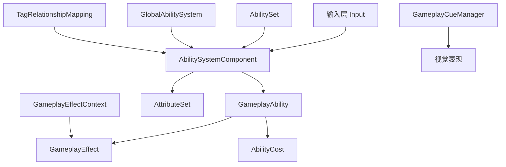
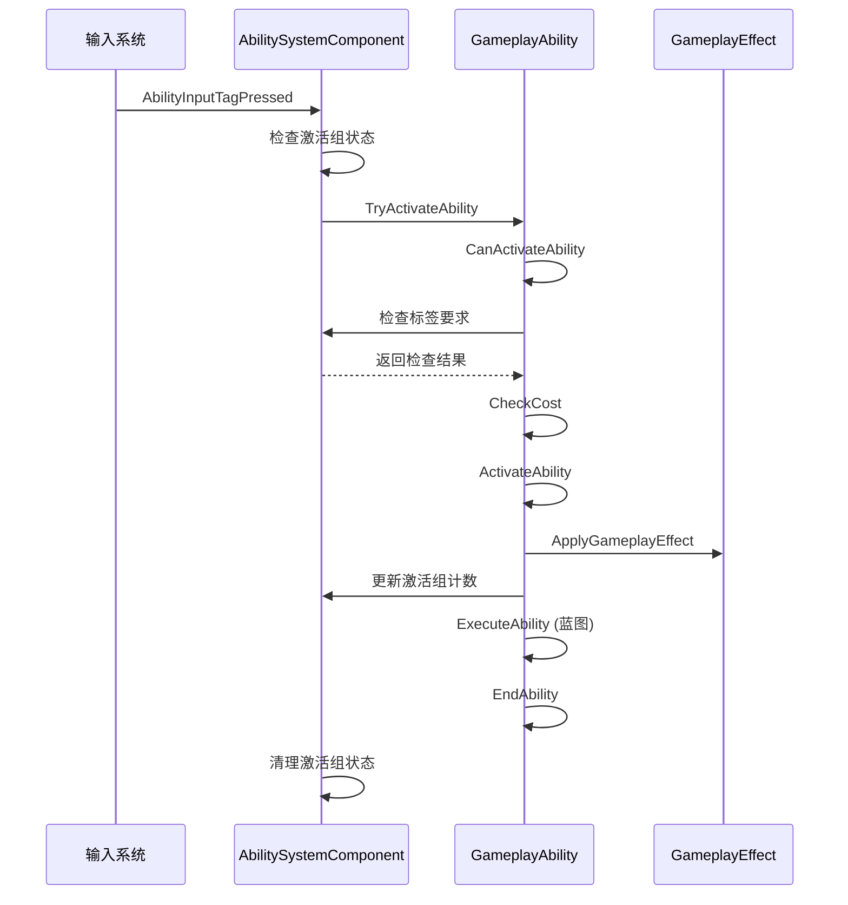

# DJ01技能系统架构文档

## 📋 目录
- [系统概览](#系统概览)
- [核心组件](#核心组件)
- [架构设计](#架构设计)
- [数据流转](#数据流转)
- [技术亮点](#技术亮点)
- [实现难点](#实现难点)

---

## 系统概览

DJ01技能系统基于UE5的Gameplay Ability System (GAS) 构建，从Lyra项目迁移并优化。提供了完整的技能激活、管理、网络同步功能。

### 功能列表
- ✅ **技能管理** - 动态授予、移除、激活技能
- ✅ **输入绑定** - 支持多种激活策略（输入触发、持续激活、自动激活）
- ✅ **技能组管理** - 独立、互斥可替换、互斥阻塞三种激活组
- ✅ **标签系统** - 完整的标签关系映射和阻塞机制
- ✅ **网络同步** - 自定义GameplayEffectContext的网络序列化
- ✅ **全局能力系统** - 跨ASC的全局技能注册
- ✅ **技能集合** - 批量授予技能、效果和属性集
- ⚠️ **动画蒙太奇** - 已屏蔽，待动画系统就绪后启用
- ⚠️ **相机模式切换** - 预留接口，待相机系统完善

---

## 核心组件

### 1. UDJ01AbilitySystemComponent (ASC)
**路径**: `AbilitySystem/Public/DJ01AbilitySystemComponent.h`

**职责**：
- 作为技能系统的核心枢纽，管理角色的所有技能
- 处理输入绑定和技能激活
- 管理技能激活组的互斥关系
- 处理标签阻塞和取消逻辑

**关键函数**：
```cpp
// 输入处理
void AbilityInputTagPressed(const FGameplayTag& InputTag);
void AbilityInputTagReleased(const FGameplayTag& InputTag);
void ProcessAbilityInput(float DeltaTime, bool bGamePaused);

// 激活组管理
void CancelAbilitiesWithActivationGroup(EDJ01AbilityActivationGroup Group);
void AddAbilityToActivationGroup(EDJ01AbilityActivationGroup Group, UDJ01GameplayAbility* Ability);
void RemoveAbilityFromActivationGroup(EDJ01AbilityActivationGroup Group, UDJ01GameplayAbility* Ability);

// 技能授予
void AbilitySpecInputPressed(FGameplayAbilitySpec& Spec);
void AbilitySpecInputReleased(FGameplayAbilitySpec& Spec);

// 标签关系处理
void GetAdditionalActivationTagRequirements(const FGameplayTagContainer& AbilityTags, 
                                           FGameplayTagContainer& OutActivationRequired, 
                                           FGameplayTagContainer& OutActivationBlocked) const;
```

**设计亮点**：
- 支持三种激活组模式（独立、互斥可替换、互斥阻塞）
- 输入队列机制确保输入不丢失
- 与全局技能系统集成

---

### 2. UDJ01GameplayAbility
**路径**: `AbilitySystem/Abilities/Public/DJ01GameplayAbility.h`

**职责**：
- 技能的基类，定义技能的行为和属性
- 管理技能的激活策略和激活组
- 处理技能成本和失败消息
- 提供蓝图可扩展的接口

**关键属性**：
```cpp
// 激活策略
EDJ01AbilityActivationPolicy ActivationPolicy;
// - OnInputTriggered: 输入触发时激活
// - WhileInputActive: 输入持续时激活
// - OnSpawn: 生成时自动激活

// 激活组
EDJ01AbilityActivationGroup ActivationGroup;
// - Independent: 独立运行
// - Exclusive_Replaceable: 可被其他互斥技能替换
// - Exclusive_Blocking: 阻塞其他互斥技能

// 额外成本
TArray<TObjectPtr<UDJ01AbilityCost>> AdditionalCosts;

// 失败消息映射
TMap<FGameplayTag, FText> FailureTagToUserFacingMessages;
TMap<FGameplayTag, TObjectPtr<UAnimMontage>> FailureTagToAnimMontage;
```

**关键函数**：
```cpp
// 激活检查
virtual bool CanActivateAbility(...) const override;

// 技能激活
virtual void ActivateAbility(...) override;

// 技能结束
virtual void EndAbility(...) override;

// 成本检查和应用
virtual bool CheckCost(...) const override;
virtual void ApplyCost(...) const override;

// 激活组切换
bool CanChangeActivationGroup(EDJ01AbilityActivationGroup NewGroup) const;
bool ChangeActivationGroup(EDJ01AbilityActivationGroup NewGroup);

// 失败处理
void OnAbilityFailedToActivate(const FGameplayTagContainer& FailedReason);
```

**设计亮点**：
- 灵活的激活策略系统
- 可扩展的成本系统（UDJ01AbilityCost）
- 完善的失败处理机制
- 相机模式切换预留接口

---

### 3. UDJ01AbilitySet
**路径**: `AbilitySystem/Public/DJ01AbilitySet.h`

**职责**：
- 批量管理技能、效果和属性集
- 简化技能系统的配置和使用
- 支持动态授予和回收

**数据结构**：
```cpp
// 技能配置
struct FDJ01AbilitySet_GameplayAbility
{
    TSubclassOf<UDJ01GameplayAbility> Ability;
    int32 AbilityLevel = 1;
    FGameplayTag InputTag;  // 绑定的输入标签
};

// 效果配置
struct FDJ01AbilitySet_GameplayEffect
{
    TSubclassOf<UGameplayEffect> GameplayEffect;
    float EffectLevel = 1.0f;
};

// 属性集配置
struct FDJ01AbilitySet_AttributeSet
{
    TSubclassOf<UAttributeSet> AttributeSet;
};

// 授予句柄
struct FDJ01AbilitySet_GrantedHandles
{
    TArray<FGameplayAbilitySpecHandle> AbilitySpecHandles;
    TArray<FActiveGameplayEffectHandle> GameplayEffectHandles;
    TArray<TObjectPtr<UAttributeSet>> GrantedAttributeSets;
    
    void TakeFromAbilitySystem(UDJ01AbilitySystemComponent* ASC);
};
```

**关键函数**：
```cpp
// 授予技能集
void GiveToAbilitySystem(UDJ01AbilitySystemComponent* ASC, 
                         FDJ01AbilitySet_GrantedHandles* OutHandles, 
                         UObject* SourceObject = nullptr) const;
```

**使用场景**：
- 角色初始化时批量授予技能
- 装备武器时添加相关技能
- 临时Buff添加额外技能

---

### 4. FDJ01GameplayEffectContext
**路径**: `AbilitySystem/Public/DJ01GameplayEffectContext.h`

**职责**：
- 扩展GAS的GameplayEffectContext
- 添加项目特定的上下文信息
- 支持网络同步

**扩展内容**：
```cpp
struct FDJ01GameplayEffectContext : public FGameplayEffectContext
{
    // 弹药ID（用于多发子弹识别）
    int32 CartridgeID = -1;
    
    // 技能源对象（实现IDJ01AbilitySourceInterface）
    TWeakObjectPtr<const UObject> AbilitySourceObject;
    
    // 获取物理材质
    const UPhysicalMaterial* GetPhysicalMaterial() const;
    
    // 设置技能源
    void SetAbilitySource(const IDJ01AbilitySourceInterface* InObject, float InSourceLevel);
    
    // 获取技能源
    const IDJ01AbilitySourceInterface* GetAbilitySource() const;
};
```

**网络同步**：
```cpp
virtual bool NetSerialize(FArchive& Ar, UPackageMap* Map, bool& bOutSuccess) override;
```

**设计亮点**：
- 支持弹药批次追踪
- 集成物理材质信息
- 可扩展的技能源接口

---

### 5. UDJ01GlobalAbilitySystem
**路径**: `AbilitySystem/Public/DJ01GlobalAbilitySystem.h`

**职责**：
- 全局技能系统管理器（WorldSubsystem）
- 管理跨ASC的全局技能
- 处理全局GameplayCue

**关键函数**：
```cpp
// 注册/注销ASC
void RegisterASC(UDJ01AbilitySystemComponent* ASC);
void UnregisterASC(UDJ01AbilitySystemComponent* ASC);

// 应用全局技能集
void ApplyAbilityToAll(TSubclassOf<UDJ01GameplayAbility> Ability);

// 应用全局效果集
void ApplyEffectToAll(TSubclassOf<UGameplayEffect> Effect);
```

**使用场景**：
- 全局Buff/Debuff
- 环境效果（如毒雾区域）
- 服务器事件响应（如全服加速）

---

### 6. UDJ01AbilityTagRelationshipMapping
**路径**: `AbilitySystem/Public/DJ01AbilityTagRelationshipMapping.h`

**职责**：
- 定义技能标签之间的关系
- 管理标签的阻塞和取消规则

**数据结构**：
```cpp
struct FDJ01AbilityTagRelationship
{
    FGameplayTag AbilityTag;  // 技能标签
    
    // 拥有这些标签时阻塞技能
    FGameplayTagContainer AbilityTagsToBlock;
    
    // 拥有这些标签时取消技能
    FGameplayTagContainer AbilityTagsToCancel;
    
    // 激活时需要的标签
    FGameplayTagContainer ActivationRequiredTags;
    
    // 激活时阻塞的标签
    FGameplayTagContainer ActivationBlockedTags;
};
```

**功能**：
- 定义技能互斥关系（如冲刺阻塞瞄准）
- 定义技能取消关系（如受击打断施法）
- 定义激活条件（如需要站立状态才能跳跃）

---

### 7. 其他支持组件

#### IDJ01AbilitySourceInterface
技能源接口，用于标识技能的来源（武器、装备等）

#### UDJ01GameplayCueManager
GameplayCue管理器，处理视觉和音效表现

#### FDJ01GameplayAbilityTargetData_SingleTargetHit
单目标命中数据，扩展了GAS的TargetData

#### ADJ01TaggedActor
带标签的Actor基类，方便进行标签查询

---

## 架构设计

### 系统分层



### 技能激活流程



---

## 数据流转

### 输入到技能激活

1. **输入捕获**: EnhancedInput → HeroComponent
2. **输入分发**: HeroComponent → AbilitySystemComponent
3. **标签匹配**: InputTag → AbilitySpec
4. **激活检查**: CanActivate (标签、成本、冷却)
5. **激活执行**: ActivateAbility → Blueprint/C++
6. **效果应用**: ApplyGameplayEffectToTarget
7. **技能结束**: EndAbility → Cleanup

### 网络同步流程

1. **客户端**: 预测性激活 → 发送RPC到服务器
2. **服务器**: 验证并激活 → 广播到所有客户端
3. **客户端**: 接收确认 → 修正预测差异

---

## 技术亮点

### 1. 灵活的激活策略系统
三种激活策略满足不同技能需求：
- **OnInputTriggered**: 瞬发技能（如攻击、跳跃）
- **WhileInputActive**: 持续技能（如瞄准、冲刺）
- **OnSpawn**: 被动技能（如光环、被动触发）

### 2. 强大的激活组管理
三种激活组实现复杂的技能互斥逻辑：
- **Independent**: 不影响其他技能（如普通移动）
- **Exclusive_Replaceable**: 可被打断（如装填弹药）
- **Exclusive_Blocking**: 完全阻塞（如处决动画）

### 3. 可扩展的成本系统
通过`UDJ01AbilityCost`基类，支持：
- 自定义成本类型（体力、魔法、物品等）
- 蓝图扩展
- 动态成本计算

### 4. 完善的失败处理
- 标签到失败消息的映射
- 标签到失败动画的映射
- 支持本地化文本

### 5. 全局技能系统
- WorldSubsystem实现跨场景管理
- 支持动态添加/移除全局技能
- 自动处理ASC注册/注销

### 6. 网络优化
- 自定义序列化减少带宽
- 预测性激活减少延迟
- 增量复制优化

---

## 实现难点

### 1. 激活组的互斥管理
**难点**：
- 需要追踪每个激活组的活跃技能数量
- 处理技能激活/结束时的竞态条件
- 确保网络同步的一致性

**解决方案**：
```cpp
// 使用计数器追踪激活组状态
int32 ActivationGroupCounts[(uint8)EDJ01AbilityActivationGroup::MAX];

// 激活前检查
if (ActivationGroupCounts[(uint8)EDJ01AbilityActivationGroup::Exclusive_Blocking] > 0)
{
    return false;  // 被阻塞
}
```

### 2. 标签关系的动态映射
**难点**：
- 标签关系复杂，硬编码难以维护
- 需要支持数据驱动配置
- 运行时查询性能要求高

**解决方案**：
- 使用DataAsset存储标签关系配置
- 构建标签索引加速查询
- 缓存常用查询结果

### 3. 网络序列化的扩展
**难点**：
- 需要扩展GameplayEffectContext
- 必须保持与基类兼容
- IrisCore集成复杂

**解决方案**：
```cpp
// 使用Iris注册自定义序列化
REGISTER_IRIS_SERIALIZER(FDJ01GameplayEffectContext);

// 实现NetSerialize
virtual bool NetSerialize(FArchive& Ar, UPackageMap* Map, bool& bOutSuccess) override
{
    Super::NetSerialize(Ar, Map, bOutSuccess);
    Ar << CartridgeID;
    // ... 序列化自定义字段
    return true;
}
```

### 4. 动画系统的解耦
**难点**：
- Lyra原始代码与动画系统深度耦合
- 需要在不破坏功能的前提下解耦
- 预留后续集成接口

**解决方案**：
- 注释掉AnimInstance相关调用
- 保留接口定义
- 使用条件编译标记 `// ANIMATION_TODO`

### 5. 输入队列的线程安全
**难点**：
- 输入事件可能在不同线程触发
- 技能激活过程中可能收到新输入
- 避免输入丢失

**解决方案**：
- 使用TArray缓存输入状态
- 在ProcessAbilityInput中统一处理
- 使用FGameplayAbilitySpec的状态标记

---

## 性能优化建议

### 1. 技能池化
对于频繁创建的技能实例，使用对象池减少GC压力。

### 2. 标签缓存
缓存常用的标签查询结果，减少容器遍历。

### 3. 条件复制
使用`DOREPLIFETIME_CONDITION`精确控制复制范围。

### 4. 延迟激活
非关键技能使用延迟激活，避免卡顿。

---

## 后续扩展计划

- [ ] 集成动画系统（蒙太奇播放、动画通知）
- [ ] 完善相机模式切换
- [ ] 添加技能预加载系统
- [ ] 实现技能组合系统
- [ ] 添加技能冷却共享组
- [ ] 实现技能预测性反馈优化

---

## 参考资料

- UE5 Gameplay Ability System 官方文档
- Lyra Sample Project
- GAS Community Documentation
- DJ01 项目技术文档

---

**文档版本**: v1.0  
**最后更新**: 2025-11-28  
**维护者**: DJ01 Team