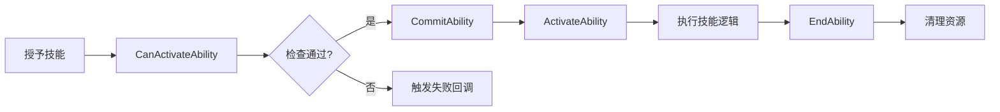

# DJ01技能系统使用指南

## 📋 目录
- [快速开始](#快速开始)
- [创建自定义技能](#创建自定义技能)
- [配置技能集](#配置技能集)
- [输入绑定](#输入绑定)
- [技能激活策略](#技能激活策略)
- [技能成本系统](#技能成本系统)
- [标签关系配置](#标签关系配置)
- [常见问题](#常见问题)
- [最佳实践](#最佳实践)

---

## 快速开始

### 1. 为角色添加AbilitySystemComponent

```cpp
// 在你的Character类中
UPROPERTY(VisibleAnywhere, BlueprintReadOnly, Category = "DJ01|Abilities")
TObjectPtr<UDJ01AbilitySystemComponent> AbilitySystemComponent;

// 构造函数中创建
ADJ01Character::ADJ01Character()
{
    AbilitySystemComponent = CreateDefaultSubobject<UDJ01AbilitySystemComponent>(TEXT("AbilitySystemComp"));
    AbilitySystemComponent->SetIsReplicated(true);
    AbilitySystemComponent->SetReplicationMode(EGameplayEffectReplicationMode::Mixed);
}

// 初始化
void ADJ01Character::PossessedBy(AController* NewController)
{
    Super::PossessedBy(NewController);
    
    AbilitySystemComponent->InitAbilityActorInfo(this, this);
}
```

### 2. 创建简单技能

#### C++方式
```cpp
// 创建技能类 DJ01GameplayAbility_Jump.h
UCLASS()
class UDJ01GameplayAbility_Jump : public UDJ01GameplayAbility
{
    GENERATED_BODY()
    
public:
    UDJ01GameplayAbility_Jump()
    {
        // 设置激活策略
        ActivationPolicy = EDJ01AbilityActivationPolicy::OnInputTriggered;
        
        // 设置激活组
        ActivationGroup = EDJ01AbilityActivationGroup::Independent;
        
        // 设置InstancingPolicy
        InstancingPolicy = EGameplayAbilityInstancingPolicy::InstancedPerActor;
    }
    
protected:
    virtual void ActivateAbility(const FGameplayAbilitySpecHandle Handle,
                                const FGameplayAbilityActorInfo* ActorInfo,
                                const FGameplayAbilityActivationInfo ActivationInfo,
                                const FGameplayEventData* TriggerEventData) override
    {
        if (!CommitAbility(Handle, ActorInfo, ActivationInfo))
        {
            EndAbility(Handle, ActorInfo, ActivationInfo, true, true);
            return;
        }
        
        // 执行跳跃
        if (ADJ01Character* Character = Cast<ADJ01Character>(ActorInfo->AvatarActor))
        {
            Character->Jump();
        }
        
        EndAbility(Handle, ActorInfo, ActivationInfo, false, false);
    }
};
```

#### 蓝图方式
1. 创建蓝图类，继承自`DJ01GameplayAbility`
2. 设置类默认值：
   - Activation Policy = OnInputTriggered
   - Activation Group = Independent
3. 重写 `ActivateAbility` 事件
4. 添加技能逻辑
5. 调用 `End Ability`

---

## 创建自定义技能

### 技能生命周期



### 完整技能示例：冲刺

```cpp
// DJ01GameplayAbility_Sprint.h
UCLASS()
class UDJ01GameplayAbility_Sprint : public UDJ01GameplayAbility
{
    GENERATED_BODY()
    
public:
    UDJ01GameplayAbility_Sprint()
    {
        ActivationPolicy = EDJ01AbilityActivationPolicy::WhileInputActive;
        ActivationGroup = EDJ01AbilityActivationGroup::Exclusive_Replaceable;
        InstancingPolicy = EGameplayAbilityInstancingPolicy::InstancedPerActor;
        
        // 设置技能标签
        AbilityTags.AddTag(FGameplayTag::RequestGameplayTag(TEXT("Ability.Movement.Sprint")));
        
        // 阻塞其他技能
        BlockAbilitiesWithTag.AddTag(FGameplayTag::RequestGameplayTag(TEXT("Ability.Weapon.Aim")));
        
        // 激活时取消其他技能
        CancelAbilitiesWithTag.AddTag(FGameplayTag::RequestGameplayTag(TEXT("Ability.Weapon.Reload")));
    }
    
protected:
    UPROPERTY(EditDefaultsOnly, Category = "Sprint")
    float SprintSpeedMultiplier = 2.0f;
    
    UPROPERTY(EditDefaultsOnly, Category = "Sprint")
    TSubclassOf<UGameplayEffect> SprintEffect;
    
    FActiveGameplayEffectHandle SprintEffectHandle;
    
    virtual void ActivateAbility(const FGameplayAbilitySpecHandle Handle,
                                const FGameplayAbilityActorInfo* ActorInfo,
                                const FGameplayAbilityActivationInfo ActivationInfo,
                                const FGameplayEventData* TriggerEventData) override
    {
        if (!CommitAbility(Handle, ActorInfo, ActivationInfo))
        {
            EndAbility(Handle, ActorInfo, ActivationInfo, true, true);
            return;
        }
        
        // 应用冲刺效果
        if (SprintEffect)
        {
            FGameplayEffectContextHandle EffectContext = GetAbilitySystemComponentFromActorInfo()->MakeEffectContext();
            EffectContext.AddSourceObject(this);
            
            FGameplayEffectSpecHandle SpecHandle = 
                MakeOutgoingGameplayEffectSpec(SprintEffect, GetAbilityLevel());
                
            SprintEffectHandle = ApplyGameplayEffectSpecToOwner(CurrentSpecHandle, CurrentActorInfo, 
                                                                CurrentActivationInfo, SpecHandle);
        }
    }
    
    virtual void EndAbility(const FGameplayAbilitySpecHandle Handle,
                           const FGameplayAbilityActorInfo* ActorInfo,
                           const FGameplayAbilityActivationInfo ActivationInfo,
                           bool bReplicateEndAbility,
                           bool bWasCancelled) override
    {
        // 移除冲刺效果
        if (SprintEffectHandle.IsValid())
        {
            GetAbilitySystemComponentFromActorInfo()->RemoveActiveGameplayEffect(SprintEffectHandle);
        }
        
        Super::EndAbility(Handle, ActorInfo, ActivationInfo, bReplicateEndAbility, bWasCancelled);
    }
};
```

---

## 配置技能集

### 创建AbilitySet资产

1. 在Content Browser中右键 → Miscellaneous → Data Asset
2. 选择父类: `DJ01AbilitySet`
3. 命名如: `DA_HeroAbilitySet`

### 配置技能集

```cpp
// 在DataAsset中配置
GrantedGameplayAbilities:
- Ability: GA_Hero_Jump
  AbilityLevel: 1
  InputTag: InputTag.Jump
  
- Ability: GA_Hero_Sprint
  AbilityLevel: 1
  InputTag: InputTag.Sprint
  
- Ability: GA_Hero_Crouch
  AbilityLevel: 1
  InputTag: InputTag.Crouch

GrantedGameplayEffects:
- GameplayEffect: GE_Hero_MaxHealth
  EffectLevel: 1.0

GrantedAttributes:
- AttributeSet: DJ01HealthSet
- AttributeSet: DJ01CombatSet
```

### 授予技能集

```cpp
// 在角色初始化时
void ADJ01Character::GrantAbilities()
{
    if (HasAuthority() && AbilitySet)
    {
        AbilitySet->GiveToAbilitySystem(AbilitySystemComponent, &GrantedHandles, this);
    }
}

// 移除技能集
void ADJ01Character::RevokeAbilities()
{
    GrantedHandles.TakeFromAbilitySystem(AbilitySystemComponent);
}
```

---

## 输入绑定

### 1. 配置InputTag

在`DJ01GameplayTags.cpp`中添加：
```cpp
UE_DEFINE_GAMEPLAY_TAG_COMMENT(InputTag_Jump, "InputTag.Jump", "Jump input.");
UE_DEFINE_GAMEPLAY_TAG_COMMENT(InputTag_Sprint, "InputTag.Sprint", "Sprint input.");
```

### 2. 在HeroComponent中绑定输入

```cpp
void UDJ01HeroComponent::SetupPlayerInputComponent(UInputComponent* PlayerInputComponent)
{
    if (UEnhancedInputComponent* EnhancedInput = Cast<UEnhancedInputComponent>(PlayerInputComponent))
    {
        // 绑定跳跃
        EnhancedInput->BindAction(JumpAction, ETriggerEvent::Triggered, this, 
                                 &ThisClass::Input_Jump_Triggered);
        EnhancedInput->BindAction(JumpAction, ETriggerEvent::Completed, this, 
                                 &ThisClass::Input_Jump_Completed);
    }
}

void UDJ01HeroComponent::Input_Jump_Triggered()
{
    if (UDJ01AbilitySystemComponent* ASC = GetAbilitySystemComponent())
    {
        ASC->AbilityInputTagPressed(DJ01GameplayTags::InputTag_Jump);
    }
}

void UDJ01HeroComponent::Input_Jump_Completed()
{
    if (UDJ01AbilitySystemComponent* ASC = GetAbilitySystemComponent())
    {
        ASC->AbilityInputTagReleased(DJ01GameplayTags::InputTag_Jump);
    }
}
```

### 3. 在Tick中处理输入

```cpp
void ADJ01Character::Tick(float DeltaSeconds)
{
    Super::Tick(DeltaSeconds);
    
    if (AbilitySystemComponent)
    {
        AbilitySystemComponent->ProcessAbilityInput(DeltaSeconds, false);
    }
}
```

---

## 技能激活策略

### OnInputTriggered - 输入触发
**适用场景**: 瞬发技能（攻击、跳跃、投掷）

```cpp
// 按下输入时立即尝试激活
// 按住不会重复激活
// 释放输入不影响技能

ActivationPolicy = EDJ01AbilityActivationPolicy::OnInputTriggered;
```

### WhileInputActive - 输入持续
**适用场景**: 持续技能（冲刺、瞄准、格挡）

```cpp
// 按下输入时激活
// 持续按住保持激活
// 释放输入时结束技能

ActivationPolicy = EDJ01AbilityActivationPolicy::WhileInputActive;
```

### OnSpawn - 生成时激活
**适用场景**: 被动技能（光环、被动触发效果）

```cpp
// 技能授予时自动激活
// 不需要输入
// 通常是被动持续效果

ActivationPolicy = EDJ01AbilityActivationPolicy::OnSpawn;
```

---

## 技能成本系统

### 创建自定义成本

```cpp
// DJ01AbilityCost_Stamina.h
UCLASS()
class UDJ01AbilityCost_Stamina : public UDJ01AbilityCost
{
    GENERATED_BODY()
    
public:
    UPROPERTY(EditAnywhere, BlueprintReadOnly, Category = "Cost")
    float StaminaCost = 10.0f;
    
    virtual bool CheckCost(const UDJ01GameplayAbility* Ability,
                          const FGameplayAbilitySpecHandle Handle,
                          const FGameplayAbilityActorInfo* ActorInfo,
                          FGameplayTagContainer* OptionalRelevantTags) const override
    {
        if (const UDJ01AbilitySystemComponent* ASC = Cast<UDJ01AbilitySystemComponent>(ActorInfo->AbilitySystemComponent.Get()))
        {
            // 检查体力属性
            const UAttributeSet* AttributeSet = ASC->GetAttributeSet(UDJ01StaminaSet::StaticClass());
            if (const UDJ01StaminaSet* StaminaSet = Cast<UDJ01StaminaSet>(AttributeSet))
            {
                return StaminaSet->GetStamina() >= StaminaCost;
            }
        }
        return false;
    }
    
    virtual void ApplyCost(const UDJ01GameplayAbility* Ability,
                          const FGameplayAbilitySpecHandle Handle,
                          const FGameplayAbilityActorInfo* ActorInfo,
                          const FGameplayAbilityActivationInfo ActivationInfo) override
    {
        // 应用消耗体力的效果
        if (StaminaCostEffect)
        {
            ApplyAbilityCostEffect(Ability, StaminaCostEffect, ActorInfo);
        }
    }
    
protected:
    UPROPERTY(EditAnywhere, Category = "Cost")
    TSubclassOf<UGameplayEffect> StaminaCostEffect;
};
```

### 在技能中使用成本

```cpp
// 在技能类的默认属性中配置
UPROPERTY(EditDefaultsOnly, Instanced, Category = "Costs")
TArray<TObjectPtr<UDJ01AbilityCost>> AdditionalCosts;

// 技能会自动调用CheckCost和ApplyCost
```

---

## 标签关系配置

### 创建标签关系映射

1. 创建DataAsset继承`DJ01AbilityTagRelationshipMapping`
2. 配置标签关系：

```cpp
AbilityTagRelationships:
- AbilityTag: Ability.Weapon.Aim
  AbilityTagsToBlock: 
    - Ability.Movement.Sprint
    - Ability.Movement.Slide
  ActivationRequiredTags:
    - State.Weapon.Equipped
  ActivationBlockedTags:
    - State.Dead
    - State.Stunned

- AbilityTag: Ability.Movement.Sprint
  AbilityTagsToCancel:
    - Ability.Weapon.Reload
  AbilityTagsToBlock:
    - Ability.Weapon.Aim
```

### 在GameData中配置

```cpp
// DJ01GameData
UPROPERTY(EditDefaultsOnly, Category = "Abilities")
TSoftObjectPtr<UDJ01AbilityTagRelationshipMapping> AbilityTagRelationshipMapping;
```

---

## 常见问题

### Q1: 技能无法激活？

**检查清单**:
1. ✅ AbilitySystemComponent是否已初始化？
2. ✅ 技能是否已授予（GiveAbility）？
3. ✅ InputTag是否正确绑定？
4. ✅ 是否满足激活标签要求？
5. ✅ 是否被激活组阻塞？
6. ✅ 是否有足够的成本（Cooldown、Cost）？

**调试方法**:
```cpp
// 在CanActivateAbility中添加日志
UE_LOG(LogDJ01AbilitySystem, Log, TEXT("CanActivate: %s, Reason: %s"), 
       *GetName(), *FailureReason.ToString());

// 使用控制台命令
showdebug abilitysystem
```

### Q2: 输入没有响应？

**可能原因**:
1. 没有调用`ProcessAbilityInput`
2. InputTag不匹配
3. ActivationPolicy设置错误

**解决方案**:
```cpp
// 确保在Tick中处理输入
void ADJ01Character::Tick(float DeltaSeconds)
{
    Super::Tick(DeltaSeconds);
    
    if (AbilitySystemComponent)
    {
        AbilitySystemComponent->ProcessAbilityInput(DeltaSeconds, false);
    }
}
```

### Q3: 技能互斥不生效？

**检查**:
- ActivationGroup设置是否正确
- 是否在激活/结束时正确管理激活组计数

```cpp
// 在ActivateAbility中
GetAbilitySystemComponentFromActorInfo()->AddAbilityToActivationGroup(ActivationGroup, this);

// 在EndAbility中
GetAbilitySystemComponentFromActorInfo()->RemoveAbilityFromActivationGroup(ActivationGroup, this);
```

### Q4: 网络同步问题？

**确认**:
1. AbilitySystemComponent的ReplicationMode设置
2. 技能的NetExecutionPolicy设置
3. GameplayEffect的ReplicationPolicy设置

```cpp
// 推荐配置
AbilitySystemComponent->SetReplicationMode(EGameplayEffectReplicationMode::Mixed);

// 技能配置
NetExecutionPolicy = EGameplayAbilityNetExecutionPolicy::LocalPredicted;
```

---

## 最佳实践

### 1. 技能命名规范
```
GA_[Category]_[Name]
例如: GA_Hero_Jump, GA_Weapon_Fire, GA_Ability_Heal
```

### 2. 标签命名规范
```
Ability.[Category].[Name]
State.[Type].[Name]
Input.[Device].[Action]

例如:
Ability.Movement.Sprint
State.Combat.InCombat
InputTag.Gamepad.RightTrigger
```

### 3. 技能结构建议
- 简单逻辑用C++
- 复杂逻辑用蓝图
- 数据配置用DataAsset

### 4. 性能优化
- 使用`InstancedPerActor`减少实例数
- 缓存常用组件引用
- 避免在Tick中频繁查询

### 5. 调试技巧
```cpp
// 使用条件断点
if (GetName().Contains(TEXT("Jump")))
{
    UE_DEBUG_BREAK();
}

// 详细日志
#if !UE_BUILD_SHIPPING
UE_LOG(LogDJ01AbilitySystem, VeryVerbose, TEXT("Detail info"));
#endif

// 使用 showdebug 命令
showdebug abilitysystem
stat abilitysystem
```

### 6. 代码组织
```
AbilitySystem/
├── Abilities/          # 具体技能实现
│   ├── Movement/      # 移动相关
│   ├── Combat/        # 战斗相关
│   └── Interaction/   # 交互相关
├── Effects/           # GameplayEffect
├── Costs/             # 自定义成本
├── AttributeSets/     # 属性集
└── Data/              # DataAsset配置
```

---

## 示例项目结构

```
Content/Abilities/
├── AbilitySets/
│   ├── DA_HeroAbilitySet
│   └── DA_WeaponAbilitySet
├── Abilities/
│   ├── Movement/
│   │   ├── GA_Hero_Jump
│   │   ├── GA_Hero_Sprint
│   │   └── GA_Hero_Crouch
│   └── Combat/
│       ├── GA_Weapon_Fire
│       └── GA_Weapon_Reload
├── Effects/
│   ├── GE_Damage_Base
│   └── GE_Heal_Base
└── Data/
    ├── DA_TagRelationships
    └── DA_GameData
```

---

## 下一步学习

1. 📖 阅读 [AbilitySystem_Architecture.md](./AbilitySystem_Architecture.md)
2. 🎮 创建一个简单的跳跃技能
3. ⚔️ 实现一个带冷却的攻击技能
4. 🏃 添加冲刺技能并配置互斥关系
5. 🎯 学习AttributeSet和GameplayEffect
6. 🌐 测试网络同步功能

---

## 获取帮助

- 📚 查看源代码注释
- 💬 询问团队成员
- 🔍 搜索UE5 GAS文档
- 🐛 提交Issue到项目仓库

---

**文档版本**: v1.0  
**最后更新**: 2025-11-28  
**维护者**: DJ01 Team