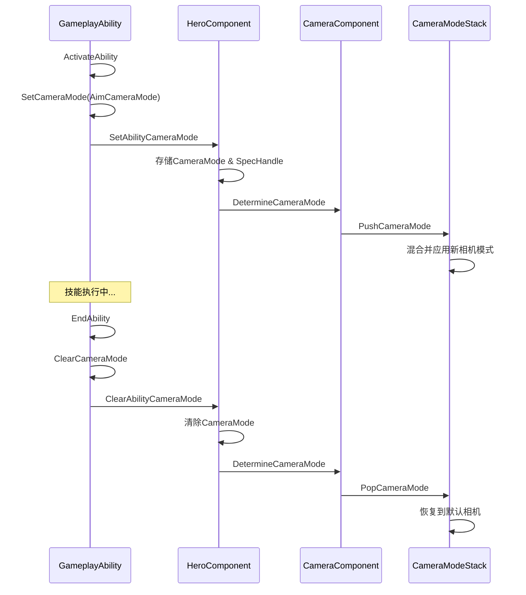

# 相机模式集成指南

## 📋 目录
- [系统概述](#系统概述)
- [快速开始](#快速开始)
- [技能中使用相机模式](#技能中使用相机模式)
- [实战示例](#实战示例)
- [高级用法](#高级用法)
- [最佳实践](#最佳实践)
- [常见问题](#常见问题)

---

## 系统概述

DJ01技能系统现已完全集成相机系统，允许技能在激活时动态切换相机模式，并在结束时自动恢复。

### 核心特性
- ✅ **自动管理**: 技能结束时自动清理相机模式
- ✅ **优先级控制**: 通过SpecHandle确保相机模式的正确归属
- ✅ **无缝切换**: 基于CameraModeStack实现平滑过渡
- ✅ **蓝图友好**: 完整的蓝图接口支持

### 架构流程



---

## 快速开始

### 1. 创建自定义相机模式

```cpp
// DJ01CameraMode_Aim.h
#include "Camera/DJ01CameraMode.h"
#include "DJ01CameraMode_Aim.generated.h"

UCLASS(BlueprintType)
class UDJ01CameraMode_Aim : public UDJ01CameraMode
{
    GENERATED_BODY()
    
public:
    UDJ01CameraMode_Aim()
    {
        // 设置视野角度
        FieldOfView = 60.0f;
        
        // 设置混合时间
        BlendTime = 0.3f;
        BlendFunction = EDJ01CameraModeBlendFunction::EaseInOut;
        
        // 设置相机偏移
        ViewPitchMin = -60.0f;
        ViewPitchMax = 60.0f;
    }
    
protected:
    virtual void UpdateView(float DeltaTime) override
    {
        Super::UpdateView(DeltaTime);
        
        // 自定义相机逻辑
        // 例如：拉近镜头用于瞄准
        FVector PivotLocation = GetPivotLocation();
        FRotator PivotRotation = GetPivotRotation();
        
        // 设置较近的相机距离
        View.Location = PivotLocation - (PivotRotation.Vector() * 150.0f);
        View.Rotation = PivotRotation;
        View.ControlRotation = PivotRotation;
        View.FieldOfView = FieldOfView;
    }
};
```

### 2. 在技能中使用

```cpp
// DJ01GameplayAbility_Aim.h
UCLASS()
class UDJ01GameplayAbility_Aim : public UDJ01GameplayAbility
{
    GENERATED_BODY()
    
public:
    UDJ01GameplayAbility_Aim()
    {
        ActivationPolicy = EDJ01AbilityActivationPolicy::WhileInputActive;
        ActivationGroup = EDJ01AbilityActivationGroup::Exclusive_Replaceable;
    }
    
protected:
    // 瞄准相机模式
    UPROPERTY(EditDefaultsOnly, Category = "Camera")
    TSubclassOf<UDJ01CameraMode> AimCameraMode;
    
    virtual void ActivateAbility(const FGameplayAbilitySpecHandle Handle,
                                const FGameplayAbilityActorInfo* ActorInfo,
                                const FGameplayAbilityActivationInfo ActivationInfo,
                                const FGameplayEventData* TriggerEventData) override
    {
        Super::ActivateAbility(Handle, ActorInfo, ActivationInfo, TriggerEventData);
        
        // 切换到瞄准相机
        if (AimCameraMode)
        {
            SetCameraMode(AimCameraMode);
        }
    }
    
    virtual void EndAbility(const FGameplayAbilitySpecHandle Handle,
                           const FGameplayAbilityActorInfo* ActorInfo,
                           const FGameplayAbilityActivationInfo ActivationInfo,
                           bool bReplicateEndAbility,
                           bool bWasCancelled) override
    {
        // 自动清理相机模式
        ClearCameraMode();
        
        Super::EndAbility(Handle, ActorInfo, ActivationInfo, bReplicateEndAbility, bWasCancelled);
    }
};
```

---

## 技能中使用相机模式

### C++ API

#### SetCameraMode
```cpp
/**
 * 设置技能的相机模式
 * @param CameraMode 要应用的相机模式类
 */
void SetCameraMode(TSubclassOf<UDJ01CameraMode> CameraMode);
```

**使用场景**:
- 瞄准时切换到瞄准相机
- 驾驶载具时切换到载具相机
- 特殊技能时切换到电影相机

**示例**:
```cpp
// 在ActivateAbility中调用
if (MyCustomCameraMode)
{
    SetCameraMode(MyCustomCameraMode);
}
```

#### ClearCameraMode
```cpp
/**
 * 清除技能设置的相机模式，恢复到默认相机
 */
void ClearCameraMode();
```

**使用场景**:
- 技能结束时恢复相机
- 技能被打断时恢复相机
- 手动切换回默认相机

**示例**:
```cpp
// 在EndAbility中调用
virtual void EndAbility(...) override
{
    ClearCameraMode();
    Super::EndAbility(...);
}
```

### 蓝图节点

在蓝图中可以直接调用：
- **Set Camera Mode**: 设置相机模式
- **Clear Camera Mode**: 清除相机模式

---

## 实战示例

### 示例1: 瞄准技能（Aim Ability）

```cpp
// GA_Weapon_Aim.h
UCLASS()
class UGA_Weapon_Aim : public UDJ01GameplayAbility
{
    GENERATED_BODY()
    
public:
    UGA_Weapon_Aim()
    {
        // 持续输入激活
        ActivationPolicy = EDJ01AbilityActivationPolicy::WhileInputActive;
        
        // 可被其他技能替换
        ActivationGroup = EDJ01AbilityActivationGroup::Exclusive_Replaceable;
        
        // 设置技能标签
        AbilityTags.AddTag(FGameplayTag::RequestGameplayTag(TEXT("Ability.Weapon.Aim")));
        
        // 阻塞冲刺
        BlockAbilitiesWithTag.AddTag(FGameplayTag::RequestGameplayTag(TEXT("Ability.Movement.Sprint")));
    }
    
protected:
    UPROPERTY(EditDefaultsOnly, Category = "Camera")
    TSubclassOf<UDJ01CameraMode> AimCameraMode;
    
    UPROPERTY(EditDefaultsOnly, Category = "Aim")
    float AimMovementSpeedMultiplier = 0.5f;
    
    UPROPERTY(EditDefaultsOnly, Category = "Aim")
    TSubclassOf<UGameplayEffect> AimMovementEffect;
    
    FActiveGameplayEffectHandle AimEffectHandle;
    
    virtual void ActivateAbility(const FGameplayAbilitySpecHandle Handle,
                                const FGameplayAbilityActorInfo* ActorInfo,
                                const FGameplayAbilityActivationInfo ActivationInfo,
                                const FGameplayEventData* TriggerEventData) override
    {
        Super::ActivateAbility(Handle, ActorInfo, ActivationInfo, TriggerEventData);
        
        if (!CommitAbility(Handle, ActorInfo, ActivationInfo))
        {
            EndAbility(Handle, ActorInfo, ActivationInfo, true, true);
            return;
        }
        
        // 1. 切换到瞄准相机
        if (AimCameraMode)
        {
            SetCameraMode(AimCameraMode);
        }
        
        // 2. 应用移动速度减缓效果
        if (AimMovementEffect)
        {
            FGameplayEffectSpecHandle SpecHandle = MakeOutgoingGameplayEffectSpec(AimMovementEffect);
            AimEffectHandle = ApplyGameplayEffectSpecToOwner(CurrentSpecHandle, CurrentActorInfo, 
                                                             CurrentActivationInfo, SpecHandle);
        }
        
        // 3. 广播瞄准开始事件
        FGameplayEventData EventData;
        EventData.EventTag = FGameplayTag::RequestGameplayTag(TEXT("Event.Weapon.AimStart"));
        SendGameplayEvent(EventData.EventTag, EventData);
    }
    
    virtual void EndAbility(const FGameplayAbilitySpecHandle Handle,
                           const FGameplayAbilityActorInfo* ActorInfo,
                           const FGameplayAbilityActivationInfo ActivationInfo,
                           bool bReplicateEndAbility,
                           bool bWasCancelled) override
    {
        // 1. 清除相机模式
        ClearCameraMode();
        
        // 2. 移除移动速度效果
        if (AimEffectHandle.IsValid())
        {
            BP_RemoveGameplayEffectFromOwnerWithHandle(AimEffectHandle);
        }
        
        // 3. 广播瞄准结束事件
        FGameplayEventData EventData;
        EventData.EventTag = FGameplayTag::RequestGameplayTag(TEXT("Event.Weapon.AimEnd"));
        SendGameplayEvent(EventData.EventTag, EventData);
        
        Super::EndAbility(Handle, ActorInfo, ActivationInfo, bReplicateEndAbility, bWasCancelled);
    }
};
```

**配置步骤**:
1. 创建相机模式蓝图 `CM_Weapon_Aim` (继承自 `DJ01CameraMode`)
2. 设置FOV为55（比默认的90更窄）
3. 设置相机距离为200（比默认更近）
4. 在技能蓝图中设置 `AimCameraMode = CM_Weapon_Aim`

---

### 示例2: 冲刺技能（Sprint Ability）

```cpp
// GA_Hero_Sprint.h
UCLASS()
class UGA_Hero_Sprint : public UDJ01GameplayAbility
{
    GENERATED_BODY()
    
public:
    UGA_Hero_Sprint()
    {
        ActivationPolicy = EDJ01AbilityActivationPolicy::WhileInputActive;
        ActivationGroup = EDJ01AbilityActivationGroup::Exclusive_Replaceable;
    }
    
protected:
    UPROPERTY(EditDefaultsOnly, Category = "Camera")
    TSubclassOf<UDJ01CameraMode> SprintCameraMode;
    
    UPROPERTY(EditDefaultsOnly, Category = "Sprint")
    float SprintFOVIncrease = 10.0f;  // FOV增加量
    
    virtual void ActivateAbility(const FGameplayAbilitySpecHandle Handle,
                                const FGameplayAbilityActorInfo* ActorInfo,
                                const FGameplayAbilityActivationInfo ActivationInfo,
                                const FGameplayEventData* TriggerEventData) override
    {
        Super::ActivateAbility(Handle, ActorInfo, ActivationInfo, TriggerEventData);
        
        // 切换到冲刺相机（更宽的FOV，增加速度感）
        if (SprintCameraMode)
        {
            SetCameraMode(SprintCameraMode);
        }
    }
    
    virtual void EndAbility(const FGameplayAbilitySpecHandle Handle,
                           const FGameplayAbilityActorInfo* ActorInfo,
                           const FGameplayAbilityActivationInfo ActivationInfo,
                           bool bReplicateEndAbility,
                           bool bWasCancelled) override
    {
        // 恢复默认相机
        ClearCameraMode();
        
        Super::EndAbility(Handle, ActorInfo, ActivationInfo, bReplicateEndAbility, bWasCancelled);
    }
};
```

---

### 示例3: 处决技能（Execution Ability）

```cpp
// GA_Combat_Execution.h
UCLASS()
class UGA_Combat_Execution : public UDJ01GameplayAbility
{
    GENERATED_BODY()
    
public:
    UGA_Combat_Execution()
    {
        ActivationPolicy = EDJ01AbilityActivationPolicy::OnInputTriggered;
        
        // 完全阻塞其他技能
        ActivationGroup = EDJ01AbilityActivationGroup::Exclusive_Blocking;
    }
    
protected:
    UPROPERTY(EditDefaultsOnly, Category = "Camera")
    TSubclassOf<UDJ01CameraMode> ExecutionCameraMode;
    
    UPROPERTY(EditDefaultsOnly, Category = "Execution")
    UAnimMontage* ExecutionMontage;
    
    UPROPERTY(EditDefaultsOnly, Category = "Execution")
    float ExecutionDuration = 3.0f;
    
    virtual void ActivateAbility(const FGameplayAbilitySpecHandle Handle,
                                const FGameplayAbilityActorInfo* ActorInfo,
                                const FGameplayAbilityActivationInfo ActivationInfo,
                                const FGameplayEventData* TriggerEventData) override
    {
        Super::ActivateAbility(Handle, ActorInfo, ActivationInfo, TriggerEventData);
        
        // 切换到电影相机模式
        if (ExecutionCameraMode)
        {
            SetCameraMode(ExecutionCameraMode);
        }
        
        // 播放处决动画
        // PlayMontageAndWait(...);  // 待动画系统就绪
        
        // 设置定时器结束技能
        FTimerHandle TimerHandle;
        GetWorld()->GetTimerManager().SetTimer(TimerHandle, [this, Handle, ActorInfo, ActivationInfo]()
        {
            EndAbility(Handle, ActorInfo, ActivationInfo, true, false);
        }, ExecutionDuration, false);
    }
    
    virtual void EndAbility(const FGameplayAbilitySpecHandle Handle,
                           const FGameplayAbilityActorInfo* ActorInfo,
                           const FGameplayAbilityActivationInfo ActivationInfo,
                           bool bReplicateEndAbility,
                           bool bWasCancelled) override
    {
        // 恢复正常相机
        ClearCameraMode();
        
        Super::EndAbility(Handle, ActorInfo, ActivationInfo, bReplicateEndAbility, bWasCancelled);
    }
};
```

---

### 示例4: 载具驾驶技能

```cpp
// GA_Vehicle_Drive.h
UCLASS()
class UGA_Vehicle_Drive : public UDJ01GameplayAbility
{
    GENERATED_BODY()
    
public:
    UGA_Vehicle_Drive()
    {
        // 生成时自动激活（上车时）
        ActivationPolicy = EDJ01AbilityActivationPolicy::OnSpawn;
        ActivationGroup = EDJ01AbilityActivationGroup::Exclusive_Blocking;
    }
    
protected:
    UPROPERTY(EditDefaultsOnly, Category = "Camera")
    TSubclassOf<UDJ01CameraMode> VehicleCameraMode;
    
    UPROPERTY(EditDefaultsOnly, Category = "Camera")
    TSubclassOf<UDJ01CameraMode> VehicleCameraMode_FirstPerson;
    
    UPROPERTY(EditDefaultsOnly, Category = "Camera")
    TSubclassOf<UDJ01CameraMode> VehicleCameraMode_ThirdPerson;
    
    bool bIsFirstPersonView = false;
    
    virtual void ActivateAbility(const FGameplayAbilitySpecHandle Handle,
                                const FGameplayAbilityActorInfo* ActorInfo,
                                const FGameplayAbilityActivationInfo ActivationInfo,
                                const FGameplayEventData* TriggerEventData) override
    {
        Super::ActivateAbility(Handle, ActorInfo, ActivationInfo, TriggerEventData);
        
        // 默认使用第三人称载具相机
        if (VehicleCameraMode_ThirdPerson)
        {
            SetCameraMode(VehicleCameraMode_ThirdPerson);
        }
    }
    
    // 蓝图可调用：切换视角
    UFUNCTION(BlueprintCallable, Category = "Vehicle")
    void ToggleCameraView()
    {
        bIsFirstPersonView = !bIsFirstPersonView;
        
        if (bIsFirstPersonView && VehicleCameraMode_FirstPerson)
        {
            SetCameraMode(VehicleCameraMode_FirstPerson);
        }
        else if (VehicleCameraMode_ThirdPerson)
        {
            SetCameraMode(VehicleCameraMode_ThirdPerson);
        }
    }
    
    virtual void EndAbility(const FGameplayAbilitySpecHandle Handle,
                           const FGameplayAbilityActorInfo* ActorInfo,
                           const FGameplayAbilityActivationInfo ActivationInfo,
                           bool bReplicateEndAbility,
                           bool bWasCancelled) override
    {
        // 下车时恢复角色相机
        ClearCameraMode();
        
        Super::EndAbility(Handle, ActorInfo, ActivationInfo, bReplicateEndAbility, bWasCancelled);
    }
};
```

---

## 高级用法

### 1. 动态相机模式切换

```cpp
UCLASS()
class UGA_Combat_DynamicCamera : public UDJ01GameplayAbility
{
    GENERATED_BODY()
    
protected:
    UPROPERTY(EditDefaultsOnly)
    TSubclassOf<UDJ01CameraMode> NormalCombatCamera;
    
    UPROPERTY(EditDefaultsOnly)
    TSubclassOf<UDJ01CameraMode> IntenseCombatCamera;
    
    void UpdateCameraBasedOnCombatIntensity(float Intensity)
    {
        if (Intensity > 0.7f && IntenseCombatCamera)
        {
            SetCameraMode(IntenseCombatCamera);
        }
        else if (NormalCombatCamera)
        {
            SetCameraMode(NormalCombatCamera);
        }
    }
};
```

### 2. 相机模式与动画联动

```cpp
virtual void ActivateAbility(...) override
{
    Super::ActivateAbility(...);
    
    // 切换相机
    if (SpecialAttackCamera)
    {
        SetCameraMode(SpecialAttackCamera);
    }
    
    // TODO: 播放动画蒙太奇（待动画系统就绪）
    // PlayMontageAndWait(AttackMontage);
    
    // 在AnimNotify中可以动态切换相机角度
}
```

### 3. 相机模式优先级管理

技能系统通过 `FGameplayAbilitySpecHandle` 自动管理相机优先级：
- **后激活的技能**优先级更高
- **技能结束时**自动恢复到前一个相机模式
- **多个技能同时激活**时，最后设置的相机生效

```cpp
// 场景：玩家在瞄准状态下触发处决技能
// 1. 瞄准技能激活 → 设置AimCamera
// 2. 处决技能激活 → 设置ExecutionCamera (覆盖AimCamera)
// 3. 处决技能结束 → 清除ExecutionCamera
// 4. 自动恢复到AimCamera (因为瞄准技能还在激活中)
// 5. 瞄准技能结束 → 清除AimCamera
// 6. 恢复到DefaultCamera
```

---

## 最佳实践

### 1. 相机模式命名规范
```
CM_[Context]_[Type]
例如: 
CM_Weapon_Aim          - 武器瞄准相机
CM_Vehicle_Drive       - 载具驾驶相机
CM_Combat_Execution    - 战斗处决相机
CM_Hero_Sprint         - 英雄冲刺相机
```

### 2. 相机切换时机

**✅ 推荐**:
```cpp
virtual void ActivateAbility(...) override
{
    Super::ActivateAbility(...);
    
    // 先Commit检查
    if (!CommitAbility(...))
    {
        EndAbility(...);
        return;
    }
    
    // 再切换相机
    SetCameraMode(MyCameraMode);
}
```

**❌ 不推荐**:
```cpp
// 不要在CommitAbility之前切换相机
SetCameraMode(MyCameraMode);  // 如果技能激活失败，相机会残留
if (!CommitAbility(...))
{
    EndAbility(...);
    return;
}
```

### 3. 相机清理保证

```cpp
virtual void EndAbility(...) override
{
    // 确保在调用Super之前清理相机
    ClearCameraMode();
    
    Super::EndAbility(...);
}

// 或使用RAII模式
class FScopedCameraMode
{
public:
    FScopedCameraMode(UDJ01GameplayAbility* Ability, TSubclassOf<UDJ01CameraMode> Mode)
        : OwningAbility(Ability)
    {
        if (OwningAbility)
        {
            OwningAbility->SetCameraMode(Mode);
        }
    }
    
    ~FScopedCameraMode()
    {
        if (OwningAbility)
        {
            OwningAbility->ClearCameraMode();
        }
    }
    
private:
    UDJ01GameplayAbility* OwningAbility;
};
```

### 4. 蓝图使用建议

在蓝图中使用相机模式：
1. 在 `ActivateAbility` 事件后调用 `Set Camera Mode`
2. 在 `EndAbility` 事件前调用 `Clear Camera Mode`
3. 使用 `Try Activate Ability` 确保激活成功再切换相机

### 5. 性能优化

```cpp
// 缓存相机模式引用
UPROPERTY(EditDefaultsOnly, Category = "Camera")
TSubclassOf<UDJ01CameraMode> CachedCameraMode;

virtual void OnGiveAbility(...) override
{
    Super::OnGiveAbility(...);
    
    // 预加载相机模式资源
    if (CachedCameraMode)
    {
        CachedCameraMode.Get();
    }
}
```

---

## 常见问题

### Q1: 相机没有切换？

**检查清单**:
1. ✅ 是否在 `ActivateAbility` 中调用了 `SetCameraMode`？
2. ✅ 相机模式类是否已设置？
3. ✅ HeroComponent 是否存在？
4. ✅ 技能是否成功激活（CommitAbility返回true）？

**调试代码**:
```cpp
void UDJ01GameplayAbility::SetCameraMode(TSubclassOf<UDJ01CameraMode> CameraMode)
{
    ENSURE_ABILITY_IS_INSTANTIATED_OR_RETURN(SetCameraMode, );
    
    UE_LOG(LogDJ01AbilitySystem, Log, TEXT("SetCameraMode: %s"), 
           CameraMode ? *CameraMode->GetName() : TEXT("None"));
    
    if (UDJ01HeroComponent* HeroComponent = GetHeroComponentFromActorInfo())
    {
        HeroComponent->SetAbilityCameraMode(CameraMode, CurrentSpecHandle);
        ActiveCameraMode = CameraMode;
    }
    else
    {
        UE_LOG(LogDJ01AbilitySystem, Warning, TEXT("HeroComponent not found!"));
    }
}
```

### Q2: 相机没有恢复？

**可能原因**:
- 忘记调用 `ClearCameraMode`
- `EndAbility` 没有执行
- 多个技能设置了相机，优先级混乱

**解决方案**:
```cpp
// 在技能基类中统一处理
virtual void EndAbility(...) override
{
    // 自动清理
    if (ActiveCameraMode)
    {
        ClearCameraMode();
    }
    
    Super::EndAbility(...);
}
```

### Q3: 多个技能相机冲突？

技能系统通过 `SpecHandle` 自动管理优先级，无需手动处理。

**工作原理**:
```cpp
// HeroComponent::DetermineCameraMode()
TSubclassOf<UDJ01CameraMode> UDJ01HeroComponent::DetermineCameraMode() const
{
    // 优先返回技能设置的相机
    if (AbilityCameraMode)
    {
        return AbilityCameraMode;
    }
    
    // 否则使用默认相机
    if (const UDJ01PawnData* PawnData = GetPawnData<UDJ01PawnData>())
    {
        return PawnData->DefaultCameraMode;
    }
    
    return nullptr;
}
```

### Q4: 相机切换不平滑？

**调整相机模式的混合参数**:
```cpp
// 在相机模式类中设置
UDJ01CameraMode_Aim()
{
    // 增加混合时间
    BlendTime = 0.5f;  // 默认0.3秒
    
    // 使用更平滑的混合函数
    BlendFunction = EDJ01CameraModeBlendFunction::EaseInOut;
}
```

---

## 完整工作流程

### 1. 创建相机模式
```
Content/Camera/Modes/
├── CM_Default_ThirdPerson (默认第三人称)
├── CM_Weapon_Aim (瞄准)
├── CM_Hero_Sprint (冲刺)
├── CM_Combat_Execution (处决)
└── CM_Vehicle_Drive (驾驶)
```

### 2. 在PawnData中设置默认相机
```cpp
// DA_HeroPawnData
DefaultCameraMode = CM_Default_ThirdPerson
```

### 3. 在技能中配置相机
```cpp
// GA_Weapon_Aim
AimCameraMode = CM_Weapon_Aim
```

### 4. 测试流程
1. 进入游戏，默认使用 `CM_Default_ThirdPerson`
2. 按下瞄准键，激活 `GA_Weapon_Aim`，切换到 `CM_Weapon_Aim`
3. 释放瞄准键，结束技能，恢复到 `CM_Default_ThirdPerson`
4. 按下冲刺键的同时瞄准，`CM_Hero_Sprint` 覆盖 `CM_Weapon_Aim`
5. 停止冲刺，恢复到 `CM_Weapon_Aim`（瞄准还在激活中）
6. 释放瞄准，最终恢复到 `CM_Default_ThirdPerson`

---

## 相关文档

- 📖 [相机系统文档](../../Camera/Docs/README.md)
- 📖 [技能系统架构](./AbilitySystem_Architecture.md)
- 📖 [技能系统使用指南](./AbilitySystem_Usage_Guide.md)
- 📖 [CameraMode详解](../../Camera/Docs/03_CameraMode.md)

---

**文档版本**: v1.0  
**最后更新**: 2025-11-28  
**维护者**: DJ01 Team  
**状态**: ✅ 功能已完整集成