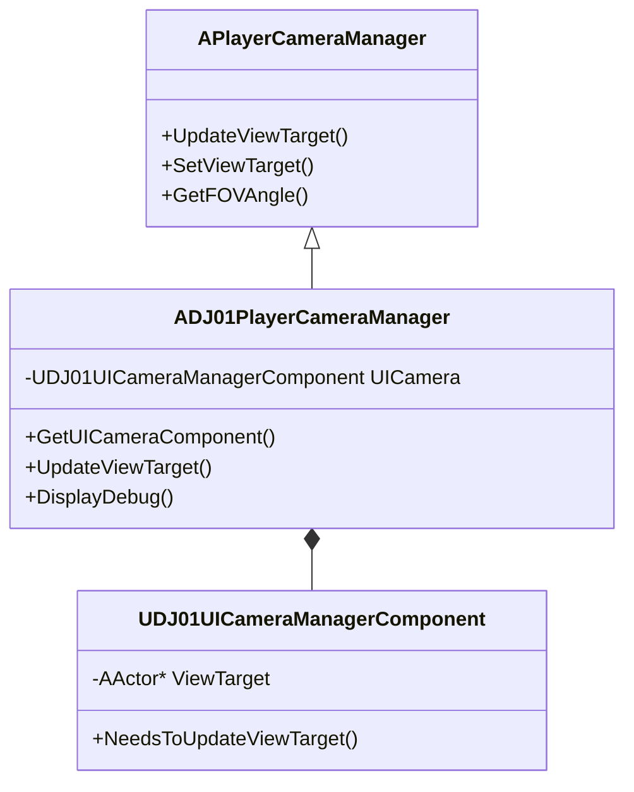

# DJ01PlayerCameraManager 详解

## 1. 概述

`DJ01PlayerCameraManager` 是整个相机系统的核心管理器，继承自 UE 的 `APlayerCameraManager`。它负责协调和管理所有相机相关的行为。

## 2. 类图关系



## 3. 关键属性

```cpp
// 默认视场角（FOV）
#define DJ01_CAMERA_DEFAULT_FOV (80.0f)

// 俯仰角限制
#define DJ01_CAMERA_DEFAULT_PITCH_MIN (-89.0f)
#define DJ01_CAMERA_DEFAULT_PITCH_MAX (89.0f)

// UI相机组件
UPROPERTY(Transient)
TObjectPtr<UDJ01UICameraManagerComponent> UICamera;
```

## 4. 核心功能

### 4.1 视角目标更新
```cpp
virtual void UpdateViewTarget(FTViewTarget& OutVT, float DeltaTime) override
{
    // 1. 检查UI相机是否需要控制
    if (UICamera->NeedsToUpdateViewTarget())
    {
        Super::UpdateViewTarget(OutVT, DeltaTime);
        UICamera->UpdateViewTarget(OutVT, DeltaTime);
        return;
    }

    // 2. 正常更新视角
    Super::UpdateViewTarget(OutVT, DeltaTime);
}
```

### 4.2 调试信息显示
```cpp
virtual void DisplayDebug(UCanvas* Canvas, const FDebugDisplayInfo& DebugDisplay, float& YL, float& YPos) override
{
    // 显示相机管理器信息
    DisplayDebugManager.DrawString(FString::Printf(TEXT("DJ01PlayerCameraManager: %s"), *GetNameSafe(this)));
    
    // 显示相机组件调试信息
    if (const UDJ01CameraComponent* CameraComponent = UDJ01CameraComponent::FindCameraComponent(Pawn))
    {
        CameraComponent->DrawDebug(Canvas);
    }
}
```

## 5. 使用示例

### 5.1 基础设置
```cpp
// 在GameMode中设置相机管理器
AYourGameMode::AYourGameMode()
{
    PlayerCameraManagerClass = ADJ01PlayerCameraManager::StaticClass();
}
```

### 5.2 获取相机管理器
```cpp
// 在任何地方获取相机管理器
ADJ01PlayerCameraManager* CameraManager = Cast<ADJ01PlayerCameraManager>(
    GetWorld()->GetFirstPlayerController()->PlayerCameraManager);
```

### 5.3 修改视角
```cpp
// 设置新的视角目标
CameraManager->SetViewTarget(NewTargetActor);

// 带过渡效果的视角切换
FViewTargetTransitionParams TransitionParams;
TransitionParams.BlendTime = 1.0f;
CameraManager->SetViewTarget(NewTargetActor, TransitionParams);
```

## 6. 高级特性

### 6.1 视角混合系统
PlayerCameraManager 提供了复杂的视角混合系统，可以实现：
- 平滑的视角过渡
- 多个视角的权重混合
- 自定义混合函数

```cpp
// 示例：创建自定义混合函数
float CustomBlendFunction(float Alpha, float Exp)
{
    return FMath::InterpEaseInOut(0.f, 1.f, Alpha, Exp);
}
```

### 6.2 相机效果系统
可以添加各种相机效果：
- 相机震动
- 后期处理效果
- FOV变化

```cpp
// 示例：添加相机震动
FCameraShakeStartParams ShakeParams;
CameraManager->StartCameraShake(UYourCameraShake::StaticClass(), ShakeParams);
```

## 7. 扩展知识

### 7.1 相关UE概念
1. **ViewTarget**
   - 什么是ViewTarget
   - ViewTarget的生命周期
   - ViewTarget切换机制

2. **相机组件系统**
   - UE默认相机组件
   - 自定义相机组件
   - 组件间通信

3. **后期处理系统**
   - Post Process Volume
   - 相机后期处理设置
   - 动态后期处理效果

### 7.2 进阶主题
1. **多玩家相机系统**
   - 分屏处理
   - 网络同步
   - 性能优化

2. **相机动画系统**
   - Matinee与Sequencer
   - 程序化相机动画
   - 动画混合

3. **VR/AR相关**
   - VR相机适配
   - 立体渲染
   - 空间定位

## 8. 常见问题

### 8.1 视角切换不平滑
```cpp
// 问题：直接设置视角导致突变
CameraManager->SetViewTarget(NewTarget); // 不推荐

// 解决：使用过渡参数
FViewTargetTransitionParams TransitionParams;
TransitionParams.BlendTime = 0.5f;
TransitionParams.BlendFunction = VTBlend_EaseInOut;
CameraManager->SetViewTarget(NewTarget, TransitionParams); // 推荐
```

### 8.2 相机穿墙
```cpp
// 问题：相机可能穿过墙体
// 解决：启用碰撞检测
UCameraComponent* Camera = CreateDefaultSubobject<UCameraComponent>(TEXT("Camera"));
Camera->bUsePawnControlRotation = true;
Camera->bDoCollisionTest = true;
```

## 9. 性能优化

### 9.1 视图更新优化
- 使用视锥体剔除
- 优化更新频率
- 使用异步更新

```cpp
// 示例：条件更新
void ADJ01PlayerCameraManager::UpdateViewTarget(FTViewTarget& OutVT, float DeltaTime)
{
    // 只在必要时更新
    if (NeedsUpdate())
    {
        Super::UpdateViewTarget(OutVT, DeltaTime);
    }
}
```

### 9.2 调试开销控制
```cpp
// 在发布版本中禁用调试绘制
#if !UE_BUILD_SHIPPING
    DrawDebugSphere(GetWorld(), Location, Radius, 12, FColor::Red);
#endif
```

## 10. 相关资源

### 10.1 官方文档
- [UE Camera Framework](https://docs.unrealengine.com/5.0/en-US/camera-framework-in-unreal-engine/)
- [Player Camera Manager](https://docs.unrealengine.com/5.0/en-US/API/Runtime/Engine/Camera/APlayerCameraManager/)

### 10.2 学习资源
- UE官方视频教程
- 社区示例项目
- 相关论坛讨论

## 11. 未来扩展

### 11.1 可能的改进
- [ ] 添加更多相机效果预设
- [ ] 优化视角切换算法
- [ ] 增加网络同步支持
- [ ] 添加更多调试工具

### 11.2 实验性功能
- 基于AI的相机控制
- 高级相机轨迹编辑器
- 实时相机行为分析