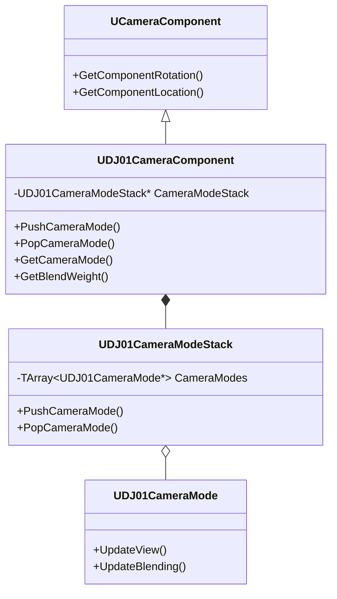

# DJ01CameraComponent 详解

## 1. 概述

`DJ01CameraComponent` 是一个可以附加到任何Actor上的相机组件，它管理相机模式栈并处理实际的视角计算。这个组件是实现复杂相机行为的核心。

## 2. 类图关系



## 3. 核心功能

### 3.1 相机模式管理
```cpp
// 添加新的相机模式
UFUNCTION(BlueprintCallable, Category = "Camera")
UDJ01CameraMode* PushCameraMode(TSubclassOf<UDJ01CameraMode> CameraModeClass)
{
    if (CameraModeStack)
    {
        return CameraModeStack->PushCameraMode(CameraModeClass);
    }
    return nullptr;
}

// 移除当前相机模式
void PopCameraMode(UDJ01CameraMode* CameraMode)
{
    if (CameraModeStack)
    {
        CameraModeStack->PopCameraMode(CameraMode);
    }
}
```

### 3.2 视角更新
```cpp
virtual void TickComponent(float DeltaTime, ELevelTick TickType, FActorComponentTickFunction* ThisTickFunction) override
{
    Super::TickComponent(DeltaTime, TickType, ThisTickFunction);

    // 更新相机模式栈
    if (CameraModeStack)
    {
        CameraModeStack->UpdateStack(DeltaTime);
    }

    // 应用最终的相机变换
    UpdateCameraTransform(DeltaTime);
}
```

## 4. 高级特性

### 4.1 相机模式混合系统
```cpp
// 在不同相机模式间平滑过渡
struct FCameraModeBlend
{
    float BlendAlpha;
    float BlendTime;
    ECameraModeBlendFunction BlendFunction;
    
    void Update(float DeltaTime)
    {
        BlendAlpha = FMath::Min(BlendAlpha + DeltaTime / BlendTime, 1.0f);
    }
};
```

### 4.2 视角插值
```cpp
// 平滑相机运动
void UDJ01CameraComponent::SmoothCameraTransform(float DeltaTime)
{
    const FVector DesiredLocation = GetDesiredLocation();
    const FRotator DesiredRotation = GetDesiredRotation();
    
    CurrentLocation = FMath::VInterpTo(CurrentLocation, DesiredLocation, DeltaTime, LocationLerpSpeed);
    CurrentRotation = FMath::RInterpTo(CurrentRotation, DesiredRotation, DeltaTime, RotationLerpSpeed);
}
```

## 5. 使用示例

### 5.1 基础设置
```cpp
// 在角色类中添加相机组件
UPROPERTY(VisibleAnywhere, BlueprintReadOnly, Category = Camera)
UDJ01CameraComponent* CameraComponent;

// 在构造函数中初始化
AYourCharacter::AYourCharacter()
{
    CameraComponent = CreateDefaultSubobject<UDJ01CameraComponent>(TEXT("CameraComponent"));
    CameraComponent->SetupAttachment(RootComponent);
}
```

### 5.2 相机模式切换
```cpp
// 切换到第三人称相机
void AYourCharacter::SwitchToThirdPerson()
{
    if (CameraComponent)
    {
        // 创建带过渡的相机模式切换
        FCameraModeTransitionParams Params;
        Params.BlendTime = 0.5f;
        Params.BlendFunction = ECameraModeBlendFunction::EaseInOut;
        
        CameraComponent->PushCameraMode(UDJ01CameraMode_ThirdPerson::StaticClass(), Params);
    }
}
```

## 6. 扩展知识

### 6.1 UE相机系统
1. **相机组件基础**
   - UCameraComponent的工作原理
   - 视图矩阵计算
   - 投影矩阵设置

2. **坐标空间转换**
   - 世界空间与相机空间
   - 视图空间与裁剪空间
   - 屏幕空间坐标

3. **相机动画**
   - 关键帧动画
   - 程序化动画
   - 物理模拟

### 6.2 进阶概念
1. **FOV和视锥体**
   - 视场角计算
   - 近平面和远平面
   - 视锥体剔除

2. **后期处理整合**
   - 相机后期处理设置
   - 动态后期处理效果
   - 自定义后期处理材质

## 7. 常见问题解决

### 7.1 相机抖动
```cpp
// 问题：相机跟随目标时出现抖动
// 解决：使用平滑插值

// 添加平滑参数
UPROPERTY(EditAnywhere, Category = "Camera|Smoothing")
float LocationSmoothing = 5.0f;

UPROPERTY(EditAnywhere, Category = "Camera|Smoothing")
float RotationSmoothing = 5.0f;

// 实现平滑更新
void SmoothCameraMovement(float DeltaTime)
{
    FVector TargetLocation = GetTargetLocation();
    FRotator TargetRotation = GetTargetRotation();
    
    CurrentLocation = FMath::VInterpTo(CurrentLocation, TargetLocation, DeltaTime, LocationSmoothing);
    CurrentRotation = FMath::RInterpTo(CurrentRotation, TargetRotation, DeltaTime, RotationSmoothing);
}
```

### 7.2 性能优化
```cpp
// 优化更新频率
UPROPERTY(EditAnywhere, Category = "Camera|Performance")
float UpdateFrequency = 60.0f;

float TimeSinceLastUpdate = 0.0f;

void TickComponent(float DeltaTime, ...)
{
    TimeSinceLastUpdate += DeltaTime;
    if (TimeSinceLastUpdate >= 1.0f / UpdateFrequency)
    {
        UpdateCamera();
        TimeSinceLastUpdate = 0.0f;
    }
}
```

## 8. 调试工具

### 8.1 可视化调试
```cpp
void UDJ01CameraComponent::DrawDebug()
{
    #if ENABLE_DRAW_DEBUG
        // 绘制相机视锥体
        DrawDebugCameraFrustum(GetWorld(), 
            GetComponentLocation(),
            GetComponentRotation(),
            FieldOfView,
            DrawScale,
            FColor::Yellow,
            false);
            
        // 绘制相机路径
        DrawDebugLine(GetWorld(),
            PreviousLocation,
            GetComponentLocation(),
            FColor::Red,
            false,
            -1.0f,
            0,
            1.0f);
    #endif
}
```

### 8.2 状态监控
```cpp
void UDJ01CameraComponent::DisplayDebugInfo(UCanvas* Canvas, const FDebugDisplayInfo& DebugDisplay)
{
    // 显示当前相机模式
    FDisplayDebugManager& DisplayDebugManager = Canvas->DisplayDebugManager;
    DisplayDebugManager.DrawString(FString::Printf(TEXT("Current Camera Mode: %s"), 
        *GetCurrentCameraMode()->GetClass()->GetName()));
        
    // 显示混合状态
    DisplayDebugManager.DrawString(FString::Printf(TEXT("Blend Weight: %f"), 
        GetBlendWeight()));
}
```

## 9. 性能考虑

### 9.1 更新优化
- 使用tick组管理更新顺序
- 实现LOD系统
- 优化计算密集型操作

```cpp
// 设置Tick组
void UDJ01CameraComponent::BeginPlay()
{
    Super::BeginPlay();
    PrimaryComponentTick.TickGroup = TG_PostUpdateWork;
}
```

### 9.2 内存管理
```cpp
// 智能管理相机模式实例
void UDJ01CameraComponent::CleanupUnusedModes()
{
    for (auto Mode : InactiveCameraModes)
    {
        if (Mode && !Mode->IsInUse())
        {
            Mode->ConditionalBeginDestroy();
        }
    }
    InactiveCameraModes.Empty();
}
```

## 10. 最佳实践

### 10.1 相机组件设置
```cpp
// 推荐的基础设置
void SetupCameraDefaults()
{
    // 基础设置
    SetRelativeLocation(FVector(0.0f, 0.0f, 50.0f));
    bUsePawnControlRotation = false;
    
    // 性能设置
    PrimaryComponentTick.bCanEverTick = true;
    PrimaryComponentTick.TickGroup = TG_PostUpdateWork;
    
    // 碰撞设置
    SetCollisionEnabled(ECollisionEnabled::NoCollision);
}
```

### 10.2 模式管理
```cpp
// 相机模式管理最佳实践
void ManageCameraModes()
{
    // 使用优先级系统
    struct FCameraModeInfo
    {
        TSubclassOf<UDJ01CameraMode> ModeClass;
        int32 Priority;
        float BlendTime;
    };
    
    // 根据优先级排序和更新
    TArray<FCameraModeInfo> ActiveModes;
    ActiveModes.Sort([](const FCameraModeInfo& A, const FCameraModeInfo& B) {
        return A.Priority > B.Priority;
    });
}
```

## 11. 未来扩展

### 11.1 计划功能
- [ ] 添加相机震动系统
- [ ] 实现高级路径跟随
- [ ] 添加事件驱动的相机行为
- [ ] 支持多目标跟随

### 11.2 实验性功能
- 基于机器学习的相机控制
- 上下文感知的相机行为
- 动态场景分析和适应

## 12. 相关资源

### 12.1 参考文档
- [UE Camera System Documentation](https://docs.unrealengine.com/5.0/en-US/cameras-in-unreal-engine/)
- [Camera Framework Guide](https://docs.unrealengine.com/5.0/en-US/camera-framework-in-unreal-engine/)

### 12.2 学习资源
- Epic Games 官方教程
- 社区示例项目
- 相关GDC演讲