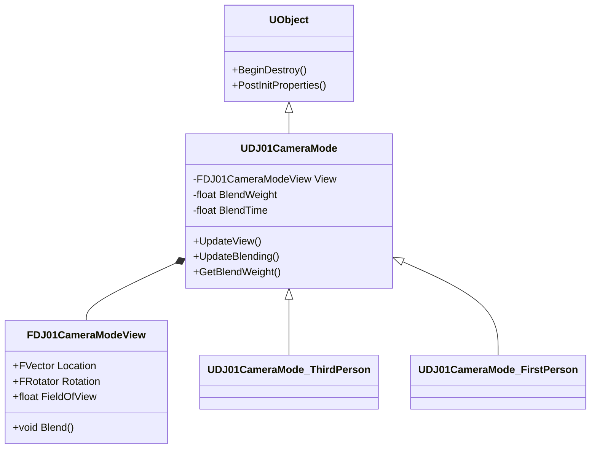

# DJ01CameraMode 详解

## 1. 概述

`DJ01CameraMode` 是所有相机模式的基类，定义了相机行为的基本框架。它提供了视角计算、混合过渡等基础功能，是实现各种具体相机模式的基础。

## 2. 类图关系



## 3. 核心结构

### 3.1 相机视图结构
```cpp
// 相机视图数据结构
USTRUCT(BlueprintType)
struct FDJ01CameraModeView
{
    GENERATED_BODY()

    // 相机位置
    UPROPERTY(EditAnywhere, BlueprintReadWrite, Category="Camera")
    FVector Location;

    // 相机旋转
    UPROPERTY(EditAnywhere, BlueprintReadWrite, Category="Camera")
    FRotator Rotation;

    // 视场角
    UPROPERTY(EditAnywhere, BlueprintReadWrite, Category="Camera")
    float FieldOfView;

    // 混合函数
    void Blend(const FDJ01CameraModeView& Other, float OtherWeight);
};
```

### 3.2 混合参数
```cpp
// 相机模式混合参数
USTRUCT(BlueprintType)
struct FDJ01CameraModeBlendParams
{
    GENERATED_BODY()

    // 混合时间
    UPROPERTY(EditAnywhere, BlueprintReadWrite, Category="Blending")
    float BlendTime;

    // 混合函数类型
    UPROPERTY(EditAnywhere, BlueprintReadWrite, Category="Blending")
    ECameraModeBlendFunction BlendFunction;

    // 混合指数
    UPROPERTY(EditAnywhere, BlueprintReadWrite, Category="Blending")
    float BlendExponent;
};
```

## 4. 核心功能

### 4.1 视图更新
```cpp
// 更新相机视图
virtual void UpdateView(float DeltaTime)
{
    // 更新基础视图参数
    UpdateViewTarget(DeltaTime);
    
    // 更新FOV
    UpdateFOV(DeltaTime);
    
    // 应用后期处理设置
    UpdatePostProcess(DeltaTime);
}
```

### 4.2 混合系统
```cpp
// 处理与其他相机模式的混合
virtual void UpdateBlending(float DeltaTime)
{
    // 更新混合权重
    if (BlendTime > 0.0f)
    {
        BlendWeight = FMath::Min(BlendWeight + DeltaTime / BlendTime, 1.0f);
    }
    else
    {
        BlendWeight = 1.0f;
    }
    
    // 应用混合函数
    BlendWeight = ApplyBlendFunction(BlendWeight);
}
```

## 5. 高级特性

### 5.1 事件系统
```cpp
// 相机模式生命周期事件
UCLASS(Abstract)
class UDJ01CameraMode : public UObject
{
    // 激活时调用
    virtual void OnActivated();
    
    // 停用时调用
    virtual void OnDeactivated();
    
    // 每次更新时调用
    virtual void OnUpdate(float DeltaTime);
    
    // 混合完成时调用
    virtual void OnBlendComplete();
};
```

### 5.2 后期处理控制
```cpp
// 后期处理设置
UPROPERTY(EditAnywhere, Category="Post Process")
struct FPostProcessSettings
{
    // 曝光控制
    float AutoExposureBias;
    
    // 景深设置
    float DepthOfFieldFocalDistance;
    float DepthOfFieldFstop;
    
    // 动态模糊
    float MotionBlurAmount;
};
```

## 6. 使用示例

### 6.1 创建自定义相机模式
```cpp
UCLASS()
class UCustomCameraMode : public UDJ01CameraMode
{
    GENERATED_BODY()

public:
    virtual void UpdateView(float DeltaTime) override
    {
        // 实现自定义视图逻辑
        FVector TargetLocation = CalculateDesiredLocation();
        FRotator TargetRotation = CalculateDesiredRotation();
        
        View.Location = FMath::VInterpTo(View.Location, TargetLocation, DeltaTime, LocationLerpSpeed);
        View.Rotation = FMath::RInterpTo(View.Rotation, TargetRotation, DeltaTime, RotationLerpSpeed);
    }
    
protected:
    UPROPERTY(EditAnywhere, Category="Camera")
    float LocationLerpSpeed = 5.0f;
    
    UPROPERTY(EditAnywhere, Category="Camera")
    float RotationLerpSpeed = 5.0f;
};
```

### 6.2 实现混合效果
```cpp
// 自定义混合函数
float UCustomCameraMode::ApplyCustomBlend(float Alpha)
{
    // 实现自定义缓动函数
    return FMath::InterpEaseInOut(0.0f, 1.0f, Alpha, BlendExponent);
}
```

## 7. 扩展知识

### 7.1 相机插值技术
1. **线性插值(LERP)**
   ```cpp
   FVector LerpLocation = FMath::Lerp(StartLoc, EndLoc, Alpha);
   ```

2. **球面插值(SLERP)**
   ```cpp
   FQuat SlerpRotation = FQuat::Slerp(StartRot, EndRot, Alpha);
   ```

3. **缓动函数**
   ```cpp
   float EaseInOut(float Alpha)
   {
       return -0.5f * (FMath::Cos(PI * Alpha) - 1.0f);
   }
   ```

### 7.2 相机约束系统
```cpp
struct FCameraConstraints
{
    // 位置约束
    FVector MinLocation;
    FVector MaxLocation;
    
    // 旋转约束
    float MinPitch;
    float MaxPitch;
    float MinYaw;
    float MaxYaw;
    
    // 应用约束
    void ApplyConstraints(FDJ01CameraModeView& View);
};
```

## 8. 调试功能

### 8.1 可视化工具
```cpp
void UDJ01CameraMode::DrawDebug(UCanvas* Canvas)
{
    // 绘制相机信息
    FDisplayDebugManager& DisplayDebugManager = Canvas->DisplayDebugManager;
    
    // 显示当前模式信息
    DisplayDebugManager.DrawString(FString::Printf(TEXT("Camera Mode: %s"), *GetClass()->GetName()));
    
    // 显示混合信息
    DisplayDebugManager.DrawString(FString::Printf(TEXT("Blend Weight: %.2f"), BlendWeight));
    
    // 显示视图参数
    DisplayDebugManager.DrawString(FString::Printf(TEXT("Location: %s"), *View.Location.ToString()));
    DisplayDebugManager.DrawString(FString::Printf(TEXT("Rotation: %s"), *View.Rotation.ToString()));
}
```

### 8.2 性能分析
```cpp
void UDJ01CameraMode::TrackPerformance()
{
    SCOPE_CYCLE_COUNTER(STAT_CameraModeUpdate);
    
    // 记录更新时间
    double StartTime = FPlatformTime::Seconds();
    UpdateView(DeltaTime);
    double EndTime = FPlatformTime::Seconds();
    
    // 更新性能统计
    UpdateTime = EndTime - StartTime;
}
```

## 9. 性能优化

### 9.1 计算优化
```cpp
// 缓存常用值
UPROPERTY(Transient)
struct FCachedCameraData
{
    FVector LastTargetLocation;
    FRotator LastTargetRotation;
    float LastUpdateTime;
    
    void UpdateCache(const FVector& NewLoc, const FRotator& NewRot)
    {
        LastTargetLocation = NewLoc;
        LastTargetRotation = NewRot;
        LastUpdateTime = FPlatformTime::Seconds();
    }
};
```

### 9.2 内存管理
```cpp
// 智能资源管理
void UDJ01CameraMode::CleanupResources()
{
    // 清理缓存数据
    CachedData.Empty();
    
    // 释放不需要的资源
    if (PostProcessMaterial)
    {
        PostProcessMaterial->RemoveFromRoot();
        PostProcessMaterial = nullptr;
    }
}
```

## 10. 最佳实践

### 10.1 相机模式设计原则
1. **单一职责**
   - 每个相机模式只处理一种特定的相机行为
   - 避免在一个模式中混合多种行为

2. **可配置性**
   - 使用UPROPERTY暴露关键参数
   - 提供合理的默认值

3. **性能考虑**
   - 优化频繁计算的部分
   - 使用适当的缓存策略

### 10.2 代码组织
```cpp
// 推荐的类结构组织
UCLASS(Abstract, Blueprintable)
class UDJ01CameraMode : public UObject
{
    // 公共接口
    public:
        // 核心更新函数
        virtual void UpdateView(float DeltaTime);
        
        // 生命周期管理
        virtual void OnActivated();
        virtual void OnDeactivated();
        
    // 保护成员
    protected:
        // 内部更新函数
        virtual void UpdateViewTarget(float DeltaTime);
        virtual void UpdateBlending(float DeltaTime);
        
        // 辅助功能
        virtual void ApplyConstraints();
        virtual void UpdatePostProcess();
        
    // 私有成员
    private:
        // 内部状态
        FDJ01CameraModeView CurrentView;
        float BlendWeight;
};
```

## 11. 常见问题

### 11.1 混合问题
```cpp
// 问题：混合过渡不平滑
// 解决：使用适当的混合函数和时间

// 错误示例
BlendWeight += DeltaTime; // 线性混合，可能不够平滑

// 正确示例
BlendWeight = FMath::InterpEaseInOut(0.0f, 1.0f, 
    FMath::Min(1.0f, ElapsedTime / BlendTime), 
    BlendExponent);
```

### 11.2 性能问题
```cpp
// 问题：频繁更新导致性能问题
// 解决：实现更新频率控制

UPROPERTY(EditAnywhere, Category="Performance")
float MinUpdateInterval = 1.0f / 60.0f;

float TimeSinceLastUpdate = 0.0f;

void UpdateView(float DeltaTime)
{
    TimeSinceLastUpdate += DeltaTime;
    if (TimeSinceLastUpdate >= MinUpdateInterval)
    {
        // 执行更新
        PerformUpdate();
        TimeSinceLastUpdate = 0.0f;
    }
}
```

## 12. 未来扩展

### 12.1 计划功能
- [ ] 支持相机路径系统
- [ ] 添加事件驱动的相机行为
- [ ] 实现相机预设系统
- [ ] 添加更多混合模式

### 12.2 实验性功能
- 基于物理的相机行为
- 智能场景分析
- 动态优先级系统

## 13. 相关资源

### 13.1 官方文档
- [UE Camera Framework](https://docs.unrealengine.com/5.0/en-US/camera-framework-in-unreal-engine/)
- [UE Animation System](https://docs.unrealengine.com/5.0/en-US/animation-system-in-unreal-engine/)

### 13.2 社区资源
- Epic Games 论坛相关讨论
- 示例项目
- 相关插件推荐