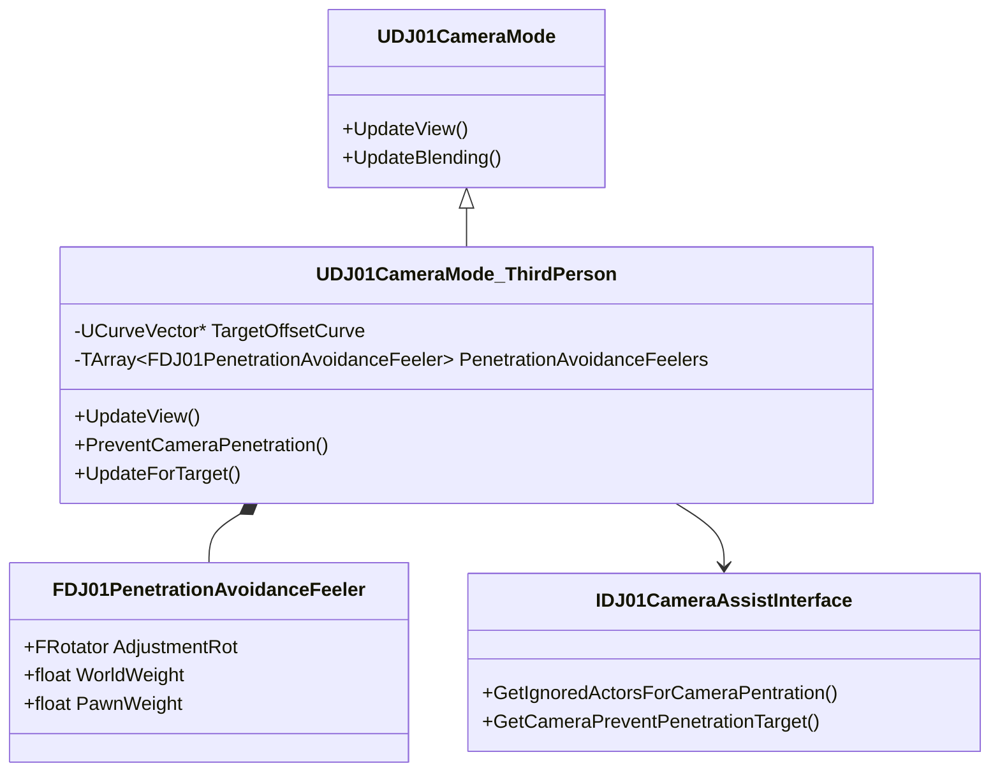

# DJ01CameraMode_ThirdPerson 详解

## 1. 概述

`DJ01CameraMode_ThirdPerson` 是一个专门实现第三人称视角的相机模式，继承自 `DJ01CameraMode`。它提供了完整的第三人称相机功能，包括跟随目标、碰撞检测、视角平滑等特性。

## 2. 类图关系



## 3. 核心功能

### 3.1 相机位置计算
```cpp
// 计算理想的相机位置
FVector UDJ01CameraMode_ThirdPerson::CalculateTargetLocation() const
{
    const AActor* TargetActor = GetTargetActor();
    if (!TargetActor)
    {
        return FVector::ZeroVector;
    }

    // 获取目标位置
    const FVector TargetLocation = TargetActor->GetActorLocation();
    
    // 应用偏移
    FVector Offset = GetTargetOffset();
    if (TargetOffsetCurve)
    {
        const float Time = GetWorld()->GetTimeSeconds();
        Offset = TargetOffsetCurve->GetVectorValue(Time);
    }
    
    return TargetLocation + Offset;
}
```

### 3.2 碰撞检测系统
```cpp
// 防止相机穿墙
void UDJ01CameraMode_ThirdPerson::PreventCameraPenetration(
    const AActor& ViewTarget, 
    const FVector& SafeLoc, 
    FVector& CameraLoc, 
    float DeltaTime)
{
    if (!bPreventPenetration)
    {
        return;
    }

    // 遍历所有检测器
    for (const FDJ01PenetrationAvoidanceFeeler& Feeler : PenetrationAvoidanceFeelers)
    {
        // 计算检测射线
        const FRotator AdjustedRot = ViewTarget.GetActorRotation() + Feeler.AdjustmentRot;
        const FVector TraceStart = SafeLoc;
        const FVector TraceEnd = CameraLoc;
        
        // 执行碰撞检测
        FHitResult Hit;
        if (PerformTrace(TraceStart, TraceEnd, Hit))
        {
            // 调整相机位置
            AdjustCameraLocation(Hit, CameraLoc, Feeler);
        }
    }
}
```

### 3.3 下蹲适配
```cpp
// 处理角色下蹲时的相机调整
void UDJ01CameraMode_ThirdPerson::UpdateForTarget(float DeltaTime)
{
    if (const ACharacter* TargetCharacter = Cast<ACharacter>(GetTargetActor()))
    {
        if (TargetCharacter->bIsCrouched)
        {
            // 计算下蹲时的高度调整
            const ACharacter* TargetCharacterCDO = 
                TargetCharacter->GetClass()->GetDefaultObject<ACharacter>();
            const float CrouchedHeightAdjustment = 
                TargetCharacterCDO->CrouchedEyeHeight - TargetCharacterCDO->BaseEyeHeight;

            SetTargetCrouchOffset(FVector(0.f, 0.f, CrouchedHeightAdjustment));
            return;
        }
    }

    SetTargetCrouchOffset(FVector::ZeroVector);
}
```

## 4. 高级特性

### 4.1 相机跟随系统
```cpp
// 高级相机跟随配置
USTRUCT()
struct FThirdPersonFollowParams
{
    GENERATED_BODY()
    
    // 跟随延迟
    UPROPERTY(EditAnywhere, Category="Follow")
    float FollowLagSpeed = 10.0f;
    
    // 旋转延迟
    UPROPERTY(EditAnywhere, Category="Follow")
    float RotationLagSpeed = 10.0f;
    
    // 高度偏移
    UPROPERTY(EditAnywhere, Category="Follow")
    float HeightOffset = 70.0f;
    
    // 距离
    UPROPERTY(EditAnywhere, Category="Follow")
    float TargetDistance = 300.0f;
};
```

### 4.2 动态偏移系统
```cpp
// 基于场景的动态偏移调整
void UDJ01CameraMode_ThirdPerson::UpdateDynamicOffset()
{
    // 检查周围环境
    TArray<FOverlapResult> Overlaps;
    FCollisionQueryParams QueryParams;
    QueryParams.bTraceComplex = false;
    
    if (GetWorld()->OverlapMultiByChannel(Overlaps, 
        GetTargetLocation(), 
        FQuat::Identity,
        ECC_Camera,
        FCollisionShape::MakeSphere(300.0f),
        QueryParams))
    {
        // 根据环境调整偏移
        for (const FOverlapResult& Overlap : Overlaps)
        {
            if (Overlap.GetActor()->IsA<AStaticMeshActor>())
            {
                // 调整相机位置以避开障碍物
                AdjustCameraForObstacle(Overlap.GetActor());
            }
        }
    }
}
```

## 5. 使用示例

### 5.1 基础设置
```cpp
// 在角色类中设置第三人称相机
void AYourCharacter::SetupThirdPersonCamera()
{
    // 创建相机组件
    CameraComponent = CreateDefaultSubobject<UDJ01CameraComponent>(TEXT("CameraComponent"));
    CameraComponent->SetupAttachment(RootComponent);
    
    // 配置第三人称模式
    if (UDJ01CameraMode_ThirdPerson* TPMode = CameraComponent->PushCameraMode<UDJ01CameraMode_ThirdPerson>())
    {
        // 配置基本参数
        TPMode->SetTargetOffset(FVector(0.0f, 0.0f, 70.0f));
        TPMode->SetTargetDistance(300.0f);
        
        // 配置碰撞检测
        TPMode->bPreventPenetration = true;
        TPMode->PenetrationAvoidanceFeelers = GetDefaultFeelers();
    }
}
```

### 5.2 高级配置
```cpp
// 配置高级特性
void ConfigureAdvancedFeatures(UDJ01CameraMode_ThirdPerson* TPMode)
{
    // 设置目标偏移曲线
    if (UCurveVector* OffsetCurve = LoadObject<UCurveVector>(nullptr, TEXT("/Game/Curves/CameraOffset")))
    {
        TPMode->SetTargetOffsetCurve(OffsetCurve);
    }
    
    // 配置自定义碰撞检测
    TArray<FDJ01PenetrationAvoidanceFeeler> CustomFeelers;
    CustomFeelers.Add(FDJ01PenetrationAvoidanceFeeler(FRotator(0.0f, 0.0f, 0.0f), 1.0f, 1.0f, 15.0f));
    CustomFeelers.Add(FDJ01PenetrationAvoidanceFeeler(FRotator(0.0f, 180.0f, 0.0f), 1.0f, 1.0f, 15.0f));
    TPMode->SetPenetrationAvoidanceFeelers(CustomFeelers);
}
```

## 6. 调试功能

### 6.1 可视化工具
```cpp
void UDJ01CameraMode_ThirdPerson::DrawDebug(UCanvas* Canvas) const
{
    Super::DrawDebug(Canvas);

    #if ENABLE_DRAW_DEBUG
        FDisplayDebugManager& DisplayDebugManager = Canvas->DisplayDebugManager;
        
        // 显示碰撞检测信息
        for (int i = 0; i < DebugActorsHitDuringCameraPenetration.Num(); i++)
        {
            DisplayDebugManager.DrawString(
                FString::Printf(TEXT("Hit Actor[%d]: %s"),
                i,
                *DebugActorsHitDuringCameraPenetration[i]->GetName()));
        }
        
        // 绘制相机路径
        DrawDebugLine(
            GetWorld(),
            GetTargetLocation(),
            GetCurrentLocation(),
            FColor::Yellow,
            false,
            -1.0f,
            0,
            1.0f);
    #endif
}
```

### 6.2 性能监控
```cpp
void UDJ01CameraMode_ThirdPerson::MonitorPerformance()
{
    #if WITH_EDITOR
        // 记录更新时间
        double StartTime = FPlatformTime::Seconds();
        
        // 执行更新
        UpdateView(DeltaTime);
        
        // 计算耗时
        double EndTime = FPlatformTime::Seconds();
        float UpdateTime = (EndTime - StartTime) * 1000.0f; // 转换为毫秒
        
        // 记录性能数据
        if (UpdateTime > 1.0f) // 超过1ms的更新
        {
            UE_LOG(LogCamera, Warning, 
                TEXT("Camera update took %.2fms - Target: %s"), 
                UpdateTime, 
                *GetNameSafe(GetTargetActor()));
        }
    #endif
}
```

## 7. 性能优化

### 7.1 碰撞检测优化
```cpp
// 优化碰撞检测频率
void UDJ01CameraMode_ThirdPerson::OptimizeCollisionChecks()
{
    // 实现检测频率控制
    for (FDJ01PenetrationAvoidanceFeeler& Feeler : PenetrationAvoidanceFeelers)
    {
        if (Feeler.FramesUntilNextTrace > 0)
        {
            --Feeler.FramesUntilNextTrace;
            continue;
        }
        
        // 执行检测
        PerformFeelerTrace(Feeler);
        
        // 重置计数器
        Feeler.FramesUntilNextTrace = Feeler.TraceInterval;
    }
}
```

### 7.2 视图更新优化
```cpp
// 优化视图更新
void UDJ01CameraMode_ThirdPerson::OptimizeViewUpdates()
{
    // 实现LOD系统
    const float DistanceToTarget = FVector::Distance(
        GetCurrentLocation(), 
        GetTargetLocation());
        
    // 根据距离调整更新频率
    const float UpdateInterval = FMath::Lerp(
        0.0f,  // 最小间隔
        0.1f,  // 最大间隔
        FMath::Clamp(DistanceToTarget / 1000.0f, 0.0f, 1.0f));
        
    // 应用更新间隔
    if (TimeUntilNextUpdate > 0.0f)
    {
        TimeUntilNextUpdate -= DeltaTime;
        return;
    }
    
    UpdateView(DeltaTime);
    TimeUntilNextUpdate = UpdateInterval;
}
```

## 8. 常见问题解决

### 8.1 相机抖动
```cpp
// 问题：快速移动时相机抖动
// 解决：实现平滑插值

void UDJ01CameraMode_ThirdPerson::SmoothCameraMovement()
{
    // 位置平滑
    const FVector DesiredLocation = CalculateTargetLocation();
    const FVector SmoothedLocation = FMath::VInterpTo(
        GetCurrentLocation(),
        DesiredLocation,
        DeltaTime,
        PositionLerpSpeed);
        
    // 旋转平滑
    const FRotator DesiredRotation = CalculateTargetRotation();
    const FRotator SmoothedRotation = FMath::RInterpTo(
        GetCurrentRotation(),
        DesiredRotation,
        DeltaTime,
        RotationLerpSpeed);
        
    SetCurrentTransform(SmoothedLocation, SmoothedRotation);
}
```

### 8.2 穿墙问题
```cpp
// 问题：相机在某些情况下仍然穿墙
// 解决：增加额外的检测点和缓冲区

void UDJ01CameraMode_ThirdPerson::EnhancePenetrationPrevention()
{
    // 添加额外的检测点
    const float BufferDistance = 10.0f;
    const FVector CameraDirection = (CameraLoc - SafeLoc).GetSafeNormal();
    
    // 创建检测点阵列
    TArray<FVector> TestPoints;
    TestPoints.Add(CameraLoc);
    TestPoints.Add(CameraLoc + FVector(0.0f, 0.0f, BufferDistance));
    TestPoints.Add(CameraLoc - FVector(0.0f, 0.0f, BufferDistance));
    
    // 检查所有点
    for (const FVector& TestPoint : TestPoints)
    {
        FHitResult Hit;
        if (PerformTrace(SafeLoc, TestPoint, Hit))
        {
            // 如果任何点发生碰撞，调整相机位置
            CameraLoc = Hit.Location - CameraDirection * BufferDistance;
            break;
        }
    }
}
```

## 9. 最佳实践

### 9.1 配置建议
```cpp
// 推荐的基础配置
void UDJ01CameraMode_ThirdPerson::SetupDefaultConfiguration()
{
    // 基础跟随参数
    FollowParams.TargetOffset = FVector(0.0f, 0.0f, 70.0f);
    FollowParams.TargetDistance = 300.0f;
    FollowParams.FollowLagSpeed = 10.0f;
    FollowParams.RotationLagSpeed = 10.0f;
    
    // 碰撞检测配置
    bPreventPenetration = true;
    PenetrationBlendInTime = 0.1f;
    PenetrationBlendOutTime = 0.15f;
    
    // 平滑参数
    PositionLerpSpeed = 5.0f;
    RotationLerpSpeed = 5.0f;
}
```

### 9.2 扩展建议
```cpp
// 示例：添加自定义行为
void UDJ01CameraMode_ThirdPerson::AddCustomBehavior()
{
    // 添加目标跟踪
    if (bEnableTargetTracking)
    {
        // 实现目标追踪逻辑
        TrackTargetOfInterest();
    }
    
    // 添加场景感知
    if (bEnableSceneAwareness)
    {
        // 实现场景分析
        AnalyzeEnvironment();
    }
}
```

## 10. 未来扩展

### 10.1 计划功能
- [ ] 智能场景分析系统
- [ ] 动态FOV调整
- [ ] 高级相机动画系统
- [ ] 多目标追踪支持

### 10.2 实验性功能
```cpp
// 示例：AI驱动的相机行为
class UDJ01CameraMode_ThirdPerson_AI : public UDJ01CameraMode_ThirdPerson
{
    // AI控制的相机行为
    virtual void UpdateView(float DeltaTime) override
    {
        // 分析场景
        AnalyzeScene();
        
        // 预测目标移动
        PredictTargetMovement();
        
        // 选择最佳视角
        ChooseBestViewpoint();
        
        // 应用相机移动
        Super::UpdateView(DeltaTime);
    }
};
```

## 11. 相关资源

### 11.1 参考文档
- [UE Camera System Documentation](https://docs.unrealengine.com/5.0/en-US/cameras-in-unreal-engine/)
- [Third Person Camera Design](https://docs.unrealengine.com/5.0/en-US/third-person-camera-setup-in-unreal-engine/)

### 11.2 学习资源
- Epic Games 官方示例
- 社区教程和插件
- GDC相关演讲资料