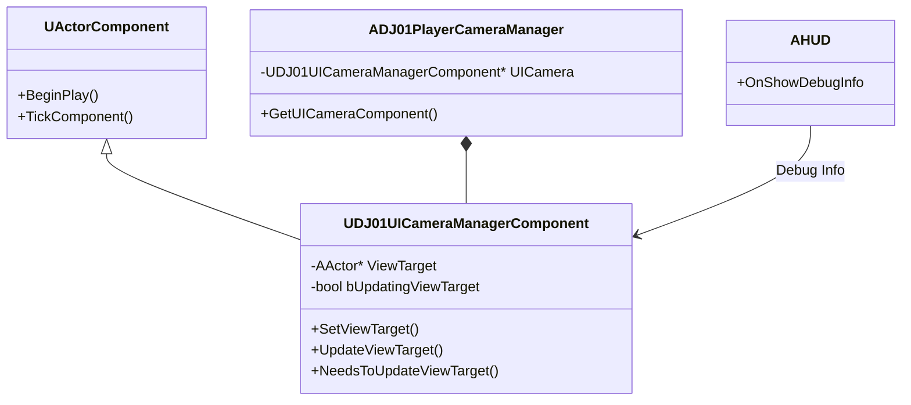

# DJ01UICameraManagerComponent 详解

## 1. 概述

`DJ01UICameraManagerComponent` 是一个专门用于处理UI相关相机行为的组件。它可以临时接管相机控制，用于处理过场动画、UI展示等特殊情况，同时提供平滑的过渡效果。

## 2. 类图关系



## 3. 核心功能

### 3.1 视角控制
```cpp
// 设置新的视角目标
void UDJ01UICameraManagerComponent::SetViewTarget(
    AActor* InViewTarget, 
    FViewTargetTransitionParams TransitionParams)
{
    TGuardValue<bool> UpdatingViewTargetGuard(bUpdatingViewTarget, true);

    // 保存当前视角目标
    ViewTarget = InViewTarget;
    
    // 通知相机管理器更新视角
    if (ADJ01PlayerCameraManager* PCMgr = Cast<ADJ01PlayerCameraManager>(GetOwner()))
    {
        PCMgr->SetViewTarget(ViewTarget, TransitionParams);
    }
}
```

### 3.2 视角更新
```cpp
// 更新视角状态
void UDJ01UICameraManagerComponent::UpdateViewTarget(
    struct FTViewTarget& OutVT, 
    float DeltaTime)
{
    if (!bUpdatingViewTarget || !ViewTarget)
    {
        return;
    }

    // 计算新的视角参数
    FMinimalViewInfo NewPOV;
    NewPOV.Location = ViewTarget->GetActorLocation();
    NewPOV.Rotation = ViewTarget->GetActorRotation();
    NewPOV.FOV = DefaultFOV;

    // 应用视角变换
    OutVT.POV = NewPOV;
}
```

## 4. 高级特性

### 4.1 视角过渡系统
```cpp
// 视角过渡配置
USTRUCT()
struct FUICameraTransitionConfig
{
    GENERATED_BODY()
    
    // 过渡时间
    UPROPERTY(EditAnywhere, Category="Transition")
    float TransitionTime = 0.5f;
    
    // 过渡曲线
    UPROPERTY(EditAnywhere, Category="Transition")
    UCurveFloat* TransitionCurve;
    
    // 过渡类型
    UPROPERTY(EditAnywhere, Category="Transition")
    EViewTargetBlendFunction BlendFunction = VTBlend_EaseInOut;
    
    // 过渡指数
    UPROPERTY(EditAnywhere, Category="Transition")
    float BlendExp = 2.0f;
};
```

### 4.2 事件系统
```cpp
// UI相机事件委托
DECLARE_DYNAMIC_MULTICAST_DELEGATE_OneParam(FOnUICameraTransitionStarted, AActor*, NewViewTarget);
DECLARE_DYNAMIC_MULTICAST_DELEGATE_OneParam(FOnUICameraTransitionCompleted, AActor*, CurrentViewTarget);

UCLASS()
class UDJ01UICameraManagerComponent : public UActorComponent
{
    // 事件声明
    UPROPERTY(BlueprintAssignable, Category="Camera|Events")
    FOnUICameraTransitionStarted OnTransitionStarted;
    
    UPROPERTY(BlueprintAssignable, Category="Camera|Events")
    FOnUICameraTransitionCompleted OnTransitionCompleted;
    
    // 事件触发
    void NotifyTransitionStarted()
    {
        OnTransitionStarted.Broadcast(ViewTarget);
    }
    
    void NotifyTransitionCompleted()
    {
        OnTransitionCompleted.Broadcast(ViewTarget);
    }
};
```

## 5. 使用示例

### 5.1 基础使用
```cpp
// 在UI系统中使用
void AGameHUD::ShowCutscene(AActor* CutsceneCamera)
{
    if (UDJ01UICameraManagerComponent* UICamera = 
        UDJ01UICameraManagerComponent::GetComponent(GetOwningPlayerController()))
    {
        // 设置过渡参数
        FViewTargetTransitionParams TransitionParams;
        TransitionParams.BlendTime = 0.5f;
        TransitionParams.BlendFunction = VTBlend_EaseInOut;
        
        // 切换到过场动画相机
        UICamera->SetViewTarget(CutsceneCamera, TransitionParams);
    }
}
```

### 5.2 高级用法
```cpp
// 创建复杂的相机序列
void UGameplaySequenceManager::ExecuteCameraSequence()
{
    if (UDJ01UICameraManagerComponent* UICamera = GetUICamera())
    {
        // 订阅事件
        UICamera->OnTransitionCompleted.AddDynamic(
            this, 
            &UGameplaySequenceManager::OnCameraTransitionComplete);
        
        // 开始相机序列
        PlayNextCameraInSequence();
    }
}

void UGameplaySequenceManager::PlayNextCameraInSequence()
{
    if (CurrentSequenceIndex < CameraSequence.Num())
    {
        const FCameraSequenceEntry& Entry = CameraSequence[CurrentSequenceIndex];
        
        FViewTargetTransitionParams TransitionParams;
        TransitionParams.BlendTime = Entry.TransitionTime;
        TransitionParams.BlendFunction = Entry.BlendFunction;
        
        UICamera->SetViewTarget(Entry.CameraActor, TransitionParams);
    }
}
```

## 6. 调试功能

### 6.1 可视化工具
```cpp
void UDJ01UICameraManagerComponent::OnShowDebugInfo(
    AHUD* HUD, 
    UCanvas* Canvas, 
    const FDebugDisplayInfo& DisplayInfo, 
    float& YL, 
    float& YPos)
{
    FDisplayDebugManager& DisplayDebugManager = Canvas->DisplayDebugManager;
    
    // 显示当前状态
    DisplayDebugManager.SetDrawColor(FColor::Yellow);
    DisplayDebugManager.DrawString(FString::Printf(
        TEXT("UI Camera Active: %s"), 
        bUpdatingViewTarget ? TEXT("True") : TEXT("False")));
        
    // 显示视角目标信息
    if (ViewTarget)
    {
        DisplayDebugManager.DrawString(FString::Printf(
            TEXT("Current View Target: %s"), 
            *ViewTarget->GetName()));
    }
}
```

### 6.2 状态监控
```cpp
// 监控相机状态
void UDJ01UICameraManagerComponent::MonitorState()
{
    #if WITH_EDITOR
        // 记录状态变化
        if (bUpdatingViewTarget != bPreviousUpdatingViewTarget)
        {
            UE_LOG(LogCamera, Log, 
                TEXT("UI Camera state changed: %s"), 
                bUpdatingViewTarget ? TEXT("Active") : TEXT("Inactive"));
        }
        
        // 检查视角目标有效性
        if (bUpdatingViewTarget && !IsValid(ViewTarget))
        {
            UE_LOG(LogCamera, Warning, 
                TEXT("UI Camera has invalid view target"));
        }
        
        bPreviousUpdatingViewTarget = bUpdatingViewTarget;
    #endif
}
```

## 7. 性能优化

### 7.1 更新优化
```cpp
// 优化更新逻辑
void UDJ01UICameraManagerComponent::OptimizeUpdates()
{
    // 只在必要时更新
    if (!bUpdatingViewTarget || !ViewTarget)
    {
        return;
    }
    
    // 使用帧缓存
    if (CachedViewInfo.TimeStamp == GetWorld()->GetTimeSeconds())
    {
        OutVT.POV = CachedViewInfo.POV;
        return;
    }
    
    // 计算新的视角信息
    UpdateViewTarget(OutVT, DeltaTime);
    
    // 更新缓存
    CachedViewInfo.TimeStamp = GetWorld()->GetTimeSeconds();
    CachedViewInfo.POV = OutVT.POV;
}
```

### 7.2 内存管理
```cpp
// 优化资源使用
void UDJ01UICameraManagerComponent::CleanupResources()
{
    // 清理不需要的引用
    if (!bUpdatingViewTarget)
    {
        ViewTarget = nullptr;
        CachedViewInfo = FViewTargetInfo();
    }
    
    // 清理事件绑定
    if (!bIsActive)
    {
        OnTransitionStarted.Clear();
        OnTransitionCompleted.Clear();
    }
}
```

## 8. 常见问题解决

### 8.1 视角切换问题
```cpp
// 问题：视角切换不平滑
// 解决：确保正确设置过渡参数

void UDJ01UICameraManagerComponent::EnsureSmoothTransition(
    AActor* NewViewTarget)
{
    // 检查当前状态
    if (bUpdatingViewTarget && ViewTarget)
    {
        // 计算适当的过渡时间
        float DistanceToNewTarget = 
            FVector::Distance(ViewTarget->GetActorLocation(), 
                            NewViewTarget->GetActorLocation());
        
        float SuggestedBlendTime = 
            FMath::Clamp(DistanceToNewTarget / 1000.0f, 0.2f, 2.0f);
        
        // 应用过渡
        FViewTargetTransitionParams TransitionParams;
        TransitionParams.BlendTime = SuggestedBlendTime;
        TransitionParams.BlendFunction = VTBlend_EaseInOut;
        
        SetViewTarget(NewViewTarget, TransitionParams);
    }
}
```

### 8.2 优先级冲突
```cpp
// 问题：与其他相机系统的优先级冲突
// 解决：实现优先级系统

UPROPERTY(EditAnywhere, Category="Camera")
int32 UICameraPriority = 100;

bool UDJ01UICameraManagerComponent::ShouldUpdateViewTarget() const
{
    if (!bUpdatingViewTarget || !ViewTarget)
    {
        return false;
    }
    
    // 检查是否有更高优先级的相机系统
    if (ADJ01PlayerCameraManager* PCMgr = 
        Cast<ADJ01PlayerCameraManager>(GetOwner()))
    {
        return PCMgr->GetCurrentCameraPriority() <= UICameraPriority;
    }
    
    return true;
}
```

## 9. 最佳实践

### 9.1 初始化
```cpp
void UDJ01UICameraManagerComponent::InitializeComponent()
{
    Super::InitializeComponent();
    
    // 设置默认值
    DefaultFOV = 90.0f;
    bWantsInitializeComponent = true;
    
    // 注册调试钩子
    if (!HasAnyFlags(RF_ClassDefaultObject))
    {
        if (!IsRunningDedicatedServer())
        {
            AHUD::OnShowDebugInfo.AddUObject(
                this, 
                &ThisClass::OnShowDebugInfo);
        }
    }
}
```

### 9.2 资源管理
```cpp
// 生命周期管理
void UDJ01UICameraManagerComponent::BeginDestroy()
{
    // 清理事件绑定
    if (!HasAnyFlags(RF_ClassDefaultObject))
    {
        AHUD::OnShowDebugInfo.RemoveAll(this);
    }
    
    // 确保正确清理视角目标
    if (bUpdatingViewTarget)
    {
        SetViewTarget(nullptr);
    }
    
    Super::BeginDestroy();
}
```

## 10. 扩展建议

### 10.1 功能扩展
```cpp
// 添加新功能示例
UCLASS()
class UDJ01AdvancedUICameraManagerComponent : 
    public UDJ01UICameraManagerComponent
{
    GENERATED_BODY()
    
public:
    // 添加相机序列支持
    UFUNCTION(BlueprintCallable, Category="Camera|Sequence")
    void PlayCameraSequence(const TArray<FCameraSequenceData>& Sequence);
    
    // 添加相机动画支持
    UFUNCTION(BlueprintCallable, Category="Camera|Animation")
    void PlayCameraAnimation(UCameraAnim* CameraAnim);
    
    // 添加场景转换效果
    UFUNCTION(BlueprintCallable, Category="Camera|Transition")
    void ApplyTransitionEffect(UMaterialInterface* TransitionMaterial);
};
```

### 10.2 集成建议
```cpp
// 与其他系统集成
void IntegrateWithGameSystems()
{
    // 与对话系统集成
    void OnDialogueStarted(const FDialogueContext& Context)
    {
        if (Context.bRequiresCameraControl)
        {
            SetupDialogueCamera(Context);
        }
    }
    
    // 与过场动画系统集成
    void OnCutsceneTriggered(UCutsceneData* CutsceneData)
    {
        if (CutsceneData->bControlCamera)
        {
            SetupCutsceneCamera(CutsceneData);
        }
    }
}
```

## 11. 相关资源

### 11.1 官方文档
- [UE Camera Framework](https://docs.unrealengine.com/5.0/en-US/camera-framework-in-unreal-engine/)
- [UE UI System](https://docs.unrealengine.com/5.0/en-US/umg-ui-designer-in-unreal-engine/)

### 11.2 示例项目
- Epic Games 示例内容
- 社区项目示例
- 相关插件推荐