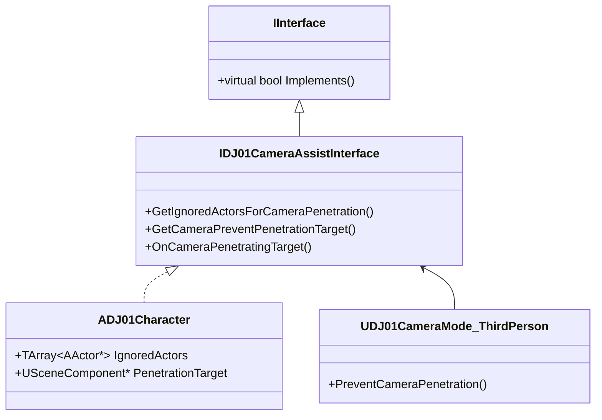

# DJ01CameraAssistInterface 详解

## 1. 概述

`DJ01CameraAssistInterface` 是一个接口类，用于定义相机系统与游戏对象之间的交互方法。它主要处理相机穿透检测、目标识别等辅助功能，使相机系统能够更智能地适应游戏环境。

## 2. 类图关系



## 3. 核心功能

### 3.1 接口定义
```cpp
// 相机辅助接口声明
UINTERFACE(MinimalAPI, meta=(CannotImplementInterfaceInBlueprint))
class UDJ01CameraAssistInterface : public UInterface
{
    GENERATED_BODY()
};

class IDJ01CameraAssistInterface
{
    GENERATED_BODY()

public:
    // 获取相机穿透检测时要忽略的Actor
    virtual TArray<AActor*> GetIgnoredActorsForCameraPenetration() const = 0;
    
    // 获取相机防穿透的目标组件
    virtual USceneComponent* GetCameraPreventPenetrationTarget() const = 0;
    
    // 当相机穿透目标时的回调
    virtual void OnCameraPenetratingTarget(const FVector& CameraLocation) = 0;
};
```

### 3.2 默认实现
```cpp
// 在Character类中实现接口
UCLASS()
class ADJ01Character : public ACharacter, public IDJ01CameraAssistInterface
{
    GENERATED_BODY()

public:
    // 实现获取忽略Actor列表的方法
    virtual TArray<AActor*> GetIgnoredActorsForCameraPenetration() const override
    {
        TArray<AActor*> IgnoredActors;
        
        // 添加角色自身
        IgnoredActors.Add(this);
        
        // 添加装备的武器
        if (CurrentWeapon)
        {
            IgnoredActors.Add(CurrentWeapon);
        }
        
        // 添加其他需要忽略的对象
        IgnoredActors.Append(AdditionalIgnoredActors);
        
        return IgnoredActors;
    }
    
    // 实现获取防穿透目标的方法
    virtual USceneComponent* GetCameraPreventPenetrationTarget() const override
    {
        return GetMesh();
    }
    
    // 实现相机穿透回调
    virtual void OnCameraPenetratingTarget(const FVector& CameraLocation) override
    {
        // 处理相机穿透情况
        HandleCameraPenetration(CameraLocation);
    }
};
```

## 4. 高级特性

### 4.1 动态目标系统
```cpp
// 实现动态目标识别
class IDJ01CameraAssistInterface
{
public:
    // 获取动态相机目标
    virtual FCameraTargetInfo GetDynamicCameraTarget() const
    {
        FCameraTargetInfo TargetInfo;
        
        // 计算最佳观察点
        TargetInfo.IdealLocation = CalculateIdealCameraLocation();
        
        // 设置优先级
        TargetInfo.Priority = CalculateTargetPriority();
        
        // 添加约束
        TargetInfo.Constraints = GetCameraConstraints();
        
        return TargetInfo;
    }
    
protected:
    // 计算理想的相机位置
    virtual FVector CalculateIdealCameraLocation() const
    {
        // 基于当前状态计算最佳观察位置
        return FVector::ZeroVector;
    }
    
    // 计算目标优先级
    virtual float CalculateTargetPriority() const
    {
        return 0.0f;
    }
    
    // 获取相机约束
    virtual FCameraConstraints GetCameraConstraints() const
    {
        return FCameraConstraints();
    }
};
```

### 4.2 场景分析系统
```cpp
// 实现场景分析功能
class IDJ01CameraAssistInterface
{
public:
    // 分析周围环境
    virtual void AnalyzeEnvironment(const FVector& CameraLocation)
    {
        // 检查遮挡物
        TArray<FHitResult> Hits;
        FCollisionQueryParams QueryParams;
        QueryParams.bTraceComplex = true;
        
        GetWorld()->LineTraceMultiByChannel(
            Hits,
            GetActorLocation(),
            CameraLocation,
            ECC_Camera,
            QueryParams);
            
        // 处理遮挡结果
        for (const FHitResult& Hit : Hits)
        {
            ProcessObstacle(Hit);
        }
    }
    
protected:
    // 处理遮挡物
    virtual void ProcessObstacle(const FHitResult& Hit)
    {
        // 实现遮挡物处理逻辑
    }
};
```

## 5. 使用示例

### 5.1 基础实现
```cpp
// 在游戏角色中实现接口
UCLASS()
class AGameCharacter : public ACharacter, public IDJ01CameraAssistInterface
{
    GENERATED_BODY()
    
public:
    // 实现接口方法
    virtual TArray<AActor*> GetIgnoredActorsForCameraPenetration() const override
    {
        TArray<AActor*> IgnoredActors;
        
        // 添加基本忽略对象
        IgnoredActors.Add(this);
        
        // 添加附加组件
        TArray<USceneComponent*> AttachedComponents;
        GetComponents<USceneComponent>(AttachedComponents);
        for (USceneComponent* Component : AttachedComponents)
        {
            if (AActor* Owner = Component->GetOwner())
            {
                IgnoredActors.AddUnique(Owner);
            }
        }
        
        return IgnoredActors;
    }
};
```

### 5.2 高级用法
```cpp
// 在AI角色中实现高级功能
UCLASS()
class AAICharacter : public ACharacter, public IDJ01CameraAssistInterface
{
    GENERATED_BODY()
    
public:
    // 实现动态目标计算
    virtual FCameraTargetInfo GetDynamicCameraTarget() const override
    {
        FCameraTargetInfo TargetInfo;
        
        // 基于AI状态计算最佳观察点
        if (UAIState* CurrentState = GetAIState())
        {
            TargetInfo.IdealLocation = CurrentState->GetBestObservationPoint();
            TargetInfo.Priority = CurrentState->GetTargetPriority();
        }
        
        // 添加战斗相关的约束
        if (bIsInCombat)
        {
            FCameraConstraints CombatConstraints;
            CombatConstraints.MinDistance = 300.f;
            CombatConstraints.MaxDistance = 800.f;
            TargetInfo.Constraints = CombatConstraints;
        }
        
        return TargetInfo;
    }
};
```

## 6. 调试功能

### 6.1 可视化辅助
```cpp
// 实现调试绘制
void IDJ01CameraAssistInterface::DrawDebug(const UWorld* World)
{
    #if ENABLE_DRAW_DEBUG
        // 绘制忽略的Actor范围
        for (AActor* Actor : GetIgnoredActorsForCameraPenetration())
        {
            if (Actor)
            {
                DrawDebugBox(
                    World,
                    Actor->GetActorLocation(),
                    Actor->GetComponentsBoundingBox().GetExtent(),
                    FColor::Green,
                    false,
                    -1.0f,
                    0,
                    2.0f);
            }
        }
        
        // 绘制防穿透目标
        if (USceneComponent* Target = GetCameraPreventPenetrationTarget())
        {
            DrawDebugSphere(
                World,
                Target->GetComponentLocation(),
                50.0f,
                12,
                FColor::Red,
                false,
                -1.0f,
                0,
                2.0f);
        }
    #endif
}
```

### 6.2 状态监控
```cpp
// 实现状态监控
void IDJ01CameraAssistInterface::MonitorState()
{
    #if WITH_EDITOR
        // 记录状态变化
        static FVector LastCameraLocation = FVector::ZeroVector;
        static TArray<AActor*> LastIgnoredActors;
        
        // 检查变化
        TArray<AActor*> CurrentIgnoredActors = GetIgnoredActorsForCameraPenetration();
        if (CurrentIgnoredActors.Num() != LastIgnoredActors.Num())
        {
            UE_LOG(LogCamera, Log, 
                TEXT("Ignored actors count changed: %d -> %d"),
                LastIgnoredActors.Num(),
                CurrentIgnoredActors.Num());
        }
        
        // 更新缓存
        LastIgnoredActors = CurrentIgnoredActors;
    #endif
}
```

## 7. 性能优化

### 7.1 缓存系统
```cpp
// 实现结果缓存
class IDJ01CameraAssistInterface
{
protected:
    // 缓存结构
    struct FCameraAssistCache
    {
        TArray<AActor*> IgnoredActors;
        float CacheTime;
        
        bool IsValid(float CurrentTime, float MaxAge = 0.1f) const
        {
            return (CurrentTime - CacheTime) < MaxAge;
        }
    };
    
    // 缓存实现
    mutable FCameraAssistCache Cache;
    
    // 获取带缓存的结果
    TArray<AActor*> GetCachedIgnoredActors() const
    {
        float CurrentTime = GetWorld()->GetTimeSeconds();
        
        if (!Cache.IsValid(CurrentTime))
        {
            Cache.IgnoredActors = GetIgnoredActorsForCameraPenetration();
            Cache.CacheTime = CurrentTime;
        }
        
        return Cache.IgnoredActors;
    }
};
```

### 7.2 计算优化
```cpp
// 优化计算密集型操作
class IDJ01CameraAssistInterface
{
protected:
    // 使用空间分区
    void OptimizeEnvironmentAnalysis(const FVector& CameraLocation)
    {
        // 使用八叉树加速空间查询
        if (UOctree* Octree = GetWorld()->GetOctree())
        {
            TArray<FBoxSphereBounds> PotentialObjects;
            Octree->GetElementsInBox(
                FBoxCenterAndExtent(
                    GetActorLocation(),
                    FVector(1000.0f)),
                PotentialObjects);
                
            // 只处理潜在对象
            for (const FBoxSphereBounds& Bounds : PotentialObjects)
            {
                ProcessPotentialObject(Bounds);
            }
        }
    }
};
```

## 8. 最佳实践

### 8.1 接口实现指南
```cpp
// 推荐的实现方式
class YOURPROJECT_API AYourCharacter : 
    public ACharacter, 
    public IDJ01CameraAssistInterface
{
public:
    // 1. 保持接口方法简单明确
    virtual TArray<AActor*> GetIgnoredActorsForCameraPenetration() const override
    {
        return CachedIgnoredActors;
    }
    
    // 2. 提供配置选项
    UPROPERTY(EditAnywhere, Category="Camera")
    bool bAutoUpdateIgnoredActors = true;
    
    // 3. 实现更新逻辑
    virtual void Tick(float DeltaTime) override
    {
        Super::Tick(DeltaTime);
        
        if (bAutoUpdateIgnoredActors)
        {
            UpdateIgnoredActors();
        }
    }
    
protected:
    // 4. 使用缓存
    UPROPERTY(Transient)
    TArray<AActor*> CachedIgnoredActors;
    
    // 5. 提供清晰的更新方法
    void UpdateIgnoredActors();
};
```

### 8.2 扩展建议
```cpp
// 扩展接口功能
class IDJ01CameraAssistInterface
{
public:
    // 添加新的辅助方法
    virtual bool ShouldAdjustCameraForAction(const FGameplayTag& ActionTag) const
    {
        return false;
    }
    
    // 提供场景感知
    virtual void NotifyCameraViewChanged(const FCameraViewData& NewView)
    {
        // 实现场景感知逻辑
    }
};
```

## 9. 常见问题解决

### 9.1 性能问题
```cpp
// 问题：频繁更新导致性能问题
// 解决：实现更新频率控制

class IDJ01CameraAssistInterface
{
protected:
    // 控制更新频率
    float TimeSinceLastUpdate = 0.0f;
    const float UpdateInterval = 0.1f;
    
    bool ShouldUpdate(float DeltaTime)
    {
        TimeSinceLastUpdate += DeltaTime;
        if (TimeSinceLastUpdate >= UpdateInterval)
        {
            TimeSinceLastUpdate = 0.0f;
            return true;
        }
        return false;
    }
};
```

### 9.2 穿透问题
```cpp
// 问题：相机穿透检测不准确
// 解决：改进检测算法

class IDJ01CameraAssistInterface
{
protected:
    // 改进的穿透检测
    bool IsActuallyPenetrating(const FVector& CameraLocation)
    {
        // 使用多个检测点
        TArray<FVector> TestPoints;
        TestPoints.Add(CameraLocation);
        TestPoints.Add(CameraLocation + FVector(0, 0, 20));
        TestPoints.Add(CameraLocation - FVector(0, 0, 20));
        
        // 检查所有点
        for (const FVector& Point : TestPoints)
        {
            if (IsPenetrating(Point))
            {
                return true;
            }
        }
        
        return false;
    }
};
```

## 10. 未来扩展

### 10.1 计划功能
- [ ] 添加相机行为预测
- [ ] 实现智能场景分析
- [ ] 添加多目标优先级系统
- [ ] 支持自定义相机规则

### 10.2 实验性功能
```cpp
// 示例：AI驱动的相机辅助
class IDJ01CameraAssistInterface_AI
{
public:
    // AI预测目标移动
    virtual FVector PredictTargetMovement(float PredictionTime)
    {
        return FVector::ZeroVector;
    }
    
    // 场景重要性分析
    virtual float AnalyzeSceneImportance(const FVector& Location)
    {
        return 0.0f;
    }
};
```

## 11. 相关资源

### 11.1 参考文档
- [UE Interface Documentation](https://docs.unrealengine.com/5.0/en-US/interfaces-in-unreal-engine/)
- [Camera System Best Practices](https://docs.unrealengine.com/5.0/en-US/camera-framework-in-unreal-engine/)

### 11.2 学习资源
- Epic Games 示例项目
- 社区教程
- 相关GDC演讲