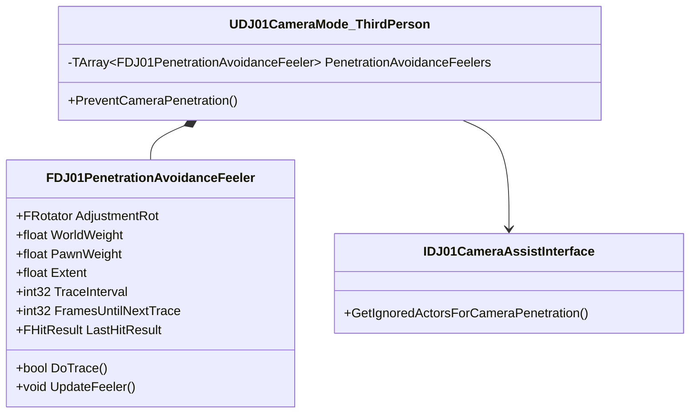

# DJ01PenetrationAvoidanceFeeler 详解

## 1. 概述

`FDJ01PenetrationAvoidanceFeeler` 是一个用于检测和防止相机穿墙的结构体。它通过发射多个探测射线来检测相机与环境的碰撞，并提供相应的调整建议，以确保相机视角的流畅性和合理性。

## 2. 类图关系



## 3. 核心结构

### 3.1 基础定义
```cpp
// 穿透检测器结构体
USTRUCT()
struct FDJ01PenetrationAvoidanceFeeler
{
    GENERATED_BODY()

    // 调整旋转
    UPROPERTY(EditAnywhere, Category="Feeler")
    FRotator AdjustmentRot;

    // 世界权重
    UPROPERTY(EditAnywhere, Category="Feeler")
    float WorldWeight;

    // Pawn权重
    UPROPERTY(EditAnywhere, Category="Feeler")
    float PawnWeight;

    // 检测范围
    UPROPERTY(EditAnywhere, Category="Feeler")
    float Extent;

    // 检测间隔
    UPROPERTY(EditAnywhere, Category="Feeler")
    int32 TraceInterval;

    // 下次检测前的帧数
    int32 FramesUntilNextTrace;

    // 上次碰撞结果
    FHitResult LastHitResult;
};
```

### 3.2 检测配置
```cpp
// 默认检测器配置
struct FDJ01PenetrationAvoidanceFeelerConfig
{
    static FDJ01PenetrationAvoidanceFeeler CreateDefaultFeeler()
    {
        FDJ01PenetrationAvoidanceFeeler Feeler;
        Feeler.AdjustmentRot = FRotator::ZeroRotator;
        Feeler.WorldWeight = 1.0f;
        Feeler.PawnWeight = 1.0f;
        Feeler.Extent = 10.0f;
        Feeler.TraceInterval = 1;
        return Feeler;
    }

    static TArray<FDJ01PenetrationAvoidanceFeeler> CreateDefaultFeelers()
    {
        TArray<FDJ01PenetrationAvoidanceFeeler> Feelers;
        
        // 中心射线
        Feelers.Add(CreateDefaultFeeler());
        
        // 上方射线
        FDJ01PenetrationAvoidanceFeeler UpFeeler = CreateDefaultFeeler();
        UpFeeler.AdjustmentRot = FRotator(45.0f, 0.0f, 0.0f);
        Feelers.Add(UpFeeler);
        
        // 下方射线
        FDJ01PenetrationAvoidanceFeeler DownFeeler = CreateDefaultFeeler();
        DownFeeler.AdjustmentRot = FRotator(-45.0f, 0.0f, 0.0f);
        Feelers.Add(DownFeeler);
        
        return Feelers;
    }
};
```

## 4. 核心功能

### 4.1 射线检测
```cpp
// 执行射线检测
bool FDJ01PenetrationAvoidanceFeeler::DoTrace(
    const UWorld* World,
    const FVector& Start,
    const FVector& End,
    const TArray<AActor*>& IgnoredActors)
{
    // 检查检测间隔
    if (FramesUntilNextTrace > 0)
    {
        --FramesUntilNextTrace;
        return false;
    }
    
    // 设置检测参数
    FCollisionQueryParams QueryParams;
    QueryParams.bTraceComplex = false;
    QueryParams.bReturnPhysicalMaterial = false;
    for (AActor* Actor : IgnoredActors)
    {
        QueryParams.AddIgnoredActor(Actor);
    }
    
    // 执行检测
    bool bHit = World->LineTraceSingleByChannel(
        LastHitResult,
        Start,
        End,
        ECC_Camera,
        QueryParams);
        
    // 重置检测间隔
    FramesUntilNextTrace = TraceInterval;
    
    return bHit;
}
```

### 4.2 调整计算
```cpp
// 计算相机调整
FVector FDJ01PenetrationAvoidanceFeeler::CalculateAdjustment(
    const FVector& SafeLocation,
    const FVector& CurrentLocation) const
{
    if (!LastHitResult.bBlockingHit)
    {
        return FVector::ZeroVector;
    }
    
    // 计算穿透深度
    float PenetrationDepth = FVector::Dist(
        LastHitResult.Location,
        CurrentLocation);
        
    // 计算调整方向
    FVector AdjustmentDirection = 
        (SafeLocation - LastHitResult.Location).GetSafeNormal();
        
    // 应用权重
    float FinalWeight = LastHitResult.Actor->IsA<APawn>() ? 
        PawnWeight : WorldWeight;
        
    // 返回调整向量
    return AdjustmentDirection * PenetrationDepth * FinalWeight;
}
```

## 5. 高级特性

### 5.1 自适应检测系统
```cpp
// 实现自适应检测
class FDJ01AdaptiveFeeler : public FDJ01PenetrationAvoidanceFeeler
{
public:
    // 基于历史数据调整检测频率
    void UpdateAdaptiveTrace()
    {
        float HitFrequency = CalculateHitFrequency();
        
        // 根据命中频率调整检测间隔
        if (HitFrequency > 0.8f)
        {
            // 频繁碰撞，增加检测频率
            TraceInterval = FMath::Max(1, TraceInterval - 1);
        }
        else if (HitFrequency < 0.2f)
        {
            // 较少碰撞，减少检测频率
            TraceInterval = FMath::Min(5, TraceInterval + 1);
        }
    }
    
private:
    TCircularBuffer<bool> HitHistory;
    
    float CalculateHitFrequency()
    {
        int32 HitCount = 0;
        for (bool bHit : HitHistory)
        {
            if (bHit) ++HitCount;
        }
        return static_cast<float>(HitCount) / HitHistory.Num();
    }
};
```

### 5.2 预测系统
```cpp
// 实现预测检测
class FDJ01PredictiveFeeler : public FDJ01PenetrationAvoidanceFeeler
{
public:
    // 预测未来可能的碰撞
    bool PredictCollision(
        const FVector& CurrentVelocity,
        float PredictionTime)
    {
        // 计算预测位置
        FVector PredictedLocation = 
            CurrentLocation + CurrentVelocity * PredictionTime;
            
        // 执行预测检测
        return DoTrace(
            GetWorld(),
            CurrentLocation,
            PredictedLocation,
            IgnoredActors);
    }
    
    // 获取预防性调整
    FVector GetPreventiveAdjustment(
        const FVector& CurrentVelocity,
        float PredictionTime)
    {
        if (PredictCollision(CurrentVelocity, PredictionTime))
        {
            return CalculateAdjustment() * 0.5f; // 柔和的预防性调整
        }
        return FVector::ZeroVector;
    }
};
```

## 6. 使用示例

### 6.1 基础设置
```cpp
// 在相机模式中设置检测器
void UDJ01CameraMode_ThirdPerson::SetupPenetrationAvoidance()
{
    // 创建基本检测器配置
    PenetrationAvoidanceFeelers = FDJ01PenetrationAvoidanceFeelerConfig::CreateDefaultFeelers();
    
    // 自定义检测器
    FDJ01PenetrationAvoidanceFeeler CustomFeeler;
    CustomFeeler.AdjustmentRot = FRotator(30.0f, 0.0f, 0.0f);
    CustomFeeler.WorldWeight = 1.2f;
    CustomFeeler.PawnWeight = 0.8f;
    CustomFeeler.Extent = 15.0f;
    
    PenetrationAvoidanceFeelers.Add(CustomFeeler);
}
```

### 6.2 高级用法
```cpp
// 实现复杂的检测逻辑
void UDJ01CameraMode_ThirdPerson::UpdatePenetrationAvoidance(
    const FVector& SafeLocation,
    FVector& CameraLocation)
{
    FVector TotalAdjustment = FVector::ZeroVector;
    
    // 获取忽略的Actor
    TArray<AActor*> IgnoredActors;
    if (IDJ01CameraAssistInterface* AssistInterface = 
        Cast<IDJ01CameraAssistInterface>(GetTargetActor()))
    {
        IgnoredActors = AssistInterface->GetIgnoredActorsForCameraPenetration();
    }
    
    // 更新所有检测器
    for (FDJ01PenetrationAvoidanceFeeler& Feeler : PenetrationAvoidanceFeelers)
    {
        // 应用旋转获取检测方向
        FRotator AdjustedRot = GetTargetRotation() + Feeler.AdjustmentRot;
        FVector TraceDir = AdjustedRot.Vector();
        
        // 执行检测
        if (Feeler.DoTrace(GetWorld(), SafeLocation, 
            CameraLocation, IgnoredActors))
        {
            // 累积调整量
            TotalAdjustment += Feeler.CalculateAdjustment(
                SafeLocation, 
                CameraLocation);
        }
    }
    
    // 应用调整
    if (!TotalAdjustment.IsNearlyZero())
    {
        CameraLocation += TotalAdjustment;
    }
}
```

## 7. 调试功能

### 7.1 可视化工具
```cpp
// 实现检测器可视化
void FDJ01PenetrationAvoidanceFeeler::DrawDebug(
    const UWorld* World,
    const FVector& Start,
    const FVector& End) const
{
    #if ENABLE_DRAW_DEBUG
        // 绘制检测线
        FColor LineColor = LastHitResult.bBlockingHit ? 
            FColor::Red : FColor::Green;
            
        DrawDebugLine(
            World,
            Start,
            LastHitResult.bBlockingHit ? LastHitResult.Location : End,
            LineColor,
            false,
            -1.0f,
            0,
            1.0f);
            
        // 绘制命中点
        if (LastHitResult.bBlockingHit)
        {
            DrawDebugPoint(
                World,
                LastHitResult.Location,
                5.0f,
                FColor::Yellow,
                false,
                -1.0f);
                
            // 绘制法线
            DrawDebugDirectionalArrow(
                World,
                LastHitResult.Location,
                LastHitResult.Location + LastHitResult.Normal * 30.0f,
                5.0f,
                FColor::Blue,
                false,
                -1.0f,
                0,
                1.0f);
        }
    #endif
}
```

### 7.2 性能监控
```cpp
// 监控检测器性能
struct FFeelerPerformanceStats
{
    int32 TotalTraces;
    int32 SuccessfulHits;
    float AverageTraceTime;
    
    void Update(bool bHit, float TraceTime)
    {
        ++TotalTraces;
        if (bHit) ++SuccessfulHits;
        AverageTraceTime = 
            (AverageTraceTime * (TotalTraces - 1) + TraceTime) / TotalTraces;
    }
    
    void LogStats() const
    {
        float HitPercentage = 
            (float)SuccessfulHits / FMath::Max(1, TotalTraces) * 100.0f;
            
        UE_LOG(LogCamera, Log,
            TEXT("Feeler Stats: Traces=%d, Hits=%d (%.1f%%), AvgTime=%.3fms"),
            TotalTraces,
            SuccessfulHits,
            HitPercentage,
            AverageTraceTime * 1000.0f);
    }
};
```

## 8. 性能优化

### 8.1 检测优化
```cpp
// 优化检测性能
void FDJ01PenetrationAvoidanceFeeler::OptimizeTraces()
{
    // 实现空间分区
    struct FSpatialBucket
    {
        TArray<FVector> TracePoints;
        bool bNeedsUpdate;
    };
    
    // 使用网格划分空间
    TArray<FSpatialBucket> Buckets;
    
    // 只在必要时更新特定区域的检测
    void UpdateBucket(int32 BucketIndex)
    {
        FSpatialBucket& Bucket = Buckets[BucketIndex];
        if (!Bucket.bNeedsUpdate)
        {
            return;
        }
        
        // 执行该区域的检测
        for (const FVector& Point : Bucket.TracePoints)
        {
            PerformTrace(Point);
        }
        
        Bucket.bNeedsUpdate = false;
    }
}
```

### 8.2 内存优化
```cpp
// 优化内存使用
struct FDJ01OptimizedFeeler
{
    // 使用紧凑的数据结构
    FVector4 PackedData; // 包含位置和权重
    uint32 PackedFlags; // 包含各种标志
    
    // 压缩碰撞结果
    struct FCompressedHitResult
    {
        FVector16 Location;
        FVector16 Normal;
        uint16 Distance;
        uint8 Flags;
    };
    
    // 使用内存池
    static FDJ01FeelerMemoryPool& GetPool()
    {
        static FDJ01FeelerMemoryPool Pool;
        return Pool;
    }
};
```

## 9. 最佳实践

### 9.1 配置建议
```cpp
// 推荐的检测器配置
void SetupOptimalFeelers(TArray<FDJ01PenetrationAvoidanceFeeler>& Feelers)
{
    // 清除现有配置
    Feelers.Empty();
    
    // 添加中心射线
    FDJ01PenetrationAvoidanceFeeler CenterFeeler;
    CenterFeeler.AdjustmentRot = FRotator::ZeroRotator;
    CenterFeeler.WorldWeight = 1.0f;
    CenterFeeler.TraceInterval = 1;
    Feelers.Add(CenterFeeler);
    
    // 添加周边射线
    const float PeripheralWeight = 0.7f;
    const int32 PeripheralInterval = 2;
    
    // 上方射线
    FDJ01PenetrationAvoidanceFeeler UpFeeler = CenterFeeler;
    UpFeeler.AdjustmentRot = FRotator(45.0f, 0.0f, 0.0f);
    UpFeeler.WorldWeight = PeripheralWeight;
    UpFeeler.TraceInterval = PeripheralInterval;
    Feelers.Add(UpFeeler);
    
    // 下方射线
    FDJ01PenetrationAvoidanceFeeler DownFeeler = CenterFeeler;
    DownFeeler.AdjustmentRot = FRotator(-45.0f, 0.0f, 0.0f);
    DownFeeler.WorldWeight = PeripheralWeight;
    DownFeeler.TraceInterval = PeripheralInterval;
    Feelers.Add(DownFeeler);
}
```

### 9.2 使用建议
```cpp
// 检测器使用最佳实践
class FDJ01FeelerBestPractices
{
public:
    // 1. 合理分配检测器
    static void DistributeFeelers(
        TArray<FDJ01PenetrationAvoidanceFeeler>& Feelers,
        float Coverage = 360.0f)
    {
        const int32 NumFeelers = FMath::CeilToInt(Coverage / 45.0f);
        const float AngleStep = Coverage / NumFeelers;
        
        for (int32 i = 0; i < NumFeelers; ++i)
        {
            FDJ01PenetrationAvoidanceFeeler Feeler;
            Feeler.AdjustmentRot = FRotator(0.0f, AngleStep * i, 0.0f);
            Feelers.Add(Feeler);
        }
    }
    
    // 2. 动态调整检测频率
    static void AdjustTraceIntervals(
        TArray<FDJ01PenetrationAvoidanceFeeler>& Feelers,
        float CameraSpeed)
    {
        const float BaseInterval = 1.0f;
        const float SpeedFactor = CameraSpeed / 1000.0f;
        
        for (FDJ01PenetrationAvoidanceFeeler& Feeler : Feelers)
        {
            Feeler.TraceInterval = FMath::Max(1, 
                FMath::RoundToInt(BaseInterval + SpeedFactor));
        }
    }
};
```

## 10. 常见问题解决

### 10.1 检测不准确
```cpp
// 问题：检测结果不准确
// 解决：改进检测算法

void FDJ01PenetrationAvoidanceFeeler::ImproveAccuracy()
{
    // 1. 使用多重检测
    bool PerformMultiTrace()
    {
        const float TraceRadius = 5.0f;
        
        // 主射线检测
        bool bMainHit = DoTrace(Start, End);
        
        // 周边射线检测
        TArray<FVector> OffsetDirections;
        OffsetDirections.Add(FVector(TraceRadius, 0.0f, 0.0f));
        OffsetDirections.Add(FVector(-TraceRadius, 0.0f, 0.0f));
        OffsetDirections.Add(FVector(0.0f, TraceRadius, 0.0f));
        OffsetDirections.Add(FVector(0.0f, -TraceRadius, 0.0f));
        
        int32 HitCount = bMainHit ? 1 : 0;
        
        for (const FVector& Offset : OffsetDirections)
        {
            if (DoTrace(Start + Offset, End + Offset))
            {
                ++HitCount;
            }
        }
        
        // 返回是否大多数射线都发生碰撞
        return HitCount > 2;
    }
}
```

### 10.2 性能问题
```cpp
// 问题：检测开销过大
// 解决：实现LOD系统

class FDJ01FeelerLODSystem
{
public:
    // 基于距离的LOD系统
    void UpdateLOD(float DistanceToCamera)
    {
        // 确定LOD级别
        int32 NewLODLevel = CalculateLODLevel(DistanceToCamera);
        
        if (NewLODLevel != CurrentLODLevel)
        {
            // 更新检测器配置
            UpdateFeelersForLOD(NewLODLevel);
            CurrentLODLevel = NewLODLevel;
        }
    }
    
private:
    int32 CurrentLODLevel;
    
    int32 CalculateLODLevel(float Distance)
    {
        if (Distance < 500.0f) return 0; // 高精度
        if (Distance < 1000.0f) return 1; // 中等精度
        return 2; // 低精度
    }
    
    void UpdateFeelersForLOD(int32 LODLevel)
    {
        switch (LODLevel)
        {
            case 0: // 高精度
                SetHighLODConfig();
                break;
            case 1: // 中等精度
                SetMediumLODConfig();
                break;
            case 2: // 低精度
                SetLowLODConfig();
                break;
        }
    }
};
```

## 11. 未来扩展

### 11.1 计划功能
- [ ] 实现基于机器学习的智能检测
- [ ] 添加预测性碰撞避免
- [ ] 支持动态物体的特殊处理
- [ ] 实现自适应检测密度

### 11.2 实验性功能
```cpp
// 示例：智能检测系统
class FDJ01SmartFeeler : public FDJ01PenetrationAvoidanceFeeler
{
public:
    // 使用历史数据预测碰撞
    bool PredictCollision(const FVector& Movement)
    {
        // 分析历史碰撞模式
        AnalyzeCollisionHistory();
        
        // 预测可能的碰撞点
        return EstimateCollisionProbability(Movement) > 0.7f;
    }
    
    // 自适应调整检测参数
    void AdaptParameters()
    {
        // 基于性能和准确性动态调整参数
        UpdateTraceInterval();
        UpdateFeelerExtent();
        UpdateWeights();
    }
};
```

## 12. 相关资源

### 12.1 参考文档
- [UE Collision Documentation](https://docs.unrealengine.com/5.0/en-US/collision-in-unreal-engine/)
- [Camera Collision Best Practices](https://docs.unrealengine.com/5.0/en-US/camera-collision-in-unreal-engine/)

### 12.2 学习资源
- Epic Games 示例项目
- 社区教程
- 相关GDC演讲