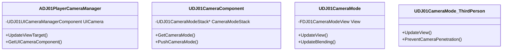

# DJ01 相机系统文档

## 1. 系统概述

DJ01相机系统是一个模块化、可扩展的相机管理系统，提供了灵活的相机控制和视角管理功能。系统包含多个组件，每个组件负责特定的功能，可以根据需要组合使用。

### 1.1 核心组件



### 1.2 文件结构

```
Camera/
├── Private/
│   ├── DJ01CameraComponent.cpp
│   ├── DJ01CameraMode.cpp
│   ├── DJ01CameraMode_ThirdPerson.cpp
│   ├── DJ01PlayerCameraManager.cpp
│   └── DJ01UICameraManagerComponent.cpp
├── Public/
│   ├── DJ01CameraAssistInterface.h
│   ├── DJ01CameraComponent.h
│   ├── DJ01CameraMode.h
│   ├── DJ01CameraMode_ThirdPerson.h
│   ├── DJ01PenetrationAvoidanceFeeler.h
│   ├── DJ01PlayerCameraManager.h
│   └── DJ01UICameraManagerComponent.h
└── README.md
```

## 2. 组件详解

### 2.1 PlayerCameraManager (DJ01PlayerCameraManager)

主要职责：
- 管理游戏中的相机系统
- 处理视角目标的更新
- 管理UI相机组件

使用示例：
```cpp
// 在GameMode中设置
PlayerCameraManagerClass = ADJ01PlayerCameraManager::StaticClass();
```

### 2.2 相机组件 (DJ01CameraComponent)

主要职责：
- 可附加到任何Actor上
- 管理相机模式栈
- 提供相机模式切换功能

使用示例：
```cpp
// 在Character类中添加相机组件
UPROPERTY()
UDJ01CameraComponent* CameraComponent;

// 初始化
CameraComponent = CreateDefaultSubobject<UDJ01CameraComponent>("CameraComponent");
```

### 2.3 相机模式 (DJ01CameraMode)

主要职责：
- 定义基本相机行为
- 处理视角平滑过渡
- 提供基础视角计算

使用示例：
```cpp
// 切换相机模式
CameraComponent->PushCameraMode(UDJ01CameraMode_ThirdPerson::StaticClass());
```

### 2.4 第三人称相机模式 (DJ01CameraMode_ThirdPerson)

主要职责：
- 实现第三人称视角逻辑
- 处理相机碰撞检测
- 支持角色下蹲时的相机调整

配置参数：
```cpp
// 相机偏移曲线
UPROPERTY(EditDefaultsOnly, Category = "Third Person")
TObjectPtr<const UCurveVector> TargetOffsetCurve;

// 碰撞检测设置
UPROPERTY(EditAnywhere, Category = "Collision")
bool bPreventPenetration = true;
```

## 3. 常见用例

### 3.1 基础设置

```cpp
// 在角色类中
void AYourCharacter::BeginPlay()
{
    Super::BeginPlay();
    
    // 设置基本的第三人称相机
    if (CameraComponent)
    {
        CameraComponent->PushCameraMode(UDJ01CameraMode_ThirdPerson::StaticClass());
    }
}
```

### 3.2 自定义相机模式

```cpp
UCLASS()
class UCustomCameraMode : public UDJ01CameraMode
{
    GENERATED_BODY()
    
    virtual void UpdateView(float DeltaTime) override
    {
        // 自定义视角更新逻辑
    }
};
```

### 3.3 UI相机控制

```cpp
// 在需要UI接管相机时
if (UDJ01UICameraManagerComponent* UICamera = UDJ01UICameraManagerComponent::GetComponent(PC))
{
    UICamera->SetViewTarget(TargetActor);
}
```

## 4. 调试功能

### 4.1 可视化调试

系统提供了多种调试功能：
- 相机碰撞检测可视化
- 相机模式状态显示
- 穿透检测器可视化

使用方法：
```cpp
// 在编辑器中启用Draw Debug
#if ENABLE_DRAW_DEBUG
    DrawDebugLine(GetWorld(), Start, End, FColor::Red);
#endif
```

### 4.2 控制台命令

可用的控制台命令：
- `ShowDebug Camera` - 显示相机调试信息
- `ShowDebug CameraMode` - 显示当前相机模式信息

## 5. 最佳实践

### 5.1 性能优化

- 合理设置碰撞检测频率
- 适当配置相机模式切换的混合时间
- 避免频繁切换相机模式

### 5.2 常见问题解决

1. 相机穿墙：
   - 检查 PenetrationAvoidanceFeelers 的配置
   - 确保碰撞检测正确启用

2. 视角切换不平滑：
   - 调整 BlendTime 和 BlendFunction
   - 检查 UpdateView 中的平滑处理

3. UI相机优先级：
   - 确保正确设置 bUpdatingViewTarget
   - 检查 NeedsToUpdateViewTarget 的返回值

### 5.3 扩展建议

1. 添加新的相机模式：
   ```cpp
   UCLASS()
   class UNewCameraMode : public UDJ01CameraMode
   {
       GENERATED_BODY()
       // 实现自定义功能
   };
   ```

2. 自定义碰撞处理：
   ```cpp
   // 实现自定义接口
   class ICustomCameraAssistInterface : public IDJ01CameraAssistInterface
   {
       // 添加自定义方法
   };
   ```

## 6. 配置参考

### 6.1 项目设置

在 DefaultEngine.ini 中：
```ini
[/Script/Engine.Engine]
DefaultPlayerCameraManagerClass=/Script/DJ01.DJ01PlayerCameraManager
```

### 6.2 常用参数

```cpp
// 相机默认值
#define DJ01_CAMERA_DEFAULT_FOV          (80.0f)
#define DJ01_CAMERA_DEFAULT_PITCH_MIN    (-89.0f)
#define DJ01_CAMERA_DEFAULT_PITCH_MAX    (89.0f)
```

## 7. 版本历史

### v1.0
- 基础相机系统实现
- 第三人称相机模式
- UI相机支持
- 碰撞检测系统

## 8. 待办事项

- [ ] 添加更多预设相机模式
- [ ] 优化碰撞检测性能
- [ ] 添加相机震动支持
- [ ] 实现更多调试功能

## 9. 联系方式

如有问题或建议，请联系项目维护团队。

## 10. 许可证

Copyright © 2025 DJ01 Team