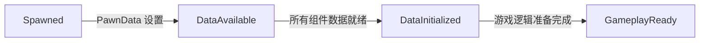

# DJ01 Character 架构说明

## 概述

DJ01Character 系统采用 Lyra 的模块化架构，通过组件化设计实现角色功能的解耦和灵活组合。

## 核心架构

### 1. 模块化组件系统

```
ADJ01Character (基础角色)
├── UDJ01PawnExtensionComponent (生命周期管理器) [在 Character 中创建]
│   └── 管理初始化状态机：Spawned → DataAvailable → DataInitialized → GameplayReady
├── UDJ01CameraComponent (相机组件) [在 Character 中创建]
└── UDJ01HeroComponent (英雄组件) [通过 GFC 动态添加]
    └── 处理玩家输入和英雄特定逻辑
```

### 2. 组件创建方式

#### 在 Character 构造函数中创建
- **PawnExtensionComponent**: 核心组件，管理整个 Pawn 的生命周期
- **CameraComponent**: 相机管理组件

#### 通过 Game Feature Data (GFD) 的 Action 动态添加
- **HeroComponent**: 玩家输入处理组件
- 其他游戏特性组件

**为什么 HeroComponent 不在 Character 中创建？**
1. **灵活性**: 不同的 Pawn 可能需要不同的控制组件（英雄、AI、载具等）
2. **模块化**: 组件可以通过 GFD 根据需要动态添加/移除
3. **复用性**: 同一个 Character 类可以用于不同的游戏特性
4. **游戏特性系统**: GFD 允许将功能打包成独立的插件，便于管理和复用

### 3. 初始化状态机

PawnExtensionComponent 通过初始化状态机协调所有组件的初始化：



**状态说明：**
- **Spawned**: Pawn 已生成到世界中
- **DataAvailable**: PawnData 已设置，Controller 已分配
- **DataInitialized**: 所有功能组件的数据已初始化
- **GameplayReady**: 准备好进入游戏逻辑

### 4. 事件转发机制

ADJ01Character 充当事件分发器，将重要的生命周期事件转发给 PawnExtensionComponent：

```cpp
// Controller 变更
void ADJ01Character::PossessedBy(AController* NewController)
{
    Super::PossessedBy(NewController);
    PawnExtComponent->HandleControllerChanged();
}

// PlayerState 复制
void ADJ01Character::OnRep_PlayerState()
{
    Super::OnRep_PlayerState();
    PawnExtComponent->HandlePlayerStateReplicated();
}

// 输入组件设置
void ADJ01Character::SetupPlayerInputComponent(UInputComponent* PlayerInputComponent)
{
    Super::SetupPlayerInputComponent(PlayerInputComponent);
    PawnExtComponent->SetupPlayerInputComponent();
}
```

### 5. PawnData 系统

**UDJ01PawnData** 是一个数据资产，定义了 Pawn 的配置：
- PawnClass: 要生成的 Pawn 类
- InputConfig: 输入配置
- DefaultCameraMode: 默认相机模式
- (TODO) AbilitySets: 能力集合
- (TODO) TagRelationshipMapping: 标签关系映射

## 与 Lyra 的对比

| 特性 | Lyra | DJ01 |
|------|------|------|
| 基础类 | ALyraCharacter | ADJ01Character |
| 生命周期管理 | ULyraPawnExtensionComponent | UDJ01PawnExtensionComponent |
| 数据资产 | ULyraPawnData | UDJ01PawnData |
| HeroComponent 创建 | GFD Action 动态添加 | GFD Action 动态添加 |
| AbilitySystem | 完整实现 | 标记为 TODO |

## TODO: AbilitySystem 集成

当前所有 AbilitySystem 相关代码都用 `TODO_ABILITY_SYSTEM:` 标记注释掉了，包括：

1. **接口实现**
   - IAbilitySystemInterface
   - IGameplayTagAssetInterface

2. **组件引用**
   - UDJ01AbilitySystemComponent

3. **功能**
   - Ability Sets 授予
   - Gameplay Tags 管理
   - Tag Relationship Mapping

要启用 AbilitySystem，搜索项目中的 `TODO_ABILITY_SYSTEM` 并逐步实现。

## 使用示例

### 创建 PawnData 资产

1. 在内容浏览器中右键 → 数据资产 → DJ01PawnData
2. 配置：
   - Pawn Class: BP_DJ01Character
   - Input Config: DA_InputConfig_Hero
   - Default Camera Mode: CM_ThirdPerson

### 通过 GFD Action 添加 HeroComponent

在 Game Feature Data 资产中：
1. 添加 **Add Components** Action
2. 配置 Actor Class: `ADJ01Character`
3. 添加 Component Class: `UDJ01HeroComponent`

参见 <a href="file:d:\UnrealProjects\DJ01\Source\DJ01\Character\Public\DJ01HeroComponent.h">DJ01HeroComponent</a> 的实现。

## 参考文档

- <a href="file:d:\UnrealProjects\DJ01\Source\DJ01\Character\Public\DJ01PawnExtensionComponent.h">DJ01PawnExtensionComponent.h</a>
- <a href="file:d:\UnrealProjects\DJ01\Source\DJ01\Character\Public\DJ01PawnData.h">DJ01PawnData.h</a>
- <a href="file:d:\UnrealProjects\DJ01\Source\DJ01\Character\Public\DJ01Character.h">DJ01Character.h</a>