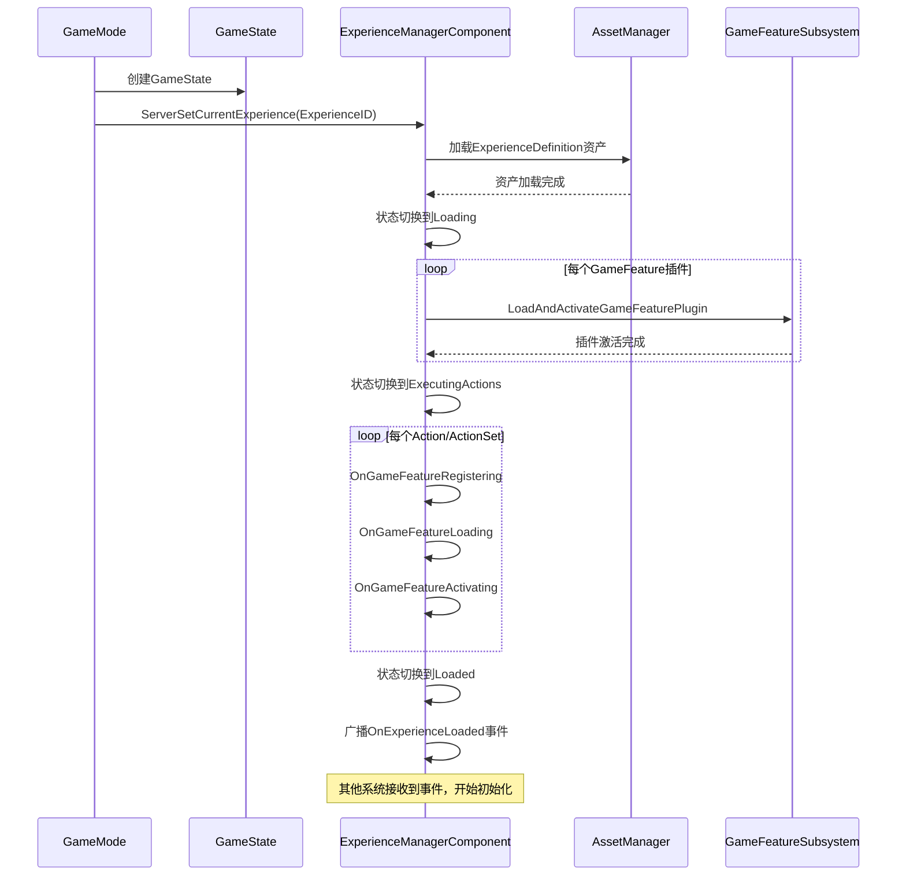

# DJ01 Experience System Documentation

## 概述

Experience System（体验系统）是从Lyra架构中移植的核心系统，用于管理游戏的不同玩法模式和配置。它提供了一个灵活的框架，允许在运行时动态加载和切换不同的游戏体验（Experience）。

## 系统架构

Experience系统由以下核心组件组成：

```
DJ01ExperienceDefinition (数据资产)
         ↓
DJ01ExperienceManagerComponent (组件)
         ↓
DJ01ExperienceManager (子系统)
         ↓
AsyncAction_ExperienceReady (蓝图异步节点)
```

---

## 核心文件说明

### 1. DJ01ExperienceDefinition.h/cpp
**功能：** Experience的核心数据定义

**职责：**
- 定义一个完整的游戏体验配置
- 包含该体验需要加载的GameFeature插件列表
- 包含要执行的ActionSet列表
- 定义默认的Pawn数据（DJ01PawnData）
- 管理体验相关的组件和输入配置

**关键属性：**
```cpp
- GameFeaturesToEnable: 需要启用的GameFeature插件列表
- DefaultPawnData: 默认的Pawn配置数据
- Actions: 体验激活时要执行的动作集合
- ActionSets: 可复用的动作集合
```

**使用场景：**
- 创建不同的游戏模式（如：死亡竞赛、团队模式、PVE模式等）
- 每个模式可以有自己的规则、UI、角色配置
- 作为PrimaryDataAsset在编辑器中创建和配置

---

### 2. DJ01ExperienceActionSet.h/cpp
**功能：** 可复用的动作集合

**职责：**
- 定义一组可以被多个Experience共享的动作
- 允许模块化组织Experience的功能
- 支持嵌套引用其他ActionSet

**关键属性：**
```cpp
- Actions: 要执行的GameFeatureAction列表
- GameFeaturesToEnable: 此ActionSet需要的GameFeature插件
```

**使用场景：**
- 将通用功能（如UI系统、输入系统）封装为ActionSet
- 多个Experience可以共享相同的ActionSet
- 实现功能的模块化和复用

**示例结构：**
```
CommonUIActionSet (通用UI)
  ├─ Add UI Widget Action
  └─ Enable Input Config

ShooterGameplayActionSet (射击玩法)
  ├─ Add Weapon System
  └─ Add Damage System
```

---

### 3. DJ01ExperienceManagerComponent.h/cpp
**功能：** Experience的运行时管理器组件

**职责：**
- 附加到GameState，管理当前Experience的生命周期
- 处理Experience的加载、激活和卸载流程
- 协调GameFeature插件的加载
- 广播Experience加载完成事件
- 管理Experience的状态机

**状态流程：**
```
Unloaded → Loading → LoadingGameFeatures → 
ExecutingActions → Loaded → Deactivating
```

**核心方法：**
```cpp
- ServerSetCurrentExperience(): 服务器设置要加载的Experience
- IsExperienceLoaded(): 检查Experience是否加载完成
- CallOrRegister_OnExperienceLoaded(): 注册加载完成回调
- OnExperienceLoadComplete(): 加载完成时的回调
```

**使用场景：**
- 在GameMode/GameState中使用
- 游戏开始时加载指定的Experience
- 其他系统通过它来等待Experience准备就绪

---

### 4. DJ01ExperienceManager.h/cpp
**功能：** Experience的全局管理子系统

**职责：**
- 作为UEngineSubsystem管理整个引擎级别的Experience状态
- 在编辑器PIE（Play In Editor）模式下追踪GameFeature插件的引用计数
- 防止多个PIE会话之间的插件冲突

**核心方法：**
```cpp
- OnPlayInEditorBegun(): PIE开始时清理状态
- NotifyOfPluginActivation(): 通知插件被激活（增加引用计数）
- RequestToDeactivatePlugin(): 请求停用插件（减少引用计数）
```

**使用场景：**
- 主要用于编辑器环境
- 确保多个PIE窗口不会相互干扰
- 管理GameFeature插件的共享使用

**注意：**
- 仅在 `WITH_EDITOR` 宏下编译
- 生产环境中功能较少，主要服务于开发调试

---

### 5. AsyncAction_ExperienceReady.h/cpp
**功能：** 蓝图异步等待节点

**职责：**
- 提供蓝图友好的异步等待接口
- 等待GameState创建
- 等待Experience加载完成
- 完成后触发蓝图事件

**执行流程：**
```
Step 1: 等待GameState创建
  ↓
Step 2: 监听Experience加载
  ↓
Step 3: 处理Experience加载完成
  ↓
Step 4: 广播OnReady事件
```

**使用场景：**
- 在蓝图中使用 `WaitForExperienceReady` 节点
- UI系统等待Experience准备就绪后再显示
- 其他游戏逻辑需要在Experience加载后执行

**蓝图示例：**
```
BeginPlay → WaitForExperienceReady → OnReady → 初始化UI
```

---

### 6. DJ01UserFacingExperienceDefinition.h/cpp
**功能：** 面向玩家的Experience展示定义

**职责：**
- 定义Experience在UI中的展示信息
- 存储地图、标题、图标等元数据
- 创建会话请求（用于多人游戏）
- 配置游戏前端菜单中的Experience选项

**关键属性：**
```cpp
- MapID: 要加载的地图资产ID
- ExperienceID: 关联的DJ01ExperienceDefinition ID
- TileTitle: UI中显示的主标题
- TileSubTitle: UI中显示的副标题
- TileDescription: 完整描述
- TileIcon: 展示图标
- MaxPlayerCount: 最大玩家数
- bIsDefaultExperience: 是否为默认体验
- bShowInFrontEnd: 是否在前端菜单中显示
- bRecordReplay: 是否录制回放
```

**使用场景：**
- 游戏主菜单的模式选择界面
- 创建在线会话时配置参数
- 为玩家提供游戏模式的可视化信息

---

## 系统工作流程

### 完整的Experience加载流程：



### Experience在GameMode中的使用示例：

```cpp
void ADJ01GameMode::InitGame(const FString& MapName, const FString& Options, FString& ErrorMessage)
{
    Super::InitGame(MapName, Options, ErrorMessage);
    
    // 获取Experience ID（从URL参数或配置）
    FPrimaryAssetId ExperienceId = DetermineExperienceForMap(MapName, Options);
    
    // 设置Experience
    if (AGameStateBase* GameState = GetGameState<AGameStateBase>())
    {
        if (UDJ01ExperienceManagerComponent* ExperienceComponent = 
            GameState->FindComponentByClass<UDJ01ExperienceManagerComponent>())
        {
            ExperienceComponent->ServerSetCurrentExperience(ExperienceId);
        }
    }
}
```

---

## 依赖关系

Experience系统依赖以下DJ01项目模块：

- **DJ01PawnData**: 定义角色数据
- **DJ01AssetManager**: 资产加载管理
- **DJ01LogChannels**: 日志输出
- **GameFeatureSubsystem**: UE引擎的GameFeature系统
- **ModularGameplay**: UE的模块化游戏框架

---

## 扩展建议

### 1. 添加自定义Actions
你可以继承 `UGameFeatureAction` 创建自定义动作：
```cpp
UCLASS()
class UGameFeatureAction_AddQuestSystem : public UGameFeatureAction
{
    GENERATED_BODY()
    
    virtual void OnGameFeatureActivating() override;
    virtual void OnGameFeatureDeactivating() override;
};
```

### 2. 创建Experience变体
为不同难度、季节活动创建Experience变体：
```
BaseShooterExperience (基础射击体验)
  ├─ EasyModeExperience (简单模式)
  ├─ HardModeExperience (困难模式)
  └─ HalloweenEventExperience (万圣节活动)
```

### 3. 添加运行时切换
实现Experience的热切换（需要仔细处理状态）：
```cpp
void SwitchExperience(FPrimaryAssetId NewExperienceId)
{
    // 1. 保存当前状态
    // 2. 卸载当前Experience
    // 3. 加载新Experience
    // 4. 恢复必要状态
}
```

---

## 常见问题

### Q: Experience什么时候加载？
A: 通常在GameMode的InitGame或HandleMatchHasStarted阶段加载。

### Q: 如何等待Experience加载完成？
A: C++中使用 `CallOrRegister_OnExperienceLoaded`，蓝图中使用 `AsyncAction_ExperienceReady`。

### Q: GameFeature和Experience的关系？
A: Experience定义了要加载哪些GameFeature插件，以及如何配置它们的Actions。

### Q: 可以在运行时切换Experience吗？
A: 理论上可以，但需要仔细处理状态清理和资源卸载，Lyra原版不支持热切换。

### Q: ActionSet和直接在Experience中添加Action的区别？
A: ActionSet可以被多个Experience复用，实现模块化；直接添加Action适合该Experience专属的功能。

---

## 参考资料

- Unreal Engine GameFeature系统文档
- Lyra Sample Project 官方文档
- Modular Gameplay插件文档

---

**文档版本：** 1.0  
**创建日期：** 2025-11-19  
**最后更新：** 2025-11-19  
**维护者：** DJ01 Team