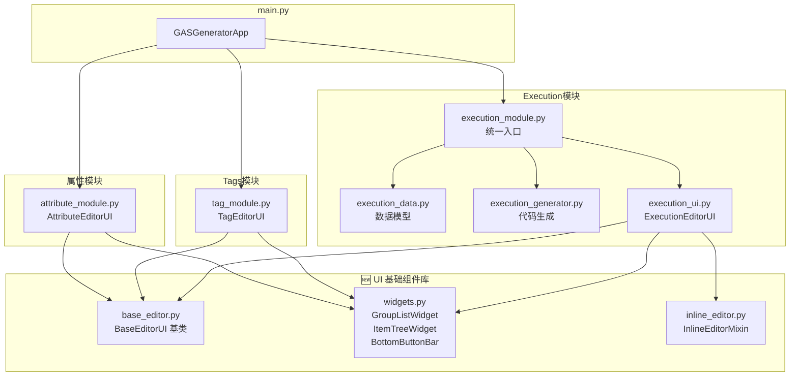
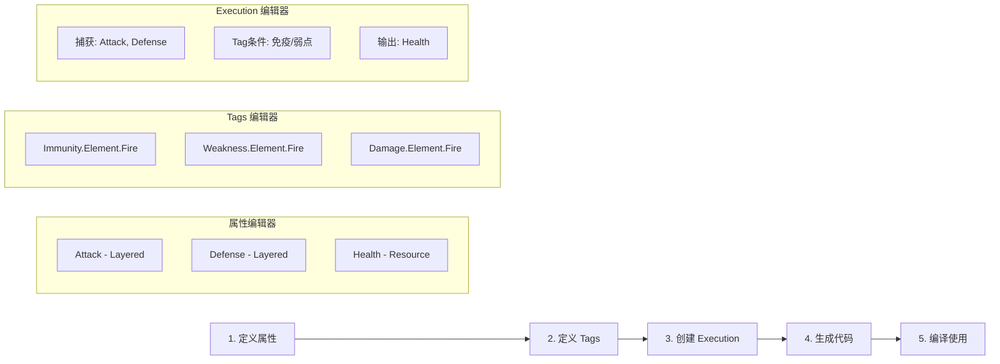

# DJ01 GAS 代码生成器 使用手册

> **版本**: 2.0  
> **适用项目**: DJ01 (UE5 + GAS)  
> **功能**: 通过可视化界面配置属性、GameplayTags 和 Execution，自动生成 C++ 代码  
> **最后更新**: 2025-12-18

---

## 目录

1. [快速开始](#快速开始)
2. [属性编辑器](#一-属性编辑器)
3. [GameplayTags 编辑器](#二-gameplaytags-编辑器)
4. [Execution 编辑器](#三-execution-编辑器)
5. [快捷键](#快捷键)
6. [常见问题](#常见问题)

---

## 快速开始

### 启动方式

**方式一：Python 脚本**
```bash
cd d:\UnrealProjects\DJ01\Tools\AttributeGenerator
python main.py
```

**方式二：打包的 EXE**
```bash
# 已打包的 exe 在项目根目录
d:\UnrealProjects\DJ01\DJ01_GAS_Generator.exe

# 或重新打包
cd d:\UnrealProjects\DJ01\Tools\AttributeGenerator
build_exe.bat
# 生成的 exe 会自动复制到项目根目录
```

### 界面概览

```
┌─────────────────────────────────────────────────────────────────────┐
│ 📊 属性编辑器 │ 📄 属性预览 │ ⚡ Execution │ 📄 Exec预览 │ 🏷️ Tags │ 📄 Tags预览 │
└─────────────────────────────────────────────────────────────────────┘
```

---

## 一、属性编辑器

### 1.1 概念说明

属性系统采用**三层架构**，支持灵活的数值计算：

| 类型 | 生成的属性 | 计算公式 | 适用场景 |
|------|-----------|---------|---------|
| **Layered** | Base + Flat + Percent | `(Base + Flat) × (1 + Percent)` | 攻击力、防御力等战斗属性 |
| **Simple** | 单一值 | 直接使用 | 当前生命值、经验值等 |
| **Resource** | Max (Layered) + Current (Simple) | Max 计算后作为上限 | 生命值、魔法值、耐力等资源 |
| **Meta** | 临时值 | 仅用于 Execution 计算 | 伤害传递、临时修正 |

### 1.2 界面结构

```
┌──────────────┐  ┌─────────────────────────────────┐  ┌────────────────┐
│   属性集     │  │          属性列表               │  │   编辑属性     │
│──────────────│  │─────────────────────────────────│  │────────────────│
│ StatSet (5)  │  │ Name     │ Type    │ Base │ ... │  │ 属性名: Attack │
│ CombatSet(3) │  │ Attack   │ Layered │ 100  │     │  │ 类型: Layered  │
│              │  │ Defense  │ Layered │ 50   │     │  │ 分类: Combat   │
│              │  │ Health   │ Resource│ 1000 │     │  │ Base: 100      │
│              │  │          │         │      │     │  │ Flat: 0        │
│              │  │          │         │      │     │  │ Percent: 0     │
│ [+新建][-删除]│  │                               │  │ 描述: 攻击力   │
└──────────────┘  └─────────────────────────────────┘  └────────────────┘
                  [+ 添加属性] [- 删除属性]    [保存配置] [重新加载] [生成代码]
```

### 1.3 操作流程

#### 创建属性集
1. 点击左侧 **[+ 新建]** 按钮
2. 输入属性集名称（如 `StatSet`、`CombatSet`）
3. 生成的类名将是 `UDJ01StatSet`、`UDJ01CombatSet`

#### 添加属性
1. 选择左侧的属性集
2. 点击 **[+ 添加属性]**
3. 在右侧面板编辑属性信息：
   - **属性名**: 如 `Attack`（不要加前缀）
   - **类型**: 选择 Layered / Simple / Resource / Meta
   - **分类**: 用于代码注释分组
   - **Base/Flat/Percent**: 初始值（Resource 类型还有 Current）
4. 点击 **[保存修改]** 或按 `Ctrl+S`

#### 快速编辑
- **双击单元格**: 直接在表格中编辑
- **F2**: 重命名当前选中项
- **Delete**: 删除当前选中项

### 1.4 生成的代码

点击 **[生成代码]** 后，生成以下文件：

| 文件 | 路径 |
|------|------|
| Header | `Source/DJ01/AbilitySystem/Attributes/Public/DJ01GeneratedAttributes.h` |
| Source | `Source/DJ01/AbilitySystem/Attributes/Private/DJ01GeneratedAttributes.cpp` |

**生成示例（Layered 类型）**:
```cpp
// Attack 属性
DECLARE_LAYERED_ATTRIBUTE(UDJ01StatSet, Attack)
// 生成: BaseAttack, FlatAttack, PercentAttack, Attack(计算值)
```

**生成示例（Resource 类型）**:
```cpp
// Health 资源
DECLARE_RESOURCE_ATTRIBUTE(UDJ01StatSet, Health)
// 生成: BaseMaxHealth, FlatMaxHealth, PercentMaxHealth, MaxHealth(计算值), Health(当前值)
```

### 1.5 使用生成的属性

```cpp
// 在 GameplayEffect 中修改属性
Modifiers:
  - Attribute: UDJ01StatSet.FlatAttack  // +50 攻击力
    Operation: Add
    Magnitude: 50

// 在代码中读取
float TotalAttack = AttributeSet->GetAttack();      // 获取最终值
float BaseAttack = AttributeSet->GetBaseAttack();   // 获取基础值
```

---

## 二、GameplayTags 编辑器

### 2.1 概念说明

GameplayTags 是 UE5 GAS 的核心标识系统，用于：
- 标识技能、状态、事件
- 技能激活条件判断
- 伤害类型分类
- GameplayCue 触发

### 2.2 界面结构

```
┌──────────────┐  ┌─────────────────────────────────────┐  ┌────────────────┐
│   标签分类   │  │            标签列表                 │  │   编辑标签     │
│──────────────│  │─────────────────────────────────────│  │────────────────│
│ Ability (6)  │  │ Tag Path          │ Variable       │  │ 标签路径:      │
│ Status (14)  │  │ Ability.Attack    │ Ability_Attack │  │ [Ability.Skill]│
│ Damage (10)  │  │ Ability.Dodge     │ Ability_Dodge  │  │ 变量名:        │
│ GameplayCue  │  │ Ability.Block     │ Ability_Block  │  │ [Ability_Skill]│
│ ...          │  │                   │                │  │ 描述:          │
│              │  │                   │                │  │ [技能标签]     │
│ [+新建][-删除]│  │                                   │  │                │
└──────────────┘  └─────────────────────────────────────┘  └────────────────┘
                  [+ 添加标签] [- 删除标签]    [保存配置] [重新加载] [生成代码]
```

### 2.3 操作流程

#### 添加标签
1. 选择或新建分类
2. 点击 **[+ 添加标签]**
3. 编辑标签信息：
   - **标签路径**: 如 `Ability.Skill.Fireball`（用 `.` 分隔层级）
   - **变量名**: 自动生成 `Ability_Skill_Fireball`（可手动修改）
   - **描述**: 用于代码注释

#### 命名规范
```
[顶级分类].[子分类].[具体标签]

示例：
- Ability.Attack.Light      // 轻攻击技能
- Status.Condition.Stunned  // 眩晕状态
- Damage.Element.Fire       // 火元素伤害
- GameplayCue.Hit.Physical  // 物理命中特效
```

### 2.4 生成的代码

| 文件 | 路径 |
|------|------|
| Header | `Source/DJ01/System/Public/DJ01GameplayTags.h` |
| Source | `Source/DJ01/System/Private/DJ01GameplayTags.cpp` |

**生成示例**:
```cpp
// Header
namespace DJ01GameplayTags
{
    DJ01_API UE_DECLARE_GAMEPLAY_TAG_EXTERN(Ability_Attack_Light);
}

// Source
namespace DJ01GameplayTags
{
    UE_DEFINE_GAMEPLAY_TAG_COMMENT(Ability_Attack_Light, "Ability.Attack.Light", "Light attack ability.");
}
```

### 2.5 使用生成的标签

```cpp
#include "DJ01GameplayTags.h"

// 检查标签
if (AbilityTags.HasTag(DJ01GameplayTags::Ability_Attack_Light))
{
    // 执行轻攻击逻辑
}

// 添加标签
ASC->AddLooseGameplayTag(DJ01GameplayTags::Status_Condition_Stunned);
```

---

## 三、Execution 编辑器

### 3.1 概念说明

Execution（`UGameplayEffectExecutionCalculation`）用于复杂的数值计算，如：
- 伤害计算（考虑攻击、防御、暴击、元素克制）
- 治疗计算
- 属性转换

### 3.2 界面结构

```
┌──────────────┐  ┌─────────────────────────────────────┐  ┌────────────────┐
│  Execution   │  │           捕获属性                  │  │  编辑 Execution│
│   列表       │  │─────────────────────────────────────│  │────────────────│
│──────────────│  │ Source │ Attribute    │ Layer      │  │ 名称:          │
│ DamageExec   │  │ Source │ Attack       │ Total      │  │ [DamageExec]   │
│ HealExec     │  │ Target │ Defense      │ Total      │  │                │
│              │  │ Target │ Health       │ Value      │  │ 描述:          │
│              │  │─────────────────────────────────────│  │ [伤害计算公式] │
│              │  │           输出修改                  │  │                │
│              │  │─────────────────────────────────────│  │                │
│              │  │ Attribute    │ Op      │ Magnitude │  │                │
│              │  │ Health       │ Add     │ -Damage   │  │                │
│ [+新建][-删除]│  │                                   │  │                │
└──────────────┘  └─────────────────────────────────────┘  └────────────────┘
                  [+ 添加捕获] [+ 添加输出]   [保存配置] [重新加载] [生成代码]
```

### 3.3 核心概念

#### 捕获属性（Capture）
从来源或目标身上获取属性值用于计算：

| 字段 | 说明 | 可选值 |
|------|------|--------|
| Source | 属性来源 | `Source`（施法者）/ `Target`（目标） |
| Attribute | 属性名 | 从属性编辑器中选择 |
| Layer | 捕获的层 | `Base` / `Flat` / `Percent` / `Total` / `Value` |

#### Tag 条件（Tag Conditions）⭐ 新功能
根据 Source 或 Target 身上的 GameplayTag 修改计算结果：

| 字段 | 说明 | 可选值 |
|------|------|--------|
| 检查对象 | 检查谁的 Tag | `Source`（施法者）/ `Target`（目标） |
| Tag | 要检查的标签 | 从 Tags 编辑器中选择 |
| 效果 | 触发的效果 | `Skip` / `Multiply` / `Add` |
| 数值 | 效果参数 | Skip 不需要，Multiply/Add 需要 |

**效果类型说明**：

| 效果 | 说明 | 应用场景 |
|------|------|---------|
| **Skip** | 直接跳过计算，返回 0 | 免疫某元素伤害 |
| **Multiply** | 最终值乘以倍率 | 弱点加成（1.5x）、抗性减免（0.5x）、暴击（2.0x） |
| **Add** | 最终值增加固定值 | 固定伤害加成、护盾吸收 |

#### 输出修改（Output）
将计算结果应用到目标属性：

| 字段 | 说明 | 可选值 |
|------|------|--------|
| Attribute | 目标属性 | 从属性编辑器中选择 |
| Operation | 操作类型 | `Additive`（加）/ `Multiply`（乘）/ `Override`（覆盖） |
| Magnitude | 数值变量名 | 在 Execute 函数中使用 |

### 3.4 操作流程

#### 创建伤害公式（含元素免疫/弱点）
1. 点击 **[+ 新建]**，输入名称 `FireDamage`
2. 添加捕获属性：
   - Source → Attack → Total（攻击者的攻击力）
   - Target → Defense → Total（目标的防御力）
3. **添加 Tag 条件**：
   - Target → `Immunity.Element.Fire` → Skip（火焰免疫）
   - Target → `Weakness.Element.Fire` → Multiply → 1.5（火焰弱点 +50%）
   - Target → `Resistance.Element.Fire` → Multiply → 0.5（火焰抗性 -50%）
4. 添加输出：
   - Health → Additive（扣减生命值）
5. 编写计算逻辑：
   ```cpp
   float FinalValue = FMath::Max(0.f, AttackValue - DefenseValue);
   ```
6. 点击 **[生成代码]**

### 3.5 生成的代码

| 文件 | 路径 |
|------|------|
| Header | `Source/DJ01/AbilitySystem/Executions/Generated/DJ01Exec_DamageExec.h` |
| Source | `Source/DJ01/AbilitySystem/Executions/Generated/DJ01Exec_DamageExec.cpp` |

**生成示例（含 Tag 条件）**:
```cpp
void UDJ01FireDamageExecution::Execute_Implementation(...) const
{
    // ... 初始化代码 ...
    
    // ========== Tag 条件检查 ==========
    float TagMultiplier = 1.f;
    float TagAdditive = 0.f;

    // Target 有 Immunity.Element.Fire 标签时跳过
    if (EvalParams.TargetTags && EvalParams.TargetTags->HasTag(DJ01GameplayTags::Immunity_Element_Fire))
    {
        return; // 免疫火焰伤害
    }

    // Target 有 Weakness.Element.Fire 标签时乘以 1.5
    if (EvalParams.TargetTags && EvalParams.TargetTags->HasTag(DJ01GameplayTags::Weakness_Element_Fire))
    {
        TagMultiplier *= 1.5f; // 弱点 +50%
    }

    // Target 有 Resistance.Element.Fire 标签时乘以 0.5
    if (EvalParams.TargetTags && EvalParams.TargetTags->HasTag(DJ01GameplayTags::Resistance_Element_Fire))
    {
        TagMultiplier *= 0.5f; // 抗性 -50%
    }

    // ========== 获取属性值 ==========
    float AttackValue = 0.f;
    float DefenseValue = 0.f;
    // ... 获取属性代码 ...

    // ========== 计算逻辑 ==========
    float FinalValue = FMath::Max(0.f, AttackValue - DefenseValue);

    // 应用 Tag 条件修正
    FinalValue = (FinalValue + TagAdditive) * TagMultiplier;

    // ========== 输出结果 ==========
    if (FinalValue != 0.f)
    {
        OutExecutionOutput.AddOutputModifier(FGameplayModifierEvaluatedData(
            UDJ01StatSet::GetHealthAttribute(), EGameplayModOp::Additive, -FinalValue));
    }
}
```

### 3.6 使用生成的 Execution

在 GameplayEffect 蓝图中：
1. 添加 `Executions` 数组元素
2. 选择 `DJ01Exec_DamageExec`
3. 应用 GE 时会自动调用计算

---

## 快捷键

| 快捷键 | 功能 | 适用范围 |
|--------|------|---------|
| `Ctrl+S` | 保存当前编辑并保存配置 | 全局 |
| `F2` | 重命名选中项 | 列表、树形控件 |
| `Delete` | 删除选中项 | 列表、树形控件 |
| `双击` | 内联编辑单元格 | 树形表格 |

---

## 常见问题

### Q: 生成代码后需要做什么？
A: 
1. 在 Rider/VS 中刷新项目（或重新生成项目文件）
2. 重新编译项目
3. 新的属性/标签/Execution 即可在蓝图中使用

### Q: 修改属性后如何更新？
A: 
1. 在生成器中修改配置
2. 点击 **[生成代码]** 覆盖生成
3. 重新编译

### Q: Execution 的计算逻辑在哪写？
A: 生成器只生成框架代码，计算逻辑需要在生成的 `.cpp` 文件的 `Execute_Implementation` 函数中手动编写。

### Q: Tag 条件是自动生成的吗？
A: 是的！在 Execution 编辑器中配置的 Tag 条件会自动生成对应的 C++ 代码，包括：
- 免疫检查（Skip）
- 倍率修正（Multiply）
- 固定加成（Add）

你只需要在 Tags 编辑器中先定义好相关的 Tag（如 `Immunity.Element.Fire`），然后在 Execution 中选择即可。

### Q: 配置文件在哪？
A:
| 模块 | 配置文件 |
|------|---------|
| 属性 | `Source/DJ01/AbilitySystem/Attributes/Config/AttributeDefinitions.csv` |
| Tags | `Source/DJ01/System/Config/GameplayTagDefinitions.json` |
| Execution | `Source/DJ01/AbilitySystem/Executions/Config/ExecutionDefinitions.json` |

---

## 文件结构

```
Tools/AttributeGenerator/
├── main.py                 # 主入口
├── config.py               # 配置常量（路径定义）
│
├── attribute_module.py     # 属性编辑器模块
├── tag_module.py           # Tags 编辑器模块
│
├── execution_module.py     # Execution 编辑器入口（统一导出）
├── execution_data.py       # Execution 数据模型
├── execution_generator.py  # Execution C++ 代码生成器
├── execution_ui.py         # Execution 编辑器 UI
│
├── ui_base/                # 🆕 可复用 UI 组件库
│   ├── __init__.py         # 模块导出
│   ├── base_editor.py      # 编辑器基类（快捷键、通用行为）
│   ├── widgets.py          # 可复用组件（GroupListWidget, ItemTreeWidget, BottomButtonBar）
│   ├── helpers.py          # 辅助函数
│   └── inline_editor.py    # 行内编辑器 Mixin
│
├── build_exe.bat           # 打包脚本
└── README.md               # 本说明书
```

### 模块架构



### UI 组件说明

| 组件 | 说明 | 使用场景 |
|------|------|---------|
| **BaseEditorUI** | 编辑器基类，提供 F2/Delete/Escape 快捷键处理 | 所有编辑器继承 |
| **GroupListWidget** | 左侧分组列表组件，支持新建/删除/选择 | 属性集、标签分类、Execution 列表 |
| **ItemTreeWidget** | 中间表格组件，基于 Treeview | 属性列表、标签列表 |
| **BottomButtonBar** | 底部按钮栏组件 | 保存/生成代码等按钮 |
| **InlineEditorMixin** | 行内编辑器 Mixin，提供下拉框/输入框编辑 | Execution 捕获/输出/Tag 条件编辑 |

---

## 工作流示例

### 创建火焰伤害系统



**步骤详解**：

1. **属性编辑器**：创建 Attack、Defense（Layered），Health（Resource）
2. **Tags 编辑器**：创建 `Immunity.Element.Fire`、`Weakness.Element.Fire`
3. **Execution 编辑器**：
   - 捕获 Source.Attack 和 Target.Defense
   - 添加 Tag 条件：火焰免疫 → Skip，火焰弱点 → Multiply 1.5
   - 输出到 Target.Health
4. **生成代码**：点击各编辑器的 [生成代码] 按钮
5. **编译使用**：在 UE5 中创建 GameplayEffect，使用生成的 Execution

---

## 版本历史

| 版本 | 日期 | 更新内容 |
|------|------|---------|
| 2.0 | 2025-12-18 | 🎉 UI 架构重构：引入 ui_base 组件库，所有编辑器继承 BaseEditorUI |
| 1.1 | 2025-01 | 添加 Tag 条件功能，Execution 编辑器模块拆分 |
| 1.0 | 2024-12 | 初始版本：属性、Tags、Execution 三大编辑器 |

---

*最后更新: 2025-12-18*