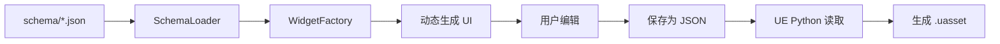

# 03 - Schema 驱动开发

## 🎯 核心思想

**Schema 驱动开发**是一种**声明式编程**思想：用数据描述"是什么"，让代码自动处理"怎么做"。

### 命令式 vs 声明式

```python
# ❌ 命令式：告诉程序"怎么做"
label = tk.Label(parent, text="默认 Pawn")
label.pack()
combo = ttk.Combobox(parent)
combo['values'] = ['Pawn1', 'Pawn2', 'Pawn3']
combo.pack()
combo.bind('<<ComboboxSelected>>', on_change)

# ✓ 声明式：只描述"是什么"
{
    "DefaultPawnData": {
        "display_name": "默认 Pawn",
        "widget": "combobox",
        "options_source": "pawn_data"
    }
}
# 代码自动根据这个定义生成 UI
```

---

## 📐 项目中的 Schema 结构

### 1. 资产类型定义 (schema/*.json)

```json
// configs/schema/experience.json
{
  "Experience": {
    "class_name": "UDJ01ExperienceDefinition",
    "display_name": "游戏体验",
    "icon": "🎮",
    
    "properties": {
      "DefaultPawnData": {
        "type": "TSoftObjectPtr<UDJ01PawnData>",
        "display_name": "默认 Pawn 数据",
        "widget": "combobox",
        "options_source": "pawn_data",
        "required": true
      },
      "Actions": {
        "type": "array",
        "item_type": "UGameFeatureAction",
        "display_name": "GameFeature Actions",
        "widget": "instanced_array_editor",
        "available_types": [
          "UGameFeatureAction_AddAbilities",
          "UGameFeatureAction_AddWidgets"
        ]
      }
    }
  }
}
```

### 2. 共享结构定义 (_common.json)

```json
// configs/schema/_common.json
{
  "structs": {
    "FGameFeatureAbilitiesEntry": {
      "ActorClass": {
        "type": "TSoftClassPtr<AActor>",
        "widget": "combobox",
        "options_source": "pawn_classes"
      },
      "GrantedAbilities": {
        "type": "array",
        "widget": "checkbox_list",
        "options_source": "gameplay_abilities"
      }
    }
  }
}
```

---

## 🔑 关键要点

### 1. Schema → UI 的映射

```
Schema 定义                      UI 控件
─────────────────────────────────────────────
"widget": "text_input"     →    文本输入框
"widget": "combobox"       →    下拉选择框
"widget": "checkbox_list"  →    多选复选框列表
"widget": "instanced_array_editor" → 动态数组编辑器
```

### 2. 数据源绑定

```json
{
  "widget": "combobox",
  "options_source": "pawn_data"  // 告诉 UI 从哪获取选项
}
```

```python
# WidgetFactory 根据 options_source 获取数据
def create(self, parent, prop):
    if prop.widget == "combobox":
        options = self.scanner.get_options(prop.options_source)
        return ComboBoxWidget(parent, prop, options)
```

### 3. 类型系统

Schema 中的 `type` 字段主要用于：
- 文档说明
- 验证输入
- 生成 UE 代码时类型匹配

```json
{
  "type": "TSoftObjectPtr<UDJ01PawnData>",  // UE 资产引用类型
  "type": "TArray<FGameplayTag>",           // 数组类型
  "type": "bool"                            // 布尔类型
}
```

---

## 🔄 数据流



---

## 💡 技术亮点

### 1. 配置即代码

添加新资产类型**不需要写 Python 代码**：

```json
// 新建 configs/schema/my_new_asset.json
{
  "MyNewAsset": {
    "class_name": "UMyNewAsset",
    "display_name": "我的新资产",
    "properties": {
      "Name": { "widget": "text_input" },
      "Value": { "widget": "spinbox", "min": 0, "max": 100 }
    }
  }
}
```

工具自动识别并生成编辑器！

### 2. 复用与继承

共享定义放在 `_common.json`，被多个 Schema 引用：

```json
// experience.json 和 action_set.json 都引用相同的 Action 定义
{
  "Actions": {
    "widget": "instanced_array_editor",
    "available_types": ["UGameFeatureAction_AddAbilities", ...]
    // 类型定义在 _common.json
  }
}
```

### 3. 关注点分离

| 层次 | 职责 | 修改频率 |
|------|------|---------|
| Schema | 定义 UI 结构 | 需求变更时 |
| WidgetFactory | 实现控件创建 | 添加新控件类型时 |
| Widget 类 | 具体 UI 行为 | 修复 bug 时 |

---

## 🧪 实践练习

**任务**：为 PawnData 添加一个新属性 "MovementSpeed"

1. 打开 `configs/schema/pawn_data.json`
2. 在 `properties` 中添加：

```json
"MovementSpeed": {
    "type": "float",
    "display_name": "移动速度",
    "description": "角色的基础移动速度",
    "widget": "spinbox",
    "default": 600.0,
    "min": 0,
    "max": 2000
}
```

3. 重新打开工具，新属性自动出现！

---

## 📚 相关概念

- **声明式编程**：React、Vue、SwiftUI 都是这种思想
- **DSL (领域特定语言)**：Schema 就是一种简单的 DSL
- **元编程**：用数据生成代码/UI