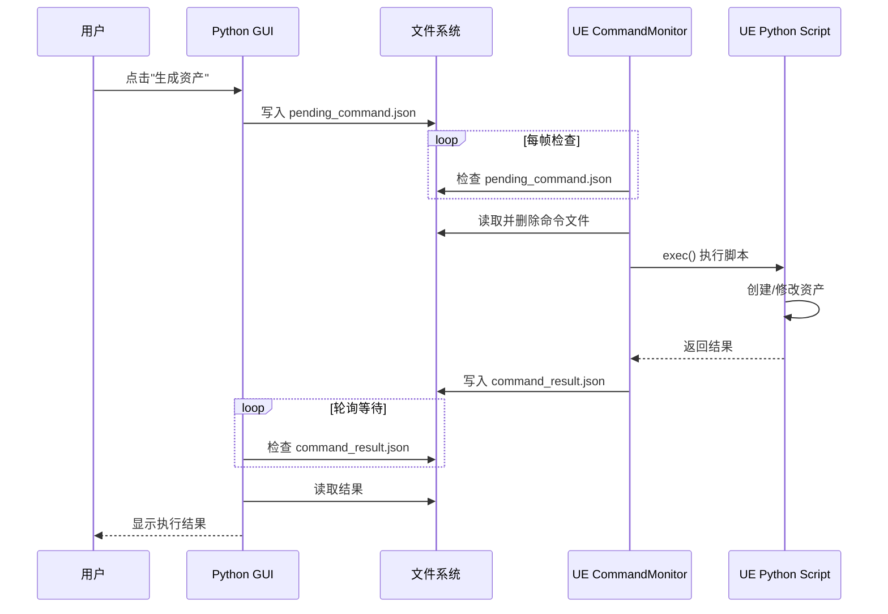

# 07 - UE-Python 通信详解

## 🎯 概述

本文详细介绍 DataAssetManager 如何与 Unreal Engine 进行双向通信，包括命令发送、脚本执行、结果返回的完整流程。

---

## 📐 系统架构



---

## 🔑 关键组件

### 1. GUI 端：UERemoteExecutor

**文件位置**: `Tools/DataAssetManager/core/ue_remote.py`

```python
class UERemoteExecutor:
    """负责与 UE 通信的客户端"""
    
    def __init__(self, project_root):
        # 定义通信文件路径
        base = os.path.join(project_root, "Intermediate", "DataAssetManager")
        self.cmd_file = os.path.join(base, "pending_command.json")
        self.result_file = os.path.join(base, "command_result.json")
        self.heartbeat_file = os.path.join(base, "ue_heartbeat.txt")
    
    def is_ue_running(self) -> bool:
        """通过心跳文件判断 UE 是否在线"""
        if not os.path.exists(self.heartbeat_file):
            return False
        mtime = os.path.getmtime(self.heartbeat_file)
        return (time.time() - mtime) < 10
    
    def execute_file(self, script_path: str, timeout=30.0) -> Tuple[bool, str]:
        """请求 UE 执行脚本，等待结果"""
        # 写入命令
        command = {
            "type": "execute_file",
            "script_path": script_path,
            "timestamp": datetime.now().isoformat()
        }
        with open(self.cmd_file, 'w') as f:
            json.dump(command, f)
        
        # 轮询等待结果
        start = time.time()
        while time.time() - start < timeout:
            if os.path.exists(self.result_file):
                with open(self.result_file, 'r') as f:
                    result = json.load(f)
                os.remove(self.result_file)
                return result['success'], result['message']
            time.sleep(0.1)
        
        return False, "执行超时"
```

### 2. UE 端：CommandMonitor

**文件位置**: `Tools/DataAssetManager/ue_scripts/command_monitor.py`

```python
import unreal
import json
import os
import time

class DataAssetCommandMonitor:
    """UE 内运行的命令监控器"""
    
    def __init__(self):
        project_dir = unreal.Paths.project_dir()
        base = os.path.join(project_dir, "Intermediate", "DataAssetManager")
        
        self.cmd_file = os.path.join(base, "pending_command.json")
        self.result_file = os.path.join(base, "command_result.json")
        self.heartbeat_file = os.path.join(base, "ue_heartbeat.txt")
        
        self.last_heartbeat = 0
        os.makedirs(base, exist_ok=True)
    
    def tick(self, delta_time):
        """每帧调用"""
        # 更新心跳（每秒一次）
        now = time.time()
        if now - self.last_heartbeat > 1.0:
            self._update_heartbeat()
            self.last_heartbeat = now
        
        # 检查命令
        if os.path.exists(self.cmd_file):
            self._process_command()
    
    def _update_heartbeat(self):
        with open(self.heartbeat_file, 'w') as f:
            f.write(f"{time.time()}")
    
    def _process_command(self):
        try:
            # 读取并删除命令
            with open(self.cmd_file, 'r', encoding='utf-8') as f:
                cmd = json.load(f)
            os.remove(self.cmd_file)
            
            # 执行脚本
            if cmd.get('type') == 'execute_file':
                script_path = cmd['script_path']
                self._execute_script(script_path)
                
        except Exception as e:
            self._write_result(False, f"处理命令失败: {e}")
    
    def _execute_script(self, script_path):
        try:
            with open(script_path, 'r', encoding='utf-8') as f:
                code = f.read()
            
            # 关键：提供 __file__ 变量
            exec(code, {'__file__': script_path})
            self._write_result(True, "执行成功")
            
        except Exception as e:
            import traceback
            self._write_result(False, traceback.format_exc())
    
    def _write_result(self, success, message):
        result = {
            "success": success,
            "message": message,
            "timestamp": time.time()
        }
        with open(self.result_file, 'w', encoding='utf-8') as f:
            json.dump(result, f, ensure_ascii=False)

# 启动监控器
_monitor = DataAssetCommandMonitor()
_tick_handle = unreal.register_slate_post_tick_callback(_monitor.tick)
unreal.log("DataAsset Command Monitor 已启动")
```

### 3. 自动启动机制

**文件位置**: `Content/Python/init_unreal.py`

UE 会自动执行 `Content/Python/init_unreal.py`：

```python
# Content/Python/init_unreal.py
import unreal
import os

def start_command_monitor():
    """启动命令监控器"""
    project_dir = unreal.Paths.project_dir()
    monitor_script = os.path.join(
        project_dir, 
        "Tools/DataAssetManager/ue_scripts/command_monitor.py"
    )
    
    if os.path.exists(monitor_script):
        with open(monitor_script, 'r', encoding='utf-8') as f:
            exec(f.read(), {'__file__': monitor_script})
        unreal.log("Command Monitor 已自动启动")

# UE 启动时自动执行
start_command_monitor()
```

---

## 📁 文件格式详解

### pending_command.json

```json
{
    "type": "execute_file",          // 命令类型
    "script_path": "D:/Project/Tools/DataAssetManager/ue_scripts/generate_experience.py",
    "timestamp": "2024-12-23T18:30:00.123456",
    "params": {                      // 可选：传递给脚本的参数
        "asset_name": "Exp_TestLevel",
        "config_file": "experiences.json"
    }
}
```

### command_result.json

```json
{
    "success": true,
    "message": "成功创建资产: /Game/Experiences/Exp_TestLevel",
    "timestamp": 1703329800.123,
    "details": {                     // 可选：详细信息
        "assets_created": ["/Game/Experiences/Exp_TestLevel"],
        "warnings": []
    }
}
```

### ue_heartbeat.txt

```
1703329800.123456
```
简单的时间戳，表示最后一次心跳时间。

---

## 🔄 通信流程图

```
┌─────────────────────────────────────────────────────────────────┐
│                        完整通信流程                               │
├─────────────────────────────────────────────────────────────────┤
│                                                                 │
│  ┌─────────┐     ┌──────────────┐     ┌─────────────────────┐   │
│  │ 用户操作 │ ──▶ │ Python GUI  │ ──▶ │ pending_command.json │   │
│  └─────────┘     └──────────────┘     └─────────────────────┘   │
│                                                 │               │
│                                                 ▼               │
│  ┌─────────────────────────────────────────────────────────┐   │
│  │                  Unreal Engine                          │   │
│  │  ┌──────────────┐     ┌────────────────────────────┐    │   │
│  │  │CommandMonitor│ ──▶ │  generate_experience.py    │    │   │
│  │  │  (tick 轮询) │     │  创建蓝图、设置属性、保存   │    │   │
│  │  └──────────────┘     └────────────────────────────┘    │   │
│  └─────────────────────────────────────────────────────────┘   │
│                                                 │               │
│                                                 ▼               │
│  ┌─────────────────────┐     ┌──────────────┐     ┌─────────┐  │
│  │ command_result.json │ ──▶ │ Python GUI  │ ──▶ │ 显示结果 │  │
│  └─────────────────────┘     └──────────────┘     └─────────┘  │
│                                                                 │
└─────────────────────────────────────────────────────────────────┘
```

---

## ⚠️ 常见问题与解决

### 1. UE 端脚本中 `__file__` 未定义

**原因**: `exec()` 默认不提供 `__file__`

**解决**:
```python
exec(code, {'__file__': script_path})
```

### 2. 心跳超时判断

**最佳实践**: 心跳间隔 1 秒，超时阈值 10 秒

```python
# 避免瞬时波动导致误判
return (time.time() - mtime) < 10
```

### 3. 编码问题

**解决**: 始终使用 UTF-8

```python
with open(file, 'r', encoding='utf-8') as f:
    ...
```

---

## 💡 扩展建议

1. **支持多种命令类型**
   ```json
   {"type": "execute_file", ...}
   {"type": "reload_module", ...}
   {"type": "query_assets", ...}
   ```

2. **添加命令队列**
   ```
   pending_commands/
   ├── cmd_001.json
   ├── cmd_002.json
   └── cmd_003.json
   ```

3. **双向通知**
   UE 主动通知 GUI（如资产变化）