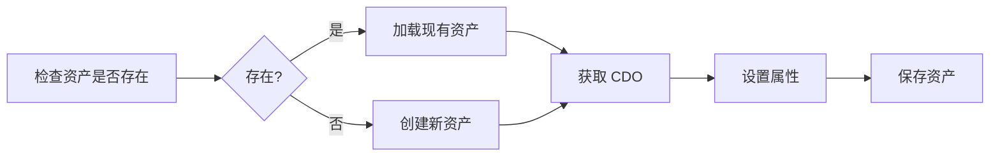

# 09 - UE 资产操作指南

## 🎯 概述

本文详细介绍如何通过 Python 脚本在 UE 编辑器中创建、修改、保存各类资产。

---

## 📐 资产操作流程



---

## 🔑 创建不同类型的资产

### 1. 创建 DataAsset 蓝图

```python
import unreal

def create_data_asset_blueprint(name, package_path, parent_class):
    """
    创建继承自 DataAsset 的蓝图
    
    Args:
        name: 资产名称，如 "BP_MyExperience"
        package_path: 保存路径，如 "/Game/Experiences"
        parent_class: 父类，如 unreal.DJ01ExperienceDefinition
    """
    full_path = f"{package_path}/{name}"
    
    # 检查是否已存在
    if unreal.EditorAssetLibrary.does_asset_exist(full_path):
        return unreal.EditorAssetLibrary.load_asset(full_path)
    
    # 创建蓝图
    asset_tools = unreal.AssetToolsHelpers.get_asset_tools()
    factory = unreal.BlueprintFactory()
    factory.set_editor_property("parent_class", parent_class)
    
    blueprint = asset_tools.create_asset(
        asset_name=name,
        package_path=package_path,
        asset_class=unreal.Blueprint,
        factory=factory
    )
    
    return blueprint
```

### 2. 创建纯 DataAsset (非蓝图)

```python
def create_data_asset(name, package_path, asset_class):
    """
    创建纯 DataAsset 实例
    
    Args:
        name: 资产名称
        package_path: 保存路径
        asset_class: 资产类，如 unreal.DJ01AbilitySet
    """
    full_path = f"{package_path}/{name}"
    
    if unreal.EditorAssetLibrary.does_asset_exist(full_path):
        return unreal.EditorAssetLibrary.load_asset(full_path)
    
    asset_tools = unreal.AssetToolsHelpers.get_asset_tools()
    
    # 使用 DataAsset 工厂
    factory = unreal.DataAssetFactory()
    factory.set_editor_property("data_asset_class", asset_class)
    
    asset = asset_tools.create_asset(
        asset_name=name,
        package_path=package_path,
        asset_class=asset_class,
        factory=factory
    )
    
    return asset
```

### 3. 创建 InputMappingContext

```python
def create_input_mapping_context(name, package_path):
    """创建增强输入映射上下文"""
    full_path = f"{package_path}/{name}"
    
    if unreal.EditorAssetLibrary.does_asset_exist(full_path):
        return unreal.EditorAssetLibrary.load_asset(full_path)
    
    asset_tools = unreal.AssetToolsHelpers.get_asset_tools()
    
    # 输入映射上下文没有专用工厂，直接创建
    asset = asset_tools.create_asset(
        asset_name=name,
        package_path=package_path,
        asset_class=unreal.InputMappingContext,
        factory=None
    )
    
    return asset
```

---

## 📝 设置资产属性

### 1. 基本属性

```python
def set_basic_properties(cdo, config):
    """设置基本类型属性"""
    
    # 字符串
    if "DisplayName" in config:
        cdo.set_editor_property("display_name", config["DisplayName"])
    
    # 数值
    if "Priority" in config:
        cdo.set_editor_property("priority", int(config["Priority"]))
    
    # 布尔值
    if "IsEnabled" in config:
        cdo.set_editor_property("is_enabled", config["IsEnabled"])
    
    # 浮点数
    if "Speed" in config:
        cdo.set_editor_property("speed", float(config["Speed"]))
```

### 2. 资产引用

```python
def set_asset_reference(cdo, property_name, asset_path):
    """设置资产引用属性"""
    
    if not asset_path:
        return False
    
    # 加载引用的资产
    asset = unreal.EditorAssetLibrary.load_asset(asset_path)
    if asset is None:
        unreal.log_warning(f"无法加载资产: {asset_path}")
        return False
    
    cdo.set_editor_property(property_name, asset)
    return True

# 使用示例
set_asset_reference(cdo, "default_pawn_data", "/Game/PawnData/PD_Hero")
```

### 3. 软引用 (SoftObjectPtr)

```python
def set_soft_reference(cdo, property_name, asset_path):
    """设置软引用属性"""
    
    if not asset_path:
        return
    
    # 创建软引用路径
    soft_path = unreal.SoftObjectPath(asset_path)
    cdo.set_editor_property(property_name, soft_path)

# 使用示例
set_soft_reference(cdo, "ability_class", "/Game/Abilities/GA_Jump.GA_Jump_C")
```

### 4. 数组属性

```python
def set_array_property(cdo, property_name, values, item_loader=None):
    """设置数组属性"""
    
    # 获取当前数组（确定类型）
    current_array = cdo.get_editor_property(property_name)
    
    # 清空现有内容
    current_array.clear()
    
    # 添加新内容
    for value in values:
        if item_loader:
            item = item_loader(value)
            if item:
                current_array.append(item)
        else:
            current_array.append(value)
    
    cdo.set_editor_property(property_name, current_array)

# 使用示例：设置字符串数组
set_array_property(cdo, "tags", ["Tag1", "Tag2", "Tag3"])

# 使用示例：设置资产引用数组
def load_ability(path):
    return unreal.EditorAssetLibrary.load_asset(path)

set_array_property(cdo, "abilities", 
    ["/Game/Abilities/GA_Jump", "/Game/Abilities/GA_Dash"],
    item_loader=load_ability
)
```

### 5. Gameplay Tags

```python
def set_gameplay_tags(cdo, property_name, tag_names):
    """设置 GameplayTag 数组"""
    
    tag_container = unreal.GameplayTagContainer()
    
    for tag_name in tag_names:
        tag = unreal.GameplayTag.request_gameplay_tag(tag_name)
        if tag.is_valid():
            tag_container.add_tag(tag)
        else:
            unreal.log_warning(f"无效的标签: {tag_name}")
    
    cdo.set_editor_property(property_name, tag_container)

# 使用示例
set_gameplay_tags(cdo, "ability_tags", [
    "Ability.Active.Jump",
    "Ability.Active.Dash"
])
```

### 6. 结构体属性

```python
def set_struct_property(cdo, property_name, struct_data):
    """设置结构体属性"""
    
    # 获取当前结构体（确定类型）
    struct = cdo.get_editor_property(property_name)
    
    # 设置结构体的各个字段
    for field_name, field_value in struct_data.items():
        struct.set_editor_property(field_name, field_value)
    
    cdo.set_editor_property(property_name, struct)
```

---

## 💾 保存资产

```python
def save_asset(asset_path, force_save=False):
    """保存资产"""
    
    if not unreal.EditorAssetLibrary.does_asset_exist(asset_path):
        unreal.log_error(f"资产不存在: {asset_path}")
        return False
    
    # 保存单个资产
    success = unreal.EditorAssetLibrary.save_asset(
        asset_path, 
        only_if_is_dirty=not force_save
    )
    
    if success:
        unreal.log(f"保存成功: {asset_path}")
    else:
        unreal.log_error(f"保存失败: {asset_path}")
    
    return success

def save_all_dirty_assets():
    """保存所有已修改的资产"""
    unreal.EditorAssetLibrary.save_loaded_assets()
```

---

## 🔄 完整示例：创建 Experience

```python
import unreal
import json
import os

def create_experience(name: str, config: dict) -> bool:
    """
    创建完整的 Experience 资产
    
    Args:
        name: Experience 名称
        config: 配置字典，包含所有属性
    
    Returns:
        bool: 是否成功
    """
    package_path = "/Game/Experiences"
    full_path = f"{package_path}/{name}"
    
    try:
        # 1. 创建或加载蓝图
        if unreal.EditorAssetLibrary.does_asset_exist(full_path):
            blueprint = unreal.EditorAssetLibrary.load_asset(full_path)
            unreal.log(f"加载现有资产: {full_path}")
        else:
            asset_tools = unreal.AssetToolsHelpers.get_asset_tools()
            factory = unreal.BlueprintFactory()
            factory.set_editor_property("parent_class", unreal.DJ01ExperienceDefinition)
            
            blueprint = asset_tools.create_asset(
                asset_name=name,
                package_path=package_path,
                asset_class=unreal.Blueprint,
                factory=factory
            )
            unreal.log(f"创建新资产: {full_path}")
        
        # 2. 获取 CDO
        generated_class = blueprint.get_editor_property("generated_class")
        if generated_class is None:
            # 尝试其他方式获取
            generated_class = getattr(blueprint, 'GeneratedClass', None)
        
        if generated_class is None:
            unreal.log_error("无法获取 GeneratedClass")
            return False
        
        cdo = unreal.get_default_object(generated_class)
        
        # 3. 设置 DefaultPawnData
        if "DefaultPawnData" in config:
            pawn_path = config["DefaultPawnData"]
            pawn_data = unreal.EditorAssetLibrary.load_asset(pawn_path)
            if pawn_data:
                cdo.set_editor_property("default_pawn_data", pawn_data)
            else:
                unreal.log_warning(f"无法加载 PawnData: {pawn_path}")
        
        # 4. 设置 GameFeatures
        if "GameFeaturesToEnable" in config:
            features = config["GameFeaturesToEnable"]
            feature_array = cdo.get_editor_property("game_features_to_enable")
            feature_array.clear()
            for feature in features:
                feature_array.append(feature)
            cdo.set_editor_property("game_features_to_enable", feature_array)
        
        # 5. 保存
        unreal.EditorAssetLibrary.save_asset(full_path)
        unreal.log(f"Experience 创建成功: {full_path}")
        
        return True
        
    except Exception as e:
        unreal.log_error(f"创建失败: {e}")
        import traceback
        unreal.log_error(traceback.format_exc())
        return False


# 主入口
if __name__ == "__main__":
    # 从配置文件读取
    script_dir = os.path.dirname(__file__)
    config_file = os.path.join(script_dir, "..", "configs", "experiences.json")
    
    with open(config_file, 'r', encoding='utf-8') as f:
        all_configs = json.load(f)
    
    success_count = 0
    for exp_name, exp_config in all_configs.items():
        if create_experience(exp_name, exp_config):
            success_count += 1
    
    unreal.log(f"完成: {success_count}/{len(all_configs)} 个 Experience 创建成功")
```

---

## ⚠️ 常见错误处理

```python
def safe_create_asset(func):
    """装饰器：安全创建资产"""
    def wrapper(*args, **kwargs):
        try:
            return func(*args, **kwargs)
        except Exception as e:
            unreal.log_error(f"资产操作失败: {e}")
            import traceback
            unreal.log_error(traceback.format_exc())
            return None
    return wrapper

@safe_create_asset
def create_my_asset(...):
    ...
```