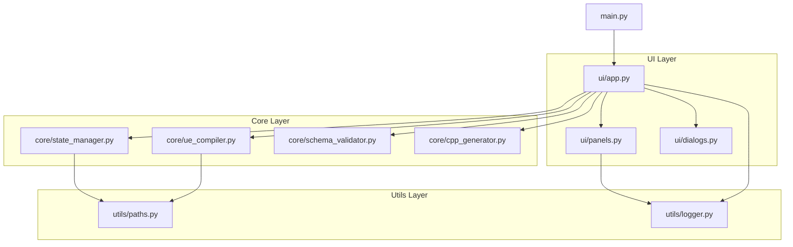
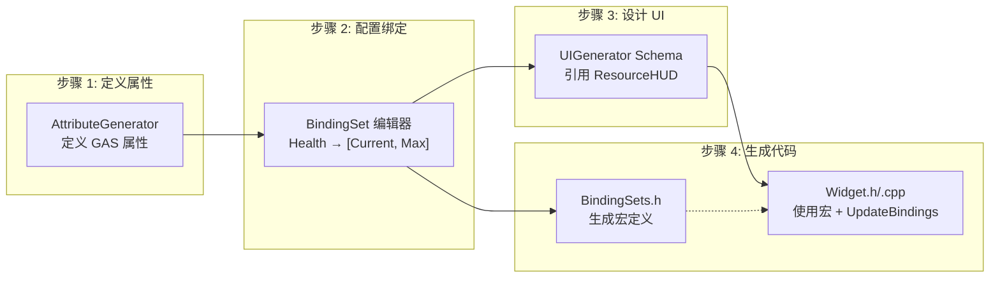

# DJ01 UI Generator

> Schema 驱动的 UI 生成工具，与 BindingSet 系统深度集成，实现 MVVM 模式

## 🎯 概述

UI Generator 是一个可视化工具，用于通过 JSON Schema 定义 UI，自动生成：
- **C++ Widget 基类** - 包含 BindWidget 组件、属性、事件
- **GAS BindingSet 集成** - 自动绑定 GameplayAttribute 到 UI（支持多值类型）
- **UMG Blueprint 骨架** - 可选的蓝图生成
- **MVVM 数据绑定** - GAS 属性变化自动同步到 UI 组件

## 🚀 快速启动

```bash
# 方式 1: 双击批处理
双击项目根目录的 "启动UI生成器.bat"

# 方式 2: 命令行
cd D:\UnrealProjects\DJ01
python Tools/UIGenerator/main.py
```

## 📋 界面说明

```
┌──────────────────────────────────────────────────────────────────────┐
│  UI Generator - Schema 驱动的 UI 生成工具 v2.1                        │
├──────────────────────────────────────────────────────────────────────┤
│  📋 生成流程                                                          │
│  ✅ 步骤1: 生成 C++  →  🔄 步骤2: 编译项目  →  ⚪ 步骤3: 生成蓝图     │
│     (Python)              (UBT/IDE)              (UE Python)          │
├──────────────────────────────────────────────────────────────────────┤
│ [🔄刷新] [✅验证] [📝新建] │ [①生成C++] [②编译] [③生成蓝图] [🚀全部]   │
├─────────────────────┬────────────────────────────────────────────────┤
│  📁 Schema 列表      │  ┌────────────────────────────────────────┐   │
│  ├─ HealthBar.json  │  │ 📋 日志 │ 👁️ 代码预览 │ 🌳 组件树      │   │
│  └─ PlayerHUD.json  │  ├────────────────────────────────────────┤   │
├─────────────────────┤  │ ✅ C++ 代码生成成功！                   │   │
│  Schema 编辑器       │  │    → DJ01HealthBarBase.h              │   │
│  ┌─────────────────┐│  │    → DJ01HealthBarBase.cpp            │   │
│  │ { "name": ... } ││  └────────────────────────────────────────┘   │
│  └─────────────────┘│                                                │
│  [💾 保存]           │                                                │
└─────────────────────┴────────────────────────────────────────────────┘
```

---

## � MVVM 架构

UI Generator 遵循 MVVM 模式，自动处理 GAS → UI 的数据流：

```
┌─────────────────────────────────────────────────────────────────┐
│                           MVVM 架构                              │
├─────────────────────────────────────────────────────────────────┤
│                                                                  │
│  ┌──────────────┐   BindingSet   ┌──────────────┐              │
│  │    Model     │ ────────────► │  ViewModel   │              │
│  │  (GAS ASC)   │   自动同步     │ (Widget C++) │              │
│  │              │               │              │              │
│  │ ○ Health     │               │ ○ CurrentHealth             │
│  │ ○ Mana       │               │ ○ MaxHealth                  │
│  │ ○ Stamina    │               │ ○ HealthPercent (计算)       │
│  └──────────────┘               └──────┬───────┘              │
│                                        │                        │
│                                        │ FieldNotify            │
│                                        ▼                        │
│                                 ┌──────────────┐              │
│                                 │     View     │              │
│                                 │ (UMG Widget) │              │
│                                 │              │              │
│                                 │ ○ HealthBar  │              │
│                                 │ ○ HealthText │              │
│                                 └──────────────┘              │
│                                                                  │
└─────────────────────────────────────────────────────────────────┘
```

### 数据流程

1. **GAS 属性变化** → ASC 触发回调
2. **BindingSet 宏接收** → 更新 Widget 中的变量（CurrentHealth、MaxHealth 等）
3. **FieldNotify 通知** → 蓝图/UMG 收到属性变化事件
4. **UI 自动刷新** → 进度条、文本等组件更新

---

## �📖 使用流程

### 第一步：创建 Schema

1. 点击 **📝 新建** 或选择现有文件
2. 编辑 JSON 配置
3. 点击 **💾 保存**

**示例 Schema：**

```json
{
  "$schema": "../ui_schema_v1.json",
  "name": "DJ01PlayerHUD",
  "description": "玩家 HUD",
  "parent_class": "CommonUserWidget",
  "output_path": "Source/DJ01/UI/Widgets",
  
  "binding_set": {
    "name": "Test",
    "component_bindings": [
      { "component": "HealthBar", "property": "Percent", 
        "source": "CurrentHealth", "transform": "HealthToPercent" }
    ]
  },
  
  "components": [
    {
      "name": "RootCanvas",
      "type": "CanvasPanel",
      "children": [
        { "name": "HealthBar", "type": "ProgressBar" }
      ]
    }
  ]
}
```

### 第二步：生成 C++

1. 点击 **✅ 验证** 检查格式
2. 点击 **① 生成 C++**
3. 生成文件到 `output_path` 目录

### 第三步：编译项目

点击 **② 编译** 按钮，工具会自动：
- 检测 UE 引擎路径
- 调用 UnrealBuildTool 编译

或手动编译：
| 方式 | 操作 |
|------|------|
| UE 编辑器 | `Ctrl+Alt+F11` |
| Visual Studio | `Ctrl+Shift+B` |
| Rider | `Ctrl+Shift+F9` |

### 第四步：创建 Widget Blueprint

1. UE 中右键 → User Interface → Widget Blueprint
2. 选择生成的基类（如 `DJ01PlayerHUDBase`）
3. 添加控件，**名称必须与 Schema 一致**

### 第五步：运行时绑定

```cpp
// C++ - 绑定到 ASC
void AMyPlayerController::BeginPlay()
{
    Super::BeginPlay();
    
    if (UAbilitySystemComponent* ASC = GetAbilitySystemComponent())
    {
        // 调用生成的绑定函数
        HealthBarWidget->BindToASC(ASC);
    }
}

// C++ - 解绑（Widget 销毁前）
void AMyPlayerController::EndPlay(const EEndPlayReason::Type Reason)
{
    if (HealthBarWidget)
    {
        HealthBarWidget->UnbindFromASC();
    }
    Super::EndPlay(Reason);
}
```

```
蓝图:
BeginPlay 
  → Get Player Controller 
  → Get Ability System Component 
  → BindToASC
```

---

## 🏗️ 项目架构

```
Tools/UIGenerator/
├── main.py                 # 入口文件 (~25行)
├── 启动UI生成器.bat
├── README.md
│
├── ui/                     # 📱 界面层
│   ├── __init__.py
│   ├── app.py              # 主应用窗口 (~350行)
│   ├── panels.py           # 面板组件 (~250行)
│   │   ├── FlowPanel       # 流程状态面板
│   │   ├── SchemaListPanel # Schema 列表
│   │   ├── EditorPanel     # JSON 编辑器
│   │   └── OutputPanel     # 日志/预览/组件树
│   └── dialogs.py          # 对话框 (~180行)
│       ├── CompileReminderDialog
│       ├── EngineSelectDialog
│       └── SettingsDialog
│
├── core/                   # ⚙️ 核心层
│   ├── __init__.py
│   ├── schema_validator.py # Schema 校验器
│   ├── cpp_generator.py    # C++ 代码生成器
│   ├── state_manager.py    # 生成状态管理 (~100行)
│   │   ├── GenerationStage # 阶段枚举
│   │   └── StateManager    # 状态持久化
│   └── ue_compiler.py      # UE 编译集成 (~200行)
│       ├── UECompiler      # 编译器封装
│       └── UECommandSender # UE 命令发送
│
├── utils/                  # 🔧 工具层
│   ├── __init__.py
│   ├── paths.py            # 路径配置单例 (~100行)
│   └── logger.py           # 日志工具 (~70行)
│
├── configs/
│   └── widget_types.json   # 组件类型定义
│
├── schemas/
│   ├── ui_schema_v1.json   # Schema 规范
│   ├── widgets/            # ⭐ 用户 Schema
│   └── examples/           # 示例
│
└── ue_scripts/
    └── generate_widget_bp.py
```

### 模块依赖图



---

## 🔧 Schema 配置参考

### 基础字段

| 字段 | 类型 | 必填 | 说明 |
|------|------|:----:|------|
| `name` | string | ✅ | Widget 类名（不含 U 前缀） |
| `description` | string | | 描述 |
| `parent_class` | string | | `UserWidget` / `CommonUserWidget` / `CommonActivatableWidget` |
| `output_path` | string | | C++ 输出路径 |
| `blueprint_path` | string | | 蓝图输出路径 |

### binding_set 配置

```json
"binding_set": {
  "name": "BindingSet名称",
  "comment": "可选说明",
  "component_bindings": [
    {
      "component": "组件名",
      "property": "Percent|Text|Visibility",
      "source": "BindingSet变量名",
      "transform": "Direct|HealthToPercent|HealthToText|BoolToVisibility",
      "comment": "可选说明"
    }
  ]
}
```

#### BindingSet 变量命名规则

BindingSet 支持多值类型，变量名自动按以下规则生成：

| VariableName | ValueTypes | 生成的变量 |
|--------------|------------|-----------|
| `Health` | `[Current]` | `Health` |
| `Health` | `[Current, Max]` | `CurrentHealth`, `MaxHealth` |
| `Health` | `[Current, Max, Base]` | `CurrentHealth`, `MaxHealth`, `BaseHealth` |
| `Mana` | `[Current, Max]` | `CurrentMana`, `MaxMana` |

#### Transform 转换函数

| transform | 输入 | 输出 | 说明 |
|-----------|------|------|------|
| `Direct` | any | same | 直接赋值 |
| `HealthToPercent` | float | float | `CurrentHealth / MaxHealth` |
| `HealthToText` | float | FText | `"100/150"` 格式 |
| `BoolToVisibility` | bool | ESlateVisibility | true→Visible, false→Collapsed |

**完整示例：**

```json
{
  "binding_set": {
    "name": "ResourceHUD",
    "comment": "资源 HUD 绑定配置",
    "component_bindings": [
      {
        "source": "CurrentHealth",
        "component": "HealthBar",
        "property": "Percent",
        "transform": "HealthToPercent",
        "comment": "当前生命值 -> 进度条百分比"
      },
      {
        "source": "CurrentHealth",
        "component": "HealthText",
        "property": "Text",
        "transform": "HealthToText",
        "comment": "生命值 -> 文字显示 (100/150)"
      },
      {
        "source": "IsStunned",
        "component": "StunnedIcon",
        "property": "Visibility",
        "transform": "BoolToVisibility",
        "comment": "眩晕状态 -> 图标可见性"
      }
    ]
  }
}
```

### components 配置

```json
"components": [
  {
    "name": "组件名",
    "type": "CanvasPanel|ProgressBar|TextBlock|Image|Button|...",
    "comment": "注释",
    "optional": false,
    "children": []
  }
]
```

### 常用组件类型

| type | UE 类 | 说明 |
|------|-------|------|
| `CanvasPanel` | UCanvasPanel | 画布 |
| `HorizontalBox` | UHorizontalBox | 水平布局 |
| `VerticalBox` | UVerticalBox | 垂直布局 |
| `ProgressBar` | UProgressBar | 进度条 |
| `TextBlock` | UTextBlock | 文本 |
| `Image` | UImage | 图片 |
| `Button` | UButton | 按钮 |

---

## 🧩 生成代码示例

假设 BindingSet `ResourceHUD` 定义了 `Health` 属性（ValueTypes: `[Current, Max]`）：

### 生成的头文件 (.h)

```cpp
UCLASS()
class UDJ01HealthBarBase : public UCommonUserWidget
{
    GENERATED_BODY()
    
public:
    // BindWidget 组件
    UPROPERTY(meta = (BindWidget))
    TObjectPtr<UProgressBar> HealthBar;
    
    UPROPERTY(meta = (BindWidget))
    TObjectPtr<UTextBlock> HealthText;
    
    // ========== BindingSet 自动生成 ==========
    DJ01_DECLARE_BINDING_SET(ResourceHUD)
    // 展开为:
    // - float CurrentHealth;
    // - float MaxHealth;
    // - void BindToASC(UAbilitySystemComponent* ASC);
    // - void UnbindFromASC();
    // ==========================================
    
protected:
    // Transform 函数
    float TransformHealthToPercent(float Health) const;
    FText TransformHealthToText(float Health) const;
    
    // UI 更新
    void UpdateBindings();
};
```

### 生成的实现文件 (.cpp)

```cpp
void UDJ01HealthBarBase::UpdateBindings()
{
    // BindingSet 变量 -> UI 组件
    if (HealthBar)
    {
        HealthBar->SetPercent(TransformHealthToPercent(CurrentHealth));
    }
    if (HealthText)
    {
        HealthText->SetText(TransformHealthToText(CurrentHealth));
    }
}

float UDJ01HealthBarBase::TransformHealthToPercent(float Health) const
{
    // MaxHealth 来自 BindingSet 自动生成的变量
    return MaxHealth > 0.0f ? FMath::Clamp(Health / MaxHealth, 0.0f, 1.0f) : 0.0f;
}

FText UDJ01HealthBarBase::TransformHealthToText(float Health) const
{
    return FText::Format(NSLOCTEXT("Health", "HealthFormat", "{0}/{1}"),
        FMath::RoundToInt(Health), FMath::RoundToInt(MaxHealth));
}
```

---

## 🔗 与 BindingSet 工具协作



### 工具对应文件

| 工具 | 配置文件 | 生成输出 |
|------|----------|----------|
| AttributeGenerator | `AttributeSetDefinitions.json` | `*AttributeSet.h/.cpp` |
| BindingSet 编辑器 | `BindingSetDefinitions.json` | `BindingSets.h` |
| UIGenerator | `schemas/widgets/*.json` | `*WidgetBase.h/.cpp` |

---

## ❓ 常见问题

### 基础问题

**Q: 生成的代码在哪里？**
A: Schema 中 `output_path` 指定的目录，默认 `Source/DJ01/UI/Generated/`

**Q: 为什么要先编译再生成蓝图？**
A: Widget Blueprint 继承 C++ 基类，基类必须先编译

**Q: 如何添加新组件类型？**
A: 编辑 `configs/widget_types.json`

**Q: 编译按钮找不到 UE？**
A: 工具会自动检测引擎路径，若失败可手动选择或在 IDE 中编译

### BindingSet 相关

**Q: BindingSet 变量从哪来？**
A: 在 `BindingSetDefinitions.json` 中定义，由 BindingSet Generator（AttributeGenerator 的 BindingSet 标签页）生成

**Q: 为什么我的变量叫 CurrentHealth 而不是 Health？**
A: 当 ValueTypes 包含多个值（如 `[Current, Max]`）时，会自动添加前缀以区分：
- `Current` → `CurrentHealth`
- `Max` → `MaxHealth`

如果只选择单个 `Current`，则变量名保持为 `Health`

**Q: Transform 函数能访问其他 BindingSet 变量吗？**
A: 可以！Transform 函数是 Widget 的成员函数，可以访问所有 BindingSet 变量。例如 `HealthToPercent` 自动使用 `MaxHealth` 计算百分比

**Q: 如何自定义 Transform 函数？**
A: 在蓝图子类或 C++ 派生类中重写 `TransformXxx` 函数

---

## �️ 开发指南

### 添加新的 Transform 类型

1. 在 `core/cpp_generator.py` 的 `generate_cpp_file` 中添加：

```python
elif t == 'MyNewTransform':
    lines.append(f"float {class_name}::TransformMyNewTransform(float Value) const")
    lines.append("{")
    lines.append("\t// 自定义转换逻辑")
    lines.append("\treturn Value * 2.0f;")
    lines.append("}")
```

2. 在 `configs/widget_types.json` 中注册（可选）

### 添加新的组件类型

编辑 `configs/widget_types.json`：

```json
{
  "MyCustomPanel": {
    "ue_class": "UMyCustomPanel",
    "header": "UI/MyCustomPanel.h",
    "can_have_children": true,
    "bindable_properties": ["Visibility"]
  }
}
```

---

## �🔗 相关文档

- [BindingSet 系统](../AttributeGenerator/README.md) - 属性绑定配置
- [GAS 属性系统](../../Source/DJ01/AbilitySystem/) - Gameplay Ability System
- [CommonUI 文档](https://docs.unrealengine.com/5.0/en-US/common-ui-plugin-for-advanced-user-interfaces-in-unreal-engine/) - UE CommonUI 插件

---

## 📝 更新日志

### v2.2 (2024-12)
- 🔄 支持多值类型（ValueTypes 列表）
- 📝 完善 Transform 函数，自动使用 BindingSet 变量
- 📖 更新文档，添加 MVVM 架构说明

### v2.1 (2024-12)
- 🏗️ 代码重构：拆分为 ui/core/utils 三层架构
- 🔧 新增自动编译功能（集成 UnrealBuildTool）
- 📦 新增 `state_manager.py` 状态持久化
- 📦 新增 `ue_compiler.py` 编译器集成
- 📦 新增 `paths.py` 路径配置单例

### v2.0 (2024-12)
- ✨ 新增 `binding_set` 配置
- ✨ 新增 `transform` 值转换
- ✨ 与 BindingSet 系统集成

### v1.0
- 🎉 初始版本

---

## 📄 License

Internal tool for DJ01 project.