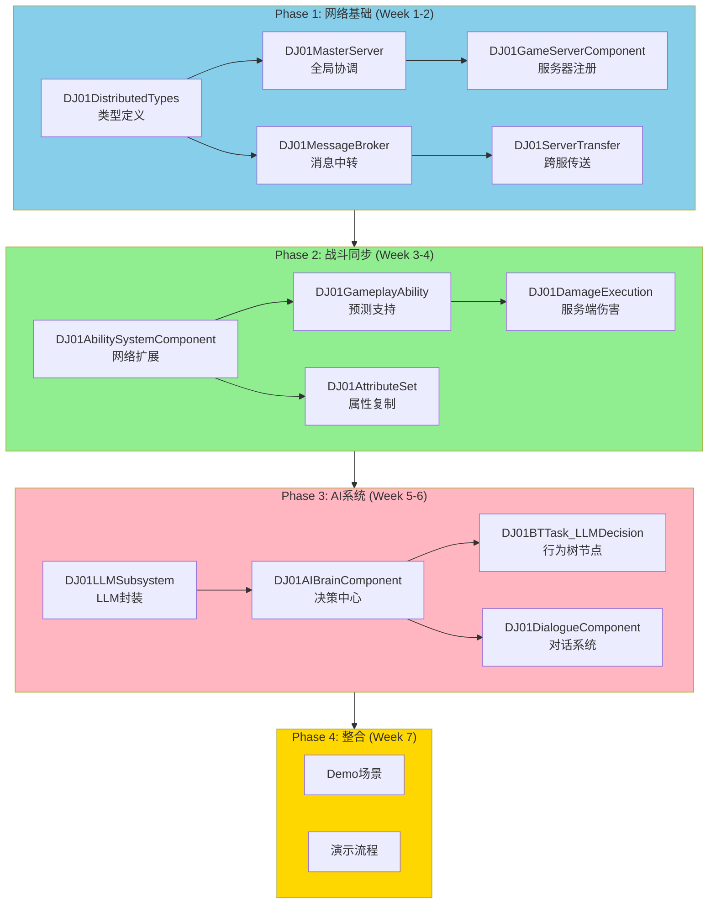

# DJ01 技术Demo开发总览

> **项目目标**：打造一个面向就业的技术演示Demo，以 **网络同步** 和 **AI大模型集成** 为核心亮点

---

## 📋 文档索引

| 文档 | 内容 | 状态 |
|------|------|------|
| [00_Overview.md](./00_Overview.md) | 项目总览与规划 | ✅ 当前 |
| [01_Phase1_NetworkFoundation.md](./01_Phase1_NetworkFoundation.md) | 分布式网络基础架构实现 | 📝 待创建 |
| [02_Phase2_CombatSync.md](./02_Phase2_CombatSync.md) | GAS战斗网络同步实现 | 📝 待创建 |
| [03_Phase3_AISystem.md](./03_Phase3_AISystem.md) | AI大模型系统实现 | 📝 待创建 |
| [04_Phase4_DemoIntegration.md](./04_Phase4_DemoIntegration.md) | Demo场景整合与演示 | 📝 待创建 |
| [05_CodeChecklist.md](./05_CodeChecklist.md) | 代码实现清单（按优先级） | 📝 待创建 |

---

## 🎯 项目定位

### 核心价值主张

```
┌─────────────────────────────────────────────────────────────────────┐
│                    DJ01 技术Demo - 面试亮点                          │
├─────────────────────────────────────────────────────────────────────┤
│                                                                     │
│  🌐 网络同步 (60%)                    🤖 AI系统 (40%)               │
│  ├─ 逆水寒式分布式架构                 ├─ 大模型API集成              │
│  ├─ Master/GAS服务器分离              ├─ 智能NPC决策               │
│  ├─ 跨服无缝传送                      ├─ 动态对话生成               │
│  ├─ GAS能力预测回滚                   └─ 行为树桥接                 │
│  └─ 服务端权威伤害计算                                              │
│                                                                     │
└─────────────────────────────────────────────────────────────────────┘
```

### 为什么选择这个方向？

| 方向 | 优势 | 劣势 | 结论 |
|------|------|------|------|
| 传统RPG | 展示面广 | 需要大量美术资源 | ❌ 不适合 |
| **网络同步** | **稀缺技能，面试加分** | 需要深入理解 | ✅ **主攻** |
| **AI集成** | **LLM是热点，有API额度** | 需要设计合理场景 | ✅ **辅攻** |

---

## 🏗️ 技术架构总览

### 系统架构图

```
┌──────────────────────────────────────────────────────────────────────────┐
│                           DJ01 分布式游戏架构                             │
├──────────────────────────────────────────────────────────────────────────┤
│                                                                          │
│                         ┌─────────────────┐                              │
│                         │  Master Server  │                              │
│                         │  (全局协调中心)  │                              │
│                         └────────┬────────┘                              │
│                                  │                                       │
│              ┌───────────────────┼───────────────────┐                   │
│              │                   │                   │                   │
│              ▼                   ▼                   ▼                   │
│     ┌────────────────┐  ┌────────────────┐  ┌────────────────┐          │
│     │  GameServer 1  │  │  GameServer 2  │  │  GameServer N  │          │
│     │  (场景服务器)   │  │  (场景服务器)   │  │  (场景服务器)   │          │
│     │                │  │                │  │                │          │
│     │  ┌──────────┐  │  │  ┌──────────┐  │  │  ┌──────────┐  │          │
│     │  │   GAS    │  │  │  │   GAS    │  │  │  │   GAS    │  │          │
│     │  │ 战斗逻辑  │  │  │  │ 战斗逻辑  │  │  │  │ 战斗逻辑  │  │          │
│     │  └──────────┘  │  │  └──────────┘  │  │  └──────────┘  │          │
│     │  ┌──────────┐  │  │  ┌──────────┐  │  │  ┌──────────┐  │          │
│     │  │ AI Brain │  │  │  │ AI Brain │  │  │  │ AI Brain │  │          │
│     │  │ LLM决策   │  │  │  │ LLM决策   │  │  │  │ LLM决策   │  │          │
│     │  └──────────┘  │  │  └──────────┘  │  │  └──────────┘  │          │
│     └───────┬────────┘  └───────┬────────┘  └───────┬────────┘          │
│             │                   │                   │                   │
│             └───────────────────┼───────────────────┘                   │
│                                 │                                       │
│                         ┌───────┴───────┐                               │
│                         │ MessageBroker │                               │
│                         │  (消息中转)    │                               │
│                         └───────────────┘                               │
│                                                                          │
└──────────────────────────────────────────────────────────────────────────┘
```

### 模块依赖关系



---

## 📅 开发时间线

### 甘特图

```
Week 1          Week 2          Week 3          Week 4          Week 5          Week 6          Week 7
├───────────────┼───────────────┼───────────────┼───────────────┼───────────────┼───────────────┤
│                                                                                               │
│ ████████████████████████████  Phase 1: 网络基础                                              │
│ ├─ 类型定义 ██                                                                               │
│ ├─ MasterServer ████████                                                                     │
│ ├─ MessageBroker ██████                                                                      │
│ ├─ ServerComponent ████                                                                      │
│ └─ ServerTransfer ████████                                                                   │
│                                                                                               │
│                               ████████████████████████████  Phase 2: 战斗同步                │
│                               ├─ ASC网络扩展 ██████                                          │
│                               ├─ Ability预测 ████████                                        │
│                               ├─ 伤害计算 ██████                                             │
│                               └─ 属性复制 ████                                               │
│                                                                                               │
│                                                               ██████████████████████  Phase 3: AI │
│                                                               ├─ LLM子系统 ██████            │
│                                                               ├─ AIBrain ████████            │
│                                                               ├─ BT节点 ████                 │
│                                                               └─ 对话系统 ████               │
│                                                                                               │
│                                                                               ████████  Phase 4 │
│                                                                               └─ Demo整合    │
└───────────────────────────────────────────────────────────────────────────────────────────────┘
```

### 里程碑

| 里程碑 | 目标日期 | 交付物 | 验收标准 |
|--------|----------|--------|----------|
| **M1** | Week 2 | 网络基础框架 | 多个DS可注册到Master，跨服传送可运行 |
| **M2** | Week 4 | 战斗同步 | 两个客户端可联机战斗，伤害同步正确 |
| **M3** | Week 6 | AI系统 | NPC可通过LLM生成对话和决策 |
| **M4** | Week 7 | 完整Demo | 可演示的技术展示场景 |

---

## 🗂️ 项目结构规划

### 新增目录结构

```
Source/DJ01/
├── Network/                          # 🆕 网络模块
│   ├── Distributed/                  # 分布式架构
│   │   ├── Public/
│   │   │   ├── DJ01DistributedTypes.h
│   │   │   ├── DJ01MasterServer.h
│   │   │   ├── DJ01MessageBroker.h
│   │   │   ├── DJ01GameServerComponent.h
│   │   │   └── DJ01ServerTransfer.h
│   │   └── Private/
│   │       ├── DJ01MasterServer.cpp
│   │       ├── DJ01MessageBroker.cpp
│   │       ├── DJ01GameServerComponent.cpp
│   │       └── DJ01ServerTransfer.cpp
│   │
│   └── Sync/                         # 同步工具
│       ├── Public/
│       │   ├── DJ01NetPrediction.h
│       │   └── DJ01ReplicationGraph.h
│       └── Private/
│           ├── DJ01NetPrediction.cpp
│           └── DJ01ReplicationGraph.cpp
│
├── AI/                               # 🆕 AI模块
│   ├── LLM/                          # 大模型集成
│   │   ├── Public/
│   │   │   ├── DJ01LLMSubsystem.h
│   │   │   ├── DJ01LLMTypes.h
│   │   │   └── DJ01LLMPromptBuilder.h
│   │   └── Private/
│   │       ├── DJ01LLMSubsystem.cpp
│   │       └── DJ01LLMPromptBuilder.cpp
│   │
│   ├── Brain/                        # AI决策
│   │   ├── Public/
│   │   │   ├── DJ01AIBrainComponent.h
│   │   │   └── DJ01AIContext.h
│   │   └── Private/
│   │       └── DJ01AIBrainComponent.cpp
│   │
│   ├── BehaviorTree/                 # 行为树扩展
│   │   ├── Public/
│   │   │   ├── DJ01BTTask_LLMDecision.h
│   │   │   └── DJ01BTDecorator_AIState.h
│   │   └── Private/
│   │       ├── DJ01BTTask_LLMDecision.cpp
│   │       └── DJ01BTDecorator_AIState.cpp
│   │
│   └── Dialogue/                     # 对话系统
│       ├── Public/
│       │   ├── DJ01DialogueComponent.h
│       │   └── DJ01DialogueTypes.h
│       └── Private/
│           └── DJ01DialogueComponent.cpp
│
└── AbilitySystem/                    # 现有模块扩展
    └── Sync/                         # 🆕 GAS网络同步
        ├── Public/
        │   ├── DJ01AbilityNetPrediction.h
        │   └── DJ01DamageNetExecution.h
        └── Private/
            ├── DJ01AbilityNetPrediction.cpp
            └── DJ01DamageNetExecution.cpp
```

---

## 🎮 Demo演示场景设计

### 场景布局

```
┌─────────────────────────────────────────────────────────────────────────┐
│                         DJ01 技术演示场景                               │
├─────────────────────────────────────────────────────────────────────────┤
│                                                                         │
│   ┌───────────────┐                         ┌───────────────┐          │
│   │   区域 A      │         传送门          │    区域 B     │          │
│   │  GameServer1  │◄────────────────────────►│  GameServer2  │          │
│   │               │                          │               │          │
│   │  ┌─────────┐  │                          │  ┌─────────┐  │          │
│   │  │ 战斗区  │  │                          │  │  NPC区  │  │          │
│   │  │         │  │                          │  │ (AI对话) │  │          │
│   │  │ Player1 │  │                          │  │         │  │          │
│   │  │ Player2 │  │                          │  │ 智能NPC │  │          │
│   │  │ 怪物AI  │  │                          │  │ 任务NPC │  │          │
│   │  └─────────┘  │                          │  └─────────┘  │          │
│   │               │                          │               │          │
│   └───────────────┘                          └───────────────┘          │
│                                                                         │
│   演示流程：                                                            │
│   1. 玩家在区域A进行联机战斗 → 展示GAS网络同步                          │
│   2. 玩家通过传送门到区域B → 展示跨服传送                              │
│   3. 玩家与NPC对话 → 展示LLM动态生成对话                               │
│   4. NPC根据对话触发任务 → 展示AI决策系统                              │
│                                                                         │
└─────────────────────────────────────────────────────────────────────────┘
```

### 演示流程脚本

| 步骤 | 操作 | 展示技术点 | 预期效果 |
|------|------|-----------|----------|
| 1 | 启动MasterServer + 2个GameServer | 分布式架构 | 控制台显示服务器注册成功 |
| 2 | 两个客户端连接到GameServer1 | 基础联网 | 两玩家在同一场景 |
| 3 | 玩家1对玩家2释放技能 | GAS预测/回滚 | 即时反馈，无延迟感 |
| 4 | 玩家1受到伤害 | 服务端权威计算 | 伤害数值一致 |
| 5 | 玩家1进入传送门 | 跨服传送 | 无缝切换到GameServer2 |
| 6 | 玩家1与NPC对话 | LLM集成 | NPC动态生成回复 |
| 7 | NPC给予任务 | AI决策 | 根据对话内容生成任务 |

---

## 📊 技术亮点总结

### 面试时可展示的能力

| 技术领域 | 实现内容 | 面试加分点 |
|----------|----------|-----------|
| **分布式架构** | Master/GameServer分离 | 展示对大型MMO架构的理解 |
| **网络预测** | GAS Ability预测回滚 | UE5高级网络特性 |
| **服务端权威** | 伤害计算在服务端 | 反作弊意识 |
| **跨服传送** | Token机制无缝传送 | 复杂数据迁移能力 |
| **AI集成** | LLM API对接 | 跟进前沿技术趋势 |
| **代码架构** | Lyra风格组件化 | 良好的工程素养 |

### 与市面项目的差异化

```
┌─────────────────────────────────────────────────────────────────┐
│                     市面常见项目 vs DJ01                        │
├─────────────────────────────────────────────────────────────────┤
│                                                                 │
│  常见学生项目:                      DJ01:                       │
│  ├─ 单机/简单DS                     ├─ 分布式多服架构           │
│  ├─ 基础GAS使用                     ├─ GAS网络同步+预测回滚     │
│  ├─ 硬编码NPC                       ├─ LLM驱动的智能NPC         │
│  ├─ 仅展示美术效果                  ├─ 展示底层技术实现         │
│  └─ 无服务端验证                    └─ 服务端权威计算           │
│                                                                 │
└─────────────────────────────────────────────────────────────────┘
```

---

## 🔧 开发环境要求

### 必需工具

- **Unreal Engine 5.3+** - 项目基础引擎
- **Visual Studio 2022** - C++开发
- **Python 3.10+** - 工具链脚本
- **Git** - 版本控制

### API服务

- **LLM API** - 需要准备API Key（OpenAI/Claude/国产大模型均可）
- 建议预留 **$20-50** 的API额度用于开发测试

### 测试环境

- 至少需要 **3个UE实例**（1 MasterServer + 2 GameServer）
- 建议 **16GB+ RAM**

---

## 📝 后续文档预告

接下来将创建以下详细实现文档：

1. **01_Phase1_NetworkFoundation.md** - 分布式网络基础
   - DJ01DistributedTypes 完整定义
   - DJ01MasterServer 详细实现
   - DJ01MessageBroker 详细实现
   - 测试验证方案

2. **02_Phase2_CombatSync.md** - GAS战斗同步
   - Ability预测机制
   - 伤害计算流程
   - 属性复制配置
   - 调试工具

3. **03_Phase3_AISystem.md** - AI大模型系统
   - LLM API封装
   - AIBrain决策流程
   - 行为树集成
   - 对话系统

4. **04_Phase4_DemoIntegration.md** - Demo整合
   - 场景搭建指南
   - 演示脚本
   - 打包配置

5. **05_CodeChecklist.md** - 代码清单
   - 按优先级排序的所有类
   - 实现状态追踪
   - 依赖关系

---

> **下一步**：请继续阅读 [01_Phase1_NetworkFoundation.md](./01_Phase1_NetworkFoundation.md) 开始实现网络基础架构