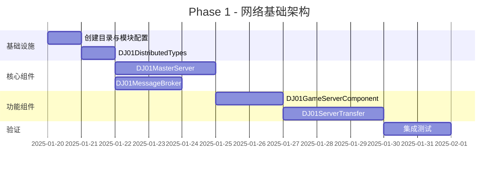
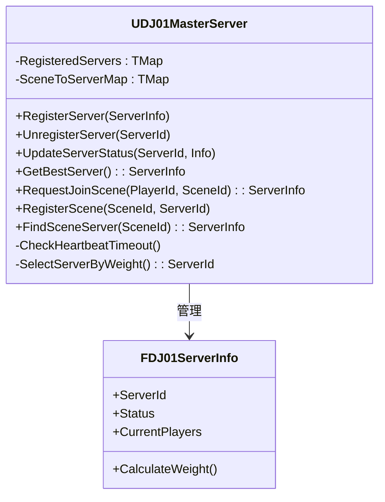
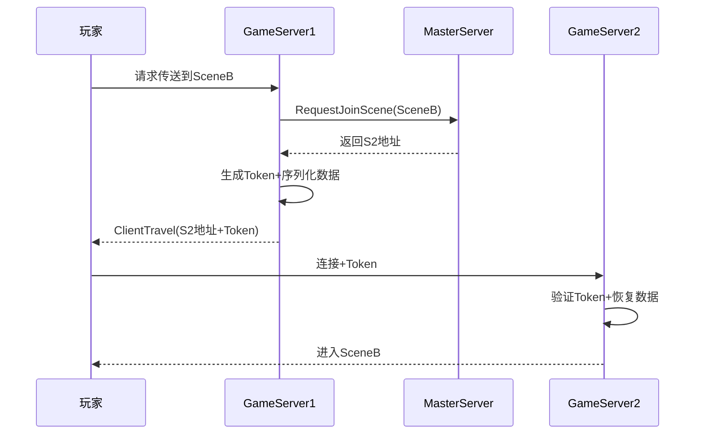

# Phase 1: 分布式网络基础架构

> **目标**：实现逆水寒式分布式架构的UE5版本  
> **预计时间**：2周  
> **前置条件**：无

---

## 📋 本阶段任务总览



---

## 📁 Task 1.1: 项目结构准备

### 目标
创建网络模块的目录结构，配置编译依赖。

### 步骤

#### 1. 创建目录结构

在项目根目录下创建以下目录：

```
Source/DJ01/Network/
└── Distributed/
    ├── Public/
    │   ├── DJ01DistributedTypes.h
    │   ├── DJ01MasterServer.h
    │   ├── DJ01MessageBroker.h
    │   ├── DJ01GameServerComponent.h
    │   └── DJ01ServerTransfer.h
    └── Private/
        ├── DJ01MasterServer.cpp
        ├── DJ01MessageBroker.cpp
        ├── DJ01GameServerComponent.cpp
        └── DJ01ServerTransfer.cpp
```

#### 2. 更新 Build.cs

编辑 `Source/DJ01/DJ01.Build.cs`，添加必要的模块依赖：

```csharp
// 添加到 PublicDependencyModuleNames
PublicDependencyModuleNames.AddRange(new string[] {
    "Json",
    "JsonUtilities",
    "HTTP",
    "Sockets",
    "Networking"
});

// 添加头文件路径
PublicIncludePaths.Add(Path.Combine(ModuleDirectory, "Network/Distributed/Public"));
PrivateIncludePaths.Add(Path.Combine(ModuleDirectory, "Network/Distributed/Private"));
```

### 验收清单
- [ ] 目录结构创建完成
- [ ] Build.cs 更新完成
- [ ] 项目可编译

---

## 📝 Task 1.2: DJ01DistributedTypes

### 目标
定义分布式系统的核心数据结构。

### 文件位置
`Source/DJ01/Network/Distributed/Public/DJ01DistributedTypes.h`

### 完整代码

```cpp
#pragma once

#include "CoreMinimal.h"
#include "DJ01DistributedTypes.generated.h"

/**
 * 服务器类型（对应逆水寒的进程类型）
 */
UENUM(BlueprintType)
enum class EDJ01ServerType : uint8
{
    Master = 0       UMETA(DisplayName = "Master"),
    GameServer = 1   UMETA(DisplayName = "GameServer"),
    LoginServer = 2  UMETA(DisplayName = "LoginServer"),
    ChatServer = 3   UMETA(DisplayName = "ChatServer"),
};

/**
 * 服务器状态
 */
UENUM(BlueprintType)
enum class EDJ01ServerStatus : uint8
{
    Starting = 0,
    Running = 1,
    Busy = 2,
    Stopping = 3,
    Offline = 4,
};

/**
 * 服务器信息结构体
 */
USTRUCT(BlueprintType)
struct DJ01_API FDJ01ServerInfo
{
    GENERATED_BODY()
    
    UPROPERTY(BlueprintReadWrite)
    FString ServerId;
    
    UPROPERTY(BlueprintReadWrite)
    EDJ01ServerType ServerType = EDJ01ServerType::GameServer;
    
    UPROPERTY(BlueprintReadWrite)
    EDJ01ServerStatus Status = EDJ01ServerStatus::Offline;
    
    UPROPERTY(BlueprintReadWrite)
    FString Address = TEXT("127.0.0.1");
    
    UPROPERTY(BlueprintReadWrite)
    int32 Port = 7777;
    
    UPROPERTY(BlueprintReadWrite)
    int32 CurrentPlayers = 0;
    
    UPROPERTY(BlueprintReadWrite)
    int32 MaxPlayers = 100;
    
    UPROPERTY(BlueprintReadWrite)
    float CPUUsage = 0.0f;
    
    UPROPERTY(BlueprintReadWrite)
    float MemoryUsage = 0.0f;
    
    UPROPERTY()
    double LastHeartbeatTime = 0.0;
    
    /** 
     * 计算负载权重（逆水寒算法）
     * weight = 100 * (2 - CPU - PlayerRatio)
     */
    float CalculateWeight() const
    {
        float PlayerRatio = MaxPlayers > 0 ? 
            static_cast<float>(CurrentPlayers) / MaxPlayers : 1.0f;
        return FMath::Max(100.0f * (2.0f - CPUUsage - PlayerRatio), 1.0f);
    }
    
    bool IsAvailable() const
    {
        return Status == EDJ01ServerStatus::Running && CurrentPlayers < MaxPlayers;
    }
    
    FString GetFullAddress() const
    {
        return FString::Printf(TEXT("%s:%d"), *Address, Port);
    }
};

/**
 * 跨服消息结构体
 */
USTRUCT(BlueprintType)
struct DJ01_API FDJ01CrossServerMessage
{
    GENERATED_BODY()
    
    UPROPERTY()
    FString MessageId;
    
    UPROPERTY()
    FString SourceServerId;
    
    UPROPERTY()
    FString TargetServerId;  // 空=广播
    
    UPROPERTY()
    FString MessageType;
    
    UPROPERTY()
    FString Payload;  // JSON
    
    UPROPERTY()
    double Timestamp = 0.0;
    
    bool IsBroadcast() const { return TargetServerId.IsEmpty(); }
};

/**
 * 传送Token结构体
 */
USTRUCT(BlueprintType)
struct DJ01_API FDJ01TransferToken
{
    GENERATED_BODY()
    
    UPROPERTY()
    FString TokenId;
    
    UPROPERTY()
    FString PlayerId;
    
    UPROPERTY()
    FString SourceServerId;
    
    UPROPERTY()
    FString TargetServerId;
    
    UPROPERTY()
    FString TargetSceneId;
    
    UPROPERTY()
    double ExpirationTime = 0.0;
    
    UPROPERTY()
    FString PlayerDataJson;
    
    bool IsExpired() const
    {
        return FPlatformTime::Seconds() > ExpirationTime;
    }
};

/**
 * 消息类型常量
 */
namespace DJ01MessageTypes
{
    const FString ServerRegister = TEXT("Server.Register");
    const FString ServerHeartbeat = TEXT("Server.Heartbeat");
    const FString TransferRequest = TEXT("Transfer.Request");
    const FString TransferComplete = TEXT("Transfer.Complete");
}
```

### 核心设计说明

| 结构体 | 用途 | 关键字段 |
|--------|------|----------|
| `FDJ01ServerInfo` | 服务器元数据 | ServerId, Status, CalculateWeight() |
| `FDJ01CrossServerMessage` | 跨服RPC载体 | MessageType, Payload(JSON) |
| `FDJ01TransferToken` | 跨服传送凭证 | TokenId, ExpirationTime |

### 验收清单
- [ ] 文件创建完成
- [ ] 编译无错误
- [ ] 所有UPROPERTY标记正确

---

## 🎛️ Task 1.3: DJ01MasterServer

### 目标
实现全局协调服务器，负责：
- 服务注册/发现
- 玩家路由（加权算法）
- 场景-服务器映射
- 心跳超时检测

### 文件位置
- `Source/DJ01/Network/Distributed/Public/DJ01MasterServer.h`
- `Source/DJ01/Network/Distributed/Private/DJ01MasterServer.cpp`

### 架构图



### 头文件

```cpp
#pragma once

#include "CoreMinimal.h"
#include "DJ01DistributedTypes.h"
#include "Subsystems/GameInstanceSubsystem.h"
#include "DJ01MasterServer.generated.h"

DECLARE_DYNAMIC_MULTICAST_DELEGATE_OneParam(FOnDJ01ServerRegistered, const FDJ01ServerInfo&, ServerInfo);
DECLARE_DYNAMIC_MULTICAST_DELEGATE_OneParam(FOnDJ01ServerUnregistered, const FString&, ServerId);

/**
 * 全局协调服务器（类似逆水寒Master进程）
 * 
 * 职责：
 * - 管理GameServer集群
 * - 智能路由玩家
 * - 维护场景映射
 */
UCLASS()
class DJ01_API UDJ01MasterServer : public UGameInstanceSubsystem
{
    GENERATED_BODY()
    
public:
    virtual void Initialize(FSubsystemCollectionBase& Collection) override;
    virtual void Deinitialize() override;
    
    //=== 服务注册 ===
    
    UFUNCTION(BlueprintCallable, Category = "DJ01|Master")
    void RegisterServer(const FDJ01ServerInfo& ServerInfo);
    
    UFUNCTION(BlueprintCallable, Category = "DJ01|Master")
    void UnregisterServer(const FString& ServerId);
    
    UFUNCTION(BlueprintCallable, Category = "DJ01|Master")
    void UpdateServerStatus(const FString& ServerId, const FDJ01ServerInfo& UpdatedInfo);
    
    UFUNCTION(BlueprintPure, Category = "DJ01|Master")
    TArray<FDJ01ServerInfo> GetAllServers() const;
    
    //=== 玩家路由 ===
    
    UFUNCTION(BlueprintCallable, Category = "DJ01|Master")
    bool GetBestServer(FDJ01ServerInfo& OutServerInfo, 
        const TArray<FString>& ExcludeServerIds = TArray<FString>());
    
    UFUNCTION(BlueprintCallable, Category = "DJ01|Master")
    bool RequestJoinScene(const FString& PlayerId, const FString& SceneId, 
        FDJ01ServerInfo& OutServerInfo);
    
    //=== 场景管理 ===
    
    UFUNCTION(BlueprintCallable, Category = "DJ01|Master")
    void RegisterScene(const FString& SceneId, const FString& ServerId);
    
    UFUNCTION(BlueprintCallable, Category = "DJ01|Master")
    bool FindSceneServer(const FString& SceneId, FDJ01ServerInfo& OutServerInfo) const;
    
    //=== 统计 ===
    
    UFUNCTION(BlueprintPure, Category = "DJ01|Master")
    int32 GetTotalPlayerCount() const;
    
    UFUNCTION(BlueprintPure, Category = "DJ01|Master")
    int32 GetOnlineServerCount() const;
    
    //=== 事件 ===
    
    UPROPERTY(BlueprintAssignable)
    FOnDJ01ServerRegistered OnServerRegistered;
    
    UPROPERTY(BlueprintAssignable)
    FOnDJ01ServerUnregistered OnServerUnregistered;
    
protected:
    UPROPERTY()
    TMap<FString, FDJ01ServerInfo> RegisteredServers;
    
    UPROPERTY()
    TMap<FString, FString> SceneToServerMap;
    
    FTimerHandle HeartbeatCheckHandle;
    
    float HeartbeatTimeoutSeconds = 30.0f;
    float HeartbeatCheckInterval = 5.0f;
    
    void CheckHeartbeatTimeout();
    FString SelectServerByWeight(const TArray<FString>& AvailableServers) const;
};
```

### 实现文件

```cpp
#include "DJ01MasterServer.h"
#include "TimerManager.h"

DEFINE_LOG_CATEGORY_STATIC(LogDJ01Master, Log, All);

void UDJ01MasterServer::Initialize(FSubsystemCollectionBase& Collection)
{
    Super::Initialize(Collection);
    
    // 启动心跳检查
    if (UWorld* World = GetWorld())
    {
        World->GetTimerManager().SetTimer(
            HeartbeatCheckHandle,
            this,
            &UDJ01MasterServer::CheckHeartbeatTimeout,
            HeartbeatCheckInterval,
            true);
    }
    
    UE_LOG(LogDJ01Master, Log, TEXT("MasterServer Initialized"));
}

void UDJ01MasterServer::Deinitialize()
{
    if (UWorld* World = GetWorld())
    {
        World->GetTimerManager().ClearTimer(HeartbeatCheckHandle);
    }
    Super::Deinitialize();
}

void UDJ01MasterServer::RegisterServer(const FDJ01ServerInfo& ServerInfo)
{
    FDJ01ServerInfo Info = ServerInfo;
    Info.LastHeartbeatTime = FPlatformTime::Seconds();
    
    RegisteredServers.Add(ServerInfo.ServerId, Info);
    OnServerRegistered.Broadcast(Info);
    
    UE_LOG(LogDJ01Master, Log, TEXT("Server Registered: %s (%s)"), 
        *ServerInfo.ServerId, *ServerInfo.GetFullAddress());
}

void UDJ01MasterServer::UnregisterServer(const FString& ServerId)
{
    // 清理场景映射
    TArray<FString> ScenesToRemove;
    for (const auto& Pair : SceneToServerMap)
    {
        if (Pair.Value == ServerId)
        {
            ScenesToRemove.Add(Pair.Key);
        }
    }
    for (const FString& SceneId : ScenesToRemove)
    {
        SceneToServerMap.Remove(SceneId);
    }
    
    RegisteredServers.Remove(ServerId);
    OnServerUnregistered.Broadcast(ServerId);
    
    UE_LOG(LogDJ01Master, Log, TEXT("Server Unregistered: %s"), *ServerId);
}

void UDJ01MasterServer::UpdateServerStatus(const FString& ServerId, 
    const FDJ01ServerInfo& UpdatedInfo)
{
    if (FDJ01ServerInfo* Existing = RegisteredServers.Find(ServerId))
    {
        Existing->Status = UpdatedInfo.Status;
        Existing->CurrentPlayers = UpdatedInfo.CurrentPlayers;
        Existing->CPUUsage = UpdatedInfo.CPUUsage;
        Existing->MemoryUsage = UpdatedInfo.MemoryUsage;
        Existing->LastHeartbeatTime = FPlatformTime::Seconds();
    }
}

TArray<FDJ01ServerInfo> UDJ01MasterServer::GetAllServers() const
{
    TArray<FDJ01ServerInfo> Result;
    RegisteredServers.GenerateValueArray(Result);
    return Result;
}

bool UDJ01MasterServer::GetBestServer(FDJ01ServerInfo& OutServerInfo, 
    const TArray<FString>& ExcludeServerIds)
{
    // 收集可用服务器
    TArray<FString> AvailableServers;
    for (const auto& Pair : RegisteredServers)
    {
        const FDJ01ServerInfo& Info = Pair.Value;
        if (Info.ServerType != EDJ01ServerType::GameServer) continue;
        if (!Info.IsAvailable()) continue;
        if (ExcludeServerIds.Contains(Info.ServerId)) continue;
        AvailableServers.Add(Info.ServerId);
    }
    
    if (AvailableServers.Num() == 0)
    {
        return false;
    }
    
    // 加权选择
    FString SelectedId = SelectServerByWeight(AvailableServers);
    if (const FDJ01ServerInfo* Info = RegisteredServers.Find(SelectedId))
    {
        OutServerInfo = *Info;
        return true;
    }
    
    return false;
}

FString UDJ01MasterServer::SelectServerByWeight(
    const TArray<FString>& AvailableServers) const
{
    if (AvailableServers.Num() == 1)
    {
        return AvailableServers[0];
    }
    
    // 计算总权重
    float TotalWeight = 0.0f;
    TArray<TPair<FString, float>> Weights;
    
    for (const FString& ServerId : AvailableServers)
    {
        if (const FDJ01ServerInfo* Info = RegisteredServers.Find(ServerId))
        {
            float W = Info->CalculateWeight();
            Weights.Add({ServerId, W});
            TotalWeight += W;
        }
    }
    
    // 加权随机
    float Random = FMath::FRand() * TotalWeight;
    float Sum = 0.0f;
    for (const auto& Pair : Weights)
    {
        Sum += Pair.Value;
        if (Random <= Sum)
        {
            return Pair.Key;
        }
    }
    
    return AvailableServers[0];
}

bool UDJ01MasterServer::RequestJoinScene(const FString& PlayerId, 
    const FString& SceneId, FDJ01ServerInfo& OutServerInfo)
{
    // 检查场景是否已存在
    if (const FString* ExistingId = SceneToServerMap.Find(SceneId))
    {
        if (const FDJ01ServerInfo* Info = RegisteredServers.Find(*ExistingId))
        {
            if (Info->IsAvailable())
            {
                OutServerInfo = *Info;
                return true;
            }
        }
    }
    
    // 选择最优服务器
    return GetBestServer(OutServerInfo);
}

void UDJ01MasterServer::RegisterScene(const FString& SceneId, const FString& ServerId)
{
    SceneToServerMap.Add(SceneId, ServerId);
    UE_LOG(LogDJ01Master, Log, TEXT("Scene %s -> Server %s"), *SceneId, *ServerId);
}

bool UDJ01MasterServer::FindSceneServer(const FString& SceneId, 
    FDJ01ServerInfo& OutServerInfo) const
{
    if (const FString* ServerId = SceneToServerMap.Find(SceneId))
    {
        if (const FDJ01ServerInfo* Info = RegisteredServers.Find(*ServerId))
        {
            OutServerInfo = *Info;
            return true;
        }
    }
    return false;
}

int32 UDJ01MasterServer::GetTotalPlayerCount() const
{
    int32 Total = 0;
    for (const auto& Pair : RegisteredServers)
    {
        Total += Pair.Value.CurrentPlayers;
    }
    return Total;
}

int32 UDJ01MasterServer::GetOnlineServerCount() const
{
    int32 Count = 0;
    for (const auto& Pair : RegisteredServers)
    {
        if (Pair.Value.Status == EDJ01ServerStatus::Running ||
            Pair.Value.Status == EDJ01ServerStatus::Busy)
        {
            Count++;
        }
    }
    return Count;
}

void UDJ01MasterServer::CheckHeartbeatTimeout()
{
    const double CurrentTime = FPlatformTime::Seconds();
    TArray<FString> TimedOut;
    
    for (const auto& Pair : RegisteredServers)
    {
        if (CurrentTime - Pair.Value.LastHeartbeatTime > HeartbeatTimeoutSeconds)
        {
            TimedOut.Add(Pair.Key);
        }
    }
    
    for (const FString& ServerId : TimedOut)
    {
        UE_LOG(LogDJ01Master, Warning, TEXT("Server %s heartbeat timeout"), *ServerId);
        UnregisterServer(ServerId);
    }
}
```

### API使用示例

```cpp
// 获取Master服务器
UDJ01MasterServer* Master = GetGameInstance()->GetSubsystem<UDJ01MasterServer>();

// 注册服务器
FDJ01ServerInfo Info;
Info.ServerId = FGuid::NewGuid().ToString();
Info.ServerType = EDJ01ServerType::GameServer;
Info.Status = EDJ01ServerStatus::Running;
Info.Address = TEXT("192.168.1.100");
Info.Port = 7777;
Master->RegisterServer(Info);

// 获取最优服务器
FDJ01ServerInfo BestServer;
if (Master->GetBestServer(BestServer))
{
    UE_LOG(LogTemp, Log, TEXT("Best: %s"), *BestServer.GetFullAddress());
}
```

### 验收清单
- [ ] 编译通过
- [ ] RegisterServer/UnregisterServer 正常工作
- [ ] GetBestServer 返回正确的加权结果
- [ ] 心跳超时检测正常
- [ ] 事件广播正常

---

## 📡 Task 1.4: DJ01MessageBroker

### 目标
实现跨服务器消息总线（类似逆水寒InnerSwitcher）。

### 文件位置
- `Source/DJ01/Network/Distributed/Public/DJ01MessageBroker.h`
- `Source/DJ01/Network/Distributed/Private/DJ01MessageBroker.cpp`

### 头文件

```cpp
#pragma once

#include "CoreMinimal.h"
#include "DJ01DistributedTypes.h"
#include "Subsystems/GameInstanceSubsystem.h"
#include "DJ01MessageBroker.generated.h"

DECLARE_DYNAMIC_MULTICAST_DELEGATE_OneParam(FOnDJ01MessageReceived, 
    const FDJ01CrossServerMessage&, Message);

/**
 * 消息总线 - 跨服务器通信
 */
UCLASS()
class DJ01_API UDJ01MessageBroker : public UGameInstanceSubsystem
{
    GENERATED_BODY()
    
public:
    virtual void Initialize(FSubsystemCollectionBase& Collection) override;
    virtual void Tick(float DeltaTime) override;
    virtual bool IsTickable() const override { return true; }
    virtual TStatId GetStatId() const override { RETURN_QUICK_DECLARE_CYCLE_STAT(UDJ01MessageBroker, STATGROUP_Tickables); }
    
    /** 获取本服务器ID */
    UFUNCTION(BlueprintPure, Category = "DJ01|MessageBroker")
    FString GetLocalServerId() const { return LocalServerId; }
    
    /** 设置本服务器ID */
    UFUNCTION(BlueprintCallable, Category = "DJ01|MessageBroker")
    void SetLocalServerId(const FString& InServerId) { LocalServerId = InServerId; }
    
    /** 发送消息到指定服务器 */
    UFUNCTION(BlueprintCallable, Category = "DJ01|MessageBroker")
    void SendMessage(const FString& TargetServerId, const FString& MessageType, 
        const FString& Payload);
    
    /** 广播消息到所有服务器 */
    UFUNCTION(BlueprintCallable, Category = "DJ01|MessageBroker")
    void BroadcastMessage(const FString& MessageType, const FString& Payload);
    
    /** 消息接收事件 */
    UPROPERTY(BlueprintAssignable)
    FOnDJ01MessageReceived OnMessageReceived;
    
    /** 注册消息处理器 (C++侧) */
    void RegisterHandler(const FString& MessageType, 
        TFunction<void(const FDJ01CrossServerMessage&)> Handler);
    
    /** 模拟接收消息（用于测试或同进程通信） */
    void SimulateReceiveMessage(const FDJ01CrossServerMessage& Message);
    
protected:
    FString LocalServerId;
    
    TQueue<FDJ01CrossServerMessage> IncomingMessages;
    TMap<FString, TFunction<void(const FDJ01CrossServerMessage&)>> Handlers;
    
    void ProcessMessages();
};
```

### 实现文件

```cpp
#include "DJ01MessageBroker.h"

DEFINE_LOG_CATEGORY_STATIC(LogDJ01Broker, Log, All);

void UDJ01MessageBroker::Initialize(FSubsystemCollectionBase& Collection)
{
    Super::Initialize(Collection);
    LocalServerId = FGuid::NewGuid().ToString();
    UE_LOG(LogDJ01Broker, Log, TEXT("MessageBroker Initialized: %s"), *LocalServerId);
}

void UDJ01MessageBroker::Tick(float DeltaTime)
{
    ProcessMessages();
}

void UDJ01MessageBroker::SendMessage(const FString& TargetServerId, 
    const FString& MessageType, const FString& Payload)
{
    FDJ01CrossServerMessage Msg;
    Msg.MessageId = FGuid::NewGuid().ToString();
    Msg.SourceServerId = LocalServerId;
    Msg.TargetServerId = TargetServerId;
    Msg.MessageType = MessageType;
    Msg.Payload = Payload;
    Msg.Timestamp = FPlatformTime::Seconds();
    
    // 实际项目中这里应该通过网络发送
    // 当前实现：同进程内直接入队
    IncomingMessages.Enqueue(Msg);
    
    UE_LOG(LogDJ01Broker, Verbose, TEXT("Message Sent: %s -> %s [%s]"), 
        *LocalServerId, *TargetServerId, *MessageType);
}

void UDJ01MessageBroker::BroadcastMessage(const FString& MessageType, 
    const FString& Payload)
{
    SendMessage(TEXT(""), MessageType, Payload);
}

void UDJ01MessageBroker::RegisterHandler(const FString& MessageType, 
    TFunction<void(const FDJ01CrossServerMessage&)> Handler)
{
    Handlers.Add(MessageType, Handler);
}

void UDJ01MessageBroker::SimulateReceiveMessage(const FDJ01CrossServerMessage& Message)
{
    IncomingMessages.Enqueue(Message);
}

void UDJ01MessageBroker::ProcessMessages()
{
    FDJ01CrossServerMessage Msg;
    while (IncomingMessages.Dequeue(Msg))
    {
        // 检查目标
        if (!Msg.IsBroadcast() && Msg.TargetServerId != LocalServerId)
        {
            continue;
        }
        
        // 广播蓝图事件
        OnMessageReceived.Broadcast(Msg);
        
        // 调用C++处理器
        if (auto* Handler = Handlers.Find(Msg.MessageType))
        {
            (*Handler)(Msg);
        }
    }
}
```

### 验收清单
- [ ] 编译通过
- [ ] SendMessage/BroadcastMessage 正常入队
- [ ] 消息处理正常分发
- [ ] 事件广播正常

---

## 🖥️ Task 1.5: DJ01GameServerComponent

### 目标
实现GameServer自动注册组件，附加到GameMode上。

### 文件位置
- `Source/DJ01/Network/Distributed/Public/DJ01GameServerComponent.h`
- `Source/DJ01/Network/Distributed/Private/DJ01GameServerComponent.cpp`

### 头文件

```cpp
#pragma once

#include "Components/ActorComponent.h"
#include "DJ01DistributedTypes.h"
#include "DJ01GameServerComponent.generated.h"

/**
 * GameServer组件 - 附加到GameMode
 * 负责向Master注册和发送心跳
 */
UCLASS(ClassGroup=(DJ01), meta=(BlueprintSpawnableComponent))
class DJ01_API UDJ01GameServerComponent : public UActorComponent
{
    GENERATED_BODY()
    
public:
    UDJ01GameServerComponent();
    
    virtual void BeginPlay() override;
    virtual void EndPlay(const EEndPlayReason::Type EndPlayReason) override;
    virtual void TickComponent(float DeltaTime, ELevelTick TickType, 
        FActorComponentTickFunction* ThisTickFunction) override;
    
    UFUNCTION(BlueprintPure, Category = "DJ01|GameServer")
    FDJ01ServerInfo GetServerInfo() const { return CurrentInfo; }
    
    UFUNCTION(BlueprintPure, Category = "DJ01|GameServer")
    FString GetServerId() const { return CurrentInfo.ServerId; }
    
protected:
    UPROPERTY(EditDefaultsOnly, Category = "Config")
    int32 MaxPlayers = 100;
    
    UPROPERTY(EditDefaultsOnly, Category = "Config")
    float HeartbeatInterval = 5.0f;
    
    FDJ01ServerInfo CurrentInfo;
    float TimeSinceLastHeartbeat = 0.0f;
    
    void RegisterWithMaster();
    void SendHeartbeat();
    void UpdateMetrics();
};
```

### 实现文件

```cpp
#include "DJ01GameServerComponent.h"
#include "DJ01MasterServer.h"
#include "GameFramework/GameStateBase.h"
#include "Kismet/GameplayStatics.h"

UDJ01GameServerComponent::UDJ01GameServerComponent()
{
    PrimaryComponentTick.bCanEverTick = true;
}

void UDJ01GameServerComponent::BeginPlay()
{
    Super::BeginPlay();
    
    // 仅服务器执行
    if (!GetOwner()->HasAuthority()) return;
    
    // 初始化信息
    CurrentInfo.ServerId = FGuid::NewGuid().ToString();
    CurrentInfo.ServerType = EDJ01ServerType::GameServer;
    CurrentInfo.Status = EDJ01ServerStatus::Starting;
    CurrentInfo.MaxPlayers = MaxPlayers;
    CurrentInfo.Address = TEXT("127.0.0.1");
    CurrentInfo.Port = GetWorld()->URL.Port;
    
    RegisterWithMaster();
}

void UDJ01GameServerComponent::EndPlay(const EEndPlayReason::Type EndPlayReason)
{
    if (UGameInstance* GI = Cast<UGameInstance>(UGameplayStatics::GetGameInstance(this)))
    {
        if (UDJ01MasterServer* Master = GI->GetSubsystem<UDJ01MasterServer>())
        {
            Master->UnregisterServer(CurrentInfo.ServerId);
        }
    }
    Super::EndPlay(EndPlayReason);
}

void UDJ01GameServerComponent::TickComponent(float DeltaTime, ELevelTick TickType,
    FActorComponentTickFunction* ThisTickFunction)
{
    Super::TickComponent(DeltaTime, TickType, ThisTickFunction);
    
    if (!GetOwner()->HasAuthority()) return;
    
    UpdateMetrics();
    
    TimeSinceLastHeartbeat += DeltaTime;
    if (TimeSinceLastHeartbeat >= HeartbeatInterval)
    {
        SendHeartbeat();
        TimeSinceLastHeartbeat = 0.0f;
    }
}

void UDJ01GameServerComponent::RegisterWithMaster()
{
    if (UGameInstance* GI = Cast<UGameInstance>(UGameplayStatics::GetGameInstance(this)))
    {
        if (UDJ01MasterServer* Master = GI->GetSubsystem<UDJ01MasterServer>())
        {
            CurrentInfo.Status = EDJ01ServerStatus::Running;
            Master->RegisterServer(CurrentInfo);
        }
    }
}

void UDJ01GameServerComponent::SendHeartbeat()
{
    if (UGameInstance* GI = Cast<UGameInstance>(UGameplayStatics::GetGameInstance(this)))
    {
        if (UDJ01MasterServer* Master = GI->GetSubsystem<UDJ01MasterServer>())
        {
            Master->UpdateServerStatus(CurrentInfo.ServerId, CurrentInfo);
        }
    }
}

void UDJ01GameServerComponent::UpdateMetrics()
{
    // 更新玩家数
    if (AGameStateBase* GS = GetWorld()->GetGameState())
    {
        CurrentInfo.CurrentPlayers = GS->PlayerArray.Num();
    }
    
    // 更新CPU（简化：用帧时间估算）
    float Delta = GetWorld()->GetDeltaSeconds();
    CurrentInfo.CPUUsage = FMath::Clamp(Delta / (1.0f/60.0f), 0.0f, 1.0f);
    
    // 更新状态
    if (CurrentInfo.CurrentPlayers >= CurrentInfo.MaxPlayers * 0.9f ||
        CurrentInfo.CPUUsage > 0.8f)
    {
        CurrentInfo.Status = EDJ01ServerStatus::Busy;
    }
    else
    {
        CurrentInfo.Status = EDJ01ServerStatus::Running;
    }
}
```

### 使用方法
在GameMode蓝图中添加此组件，或在C++ GameMode构造函数中：
```cpp
ADJ01GameMode::ADJ01GameMode()
{
    GameServerComponent = CreateDefaultSubobject<UDJ01GameServerComponent>(TEXT("GameServerComponent"));
}
```

### 验收清单
- [ ] 编译通过
- [ ] BeginPlay时自动注册
- [ ] EndPlay时自动注销
- [ ] 心跳正常发送
- [ ] 指标正常更新

---

## 🚀 Task 1.6: DJ01ServerTransfer

### 目标
实现跨服传送功能。

### 文件位置
- `Source/DJ01/Network/Distributed/Public/DJ01ServerTransfer.h`
- `Source/DJ01/Network/Distributed/Private/DJ01ServerTransfer.cpp`

### 传送流程



### 头文件

```cpp
#pragma once

#include "CoreMinimal.h"
#include "DJ01DistributedTypes.h"
#include "Subsystems/GameInstanceSubsystem.h"
#include "DJ01ServerTransfer.generated.h"

/**
 * 跨服传送管理器
 */
UCLASS()
class DJ01_API UDJ01ServerTransfer : public UGameInstanceSubsystem
{
    GENERATED_BODY()
    
public:
    /** 发起传送 */
    UFUNCTION(BlueprintCallable, Category = "DJ01|Transfer")
    bool InitiateTransfer(APlayerController* Player, const FString& TargetSceneId);
    
    /** 验证Token */
    UFUNCTION(BlueprintCallable, Category = "DJ01|Transfer")
    bool ValidateToken(const FString& TokenId, FDJ01TransferToken& OutToken);
    
    /** 完成传送（目标服务器调用） */
    UFUNCTION(BlueprintCallable, Category = "DJ01|Transfer")
    bool CompleteTransfer(const FString& TokenId, APlayerController* Player);
    
protected:
    TMap<FString, FDJ01TransferToken> PendingTokens;
    
    FString SerializePlayerData(APlayerController* Player);
    bool DeserializePlayerData(APlayerController* Player, const FString& DataJson);
};
```

### 实现文件

```cpp
#include "DJ01ServerTransfer.h"
#include "DJ01MasterServer.h"
#include "GameFramework/PlayerState.h"
#include "Kismet/GameplayStatics.h"
#include "JsonObjectConverter.h"

bool UDJ01ServerTransfer::InitiateTransfer(APlayerController* Player, 
    const FString& TargetSceneId)
{
    if (!Player || !Player->PlayerState) return false;
    
    // 1. 请求目标服务器
    UDJ01MasterServer* Master = GetGameInstance()->GetSubsystem<UDJ01MasterServer>();
    if (!Master) return false;
    
    FDJ01ServerInfo TargetServer;
    if (!Master->RequestJoinScene(Player->PlayerState->GetPlayerName(), 
        TargetSceneId, TargetServer))
    {
        return false;
    }
    
    // 2. 创建Token
    FDJ01TransferToken Token;
    Token.TokenId = FGuid::NewGuid().ToString();
    Token.PlayerId = Player->PlayerState->GetPlayerName();
    Token.TargetServerId = TargetServer.ServerId;
    Token.TargetSceneId = TargetSceneId;
    Token.ExpirationTime = FPlatformTime::Seconds() + 30.0;
    Token.PlayerDataJson = SerializePlayerData(Player);
    
    PendingTokens.Add(Token.TokenId, Token);
    
    // 3. 传送
    FString URL = FString::Printf(TEXT("%s?Token=%s"), 
        *TargetServer.GetFullAddress(), *Token.TokenId);
    Player->ClientTravel(URL, ETravelType::TRAVEL_Absolute);
    
    return true;
}

bool UDJ01ServerTransfer::ValidateToken(const FString& TokenId, 
    FDJ01TransferToken& OutToken)
{
    if (FDJ01TransferToken* Token = PendingTokens.Find(TokenId))
    {
        if (!Token->IsExpired())
        {
            OutToken = *Token;
            return true;
        }
        PendingTokens.Remove(TokenId);
    }
    return false;
}

bool UDJ01ServerTransfer::CompleteTransfer(const FString& TokenId, 
    APlayerController* Player)
{
    FDJ01TransferToken Token;
    if (!ValidateToken(TokenId, Token)) return false;
    
    if (!DeserializePlayerData(Player, Token.PlayerDataJson)) return false;
    
    PendingTokens.Remove(TokenId);
    return true;
}

FString UDJ01ServerTransfer::SerializePlayerData(APlayerController* Player)
{
    TSharedPtr<FJsonObject> Json = MakeShared<FJsonObject>();
    
    if (Player->PlayerState)
    {
        Json->SetStringField(TEXT("Name"), Player->PlayerState->GetPlayerName());
        Json->SetNumberField(TEXT("Score"), Player->PlayerState->GetScore());
    }
    
    // TODO: 序列化更多数据（背包、属性、Buff等）
    
    FString Output;
    TSharedRef<TJsonWriter<>> Writer = TJsonWriterFactory<>::Create(&Output);
    FJsonSerializer::Serialize(Json.ToSharedRef(), Writer);
    return Output;
}

bool UDJ01ServerTransfer::DeserializePlayerData(APlayerController* Player, 
    const FString& DataJson)
{
    TSharedPtr<FJsonObject> Json;
    TSharedRef<TJsonReader<>> Reader = TJsonReaderFactory<>::Create(DataJson);
    
    if (!FJsonSerializer::Deserialize(Reader, Json)) return false;
    
    // TODO: 恢复更多数据
    
    return true;
}
```

### 验收清单
- [ ] 编译通过
- [ ] InitiateTransfer 正确生成Token并传送
- [ ] Token验证和过期检测正常
- [ ] 数据序列化/反序列化正常

---

## ✅ Phase 1 完成检查清单

| 组件 | 状态 | 测试 |
|------|------|------|
| DJ01DistributedTypes.h | ⬜ | 编译通过 |
| DJ01MasterServer | ⬜ | 服务注册、路由、心跳 |
| DJ01MessageBroker | ⬜ | 消息发送/接收 |
| DJ01GameServerComponent | ⬜ | 自动注册、心跳 |
| DJ01ServerTransfer | ⬜ | 传送流程 |

### 集成测试步骤

1. **启动测试**
   ```
   - 启动编辑器
   - PIE模式运行2个DS实例
   - 检查日志是否显示服务器注册
   ```

2. **路由测试**
   ```cpp
   UDJ01MasterServer* Master = ...;
   FDJ01ServerInfo Best;
   Master->GetBestServer(Best);
   // 验证返回负载最低的服务器
   ```

3. **传送测试**
   ```cpp
   UDJ01ServerTransfer* Transfer = ...;
   Transfer->InitiateTransfer(PlayerController, TEXT("SceneB"));
   // 验证玩家能切换到另一个DS
   ```

---

## 📌 下一阶段预告

完成Phase 1后，进入 **[02_Phase2_CombatSync.md](./02_Phase2_CombatSync.md)**：
- GAS网络同步扩展
- 技能预测与回滚
- 服务端权威伤害计算
- 属性复制配置