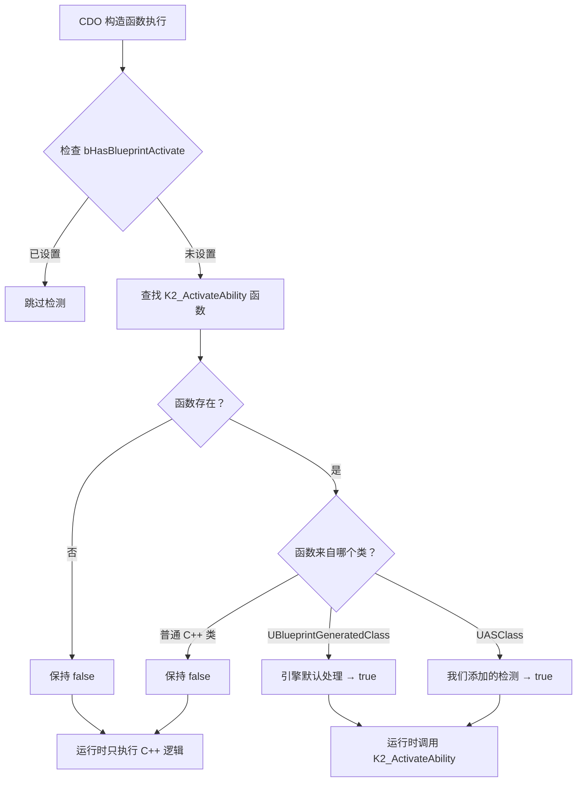
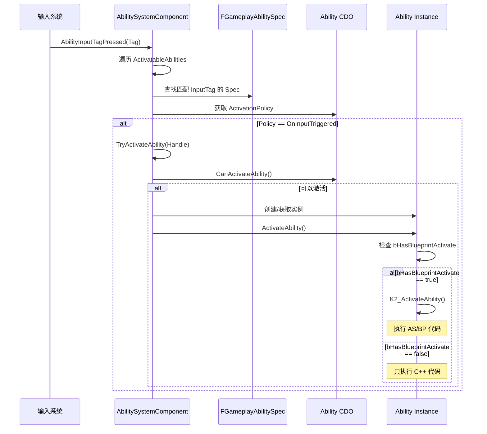
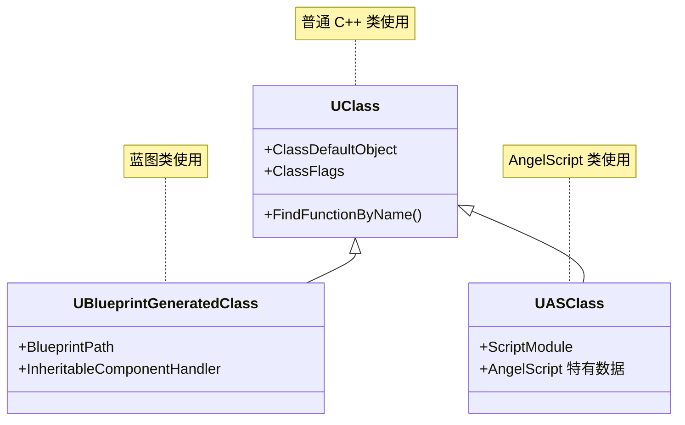

# AngelScript 与 GAS 集成指南

> 本文档记录了 AngelScript 能力类无法正确激活的问题排查过程，以及解决方案的技术原理。

## 目录

1. [问题描述](#问题描述)
2. [根本原因分析](#根本原因分析)
3. [解决方案](#解决方案)
4. [核心概念详解](#核心概念详解)
   - [CDO（Class Default Object）](#cdo-class-default-object)
   - [GAS 能力激活流程](#gas-能力激活流程)
   - [AngelScript 函数映射机制](#angelscript-函数映射机制)
5. [代码修改清单](#代码修改清单)
6. [扩展知识](#扩展知识)

---

## 问题描述

### 现象

使用 AngelScript 编写的 GameplayAbility 类（如 `UGA_CastStone`）：

- ✅ 能够正确创建 CDO（`Default__GA_CastStone`）
- ✅ 能够被 `AbilitySet` 正确授予（Grant）
- ✅ `TryActivateAbility` 返回 `SUCCESS`
- ❌ **但是 `ActivateAbility` 中的代码从未执行**

### 对比现象

如果用蓝图包装同一个 AngelScript 类（创建 BP 子类），则能正确工作。

```
GA_CastStone.as          → 直接使用 → ❌ 不工作
GABP_CastStone (BP子类)  → 包装使用 → ✅ 正常工作
```

---

## 根本原因分析

### GAS 的蓝图激活检测机制

`UGameplayAbility` 基类有几个关键标志位：

```cpp
// UGameplayAbility.h
bool bHasBlueprintActivate;              // 是否有蓝图覆盖 K2_ActivateAbility
bool bHasBlueprintActivateFromEvent;     // 是否有蓝图覆盖 K2_ActivateAbilityFromEvent
bool bHasBlueprintCanUse;                // 是否有蓝图覆盖 K2_CanActivateAbility
bool bHasBlueprintShouldAbilityRespondToEvent;
```

在 `ActivateAbility` 执行时，GAS 会检查这些标志：

```cpp
void UGameplayAbility::ActivateAbility(...)
{
    // ... 前置检查 ...
    
    if (bHasBlueprintActivate)
    {
        // 调用蓝图/脚本实现
        K2_ActivateAbility();
    }
    else
    {
        // 只执行 C++ 原生逻辑
    }
}
```

### 蓝图为什么能工作？

UE 引擎在 `UGameplayAbility` 的构造函数中**自动检测蓝图覆盖**：

```cpp
// 引擎内部逻辑（简化）
if (GetClass()->IsChildOf(UBlueprintGeneratedClass::StaticClass()))
{
    UFunction* ActivateFunc = GetClass()->FindFunctionByName("K2_ActivateAbility");
    if (ActivateFunc && ActivateFunc->GetOuter()->IsA<UBlueprintGeneratedClass>())
    {
        bHasBlueprintActivate = true;
    }
}
```

### AngelScript 为什么不工作？

AngelScript 生成的类是 `UASClass`，不是 `UBlueprintGeneratedClass`。引擎默认的检测逻辑**不认识** AngelScript 类！

```
UBlueprintGeneratedClass  → 引擎默认检测 ✅
UASClass                  → 引擎不检测 ❌
```

---

## 解决方案

### 方案概述

在项目的 `UDJ01GameplayAbility` 构造函数中添加对 AngelScript 类的检测逻辑，与 `UAngelscriptGASAbility`（引擎插件提供的基类）相同的实现。

### 架构对比

```
修改前：
UGameplayAbility
    └── UDJ01GameplayAbility (无 AS 检测)
            └── UGA_CastStone.as → bHasBlueprintActivate = false ❌

修改后：
UGameplayAbility
    └── UDJ01GameplayAbility (添加 AS 检测)
            └── UGA_CastStone.as → bHasBlueprintActivate = true ✅
```

### 流程图



---

## 核心概念详解

### CDO (Class Default Object)

#### 定义

CDO 是每个 `UClass` 自动创建的**唯一原型对象**，用于存储类的默认属性值。

#### CDO vs 实例

| 特性 | CDO | 普通实例 |
|------|-----|----------|
| 数量 | 每个类只有 1 个 | 可以有无数个 |
| 创建时机 | 类注册时自动创建 | 运行时按需 `NewObject` |
| 命名规则 | `Default__ClassName` | `ClassName_0`, `ClassName_1` |
| 生命周期 | 跟随引擎，不会被 GC | 可被垃圾回收 |
| 主要用途 | 默认值模板、类级元信息 | 实际游戏逻辑 |

#### 代码示例

```cpp
// 获取 CDO（不创建实例）
UGA_CastStone* CDO = GetDefault<UGA_CastStone>();
// CDO->GetName() == "Default__GA_CastStone"
// CDO->GetOuter() == GetTransientPackage() 或类所属包

// 创建实例
UGA_CastStone* Instance = NewObject<UGA_CastStone>(Outer);
// Instance->GetName() == "GA_CastStone_0"

// 检查是否是 CDO
bool bIsCDO = SomeObject->HasAnyFlags(RF_ClassDefaultObject);
```

#### CDO 的核心作用

1. **默认值存储**
   - 在编辑器中修改的属性默认值存储在 CDO 上
   - `NewObject` 创建实例时从 CDO 复制初始值

2. **序列化优化**
   - 保存对象时只序列化与 CDO **不同**的属性
   - 大幅减少存档/网络传输的数据量

3. **类级别查询**
   - 不需要创建实例就能查询类的特性
   - 例如：在授予能力前检查 `ActivationPolicy`

```cpp
// 不创建实例，直接查询 CDO 的属性
const UDJ01GameplayAbility* AbilityCDO = AbilityClass.GetDefaultObject();
if (AbilityCDO->GetActivationPolicy() == EDJ01AbilityActivationPolicy::OnSpawn)
{
    // 这个能力需要在生成时激活
}
```

### GAS 能力激活流程

#### 完整流程图



#### 关键数据结构

```cpp
// 能力规格 - 存储授予信息
struct FGameplayAbilitySpec
{
    FGameplayAbilitySpecHandle Handle;  // 唯一句柄
    TSubclassOf<UGameplayAbility> Ability;  // 能力类（指向 CDO）
    int32 Level;
    int32 InputID;
    UObject* SourceObject;
    
    // 实例化的能力对象（如果 InstancingPolicy != NonInstanced）
    TArray<UGameplayAbility*> ReplicatedInstances;
    TArray<UGameplayAbility*> NonReplicatedInstances;
};

// 能力句柄 - 用于引用特定的授予
struct FGameplayAbilitySpecHandle
{
    int32 Handle;  // 简单的整数 ID
};
```

### AngelScript 函数映射机制

#### 核心原理

AngelScript 通过 `UFUNCTION` 宏的 `ScriptName` 元数据实现 C++/AS 函数名映射：

```cpp
// C++ 声明
UFUNCTION(BlueprintImplementableEvent, meta = (ScriptName = "ActivateAbility"))
void K2_ActivateAbility();
```

```angelscript
// AngelScript 覆盖 - 使用 ScriptName 指定的名称
class UGA_CastStone : UDJ01GameplayAbility
{
    UFUNCTION(BlueprintOverride)
    void ActivateAbility()  // 映射到 K2_ActivateAbility
    {
        Print("Hello from AngelScript!");
    }
}
```

#### 命名规则

| C++ 函数名 | AngelScript 使用的名称 | 原因 |
|-----------|----------------------|------|
| `K2_ActivateAbility` | `ActivateAbility` | `ScriptName` 元数据 |
| `K2_EndAbility` | `EndAbility` | `ScriptName` 元数据 |
| `ReceiveBeginPlay` | `BeginPlay` | 去除 `Receive` 前缀 |

#### UASClass 检测

```cpp
// 检测函数是否由 AngelScript 实现
auto ImplementedInAS = [](const UFunction* Func) -> bool {
    // 函数存在，且其 Outer（所属类）是 UASClass
    return Func && 
           ensure(Func->GetOuter()) && 
           Func->GetOuter()->IsA(UASClass::StaticClass());
};

// UASClass 是 AngelScript 插件为脚本类生成的 UClass 子类
// UBlueprintGeneratedClass 是蓝图生成的 UClass 子类
// 普通 C++ 类的 UClass 没有特殊子类
```

---

## 代码修改清单

### 1. DJ01GameplayAbility.cpp

**文件路径**: `Source/DJ01/AbilitySystem/Abilities/Private/DJ01GameplayAbility.cpp`

**添加头文件**:
```cpp
#include "ClassGenerator/ASClass.h"
```

**修改构造函数**:
```cpp
UDJ01GameplayAbility::UDJ01GameplayAbility(const FObjectInitializer& ObjectInitializer)
    : Super(ObjectInitializer)
{
    // ... 原有代码 ...

    // === 新增：AngelScript 集成 ===
    // 检测 AS 类是否覆盖了 K2_ 开头的蓝图事件
    auto ImplementedInAS = [](const UFunction* Func) -> bool {
        return Func && ensure(Func->GetOuter()) && 
               Func->GetOuter()->IsA(UASClass::StaticClass());
    };

    if (!bHasBlueprintShouldAbilityRespondToEvent)
    {
        static FName FuncName = FName(TEXT("K2_ShouldAbilityRespondToEvent"));
        UFunction* ShouldRespondFunction = GetClass()->FindFunctionByName(FuncName);
        bHasBlueprintShouldAbilityRespondToEvent = ImplementedInAS(ShouldRespondFunction);
    }

    if (!bHasBlueprintCanUse)
    {
        static FName FuncName = FName(TEXT("K2_CanActivateAbility"));
        UFunction* CanActivateFunction = GetClass()->FindFunctionByName(FuncName);
        bHasBlueprintCanUse = ImplementedInAS(CanActivateFunction);
    }

    if (!bHasBlueprintActivate)
    {
        static FName FuncName = FName(TEXT("K2_ActivateAbility"));
        UFunction* ActivateFunction = GetClass()->FindFunctionByName(FuncName);
        if (ActivateFunction && (HasAnyFlags(RF_ClassDefaultObject) || 
            ActivateFunction->IsValidLowLevelFast()))
        {
            bHasBlueprintActivate = ImplementedInAS(ActivateFunction);
        }
    }

    if (!bHasBlueprintActivateFromEvent)
    {
        static FName FuncName = FName(TEXT("K2_ActivateAbilityFromEvent"));
        UFunction* ActivateFunction = GetClass()->FindFunctionByName(FuncName);
        bHasBlueprintActivateFromEvent = ImplementedInAS(ActivateFunction);
    }
}
```

### 2. DJ01.Build.cs

**文件路径**: `Source/DJ01/DJ01.Build.cs`

**添加模块依赖**:
```csharp
PrivateDependencyModuleNames.AddRange(new string[] { 
    "Slate",
    "SlateCore",
    "GameFeatureActions",
    "ModularGameplayActors",
    "CommonGame",
    "UIExtension",
    "EngineSettings",
    "AngelscriptCode"  // 新增：用于检测 UASClass
});
```

---

## 扩展知识

### UClass 层次结构



### InstancingPolicy 详解

```cpp
UENUM()
enum class EGameplayAbilityInstancingPolicy : uint8
{
    // 不实例化，所有调用都在 CDO 上执行（最高性能，但无状态）
    NonInstanced,
    
    // 每个 Actor 一个实例（推荐，平衡性能和状态）
    InstancedPerActor,
    
    // 每次激活都创建新实例（最灵活，但性能最低）
    InstancedPerExecution
};
```

### GAS 网络复制策略

```cpp
UENUM()
enum class EGameplayAbilityReplicationPolicy : uint8
{
    // 不复制能力执行
    ReplicateNo,
    
    // 复制能力执行到所有客户端
    ReplicateYes
};

UENUM()
enum class EGameplayAbilityNetExecutionPolicy : uint8
{
    // 本地预测，服务器确认
    LocalPredicted,
    
    // 只在本地执行
    LocalOnly,
    
    // 只在服务器执行
    ServerOnly,
    
    // 服务器发起，客户端执行
    ServerInitiated
};
```

### 相关源码位置

| 内容 | 路径 |
|------|------|
| AngelscriptGAS 插件 | `Engine/Plugins/AngelscriptGAS/` |
| UAngelscriptGASAbility | `Engine/Plugins/AngelscriptGAS/Source/Public/AngelscriptGASAbility.h` |
| UASClass 定义 | `Engine/Plugins/Angelscript/Source/AngelscriptCode/Public/ClassGenerator/ASClass.h` |
| GAS 能力基类 | `Engine/Plugins/GameplayAbilities/Source/GameplayAbilities/Public/Abilities/GameplayAbility.h` |

---

## 附录：调试技巧

### 检查 CDO 是否正确创建

```cpp
UE_LOG(LogTemp, Warning, TEXT("CDO Name: %s, Class: %s"), 
    *AbilityClass.GetDefaultObject()->GetName(),
    *AbilityClass->GetName());
```

### 检查 bHasBlueprintActivate 状态

```cpp
const UGameplayAbility* AbilityCDO = AbilitySpec->Ability;
UE_LOG(LogTemp, Warning, TEXT("bHasBlueprintActivate: %s"), 
    AbilityCDO->bHasBlueprintActivate ? TEXT("true") : TEXT("false"));
```

### 检查函数是否来自 AS

```cpp
UFunction* Func = SomeClass->FindFunctionByName("K2_ActivateAbility");
if (Func)
{
    UE_LOG(LogTemp, Warning, TEXT("Function Outer: %s, IsASClass: %s"),
        *Func->GetOuter()->GetName(),
        Func->GetOuter()->IsA(UASClass::StaticClass()) ? TEXT("Yes") : TEXT("No"));
}
```

---

*文档创建时间: 2024年12月*
*最后更新: 解决 AngelScript 能力激活问题*