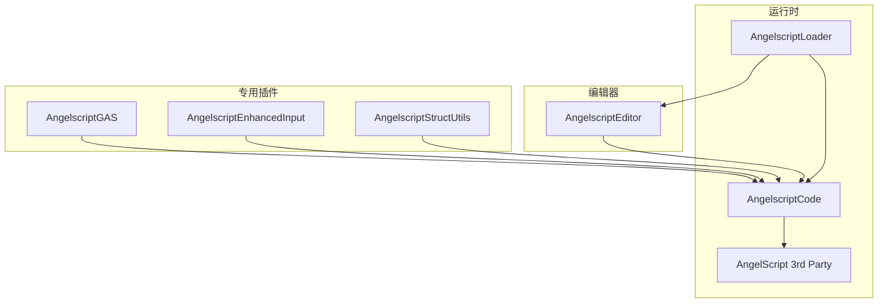
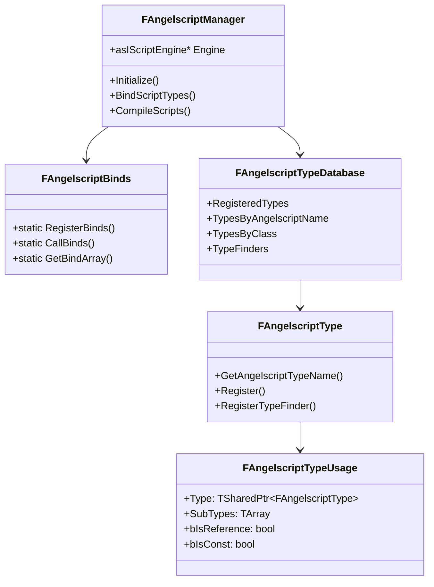

# 第1章：插件架构详解

## 目录结构

```
Engine/Plugins/Angelscript/
├── Source/
│   ├── AngelscriptCode/          # 核心模块 - 运行时逻辑
│   │   ├── Public/
│   │   │   ├── AngelscriptManager.h
│   │   │   ├── AngelscriptBinds.h
│   │   │   ├── AngelscriptType.h
│   │   │   └── ...
│   │   └── Private/
│   │       ├── Binds/            # 各种类型的绑定实现
│   │       │   ├── Bind_AActor.cpp
│   │       │   ├── Bind_UObject.cpp
│   │       │   ├── Bind_FVector.cpp
│   │       │   └── ...
│   │       └── ...
│   │
│   ├── AngelscriptEditor/        # 编辑器扩展模块
│   │   └── ...
│   │
│   └── AngelscriptLoader/        # 加载器模块
│       └── ...
│
├── ThirdParty/                   # AngelScript 引擎源码
│   └── angelscript/
│       ├── include/
│       │   └── angelscript.h     # 核心头文件
│       └── source/
│           └── ...
│
└── Angelscript.uplugin
```

## 模块依赖关系



## 核心类关系



## 核心类说明

### FAngelscriptManager
全局单例管理器，负责：
- 创建和管理 AngelScript 引擎实例
- 协调初始化流程
- 编译和热重载脚本

### FAngelscriptBinds
静态绑定工具类，提供：
- 注册绑定的 API
- 类型声明方法（ValueClass、ReferenceClass 等）
- 绑定顺序控制

### FAngelscriptType
类型描述的抽象基类，不同类型有不同子类：
- `FUObjectType` - UObject 派生类
- `FUStructType` - UScriptStruct 结构体
- `FUEnumType` - UEnum 枚举
- `TIntegralAngelscriptType` - 基础整数类型

### FAngelscriptTypeDatabase
全局类型数据库，存储所有已注册类型的索引

---

**上一章**: [00_概述与语言基础.md](./00_概述与语言基础.md)  
**下一章**: [02_初始化流程.md](./02_初始化流程.md) - 了解引擎启动时的初始化序列