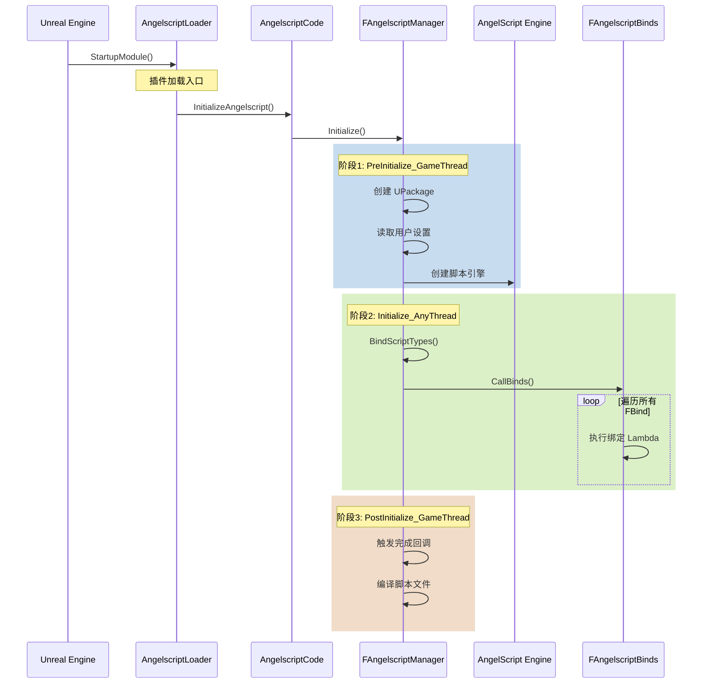

# 第2章：引擎启动与初始化流程

## 完整初始化序列



## PreInitialize_GameThread 详解

```cpp
void FAngelscriptManager::PreInitialize_GameThread()
{
    // 1. 创建两个核心 UPackage
    //    这些包用于存储脚本生成的类型
    ScriptPackage = CreatePackage(TEXT("/Script/Angelscript"));
    AssetsPackage = CreatePackage(TEXT("/Script/AngelscriptAssets"));
    
    // 2. 读取用户设置
    const UAngelscriptSettings* Settings = GetDefault<UAngelscriptSettings>();
    
    // 3. 创建 AngelScript 引擎实例
    Engine = asCreateScriptEngine();
    
    // 4. 配置引擎
    Engine->SetMessageCallback(...);
    Engine->SetEngineProperty(asEP_ALLOW_UNSAFE_REFERENCES, true);
    // ... 更多配置
}
```

### UPackage 的作用

```
/Script/Angelscript
├── UASClass_GA_CastStone        # AS 定义的类
├── UASClass_BP_MyCharacter      # AS 定义的类
└── ...

/Script/AngelscriptAssets  
├── 资产相关的脚本类型
└── ...
```

## Initialize_AnyThread 详解

这是最核心的初始化阶段，**可以在非主线程运行**：

```cpp
void FAngelscriptManager::Initialize_AnyThread()
{
    // 核心：绑定所有类型到 AngelScript
    BindScriptTypes();
}

void FAngelscriptManager::BindScriptTypes()
{
    // 调用所有注册的绑定
    FAngelscriptBinds::CallBinds();
}

void FAngelscriptBinds::CallBinds()
{
    // 1. 按顺序排序所有绑定
    GetBindArray().Sort();
    
    // 2. 依次执行每个绑定的 Lambda
    for (auto& Bind : GetBindArray())
    {
        Bind.Function();  // 执行绑定逻辑
    }
}
```

## PostInitialize_GameThread

```cpp
void FAngelscriptManager::PostInitialize_GameThread()
{
    // 1. 触发初始化完成回调
    OnAngelscriptInitialized.Broadcast();
    
    // 2. 扫描并编译所有 .as 文件
    CompileAllScripts();
    
    // 3. 创建脚本定义的类的 CDO
    CreateScriptClassCDOs();
}
```

## 初始化时序总结

| 阶段 | 线程 | 主要工作 |
|------|------|----------|
| PreInitialize | 游戏线程 | 创建 Package、配置引擎 |
| Initialize | 任意线程 | 执行所有类型绑定 |
| PostInitialize | 游戏线程 | 编译脚本、创建 CDO |

---

**上一章**: [01_插件架构.md](./01_插件架构.md)  
**下一章**: [03_类型系统.md](./03_类型系统.md) - 深入理解类型系统的数据结构