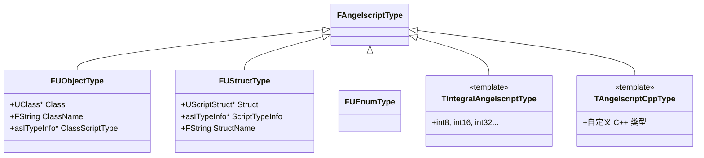

# 第3章：类型系统深度解析

## 核心数据结构

### 1. FAngelscriptType - 类型描述

```cpp
/**
 * FAngelscriptType 是连接 UE 类型系统和 AS 类型系统的桥梁
 * 它是一个抽象基类，不同类型有不同的子类实现
 */
struct FAngelscriptType : TSharedFromThis<FAngelscriptType>
{
    // 获取在 AS 中显示的类型名
    virtual FString GetAngelscriptTypeName() const = 0;
    
    // 获取 C++ 形式（用于预编译）
    virtual bool GetCppForm(const FAngelscriptTypeUsage& Usage, FCppForm& OutCppForm) const;
    
    // 检查是否匹配某个 UProperty
    virtual bool MatchesProperty(const FAngelscriptTypeUsage& Usage, 
                                  const FProperty* Property, 
                                  EPropertyMatchType MatchType) const;
    
    // 是否可以作为模板子类型
    virtual bool CanBeTemplateSubType() const { return true; }
    
    // 是否是对象指针类型
    virtual bool IsObjectPointer() const { return false; }
};
```

### 2. 常见的 FAngelscriptType 子类



### 3. FAngelscriptTypeUsage - 类型使用上下文

```cpp
/**
 * 描述一个类型的具体使用方式
 * 包括 const、引用、模板参数等修饰符
 */
struct FAngelscriptTypeUsage
{
    // 基础类型信息
    TSharedPtr<FAngelscriptType> Type;
    
    // 子类型（用于模板/容器）
    TArray<FAngelscriptTypeUsage> SubTypes;
    
    // 修饰符
    bool bIsReference = false;
    bool bIsConst = false;
    
    // 关联的脚本/UE 类型信息（三选一）
    union
    {
        asITypeInfo* ScriptClass;     // AS 类型信息
        FProperty* UnrealProperty;    // UE 属性
        int32 TypeIndex;              // 类型索引
    };
    
    // 常用构造方法
    static FAngelscriptTypeUsage FromTypeId(int32 TypeId);
    static FAngelscriptTypeUsage FromProperty(FProperty* Property);
    static FAngelscriptTypeUsage FromClass(UClass* Class);
    static FAngelscriptTypeUsage FromStruct(UScriptStruct* Struct);
};
```

### 4. FAngelscriptTypeDatabase - 类型数据库

```cpp
/**
 * 全局单例，存储所有已注册的类型信息
 */
struct FAngelscriptTypeDatabase
{
    static FAngelscriptTypeDatabase& Get();
    
    // 所有注册的类型
    TArray<TSharedRef<FAngelscriptType>> RegisteredTypes;
    
    // 按 AS 类型名索引
    TMap<FString, TSharedRef<FAngelscriptType>> TypesByAngelscriptName;
    
    // 按 UClass 索引
    TMap<UClass*, TSharedRef<FAngelscriptType>> TypesByClass;
    
    // 按自定义数据索引
    TMap<void*, TSharedRef<FAngelscriptType>> TypesByData;
    
    // 支持属性匹配的类型
    TArray<TSharedRef<FAngelscriptType>> TypesImplementingProperties;
    
    // 类型查找器（用于复杂类型如 TSubclassOf）
    TArray<FTypeFinder> TypeFinders;
};
```

## 类型 ID 系统

AngelScript 使用整数 TypeId 来唯一标识每个类型：

```cpp
// 基础类型有固定的 TypeId
enum asETypeIdFlags
{
    asTYPEID_VOID           = 0,
    asTYPEID_BOOL           = 1,
    asTYPEID_INT8           = 2,
    asTYPEID_INT16          = 3,
    asTYPEID_INT32          = 4,
    asTYPEID_INT64          = 5,
    asTYPEID_UINT8          = 6,
    asTYPEID_UINT16         = 7,
    asTYPEID_UINT32         = 8,
    asTYPEID_UINT64         = 9,
    asTYPEID_FLOAT32        = 10,
    asTYPEID_FLOAT64        = 11,
    
    asTYPEID_LAST_PRIMITIVE = asTYPEID_FLOAT64,
    
    // 非基础类型的 TypeId > 11，动态分配
};

// 获取类型信息的方式
asITypeInfo* TypeInfo = Engine->GetTypeInfoById(TypeId);
FString TypeName = ANSI_TO_TCHAR(TypeInfo->GetName());
```

## 类型存储位置总结

```
┌─────────────────────────────────────────────────────────────┐
│                        类型信息存储                          │
├─────────────────────────────────────────────────────────────┤
│                                                             │
│  AngelScript 引擎层                                          │
│  ┌─────────────────────────────────────────────────────┐   │
│  │ asIScriptEngine                                      │   │
│  │  └── asCTypeInfo (每个注册的类型)                     │   │
│  │       ├── name: 类型名                               │   │
│  │       ├── typeId: 类型 ID                            │   │
│  │       ├── size: 类型大小                             │   │
│  │       ├── flags: 类型标志                            │   │
│  │       └── plainUserData: 自定义数据 ──┐              │   │
│  └───────────────────────────────────────│──────────────┘   │
│                                          │                   │
│  UE 桥接层                               ▼                   │
│  ┌─────────────────────────────────────────────────────┐   │
│  │ FAngelscriptTypeDatabase (全局单例)                  │   │
│  │  ├── TypesByAngelscriptName["FVector"] ──► FUStructType│ │
│  │  ├── TypesByClass[AActor::StaticClass()] ──► FUObjectType│
│  │  └── TypeFinders[] ──► Lambda 查找器                 │   │
│  └─────────────────────────────────────────────────────┘   │
│                                                             │
│  UE 原生层                                                   │
│  ┌─────────────────────────────────────────────────────┐   │
│  │ UClass / UScriptStruct / UEnum                       │   │
│  │  └── (通过 plainUserData 反向引用)                    │   │
│  └─────────────────────────────────────────────────────┘   │
│                                                             │
└─────────────────────────────────────────────────────────────┘
```

---

**上一章**: [02_初始化流程.md](./02_初始化流程.md)  
**下一章**: [04_FBind机制.md](./04_FBind机制.md) - 了解绑定注册的核心机制