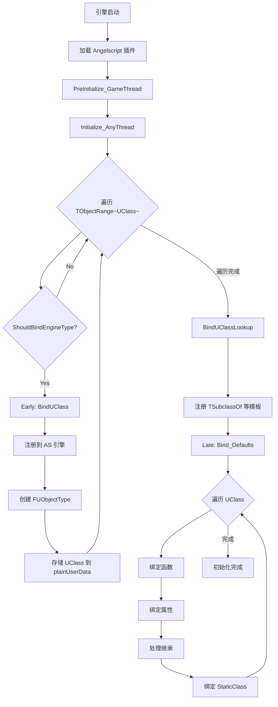

# 第5章：UObject 绑定流程

## Early 阶段：类型声明

```cpp
AS_FORCE_LINK const FAngelscriptBinds::FBind Bind_BlueprintType_Declarations(
    FAngelscriptBinds::EOrder::Early, 
    []
{
    // 遍历所有 UClass
    for (UClass* Class : TObjectRange<UClass>())
    {
        // 检查是否应该绑定
        if (!ShouldBindEngineType(Class))
            continue;
        
        // 获取绑定名称
        FString ClassName = FAngelscriptType::GetBoundClassName(Class);
        
        // 执行绑定
        BindUClass(Class, ClassName);
    }
    
    // 绑定特殊类型查找器
    BindUClassLookup();
});
```

### ShouldBindEngineType 判断逻辑

```cpp
bool ShouldBindEngineType(UClass* Class)
{
    // 1. 检查 BlueprintType 元数据
    if (Class->HasMetaData(TEXT("BlueprintType")))
        return true;
    
    // 2. 检查是否是蓝图类
    if (Class->HasAnyClassFlags(CLASS_CompiledFromBlueprint))
        return true;
    
    // 3. 检查 ForceAngelscriptBind 元数据
    if (Class->HasMetaData(TEXT("ForceAngelscriptBind")))
        return true;
    
    // 4. 检查是否有蓝图可调用函数
    for (TFieldIterator<UFunction> It(Class); It; ++It)
    {
        if (It->HasAnyFunctionFlags(FUNC_BlueprintCallable))
            return true;
    }
    
    return false;
}
```

### BindUClass 核心实现

```cpp
static void BindUClass(UClass* Class, const FString& TypeName)
{
    // 1. 注册到 AS 引擎
    //    asOBJ_REF: 引用类型
    //    asOBJ_NOCOUNT: 不使用 AS 引用计数（UE 管理生命周期）
    //    asOBJ_IMPLICIT_HANDLE: 允许省略 @ 符号
    auto Class_ = FAngelscriptBinds::ReferenceClass(TypeName, Class);
    
    // 2. 创建 UE 端类型描述
    auto Type = MakeShared<FUObjectType>(Class, TypeName, Class_.GetTypeInfo());
    FAngelscriptType::Register(Type);
    
    // 3. 在 AS 类型信息中存储 UClass 指针
    //    这样可以从 AS 侧反查 UE 类型
    auto* TypeInfo = (asCTypeInfo*)Class_.GetTypeInfo();
    if (TypeInfo != nullptr)
    {
        // plainUserData 是 AS 提供的自定义数据字段
        TypeInfo->plainUserData = (SIZE_T)Class;
        
#if WITH_EDITOR
        // 编辑器专用：添加文档
        const FString& Tooltip = Class->GetMetaData(NAME_Func_Tooltip);
        if (Tooltip.Len() != 0)
            FAngelscriptDocs::AddUnrealDocumentationForType(
                TypeInfo->GetTypeId(), Tooltip);
#endif
    }
}
```

### ReferenceClass 详解

```cpp
FAngelscriptBinds FAngelscriptBinds::ReferenceClass(FBindString Name, UClass* UnrealClass)
{
    // 注册对象类型
    auto Binds = FAngelscriptBinds(
        Name,
        asOBJ_REF |              // 引用类型（堆分配）
        asOBJ_NOCOUNT |          // 不使用 AS 引用计数
        asOBJ_IMPLICIT_HANDLE,   // 隐式句柄（可省略 @）
        0                        // 初始大小（稍后设置）
    );
    
    // 设置类型大小和对齐
    ((asCObjectType*)Binds.ScriptType)->size = UnrealClass->GetStructureSize();
    Binds.ScriptType->alignment = UnrealClass->GetMinAlignment();
    
    return Binds;
}
```

## Late 阶段：成员绑定

```cpp
AS_FORCE_LINK const FAngelscriptBinds::FBind Bind_Defaults(
    (int32)FAngelscriptBinds::EOrder::Late + 100,
    []
{
    // 处理所有已声明的 UClass
    for (UClass* Class : TObjectRange<UClass>())
    {
        if (!ShouldBindEngineType(Class))
            continue;
            
        FString ClassName = FAngelscriptType::GetBoundClassName(Class);
        auto Class_ = FAngelscriptBinds::ExistingClass(ClassName);
        
        // 1. 绑定函数
        BindClassFunctions(Class, Class_);
        
        // 2. 绑定属性
        BindClassProperties(Class, Class_);
        
        // 3. 处理继承
        BindClassInheritance(Class, Class_);
        
        // 4. 绑定静态方法
        BindStaticClass(Class, Class_);
    }
});
```

## 绑定流程图



---

**上一章**: [04_FBind机制.md](./04_FBind机制.md)  
**下一章**: [06_UScriptStruct绑定.md](./06_UScriptStruct绑定.md) - 了解值类型的绑定方式