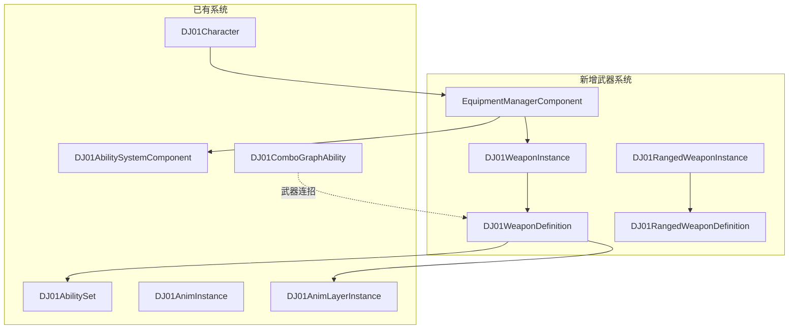
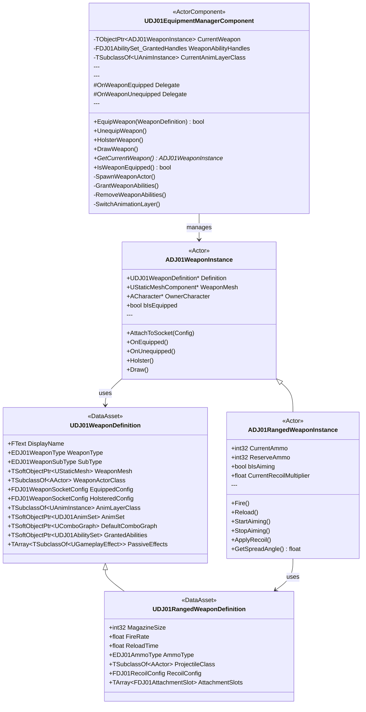
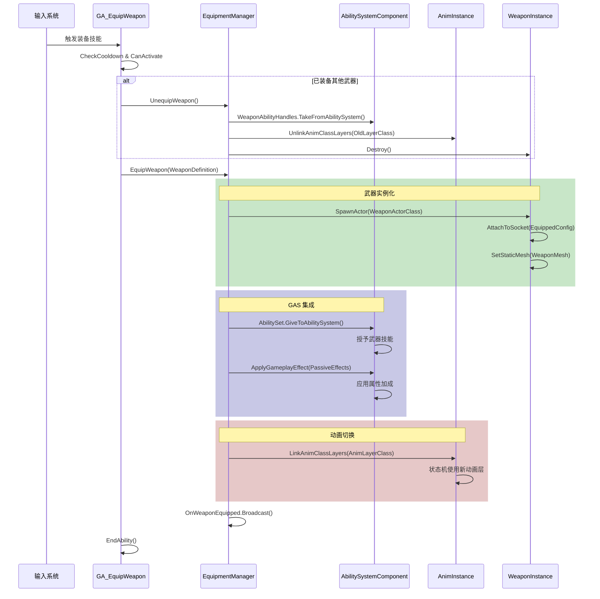
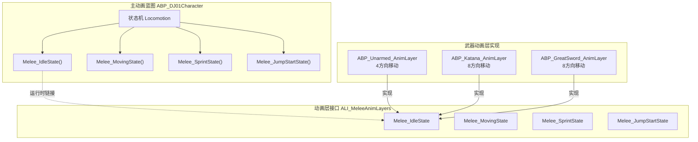
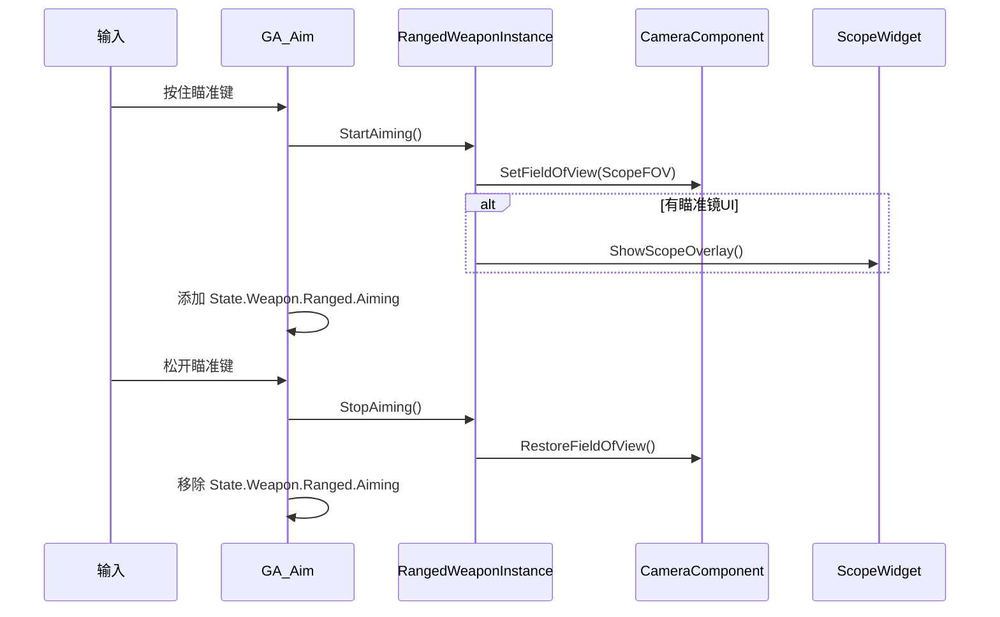

# DJ01 模块化武器系统架构设计

> 版本: 1.0  
> 更新日期: 2026-01-17  
> 作者: CodeMaker

---

## 目录

1. [系统概述](#1-系统概述)
2. [架构总览](#2-架构总览)
3. [核心数据结构](#3-核心数据结构)
4. [武器类型定义](#4-武器类型定义)
5. [GAS 集成方案](#5-gas-集成方案)
6. [动画系统集成](#6-动画系统集成)
7. [远程武器扩展](#7-远程武器扩展)
8. [实现路线图](#8-实现路线图)

---

## 1. 系统概述

### 1.1 设计目标

| 目标 | 描述 |
|------|------|
| **模块化** | 武器定义与实现分离，支持数据驱动配置 |
| **GAS 深度集成** | 武器技能、属性加成、状态管理全部通过 GAS |
| **动画层解耦** | 每种武器对应独立动画层，装备时自动切换 |
| **可扩展性** | 支持近战/远程/特殊武器，枪械配件系统 |
| **快速原型** | 通过 AngelScript 快速验证，C++ 实现核心逻辑 |

### 1.2 与现有系统的关系



---

## 2. 架构总览

### 2.1 核心类图



### 2.2 装备流程时序图



---

## 3. 核心数据结构

### 3.1 Socket 配置

```cpp
USTRUCT(BlueprintType)
struct FDJ01WeaponSocketConfig
{
    GENERATED_BODY()

    /** Socket 名称 */
    UPROPERTY(EditDefaultsOnly, BlueprintReadOnly)
    FName SocketName = NAME_None;

    /** 位置偏移 */
    UPROPERTY(EditDefaultsOnly, BlueprintReadOnly)
    FVector LocationOffset = FVector::ZeroVector;

    /** 旋转偏移 */
    UPROPERTY(EditDefaultsOnly, BlueprintReadOnly)
    FRotator RotationOffset = FRotator::ZeroRotator;
};
```

### 3.2 Katana 配置实例

| 字段 | 值 |
|------|-----|
| DisplayName | `武士刀 (Katana)` |
| WeaponType | `Melee` |
| SubType | `Katana` |
| **EquippedConfig** | |
| - SocketName | `socket_weapon_r` |
| - LocationOffset | `(-10, 5, 8)` |
| - RotationOffset | `(130, 0, -90)` |
| **HolsteredConfig** | |
| - SocketName | `spine_03` |
| - LocationOffset | `(0, 0, 0)` |
| - RotationOffset | `(0, 0, 0)` |
| AnimLayerClass | `ABP_Katana_AnimLayer` |

---

## 4. 武器类型定义

### 4.1 武器类型枚举

```cpp
UENUM(BlueprintType)
enum class EDJ01WeaponType : uint8
{
    Unarmed     UMETA(DisplayName = "徒手"),
    Melee       UMETA(DisplayName = "近战武器"),
    Ranged      UMETA(DisplayName = "远程武器"),
    Special     UMETA(DisplayName = "特殊武器"),
};

UENUM(BlueprintType)
enum class EDJ01WeaponSubType : uint8
{
    // 近战
    Katana      UMETA(DisplayName = "武士刀"),
    GreatSword  UMETA(DisplayName = "大剑"),
    DualBlade   UMETA(DisplayName = "双刀"),
    Axe         UMETA(DisplayName = "斧"),
    Spear       UMETA(DisplayName = "长枪"),
    
    // 远程
    Pistol      UMETA(DisplayName = "手枪"),
    Rifle       UMETA(DisplayName = "步枪"),
    Bow         UMETA(DisplayName = "弓"),
    
    // 特殊
    Shield      UMETA(DisplayName = "盾牌"),
    Magic       UMETA(DisplayName = "法器"),
};
```

### 4.2 武器类型特性矩阵

| 类型 | 动画层接口 | 连招支持 | 弹药系统 | 瞄准系统 |
|------|-----------|---------|---------|---------|
| Unarmed | ALI_MeleeAnimLayers | ✅ | ❌ | ❌ |
| Melee | ALI_MeleeAnimLayers | ✅ | ❌ | ❌ |
| Ranged | ALI_RangedAnimLayers | ❌ | ✅ | ✅ |
| Special | ALI_SpecialAnimLayers | 视情况 | 视情况 | 视情况 |

---

## 5. GAS 集成方案

### 5.1 武器技能授予机制

利用现有的 `UDJ01AbilitySet` 系统：

```cpp
// 武器装备时
void UDJ01EquipmentManagerComponent::GrantWeaponAbilities()
{
    if (!CurrentWeaponDefinition || !CurrentWeaponDefinition->GrantedAbilities)
        return;
    
    UDJ01AbilitySystemComponent* ASC = GetOwnerASC();
    if (!ASC)
        return;
    
    // 授予武器技能集，保存 Handle 以便后续移除
    CurrentWeaponDefinition->GrantedAbilities->GiveToAbilitySystem(
        ASC, 
        &WeaponAbilityHandles,
        CurrentWeaponInstance
    );
    
    // 应用被动效果
    for (const auto& EffectClass : CurrentWeaponDefinition->PassiveEffects)
    {
        FGameplayEffectContextHandle Context = ASC->MakeEffectContext();
        Context.AddSourceObject(CurrentWeaponInstance);
        
        FGameplayEffectSpecHandle Spec = ASC->MakeOutgoingSpec(EffectClass, 1, Context);
        FActiveGameplayEffectHandle Handle = ASC->ApplyGameplayEffectSpecToSelf(*Spec.Data.Get());
        
        WeaponAbilityHandles.AddGameplayEffectHandle(Handle);
    }
}

// 武器卸载时
void UDJ01EquipmentManagerComponent::RemoveWeaponAbilities()
{
    UDJ01AbilitySystemComponent* ASC = GetOwnerASC();
    if (!ASC)
        return;
    
    WeaponAbilityHandles.TakeFromAbilitySystem(ASC);
}
```

### 5.2 武器 AbilitySet 示例

#### Katana AbilitySet

```
DA_Katana_AbilitySet
├── GrantedGameplayAbilities
│   ├── GA_Katana_LightAttack (InputTag.Ability.Attack.Light)
│   ├── GA_Katana_HeavyAttack (InputTag.Ability.Attack.Heavy)
│   ├── GA_Katana_Skill_Iai (InputTag.Ability.Skill.1)
│   └── GA_Katana_Parry (InputTag.Ability.Defend)
├── GrantedGameplayEffects
│   └── GE_Katana_PassiveStats
└── GrantedAttributes
    └── (无额外属性集)
```

#### Rifle AbilitySet

```
DA_Rifle_AbilitySet
├── GrantedGameplayAbilities
│   ├── GA_Rifle_Fire (InputTag.Ability.Attack.Light)
│   ├── GA_Rifle_Aim (InputTag.Ability.Attack.Heavy)
│   ├── GA_Rifle_Reload (InputTag.Ability.Reload)
│   └── GA_Rifle_SwitchFireMode (InputTag.Ability.Skill.1)
├── GrantedGameplayEffects
│   └── GE_Rifle_PassiveStats
└── GrantedAttributes
    └── (无额外属性集)
```

### 5.3 Gameplay Tags 设计

```
State.Weapon
├── State.Weapon.Equipped          # 有武器装备中
├── State.Weapon.Holstered         # 武器收起
├── State.Weapon.Drawing           # 正在拔刀
├── State.Weapon.Holstering        # 正在收刀
├── State.Weapon.Type
│   ├── State.Weapon.Type.Melee    # 近战武器
│   ├── State.Weapon.Type.Ranged   # 远程武器
│   └── State.Weapon.Type.Special  # 特殊武器
└── State.Weapon.Ranged
    ├── State.Weapon.Ranged.Aiming     # 瞄准中
    ├── State.Weapon.Ranged.Firing     # 射击中
    ├── State.Weapon.Ranged.Reloading  # 换弹中
    └── State.Weapon.Ranged.OutOfAmmo  # 弹匣空

InputTag.Ability
├── InputTag.Ability.Attack.Light  # 轻攻击/射击
├── InputTag.Ability.Attack.Heavy  # 重攻击/瞄准
├── InputTag.Ability.Skill.1       # 技能1
├── InputTag.Ability.Skill.2       # 技能2
├── InputTag.Ability.Defend        # 防御/格挡
├── InputTag.Ability.Reload        # 换弹
└── InputTag.Ability.Weapon.Toggle # 拔刀/收刀

Ammo.Type
├── Ammo.Type.Pistol
├── Ammo.Type.Rifle
├── Ammo.Type.Shotgun
├── Ammo.Type.Arrow
└── Ammo.Type.Energy
```

### 5.4 属性加成 GameplayEffect

```cpp
// GE_Katana_PassiveStats
// Duration: Infinite (装备期间持续生效)

Modifiers:
  - Attribute: DJ01AttributeSet.Attack
    ModifierOp: Additive
    Magnitude: 15.0
    
  - Attribute: DJ01AttributeSet.AttackSpeed
    ModifierOp: Multiplicative
    Magnitude: 1.05  // +5%
    
  - Attribute: DJ01AttributeSet.CriticalChance
    ModifierOp: Additive
    Magnitude: 0.03  // +3%

GrantedTags:
  - State.Weapon.Equipped
  - State.Weapon.Type.Melee
```

---

## 6. 动画系统集成

### 6.1 动画层架构



### 6.2 动画层切换实现

```cpp
void UDJ01EquipmentManagerComponent::SwitchAnimationLayer(TSubclassOf<UAnimInstance> NewLayerClass)
{
    ACharacter* Character = Cast<ACharacter>(GetOwner());
    if (!Character)
        return;
    
    USkeletalMeshComponent* Mesh = Character->GetMesh();
    if (!Mesh)
        return;
    
    UAnimInstance* AnimInstance = Mesh->GetAnimInstance();
    if (!AnimInstance)
        return;
    
    // 断开当前动画层
    if (CurrentAnimLayerClass)
    {
        AnimInstance->UnlinkAnimClassLayers(CurrentAnimLayerClass);
        CurrentAnimLayerClass = nullptr;
    }
    
    // 连接新动画层
    if (NewLayerClass)
    {
        AnimInstance->LinkAnimClassLayers(NewLayerClass);
        CurrentAnimLayerClass = NewLayerClass;
    }
}
```

### 6.3 AnimSet 数据资产

```cpp
UCLASS(BlueprintType)
class UDJ01AnimSet : public UPrimaryDataAsset
{
    GENERATED_BODY()

public:
    // ========== 移动动画 ==========
    UPROPERTY(EditDefaultsOnly, Category = "Locomotion")
    TObjectPtr<UBlendSpace> LocomotionBlendSpace;
    
    UPROPERTY(EditDefaultsOnly, Category = "Locomotion")
    TObjectPtr<UAnimSequence> IdleAnim;
    
    UPROPERTY(EditDefaultsOnly, Category = "Locomotion")
    TObjectPtr<UAnimSequence> SprintAnim;
    
    // ========== 跳跃动画 ==========
    UPROPERTY(EditDefaultsOnly, Category = "Jump")
    TObjectPtr<UAnimSequence> JumpStartAnim;
    
    UPROPERTY(EditDefaultsOnly, Category = "Jump")
    TObjectPtr<UAnimSequence> JumpApexAnim;
    
    UPROPERTY(EditDefaultsOnly, Category = "Jump")
    TObjectPtr<UAnimSequence> JumpLandAnim;
    
    // ========== 战斗动画 (可选) ==========
    UPROPERTY(EditDefaultsOnly, Category = "Combat")
    TObjectPtr<UAnimMontage> DrawWeaponMontage;
    
    UPROPERTY(EditDefaultsOnly, Category = "Combat")
    TObjectPtr<UAnimMontage> HolsterWeaponMontage;
};
```

---

## 7. 远程武器扩展

### 7.1 远程武器数据结构

```cpp
// 弹药类型
UENUM(BlueprintType)
enum class EDJ01AmmoType : uint8
{
    Pistol      UMETA(DisplayName = "手枪弹"),
    Rifle       UMETA(DisplayName = "步枪弹"),
    Shotgun     UMETA(DisplayName = "霰弹"),
    Arrow       UMETA(DisplayName = "箭矢"),
    Energy      UMETA(DisplayName = "能量弹"),
    Infinite    UMETA(DisplayName = "无限弹药"),
};

// 后坐力配置
USTRUCT(BlueprintType)
struct FDJ01RecoilConfig
{
    GENERATED_BODY()

    UPROPERTY(EditDefaultsOnly)
    float VerticalRecoil = 1.0f;

    UPROPERTY(EditDefaultsOnly)
    float HorizontalRecoilRange = 0.5f;

    UPROPERTY(EditDefaultsOnly)
    float RecoverySpeed = 5.0f;

    UPROPERTY(EditDefaultsOnly)
    float AccumulationMultiplier = 1.2f;
};

// 配件插槽
USTRUCT(BlueprintType)
struct FDJ01AttachmentSlot
{
    GENERATED_BODY()

    UPROPERTY(EditDefaultsOnly)
    EDJ01AttachmentSlotType SlotType;

    UPROPERTY(EditDefaultsOnly)
    FName SocketName;

    UPROPERTY(EditDefaultsOnly)
    TSoftObjectPtr<UDJ01AttachmentDefinition> DefaultAttachment;
};
```

### 7.2 瞄准系统



### 7.3 射击与后坐力

```cpp
void ADJ01RangedWeaponInstance::Fire()
{
    if (!CanFire())
        return;
    
    CurrentAmmo--;
    
    // 计算散布
    float SpreadAngle = GetSpreadAngle();
    FRotator AimRotation = GetAimRotation();
    AimRotation.Pitch += FMath::RandRange(-SpreadAngle, SpreadAngle);
    AimRotation.Yaw += FMath::RandRange(-SpreadAngle, SpreadAngle);
    
    // 生成投射物或射线检测
    if (RangedDefinition->ProjectileClass)
    {
        SpawnProjectile(AimRotation);
    }
    else
    {
        PerformHitscan(AimRotation);
    }
    
    ApplyRecoil();
    PlayMuzzleFlash();
    PlayFireSound();
}

void ADJ01RangedWeaponInstance::ApplyRecoil()
{
    FDJ01RecoilConfig& Recoil = RangedDefinition->RecoilConfig;
    
    float VerticalKick = Recoil.VerticalRecoil * CurrentRecoilMultiplier;
    float HorizontalKick = FMath::RandRange(
        -Recoil.HorizontalRecoilRange, 
        Recoil.HorizontalRecoilRange
    ) * CurrentRecoilMultiplier;
    
    OwnerController->AddPitchInput(-VerticalKick);
    OwnerController->AddYawInput(HorizontalKick);
    
    CurrentRecoilMultiplier *= Recoil.AccumulationMultiplier;
}
```

---

## 8. 实现路线图

### Phase 1: 基础框架 (当前优先)

- [ ] 创建 `Source/DJ01/Weapon/` 目录结构
- [ ] 实现 `UDJ01WeaponDefinition` 数据资产
- [ ] 实现 `ADJ01WeaponInstance` 基础武器 Actor
- [ ] 实现 `UDJ01EquipmentManagerComponent`
- [ ] 将现有 `AWeapon_Katana.as` 迁移到新架构

### Phase 2: GAS 深度集成

- [ ] 创建 `GA_EquipWeapon` / `GA_UnequipWeapon`
- [ ] 创建 Katana AbilitySet
- [ ] 实现武器属性加成 GE
- [ ] 添加武器相关 Gameplay Tags

### Phase 3: 动画系统完善

- [ ] 创建 `ABP_Katana_AnimLayer` 蓝图
- [ ] 实现 AnimSet 数据资产
- [ ] 测试动画层热切换

### Phase 4: 远程武器扩展

- [ ] 实现 `UDJ01RangedWeaponDefinition`
- [ ] 实现 `ADJ01RangedWeaponInstance`
- [ ] 创建瞄准/射击/换弹技能
- [ ] 实现后坐力系统

### Phase 5: 配件系统

- [ ] 实现配件数据资产
- [ ] 实现瞄准镜 FOV 切换
- [ ] 实现配件 UI 系统

---

## 附录

### A. 文件目录结构

```
Source/DJ01/Weapon/
├── Private/
│   ├── DJ01WeaponDefinition.cpp
│   ├── DJ01RangedWeaponDefinition.cpp
│   ├── DJ01WeaponInstance.cpp
│   ├── DJ01RangedWeaponInstance.cpp
│   └── DJ01EquipmentManagerComponent.cpp
├── Public/
│   ├── DJ01WeaponTypes.h
│   ├── DJ01WeaponDefinition.h
│   ├── DJ01RangedWeaponDefinition.h
│   ├── DJ01WeaponInstance.h
│   ├── DJ01RangedWeaponInstance.h
│   └── DJ01EquipmentManagerComponent.h
└── README.md

Content/
├── Weapons/
│   ├── Definitions/
│   │   ├── DA_Weapon_Katana.uasset
│   │   ├── DA_Weapon_GreatSword.uasset
│   │   └── DA_Weapon_Rifle.uasset
│   ├── AbilitySets/
│   │   ├── DA_Katana_AbilitySet.uasset
│   │   └── DA_Rifle_AbilitySet.uasset
│   └── AnimSets/
│       ├── DA_Katana_AnimSet.uasset
│       └── DA_Rifle_AnimSet.uasset
└── Animation/
    └── Layers/
        ├── ABP_Unarmed_AnimLayer.uasset
        ├── ABP_Katana_AnimLayer.uasset
        └── ABP_Rifle_AnimLayer.uasset
```

### B. 相关文档

- [动画层接口实现](../ComBoFirst/ABP/04_动画层接口实现.md)
- [武器动画层创建](../ComBoFirst/ABP/05_武器动画层创建.md)
- [Root Motion 配置](../ComBoFirst/ABP/03c_RootMotion与根锁定详解.md)
- [GAS 架构指南](../../Source/DJ01/AbilitySystem/AbilitySystem_Architecture.md)