# DJ01 连招系统开发指南

> **版本**: 1.0  
> **创建日期**: 2026-01-11  
> **目标**: 实现一套完整的动作游戏连招系统

---

## 📚 文档目录

| 序号 | 文档 | 内容 | 预计耗时 |
|------|------|------|---------|
| 00 | [本文档](./00_Overview.md) | 系统总览与实施路线图 | 10分钟 |
| 01 | [动画资产准备](./01_AnimationAssets.md) | 蒙太奇制作、AnimNotify配置 | 2小时 |
| 02 | [动画蓝图设计](./02_AnimBlueprint.md) | ABP创建、状态机设计 | 3小时 |
| 03 | [动画层系统](./03_AnimLayers.md) | 武器动画层、切换机制 | 2小时 |
| 04 | [Tags与BindingSet](./04_TagsAndBindings.md) | 使用工具配置标签和绑定 | 1小时 |
| 05 | [AngelScript技能](./05_AbilityScript.md) | 连招技能类编写 | 2小时 |
| 06 | [ComboGraph配置](./06_ComboGraph.md) | 连招图资产创建与配置 | 2小时 |
| 07 | [整合测试](./07_Integration.md) | 系统整合与调试 | 1小时 |

**总预计耗时**: 约 13 小时（可分多天完成）

---

## 🎯 最终目标

完成后你将拥有：

1. ✅ **模块化动画蓝图** - 支持多武器切换的 Lyra 风格动画层架构
2. ✅ **完善的状态机** - 移动、跳跃、攻击、受击等状态无缝切换
3. ✅ **流畅的连招系统** - 基于 ComboGraph 的输入缓冲和连招分支
4. ✅ **GAS 深度集成** - 技能、伤害、特效通过 Gameplay Ability System 管理

---

## 🏗️ 系统架构

```
┌─────────────────────────────────────────────────────────────────┐
│                         玩家输入                                 │
│                    (Enhanced Input System)                       │
└─────────────────────────────┬───────────────────────────────────┘
                              │
                              ▼
┌─────────────────────────────────────────────────────────────────┐
│                    Gameplay Ability System                       │
│  ┌──────────────────┐  ┌──────────────────┐  ┌───────────────┐ │
│  │ GA_WeaponCombo   │  │ GameplayTags     │  │ BindingSet    │ │
│  │ (AngelScript)    │  │ (状态标签)        │  │ (数据绑定)    │ │
│  └────────┬─────────┘  └────────┬─────────┘  └───────┬───────┘ │
└───────────┼─────────────────────┼────────────────────┼─────────┘
            │                     │                    │
            ▼                     ▼                    ▼
┌───────────────────────┐  ┌────────────────────────────────────┐
│    ComboGraph         │  │          Animation System           │
│  ┌─────────────────┐  │  │  ┌───────────────────────────────┐ │
│  │ Entry → Node1   │  │  │  │    ABP_DJ01Character_Base     │ │
│  │   ├─→ Node2     │  │  │  │  ┌─────────────────────────┐  │ │
│  │   └─→ Node3     │  │  │  │  │   State Machines        │  │ │
│  └─────────────────┘  │  │  │  │   ├── LocomotionSM      │  │ │
│                       │  │  │  │   └── ActionSM          │  │ │
│  - 输入缓冲           │  │  │  └─────────────────────────┘  │ │
│  - 连招窗口           │  │  │                               │ │
│  - 分支选择           │  │  │  ┌─────────────────────────┐  │ │
└───────────┬───────────┘  │  │  │   Animation Layers      │  │ │
            │              │  │  │   ├── ALB_Katana        │  │ │
            │              │  │  │   ├── ALB_SwordShield   │  │ │
            ▼              │  │  │   └── ALB_TwinSword     │  │ │
     PlayMontage ──────────┼──┼─→│  └─────────────────────────┘  │ │
                           │  └───────────────────────────────────┘
                           │
                           ▼
                    ┌─────────────────┐
                    │ Character Mesh  │
                    │   (动画播放)     │
                    └─────────────────┘
```

---

## 🔧 技术栈

### 核心系统

| 系统 | 技术 | 用途 |
|------|------|------|
| **输入** | Enhanced Input | 处理玩家输入，支持组合键 |
| **技能** | Gameplay Ability System | 管理技能激活、消耗、冷却 |
| **连招** | ComboGraph Plugin | 可视化连招编辑、输入缓冲 |
| **动画** | Animation Blueprint | 状态机、动画混合、Montage |
| **脚本** | AngelScript | 热重载技能逻辑 |

### 项目特有工具

| 工具 | 路径 | 用途 |
|------|------|------|
| **AttributeGenerator** | `Tools/AttributeGenerator/` | 配置 Tags、Attributes、BindingSet |
| **BindingSet** | 自动生成 | GAS属性/标签到动画变量的自动绑定 |

---

## 📦 已有资源

### 动画资产 (`Content/Characters/AnimationAssets/`)

| 武器类型 | 资产目录 | Combo数量 | 特殊动作 |
|---------|---------|-----------|---------|
| **Katana (刀)** | DynamicKatanaAnims | 4套 (A-D) | 受击、移动 |
| **SwordAndShield (剑盾)** | DynamicSwordAndShield | 2套 | 格挡、闪避 |
| **TwinSword (双刀)** | TwinSwordAnims | 1套 | 格挡、闪避 |
| **HandsomeSword (单手剑)** | HandsomeSwordCombatAnims | 多种攻击 | 处决 |

### 已有代码基础

| 组件 | 路径 | 状态 |
|------|------|------|
| **AnimInstance 基类** | `Source/DJ01/Animation/DJ01AnimInstance.h` | ✅ 已有 |
| **动画层接口** | `Source/DJ01/Animation/ALI_DJ01AnimLayers.h` | ✅ 已有基础 |
| **BindingSet 系统** | `Source/DJ01/AbilitySystem/Attributes/BindingSets/` | ✅ 已有 |
| **技能基类** | `UDJ01GameplayAbility` | ✅ 已有 |

---

## 🗺️ 实施路线图

```mermaid
gantt
    title 连招系统开发路线图
    dateFormat  X
    axisFormat %s

    section 准备阶段
    配置Tags和BindingSet     :a1, 0, 60
    扩展动画层接口(C++)       :a2, after a1, 30

    section 资产制作
    制作攻击蒙太奇            :b1, after a2, 120
    配置AnimNotify           :b2, after b1, 60

    section 动画系统
    创建主动画蓝图            :c1, after b2, 90
    设计状态机               :c2, after c1, 60
    创建武器动画层            :c3, after c2, 60

    section 技能系统
    编写AngelScript技能       :d1, after c3, 90
    创建ComboGraph资产        :d2, after d1, 90

    section 整合
    整合测试与调试            :e1, after d2, 60
```



---

## ⚡ 快速开始

### 第一步：确认环境

```bash
# 确保以下工具/插件已就绪

✅ UE5 项目可正常编译
✅ ComboGraph 插件已启用 (Plugins/ComboGraph)
✅ AngelScript 插件已启用
✅ AttributeGenerator 工具可运行 (Tools/AttributeGenerator/)
```

### 第二步：运行 AttributeGenerator

```bash
cd D:\UnrealProjects\DJ01\Tools\AttributeGenerator
python main.py
```

或使用打包的 exe：
```bash
D:\UnrealProjects\DJ01\DJ01_GAS_Generator.exe
```

### 第三步：按顺序阅读文档

1. 📖 阅读 [01_AnimationAssets.md](./01_AnimationAssets.md) - 准备动画资产
2. 📖 阅读 [02_AnimBlueprint.md](./02_AnimBlueprint.md) - 创建动画蓝图
3. ... 依次完成所有步骤

---

## 🎮 最终效果预览

完成所有步骤后，你将能够：

1. **切换武器时动画自动切换**
   - 装备刀 → 刀的待机/移动/攻击动画
   - 装备剑盾 → 剑盾的待机/移动/攻击动画

2. **流畅的连招体验**
   - 按攻击键开始第一段攻击
   - 在连招窗口内按键，自动衔接下一段
   - 不同输入触发不同分支 (轻攻击 vs 重攻击)

3. **完整的战斗反馈**
   - 攻击时触发伤害 GameplayEffect
   - 命中时播放 GameplayCue (特效/音效)
   - 受击时播放受击动画

---

## ❓ 常见问题

### Q: 我应该从哪个武器开始？

**A**: 建议从 **Katana (刀)** 开始，因为：
- 资产最完整 (4套连招 + 受击 + 移动)
- 动画质量好，有 RootMotion 版本
- 无复杂机制 (不像剑盾需要格挡)

### Q: ComboGraph 和 动画蓝图是什么关系？

**A**: 
- **ComboGraph** 负责连招逻辑（输入检测、节点转换、播放Montage）
- **动画蓝图** 负责动画混合（状态机、BlendSpace、动画层）
- ComboGraph 通过 `PlayMontage` 驱动动画蓝图中的 Slot

### Q: 为什么要用动画层而不是直接在ABP里做？

**A**: 动画层的优势：
- **模块化**: 每种武器一个动画层蓝图，独立维护
- **热切换**: 运行时可无缝切换武器动画
- **复用性**: 基础移动逻辑可在所有武器层共享

---

## 📞 下一步

准备好了吗？让我们开始吧！

👉 **[进入第一章：动画资产准备](./01_AnimationAssets.md)**