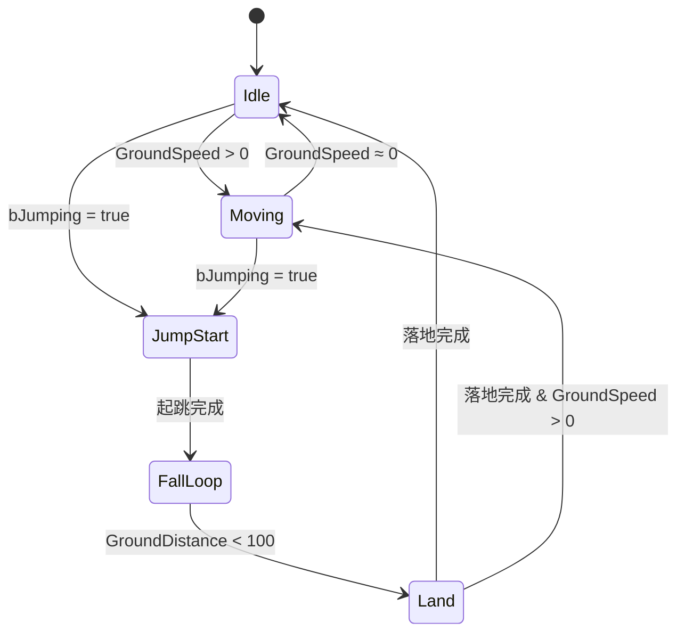

# 第二章：动画蓝图设计

> **预计耗时**: 3小时  
> **前置要求**: 已完成 [01_AnimationAssets.md](./01_AnimationAssets.md)  
> **本章目标**: 创建主动画蓝图，设计状态机，配置动画层调用

---

## 📋 本章任务清单

- [ ] 理解动画蓝图架构
- [ ] 创建/配置主动画蓝图 (ABP_DJ01Character_Base)
- [ ] 设计移动状态机 (LocomotionSM)
- [ ] 配置 Montage Slot 节点
- [ ] 集成 BindingSet 变量
- [ ] 调用动画层接口

---

## 2.1 动画蓝图架构

### Lyra 风格架构

本项目采用类似 Lyra 的动画层架构:

```
┌─────────────────────────────────────────────────────────────┐
│                ABP_DJ01Character_Base                        │
│                     (主动画蓝图)                              │
│                                                              │
│  ┌─────────────────────────────────────────────────────┐   │
│  │               AnimGraph                              │   │
│  │  ┌─────────────────────────────────────────────┐    │   │
│  │  │          LocomotionSM (状态机)              │    │   │
│  │  │  ┌─────────┐   ┌─────────┐   ┌─────────┐   │    │   │
│  │  │  │  Idle   │ → │ Moving  │ → │  Jump   │   │    │   │
│  │  │  │  State  │   │  State  │   │ States  │   │    │   │
│  │  │  └────┬────┘   └────┬────┘   └─────────┘   │    │   │
│  │  │       │             │                       │    │   │
│  │  │       ▼             ▼                       │    │   │
│  │  │  ┌──────────────────────────────────────┐  │    │   │
│  │  │  │     Animation Layer Calls            │  │    │   │
│  │  │  │  FullBody_IdleState()                │  │    │   │
│  │  │  │  FullBody_MovingState()              │  │    │   │
│  │  │  └──────────────────────────────────────┘  │    │   │
│  │  └─────────────────────────────────────────────┘    │   │
│  │                         │                            │   │
│  │                         ▼                            │   │
│  │  ┌─────────────────────────────────────────────┐    │   │
│  │  │           Slot 'DefaultSlot'                │    │   │
│  │  │        (Montage 播放在此覆盖)                │    │   │
│  │  └─────────────────────────────────────────────┘    │   │
│  │                         │                            │   │
│  │                         ▼                            │   │
│  │                   Output Pose                        │   │
│  └─────────────────────────────────────────────────────┘   │
└─────────────────────────────────────────────────────────────┘
                              │
                              │ LinkAnimClassLayers
                              ▼
┌───────────────────────────────────────────────────────────────┐
│   Linked Animation Blueprints (武器动画层)                     │
│                                                               │
│  ┌─────────────────┐  ┌─────────────────┐  ┌───────────────┐ │
│  │   ALB_Katana    │  │ ALB_SwordShield │  │ ALB_TwinSword │ │
│  │                 │  │                 │  │               │ │
│  │ FullBody_Idle() │  │ FullBody_Idle() │  │ FullBody_Idle │ │
│  │ → 刀待机动画    │  │ → 剑盾待机动画   │  │ → 双刀待机     │ │
│  └─────────────────┘  └─────────────────┘  └───────────────┘ │
└───────────────────────────────────────────────────────────────┘
```

### 关键概念

| 概念 | 说明 |
|------|------|
| **主动画蓝图 (ABP)** | 包含状态机和整体逻辑，调用动画层接口 |
| **动画层接口 (ALI)** | 定义可被覆盖的函数，返回 FPoseLink |
| **链接动画蓝图 (ALB)** | 实现具体武器的动画，被运行时链接 |
| **状态机 (SM)** | 管理移动/跳跃等状态转换 |
| **Slot** | Montage 播放的插槽，覆盖状态机输出 |

---

## 2.2 主动画蓝图结构

### 文件位置

```
Content/Characters/Heroes/HeroAnimations/
├── ABP_DJ01Character_Base.uasset    ← 主动画蓝图
```

### 父类设置

确保动画蓝图继承自项目的 AnimInstance:

```
Parent Class: UDJ01AnimInstance
             (Source/DJ01/Animation/DJ01AnimInstance.h)
```

这个基类提供:
- `InitializeWithAbilitySystem()` - GAS 集成
- `GroundSpeed` / `GroundDistance` - 物理状态数据
- `GameplayTagPropertyMap` - Tag 到变量的映射

---

## 2.3 设计状态机

### 状态机概览



### 创建状态机

1. 打开 `ABP_DJ01Character_Base`
2. 在 AnimGraph 中 **右键** → **Add New State Machine**
3. 命名为 `LocomotionSM`

### 配置状态

#### State: Idle

```
1. 双击进入 Idle State
2. 添加节点: Animation Layer → FullBody_IdleState
3. 连接到 Output Animation Pose
```

蓝图示意:
```
[FullBody_IdleState] ──→ [Output Animation Pose]
        │
        ↓
   (调用链接层的实现)
```

#### State: Moving

```
1. 双击进入 Moving State
2. 添加节点: Animation Layer → FullBody_MovingState
3. 连接到 Output Animation Pose
```

#### State: JumpStart / FallLoop / Land

类似处理，分别调用:
- `FullBody_JumpStartState()`
- `FullBody_FallLoopState()`
- `FullBody_LandState()`

### 配置转换条件

#### Idle → Moving

1. 点击转换箭头
2. 双击进入 Transition Rule
3. 添加逻辑:

```
// 蓝图逻辑 (伪代码)
Result = GroundSpeed > 1.0
```

蓝图节点:
```
[Get GroundSpeed] ──→ [>] ──→ [Result]
                      ↑
                    [1.0]
```

#### Moving → Idle

```
Result = GroundSpeed < 1.0
```

---

## 2.4 配置 Montage Slot

### Slot 节点位置

Slot 节点应放在状态机输出之后:

```
[LocomotionSM] ──→ [Slot 'DefaultSlot'] ──→ [Output Pose]
```

### 添加 Slot 节点

1. 在 AnimGraph 中
2. 状态机输出后添加 **Slot** 节点
3. 配置 Slot Name: `DefaultGroup.DefaultSlot`

### 多 Slot 配置 (高级)

如果需要上下身分离:

```
                        ┌──→ [UpperBody Slot] ──┐
[LocomotionSM] ──→ [Layered Blend per Bone] ──→ [Output Pose]
                        └──→ [LowerBody Slot] ──┘
```

配置 Layered Blend per Bone:
- **Branch Filter**: 
  - Layer 0: `spine_01` (上半身)
  - Layer 1: `pelvis` (下半身)

---

## 2.5 集成 BindingSet

### 理解 BindingSet

BindingSet 系统自动将 GAS 属性/标签绑定到动画变量:

```
                    BindingSet 配置
                          │
                          ▼
┌─────────────────────────────────────────────────┐
│              自动生成代码                        │
│  DJ01_DECLARE_BINDING_SET(StatusCondition)      │
│                                                  │
│  bool bIsStunned;     ←── Status.Condition.Stunned
│  bool bIsRooted;      ←── Status.Condition.Rooted
│  float CurrentHealth; ←── Attribute.Health.Current
└─────────────────────────────────────────────────┘
```

### 在动画蓝图中使用

1. **确保变量存在**:
   
   在 `DJ01AnimInstance.h` 中，通过宏声明:
   ```cpp
   // 引入 BindingSet 变量
   DJ01_DECLARE_BINDING_SET(StatusCondition)
   ```

2. **在蓝图中读取**:
   
   这些变量在蓝图中可直接访问:
   ```
   [Get bIsStunned] ──→ [Branch] ──→ 播放眩晕动画
   ```

3. **典型使用场景**:
   
   | 变量 | 来源标签 | 用途 |
   |------|---------|------|
   | `bIsStunned` | `Status.Condition.Stunned` | 播放眩晕动画 |
   | `bIsRooted` | `Status.Condition.Rooted` | 禁止移动动画 |
   | `bIsDead` | `Status.Condition.Dead` | 播放死亡动画 |

---

## 2.6 调用动画层

### 动画层接口定义

项目已定义 `IALI_DJ01AnimLayers` 接口:

```cpp filePath=Source/DJ01/Animation/ALI_DJ01AnimLayers.h
// 全身移动层
FPoseLink FullBody_IdleState();
FPoseLink FullBody_MovingState();
FPoseLink FullBody_JumpStartState();
FPoseLink FullBody_FallLoopState();
FPoseLink FullBody_LandState();

// 上身覆盖层
FPoseLink UpperBody_Overlay();
```

### 在状态机中调用

在每个状态内部:

1. **右键** → **Linked Anim Layers** → 选择对应函数
2. 例如在 Idle State 中:
   - 添加 `FullBody_IdleState` 节点
   - 连接到 Output

### 让主 ABP 实现接口

1. 打开 `ABP_DJ01Character_Base` 的 **Class Settings**
2. 在 **Interfaces** 中添加 `ALI_DJ01AnimLayers`
3. 实现默认的层函数 (用于无武器状态)

---

## 2.7 完整 AnimGraph 示意

```
                    AnimGraph
                        │
                        ▼
┌───────────────────────────────────────────────────────────┐
│                   LocomotionSM                             │
│                                                            │
│   ┌─────────────────────────────────────────────────┐     │
│   │                                                  │     │
│   │  [Idle] ←──→ [Moving] ←──→ [Jump States]       │     │
│   │     │            │              │               │     │
│   │     ▼            ▼              ▼               │     │
│   │  FullBody_   FullBody_    FullBody_Jump...     │     │
│   │  IdleState   MovingState                        │     │
│   │                                                  │     │
│   └─────────────────────────────────────────────────┘     │
│                          │                                 │
└──────────────────────────┼─────────────────────────────────┘
                           │
                           ▼
                 ┌──────────────────┐
                 │  Slot 'Default'  │ ← Montage 在此播放
                 └────────┬─────────┘
                          │
                          ▼
┌────────────────────────────────────────────────────────────┐
│                 Blend by Bool (bIsStunned)                  │
│                                                             │
│   False ──→ [来自Slot的Pose]                               │
│   True  ──→ [Stunned Additive Anim]                        │
│                                                             │
└────────────────────────────────────────────────────────────┘
                          │
                          ▼
                 ┌──────────────────┐
                 │   Output Pose    │
                 └──────────────────┘
```

---

## 2.8 EventGraph 配置

### 初始化 GAS 绑定

在 EventGraph 中:

```
Event Blueprint Initialize Animation
          │
          ▼
   [Try Get Pawn Owner] ──→ [Get Component by Class: AbilitySystemComponent]
                                        │
                                        ▼
                         [Initialize With Ability System]
                                   (调用父类函数)
```

### 更新动画数据

```
Event Blueprint Update Animation
          │
          ├──→ [更新 GroundSpeed]
          │         Get Velocity → Vector Length XY → Set GroundSpeed
          │
          └──→ [更新 GroundDistance]
                    Line Trace → Set GroundDistance
```

---

## 2.9 验证清单

### 编译检查

- [ ] 动画蓝图无编译错误
- [ ] 所有动画层函数有实现 (至少返回空Pose)
- [ ] 状态机转换逻辑正确

### 运行时检查

- [ ] 角色站立时播放 Idle 动画
- [ ] 角色移动时切换到 Moving 动画
- [ ] 跳跃时触发 Jump 状态序列
- [ ] BindingSet 变量正确更新

### 调试技巧

1. **启用动画调试显示**:
   ```
   控制台: ShowDebug Animation
   ```

2. **查看状态机状态**:
   - 在 AnimGraph 编辑器中勾选 **Show State Weights**

3. **检查变量值**:
   - 在 AnimGraph 编辑器中勾选 **Show Variable Values**

---

## 2.10 常见问题

### Q: 状态机不切换状态

**可能原因**:
1. 转换条件变量未更新
2. 条件阈值设置不当

**解决方案**:
- 检查 `NativeUpdateAnimation` 是否正确更新 `GroundSpeed`
- 在 EventGraph 中添加 Print 调试

### Q: 动画层调用返回空 Pose

**可能原因**:
1. 没有链接武器动画蓝图
2. 武器动画蓝图未实现该函数

**解决方案**:
- 在主 ABP 中提供默认实现
- 确保在角色初始化时调用 `LinkAnimClassLayers`

### Q: Montage 不播放

**可能原因**:
1. Slot 名称不匹配
2. Montage 的 Slot 与 AnimGraph 中的不同

**解决方案**:
- 统一使用 `DefaultGroup.DefaultSlot`
- 检查蒙太奇的 Slot 设置

---

## 2.11 下一步

完成本章后，你应该有:

✅ 一个功能完整的主动画蓝图 (`ABP_DJ01Character_Base`)  
✅ 包含 Idle/Moving/Jump 状态的状态机  
✅ 配置好的 Montage Slot  
✅ 对动画层系统的理解

接下来我们将创建武器特定的动画层蓝图。

---

👉 **[进入第三章：动画层系统](./03_AnimLayers.md)**