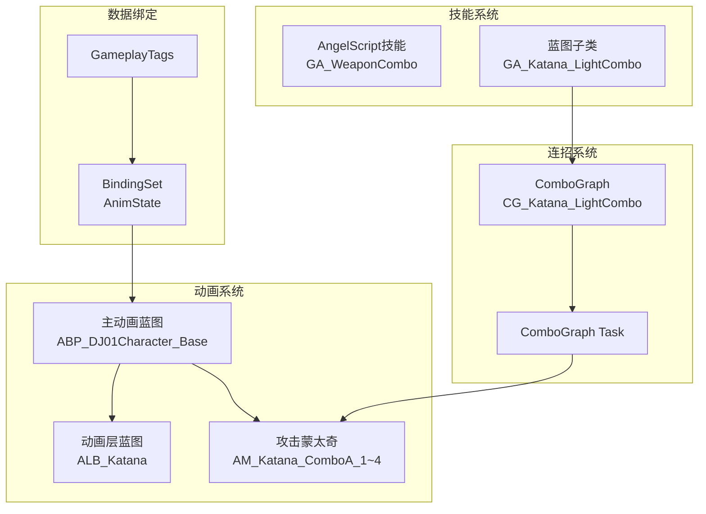

# 第七章：整合测试

> **预计耗时**: 1小时  
> **前置要求**: 已完成前六章所有内容  
> **本章目标**: 整合所有组件，进行完整测试，解决常见问题

---

## 📋 本章任务清单

- [ ] 整合检查清单
- [ ] 端到端测试
- [ ] 调试工具使用
- [ ] 常见问题排查
- [ ] 性能优化建议
- [ ] 后续扩展方向

---

## 7.1 整合检查清单

### 资产检查

#### 动画资产
| 检查项 | 状态 | 说明 |
|--------|------|------|
| 蒙太奇已创建 | ⬜ | AM_Katana_ComboA_1 ~ 4 |
| ComboWindow Notify | ⬜ | 除最后一段外都需要 |
| 伤害事件 Notify | ⬜ | SendGameplayEvent |
| Slot 配置 | ⬜ | DefaultGroup.DefaultSlot |

#### 动画蓝图
| 检查项 | 状态 | 说明 |
|--------|------|------|
| ABP 继承正确 | ⬜ | 父类: UDJ01AnimInstance |
| 状态机存在 | ⬜ | LocomotionSM |
| 动画层调用 | ⬜ | FullBody_IdleState 等 |
| Slot 节点 | ⬜ | 在状态机输出后 |
| BindingSet 初始化 | ⬜ | InitBindingSet_AnimState |

#### 动画层蓝图
| 检查项 | 状态 | 说明 |
|--------|------|------|
| 接口实现 | ⬜ | IALI_DJ01AnimLayers |
| 各函数实现 | ⬜ | IdleState, MovingState 等 |
| 动画引用 | ⬜ | 正确的武器动画 |

### 代码检查

#### BindingSet
| 检查项 | 状态 | 说明 |
|--------|------|------|
| JSON 配置 | ⬜ | BindingSetDefinitions.json |
| 代码已生成 | ⬜ | Generated/BindingSets.h |
| 宏已添加 | ⬜ | DJ01_DECLARE_BINDING_SET |
| 初始化调用 | ⬜ | InitBindingSet_xxx |

#### AngelScript 技能
| 检查项 | 状态 | 说明 |
|--------|------|------|
| 脚本无错误 | ⬜ | 热重载成功 |
| 蓝图子类 | ⬜ | GA_Katana_LightCombo |
| ComboGraph 引用 | ⬜ | 指向正确资产 |
| 技能已授予 | ⬜ | GiveAbility 调用 |

#### ComboGraph
| 检查项 | 状态 | 说明 |
|--------|------|------|
| 资产已创建 | ⬜ | CG_Katana_LightCombo |
| 节点配置 | ⬜ | 所有 Montage 正确 |
| Edge 配置 | ⬜ | Input 和 Behavior 正确 |
| 效果配置 | ⬜ | Effects Container (可选) |

---

## 7.2 端到端测试流程

### 测试 1: 基础移动动画

**步骤**:
1. 启动 PIE (Play In Editor)
2. 观察角色待机动画
3. WASD 移动，观察移动动画混合
4. 跳跃，观察跳跃动画序列

**预期结果**:
- ✅ 待机时播放 Idle 动画
- ✅ 移动时平滑过渡到移动动画
- ✅ 速度变化时 BlendSpace 正确混合
- ✅ 跳跃时播放完整的 Start → Loop → Land

**问题排查**:
| 问题 | 可能原因 | 解决方案 |
|------|---------|---------|
| T-Pose | 动画层未链接 | 检查 LinkAnimClassLayers |
| 不切换状态 | 转换条件错误 | 检查 GroundSpeed 更新 |
| 动画跳变 | BlendSpace 配置错误 | 检查轴范围和采样点 |

### 测试 2: 连招执行

**步骤**:
1. 按下攻击键 (如 左键)
2. 观察第一段攻击动画
3. 在 ComboWindow 内再次按键
4. 观察后续攻击段
5. 完成完整4段连招

**预期结果**:
- ✅ 第一次按键触发技能和第一段攻击
- ✅ 动画通过 Slot 正确播放
- ✅ 窗口内按键触发下一段
- ✅ 最后一段结束后技能正常结束

**问题排查**:
| 问题 | 可能原因 | 解决方案 |
|------|---------|---------|
| 技能不激活 | 技能未授予 | 检查 GiveAbility |
| 动画不播放 | Slot 不匹配 | 检查蒙太奇和 ABP 的 Slot |
| 连招中断 | 无 ComboWindow | 检查蒙太奇 Notify |
| 技能不结束 | 回调未绑定 | 检查 OnGraphEnd 绑定 |

### 测试 3: 分支切换

**步骤**:
1. 开始轻攻击连招
2. 在某一段的窗口内按重攻击键
3. 观察是否切换到重攻击路径

**预期结果**:
- ✅ 重攻击输入触发对应节点
- ✅ 动画正确切换
- ✅ 后续连招继续正常

### 测试 4: 状态条件

**步骤**:
1. 通过控制台或调试工具给角色添加 Stunned Tag
2. 观察动画反应
3. 尝试激活连招技能

**预期结果**:
- ✅ bIsStunned 变量更新为 true
- ✅ 动画蓝图根据状态调整 (如有配置)
- ✅ 技能被 Activation Blocked Tags 阻止

---

## 7.3 调试工具

### 控制台命令

```bash
# 显示动画调试信息
ShowDebug Animation

# 显示 GAS 调试信息
ShowDebug AbilitySystem

# ComboGraph 详细日志
Log LogComboGraph Verbose

# 技能系统日志
Log LogAbilitySystem Verbose
```

### 编辑器调试

#### 动画蓝图调试
1. 运行游戏
2. 选中角色
3. 在 ABP 编辑器中查看:
   - 状态机当前状态 (高亮)
   - 变量实时值
   - Pose 权重

#### ComboGraph 调试
1. 运行游戏
2. 打开 ComboGraph 编辑器
3. 在调试面板选择 Actor
4. 观察当前节点高亮

### 蓝图打印

在关键位置添加 Print 节点:
- 技能激活/结束
- ComboGraph 回调
- 状态变量变化

---

## 7.4 常见问题汇总

### 动画系统问题

| 问题 | 症状 | 解决方案 |
|------|------|---------|
| **T-Pose** | 角色呈 T 型 | 检查动画层是否链接，函数是否实现 |
| **动画跳变** | 状态切换时突变 | 检查 Blend Time，添加过渡动画 |
| **Montage 不播** | 攻击无动画 | 检查 Slot 名称是否匹配 |
| **根运动不生效** | 角色不移动 | 检查蒙太奇 Enable Root Motion |
| **动画循环问题** | 动画卡在某帧 | 检查 Sequence Player 的 Loop 设置 |

### 连招系统问题

| 问题 | 症状 | 解决方案 |
|------|------|---------|
| **窗口不开启** | 连招无法继续 | 检查蒙太奇的 ComboWindow Notify |
| **输入不响应** | 按键无效 | 检查 Edge 的 TransitionInput |
| **分支不生效** | 总是走同一路径 | 检查不同 Edge 的 Input 配置 |
| **伤害不触发** | 无伤害输出 | 检查 SendGameplayEvent Notify |
| **技能卡住** | 不结束 | 检查 OnGraphEnd 回调 |

### GAS 问题

| 问题 | 症状 | 解决方案 |
|------|------|---------|
| **技能不激活** | 按键无反应 | 检查技能是否授予，Tags 是否阻止 |
| **变量不更新** | BindingSet 变量不变 | 检查初始化函数是否调用 |
| **Effect 不应用** | 伤害/Buff 不生效 | 检查 Effect 配置和 Target |
| **Cue 不触发** | 无特效/音效 | 检查 GameplayCue 是否存在 |

---

## 7.5 性能优化

### 动画优化

| 优化点 | 方法 |
|--------|------|
| **减少骨骼计算** | 使用 LOD 和骨骼 LOD |
| **简化 BlendSpace** | 减少采样点数量 |
| **缓存 Pose** | 使用 Cache Pose 节点 |
| **异步加载** | 预加载常用蒙太奇 |

### ComboGraph 优化

| 优化点 | 方法 |
|--------|------|
| **简化图结构** | 避免过于复杂的分支 |
| **减少 Effect** | 合并相似的 GameplayEffect |
| **Cue 优化** | 使用 pooling，避免频繁创建 |

### GAS 优化

| 优化点 | 方法 |
|--------|------|
| **减少 Tag 查询** | 缓存常用 Tag 查询结果 |
| **批量属性更新** | 使用 SetByCallerMagnitude |
| **网络同步** | 只同步关键状态 |

---

## 7.6 后续扩展方向

### 更多武器类型

```
添加新武器的步骤:
1. 创建武器动画层 (ALB_NewWeapon)
2. 制作武器蒙太奇
3. 创建武器 ComboGraph
4. 创建武器技能蓝图子类
```

### 连招系统扩展

| 扩展 | 说明 |
|------|------|
| **空中连招** | 使用 Conduit 区分地面/空中 |
| **方向连招** | 基于输入方向选择不同动作 |
| **取消机制** | 配置哪些技能可以打断连招 |
| **连招计数器** | 实现连招数显示 |

### 高级功能

| 功能 | 实现思路 |
|------|---------|
| **输入缓冲** | ComboGraph 已内置 |
| **帧取消** | 使用 AnimNotify 配合 Tags |
| **招式解锁** | 运行时修改 ComboGraph 可用节点 |
| **连招预览** | UI 显示可用的后续招式 |

---

## 7.7 完成清单

### 必须完成

- [ ] 角色可以正常移动和跳跃
- [ ] 按攻击键可以触发连招
- [ ] 4段轻攻击连招完整执行
- [ ] 分支切换 (轻→重) 正常工作
- [ ] 技能正常结束

### 可选完成

- [ ] 多武器动画层切换
- [ ] 伤害效果触发
- [ ] GameplayCue 特效
- [ ] 状态条件阻止技能

---

## 7.8 总结

恭喜！你已经完成了 DJ01 连招系统的核心实现：

### 已完成的组件



### 数据流向

```
玩家输入 → 技能激活 → ComboGraph → 播放 Montage → 动画蓝图 → Mesh 渲染
                 ↓
            伤害/效果 → GAS → 属性变化 → BindingSet → 动画变量
```

### 下一步建议

1. **完善现有系统**: 添加更多攻击段和分支
2. **添加其他武器**: 复制流程创建剑盾、双刀等
3. **优化手感**: 调整窗口时机和动画混合
4. **添加特效**: 创建 GameplayCue 丰富反馈
5. **网络同步**: 测试多人游戏场景

---

## 📚 参考资源

### 项目文档
- [ComboGraph 使用指南](../../Plugins/ComboGraph/USAGE_GUIDE.md)
- [BindingSet 使用指南](../../Tools/AttributeGenerator/docs/BindingSet使用指南.md)

### 官方文档
- [UE5 Animation Documentation](https://docs.unrealengine.com/5.0/en-US/animation-in-unreal-engine/)
- [Gameplay Ability System](https://docs.unrealengine.com/5.0/en-US/gameplay-ability-system-for-unreal-engine/)

### 社区资源
- [ComboGraph Discord](https://discord.gg/d4rs4vcX6t)
- [ComboGraph 官方文档](https://combo-graph.github.io)

---

**🎉 连招系统开发指南完成！祝你开发顺利！**