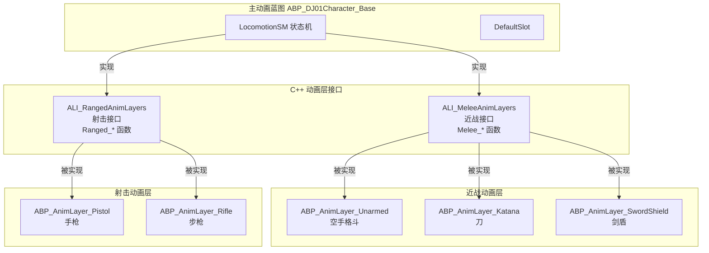

# 01. 创建主动画蓝图

> **预计耗时**: 45 分钟  
> **前置条件**: 已阅读 00_ABP架构总览

---

## 🎯 本章目标

创建 `ABP_DJ01Character_Base` - 项目的主动画蓝图，它将：

1. 继承自 `UDJ01AnimInstance` (C++ 基类)
2. 实现 **双动画层接口** - 支持近战和射击武器
3. 包含基础的状态机骨架
4. 提供 Montage 播放的 Slot

---

## 🏗️ 双接口架构说明

项目使用 **两个 C++ 动画层接口**，完全自主控制，不依赖 Lyra 的复杂系统：



### 接口职责划分

| 接口 | 文件位置 | 函数前缀 | 适用武器 |
|------|---------|---------|---------|
| **ALI_MeleeAnimLayers** | `Source/DJ01/Animation/ALI_MeleeAnimLayers.h` | `Melee_` | 空手、刀、剑盾、双剑 |
| **ALI_RangedAnimLayers** | `Source/DJ01/Animation/ALI_RangedAnimLayers.h` | `Ranged_` | 手枪、步枪、弓箭 |

### 为什么这样设计？

| 优势 | 说明 |
|------|------|
| ✅ **完全自主** | 不依赖 Lyra 的 Distance Matching 等复杂 C++ 代码 |
| ✅ **简单可靠** | 使用标准 UE5 BlendSpace 和状态机，易于调试 |
| ✅ **职责清晰** | 近战 vs 射击，命名直观 |
| ✅ **易于扩展** | 新武器只需创建对应的动画层蓝图 |
| ✅ **复用动画资源** | 仍可使用 Lyra 的动画资产（MM_Unarmed_* 等） |

---

## 📝 创建步骤

### Step 1: 创建动画蓝图

1. **在内容浏览器中导航到**:
   ```
   Content/Characters/Heroes/HeroAnimations/
   ```

2. **右键 → Animation → Animation Blueprint**

3. **选择父类和骨骼**:
   - Parent Class: `DJ01AnimInstance`
   - Target Skeleton: `SK_Mannequin` (或你的角色骨骼)

4. **命名为**: `ABP_DJ01Character_Base`

5. **双击打开**

---

### Step 2: 实现动画层接口（双接口）

主动画蓝图需要 **同时实现两个 C++ 接口**：近战接口 + 射击接口。

1. **打开 Class Settings**:
   - 点击工具栏 `Class Settings`

2. **添加近战接口**:
   - 在 Details 面板找到 `Interfaces` → `已实现的接口`
   - 点击 `添加` → 搜索 `ALI_MeleeAnimLayers`
   - 选择 `ALI_MeleeAnimLayers`

3. **添加射击接口**:
   - 再次点击 `添加` → 搜索 `ALI_RangedAnimLayers`
   - 选择 `ALI_RangedAnimLayers`

4. **编译保存**:
   - 点击 `Compile`
   - 现在你会在 My Blueprint 面板看到 **两组** 接口函数

```
My Blueprint
├── Interfaces
│   │
│   ├── 📁 ALI_MeleeAnimLayers (近战)
│   │   │
│   │   ├── 🏃 移动层
│   │   │   ├── Melee_IdleState           ← 近战待机
│   │   │   ├── Melee_MovingState         ← 近战移动
│   │   │   └── Melee_SprintState         ← 近战冲刺
│   │   │
│   │   ├── 🦘 跳跃层
│   │   │   ├── Melee_JumpStartState      ← 起跳
│   │   │   ├── Melee_FallLoopState       ← 下落
│   │   │   └── Melee_LandState           ← 落地
│   │   │
│   │   ├── ⚔️ 战斗层
│   │   │   ├── Melee_BlockState          ← 格挡
│   │   │   ├── Melee_BlockHitState       ← 格挡受击
│   │   │   ├── Melee_DodgeState          ← 闪避
│   │   │   ├── Melee_HitReactState       ← 受击硬直
│   │   │   ├── Melee_KnockdownState      ← 倒地
│   │   │   └── Melee_GetUpState          ← 起身
│   │   │
│   │   └── 🗡️ 武器层
│   │       ├── Melee_DrawWeaponState     ← 拔刀
│   │       └── Melee_SheathWeaponState   ← 收刀
│   │
│   └── 📁 ALI_RangedAnimLayers (射击)
│       │
│       ├── 🏃 移动层
│       │   ├── Ranged_IdleState          ← 持枪待机
│       │   ├── Ranged_WalkState          ← 持枪移动
│       │   └── Ranged_SprintState        ← 持枪冲刺
│       │
│       ├── 🦘 跳跃层
│       │   ├── Ranged_JumpStartState     ← 起跳
│       │   ├── Ranged_FallLoopState      ← 下落
│       │   └── Ranged_LandState          ← 落地
│       │
│       ├── 🦵 蹲伏层
│       │   ├── Ranged_CrouchIdleState    ← 蹲伏待机
│       │   └── Ranged_CrouchWalkState    ← 蹲伏移动
│       │
│       ├── 🎯 射击层
│       │   ├── Ranged_AimingState        ← 瞄准 (ADS)
│       │   ├── Ranged_HipfireIdleState   ← 髋射待机
│       │   └── Ranged_ReloadState        ← 换弹
│       │
│       └── 📐 覆盖层
│           └── UpperBody_Overlay         ← 上身覆盖
```

> **💡 命名规则**: 
> - 近战函数以 `Melee_` 开头
> - 射击函数以 `Ranged_` 开头

---

### Step 2.5: 理解接口函数的使用方式

#### 核心概念：根据动画层类型调用不同接口

```
┌─────────────────────────────────────────────────────────────────┐
│  状态机中的 Idle 状态                                            │
├─────────────────────────────────────────────────────────────────┤
│                                                                  │
│   ┌────────────────┐                                            │
│   │ AnimLayerType  │                                            │
│   └───────┬────────┘                                            │
│           │                                                      │
│           ▼                                                      │
│   ┌───────────────────┐                                         │
│   │ Switch on         │                                         │
│   │ EAnimLayerType    │                                         │
│   └───────┬───────────┘                                         │
│           │                                                      │
│     ┌─────┴─────┬─────────┬─────────┐                           │
│     │           │         │         │                           │
│     ▼           ▼         ▼         ▼                           │
│  Melee      Ranged    Aerial    Monster...                      │
│     │           │         │         │                           │
│     ▼           ▼         ▼         ▼                           │
│ ┌────────┐ ┌────────┐ ┌────────┐ ┌────────┐                    │
│ │ Melee_ │ │Ranged_ │ │Aerial_ │ │Monster_│                    │
│ │ Idle   │ │ Idle   │ │ Idle   │ │ Idle   │                    │
│ │ State()│ │ State()│ │ State()│ │ State()│                    │
│ └───┬────┘ └───┬────┘ └───┬────┘ └───┬────┘                    │
│     │          │          │          │                          │
│     └──────────┴──────────┴──────────┘                          │
│                     │                                            │
│                     ▼                                            │
│            ┌─────────────────┐                                   │
│            │ Blend Poses     │                                   │
│            │ by Int          │ ──────────→ Output Pose           │
│            └─────────────────┘                                   │
│                                                                  │
└─────────────────────────────────────────────────────────────────┘
```

#### 运行时切换武器动画

```cpp
// === 切换到空手格斗 (使用近战接口) ===
AnimInstance->AnimLayerType = EAnimLayerType::Melee;
AnimInstance->LinkAnimClassLayers(ABP_AnimLayer_Unarmed::StaticClass());

// === 切换到刀 (使用近战接口) ===
AnimInstance->AnimLayerType = EAnimLayerType::Melee;
AnimInstance->LinkAnimClassLayers(ABP_AnimLayer_Katana::StaticClass());

// === 切换到手枪 (使用射击接口) ===
AnimInstance->AnimLayerType = EAnimLayerType::Ranged;
AnimInstance->LinkAnimClassLayers(ABP_AnimLayer_Pistol::StaticClass());

// === 切换到飞行形态 (使用空中接口) ===
AnimInstance->AnimLayerType = EAnimLayerType::Aerial;
AnimInstance->LinkAnimClassLayers(ABP_AnimLayer_Flying::StaticClass());

// === 怪物 Boss 形态 ===
AnimInstance->AnimLayerType = EAnimLayerType::MonsterB;
AnimInstance->LinkAnimClassLayers(ABP_AnimLayer_GiantBoss::StaticClass());
```

#### 需要创建的动画层

| 动画层 | 实现接口 | 使用的动画资源 |
|--------|---------|---------------|
| `ABP_AnimLayer_Unarmed` | `ALI_MeleeAnimLayers` | `MM_Unarmed_*` (Lyra) |
| `ABP_AnimLayer_Katana` | `ALI_MeleeAnimLayers` | 自定义刀动画 |
| `ABP_AnimLayer_SwordShield` | `ALI_MeleeAnimLayers` | 自定义剑盾动画 |
| `ABP_AnimLayer_Pistol` | `ALI_RangedAnimLayers` | `MM_Pistol_*` (Lyra) |
| `ABP_AnimLayer_Rifle` | `ALI_RangedAnimLayers` | `MM_Rifle_*` (Lyra) |

> **📝 注意**: 动画层使用 Lyra 的动画资源（如 `MM_Unarmed_Idle_Ready`），但动画蓝图逻辑我们自己写，简单可控

---

### Step 3: 创建基础 AnimGraph

1. **打开 AnimGraph**:
   - 点击左侧 `AnimGraph` 标签

2. **创建状态机**:
   - 右键 → Add New State Machine
   - 命名为 `LocomotionSM`

3. **添加 Slot 节点**:
   - 右键 → 搜索 `Slot`
   - 选择 `Slot 'DefaultSlot'`
   - 这是播放攻击蒙太奇的地方

4. **连接节点**:

```
                    ┌──────────────────┐
                    │  LocomotionSM    │
                    │  (State Machine) │
                    └────────┬─────────┘
                             │
                             ▼
                    ┌──────────────────┐
                    │  DefaultSlot     │
                    │  (Slot Node)     │
                    └────────┬─────────┘
                             │
                             ▼
                    ┌──────────────────┐
                    │  Output Pose     │
                    └──────────────────┘
```

5. **详细节点设置**:

   **DefaultSlot 设置**:
   - Slot Name: `DefaultSlot`
   - Always Update Source Pose: ✅ (确保移动动画持续更新)

---

### Step 4: 设置状态机内部 (初始版本)

1. **双击 LocomotionSM 进入**

2. **创建状态**:
   - 右键 → Add State → 命名为 `Idle`
   - 右键 → Add State → 命名为 `Moving`
   - 右键 → Add State → 命名为 `Jump`

3. **连接 Entry**:
   - 从 `Entry` 拖线到 `Idle`
   - 这是默认状态

4. **创建转换规则** (暂时简化):
   - `Idle` → `Moving`: 当 GroundSpeed > 10
   - `Moving` → `Idle`: 当 GroundSpeed <= 10
   - 跳跃相关转换后续添加

**状态机结构**:

```
     ┌─────────┐
     │  Entry  │
     └────┬────┘
          │
          ▼
     ┌─────────┐     GroundSpeed > 10      ┌─────────┐
     │  Idle   │ ────────────────────────→ │ Moving  │
     └─────────┘ ←──────────────────────── └─────────┘
                   GroundSpeed <= 10
          │                                      │
          │         ┌─────────┐                  │
          └────────→│  Jump   │←─────────────────┘
                    └─────────┘
```

---

### Step 5: 配置状态内容 (临时占位)

在后续章节中，我们会用动画层接口替换这些内容。现在先用简单动画占位：

> **💡 推荐使用 Lyra 动画资产**
> 
> 项目中已从 Lyra 导入了完整的移动动画，位于：
> ```
> /Game/Characters/Heroes/Mannequin_Mesh/Animations/Locomotion/Unarmed/
> ```
> 
> 这些动画使用 UE5 Mannequin 骨骼，与项目角色兼容。

#### 可用的 Lyra Unarmed 动画资产：

| 动画类型 | 男性角色 (MM_) | 女性角色 (MF_) |
|---------|---------------|---------------|
| **Idle** | `MM_Unarmed_Idle_Ready` | `MF_Unarmed_Idle_Ready` |
| **Idle Break** | `MM_Unarmed_IdleBreak_Fidget` | `MF_Unarmed_Idle_Break` |
| **Walk 前进** | `MM_Unarmed_Walk_Fwd` | `MF_Unarmed_Walk_Fwd` |
| **Walk 后退** | `MM_Unarmed_Walk_Bwd` | `MF_Unarmed_Walk_Bwd` |
| **Walk 左** | `MM_Unarmed_Walk_Left` | `MF_Unarmed_Walk_Left` |
| **Walk 右** | `MM_Unarmed_Walk_Right` | `MF_Unarmed_Walk_Right` |
| **Jog 前进** | `MM_Unarmed_Jog_Fwd` | `MF_Unarmed_Jog_Fwd` |
| **Jog 后退** | `MM_Unarmed_Jog_Bwd` | `MF_Unarmed_Jog_Bwd` |
| **Jog 左** | `MM_Unarmed_Jog_Left` | `MF_Unarmed_Jog_Left` |
| **Jog 右** | `MM_Unarmed_Jog_Right` | `MF_Unarmed_Jog_Right` |
| **Crouch Idle** | `MM_Unarmed_Crouch_Idle` | - |
| **Crouch Walk** | `MM_Unarmed_Crouch_Walk_Fwd` | - |

> **📂 完整动画资产路径**
> ```
> /Game/Characters/Heroes/Mannequin_Mesh/Animations/Locomotion/Unarmed/
> ├── MM_Unarmed_Idle_Ready.uasset          ← 推荐用于 Idle 状态
> ├── MM_Unarmed_Jog_Fwd.uasset             ← 推荐用于 Moving 状态
> ├── BS_MM_Unarmed_Jog_Walk.uasset         ← BlendSpace (高级)
> └── ...
> ```

---

#### 配置各状态动画：

1. **双击 Idle 状态**:
   - 添加 `Play Asset` 节点
   - 选择 Lyra 动画: `MM_Unarmed_Idle_Ready`
     - 路径: `/Game/Characters/Heroes/Mannequin_Mesh/Animations/Locomotion/Unarmed/`
   - 连接到 `Output Animation Pose`

2. **双击 Moving 状态**:
   - 添加 `Play Asset` 节点
   - 选择 Lyra 动画: `MM_Unarmed_Jog_Fwd`
     - 路径: `/Game/Characters/Heroes/Mannequin_Mesh/Animations/Locomotion/Unarmed/`
   - 连接到 `Output Animation Pose`
   
   > **🎯 进阶方案**: 使用 BlendSpace `BS_MM_Unarmed_Jog_Walk` 替代单一动画，可以实现多方向移动混合。

3. **双击 Jump 状态**:
   - 添加 `Play Asset` 节点
   - 选择 Lyra 动画 (从 Pistol 目录借用): `MM_Pistol_Jump_Start`
     - 路径: `/Game/Characters/Heroes/Mannequin_Mesh/Animations/Locomotion/Pistol/`
   - 连接到 `Output Animation Pose`
   
   > **📝 注意**: Unarmed 目录没有跳跃动画，可以从 Pistol/Rifle 目录借用，姿态相近。

---

#### 使用 BlendSpace 实现多方向移动 (可选进阶)

项目中已有现成的 BlendSpace：

```
/Game/Characters/Heroes/Mannequin_Mesh/Animations/Locomotion/Unarmed/BS_MM_Unarmed_Jog_Walk
```

在 Moving 状态中使用 BlendSpace：

1. **双击 Moving 状态**
2. 删除 `Play Asset` 节点
3. 添加 `BlendSpace Player` 节点
4. 选择 `BS_MM_Unarmed_Jog_Walk`
5. 连接输入参数：
   - **Speed**: 连接 `GroundSpeed` 变量

> **📝 注意**: `BS_MM_Unarmed_Jog_Walk` 是 **1D BlendSpace**，仅根据速度在 Walk 和 Jog 之间混合（低速 → Walk，高速 → Jog），没有方向参数。如需多方向移动混合，需要使用 2D BlendSpace（如 `BS_MM_Unarmed_WalkJog_Cardinal`）。

```
┌─────────────────────────────────────────────────────────────┐
│  Moving 状态 (使用 1D BlendSpace)                            │
├─────────────────────────────────────────────────────────────┤
│                                                              │
│  [GroundSpeed] ──→ ┌─────────────────────────┐              │
│                    │  BlendSpace Player      │              │
│                    │  BS_MM_Unarmed_Jog_Walk │ ──→ Output   │
│                    └─────────────────────────┘              │
│                                                              │
│  💡 这是 1D BlendSpace，只有 Speed 一个输入                   │
│     低速 → Walk 动画                                         │
│     高速 → Jog 动画                                          │
│                                                              │
└─────────────────────────────────────────────────────────────┘
```

---

### Step 6: 使用继承的变量

父类 `UDJ01AnimInstance` 提供了两类变量，**无需在蓝图中手动获取**：

#### 物理状态变量 (C++ 每帧更新)

| 变量 | 类型 | 说明 | 用途 |
|------|------|------|------|
| `GroundSpeed` | float | 地面移动速度 (XY平面) | 状态机转换、BlendSpace 输入 |
| `GroundDistance` | float | 角色到地面的距离 | 跳跃/落地动画控制 |
| `bIsFalling` | bool | 是否在空中 (物理状态) | 状态机转换：进入 InAir 状态 |
| `TimeInAir` | float | 空中持续时间 (秒) | 判断轻/重落地 |

```cpp
// DJ01AnimInstance.cpp - NativeUpdateAnimation 中自动更新
GroundSpeed = CharMoveComp->Velocity.Size2D();
GroundDistance = GroundInfo.GroundDistance;
bIsFalling = CharMoveComp->IsFalling();
TimeInAir += DeltaSeconds;  // 空中时累加
```

#### BindingSet 变量 (GAS Tag 自动同步)

通过 `BindingSet_AnimState` 系统，以下变量会随 GAS Tag 变化自动更新：

| 变量 | 类型 | 关联 Tag | 说明 |
|------|------|---------|------|
| `bIsDead` | bool | `Status.Death` | 是否死亡 |
| `bIsGrounded` | bool | `Status.Movement.Grounded` | 是否在地面 (GAS 逻辑) |
| `bIsInAir` | bool | `Status.Movement.InAir` | 是否在空中 (GAS 逻辑) |
| `bHasJumped` | bool | `Status.Movement.Jumping` | 是否主动跳跃 ⭐ |
| `bIsSprinting` | bool | `Status.Movement.Sprinting` | 是否冲刺 |
| `bIsCrouching` | bool | `Status.Movement.Crouching` | 是否蹲伏 |
| `bIsAttacking` | bool | `Status.Action.Attacking` | 是否攻击中 |
| `bIsBlocking` | bool | `Status.Action.Blocking` | 是否格挡中 |
| `bIsDodging` | bool | `Status.Action.Dodging` | 是否闪避中 |
| `bIsCasting` | bool | `Status.Action.Casting` | 是否施法中 |
| `bIsStunned` | bool | `Status.Condition.Stunned` | 是否眩晕 |
| `bIsRooted` | bool | `Status.Condition.Rooted` | 是否定身 |
| `bIsSilenced` | bool | `Status.Condition.Silenced` | 是否沉默 |
| `bIsSlowed` | bool | `Status.Condition.Slowed` | 是否减速 |
| `bIsHasted` | bool | `Status.Condition.Hasted` | 是否加速 |
| `TotalMoveSpeed` | float | Attribute 变化 | 移动速度总值 |
| `TotalAttackSpeed` | float | Attribute 变化 | 攻击速度倍率 |

> **💡 关键区别**：
> - `bIsFalling` = 物理状态，每帧从 CharacterMovement 读取，**实时精确**
> - `bIsInAir` = GAS 逻辑状态，由 Ability/Effect 设置 Tag 触发，**可能有延迟**
> - `bHasJumped` = 区分主动跳跃 vs 被动坠落，**由 GA_Jump 设置 Tag**

#### 使用建议

```
┌─────────────────────────────────────────────────────────────────┐
│  状态机转换 (需要精确)                                           │
├─────────────────────────────────────────────────────────────────┤
│  • 进入 InAir 状态：使用 bIsFalling (物理精确)                   │
│  • 进入 Moving 状态：使用 GroundSpeed > 10                       │
│  • 进入 Crouch 状态：使用 bIsCrouching (GAS Tag)                │
└─────────────────────────────────────────────────────────────────┘

┌─────────────────────────────────────────────────────────────────┐
│  动画选择 (需要逻辑判断)                                         │
├─────────────────────────────────────────────────────────────────┤
│  • 选择跳跃动画 vs 坠落动画：使用 bHasJumped (区分主动/被动)     │
│  • 选择轻落地 vs 重落地：使用 TimeInAir < 0.5 秒                 │
│  • 受击时是否眩晕动画：使用 bIsStunned                           │
└─────────────────────────────────────────────────────────────────┘
```

---

### Step 7: 配置转换规则

1. **双击 Idle → Moving 的转换**:
   - 添加条件: `GroundSpeed > 10.0`

2. **双击 Moving → Idle 的转换**:
   - 添加条件: `GroundSpeed <= 10.0`

**蓝图节点**:

```
[GroundSpeed] ──→ [>] ──→ [Result]
                   │
                 10.0
```

---

### Step 8: 绑定到角色

1. **打开角色蓝图** (如 `BP_DJ01Character`)

2. **选择 Mesh 组件**

3. **设置 Anim Class**:
   - Details → Animation → Anim Class
   - 选择 `ABP_DJ01Character_Base`

4. **测试运行**:
   - PIE 运行
   - 角色应该能播放 Idle 动画
   - 移动时切换到 Moving 动画

---

## 🔀 武器类型切换逻辑

根据当前装备的武器类型，状态机需要调用不同接口的函数。

### Step 9: 动画层类型变量

`AnimLayerType` 变量已在 C++ 基类 `UDJ01AnimInstance` 中定义，**无需在蓝图中手动创建**：

```cpp
// DJ01AnimationTypes.h - 枚举定义
UENUM(BlueprintType)
enum class EAnimLayerType : uint8
{
    Melee,      // 近战 - ALI_MeleeAnimLayers (空手/刀/剑盾)
    Ranged,     // 远程 - ALI_RangedAnimLayers (手枪/步枪)
    Aerial,     // 空中 - ALI_AerialAnimLayers (飞行/滑翔)
    MonsterA,   // 怪物A - ALI_MonsterAnimLayers_A (四足/爬行)
    MonsterB,   // 怪物B - ALI_MonsterAnimLayers_B (巨型/Boss)
    Vehicle,    // 载具 - ALI_VehicleAnimLayers (骑乘)
};

// DJ01AnimInstance.h - 变量声明
UPROPERTY(BlueprintReadWrite, Category = "Character State Data|AnimLayer")
EAnimLayerType AnimLayerType = EAnimLayerType::Melee;
```

| 枚举值 | 使用的接口 | 适用场景 |
|--------|-----------|---------|
| `Melee` | `ALI_MeleeAnimLayers` | 空手、刀、剑盾、双剑 |
| `Ranged` | `ALI_RangedAnimLayers` | 手枪、步枪、弓箭 |
| `Aerial` | `ALI_AerialAnimLayers` | 飞行、滑翔形态 |
| `MonsterA` | `ALI_MonsterAnimLayers_A` | 四足怪物、爬行类 |
| `MonsterB` | `ALI_MonsterAnimLayers_B` | 巨型怪物、Boss |
| `Vehicle` | `ALI_VehicleAnimLayers` | 骑乘载具 |

> **💡 直接使用**: 在状态机中使用 `Switch on EAnimLayerType` 节点来分支调用不同接口。

### Step 10: 在状态中实现分支逻辑

在每个状态内，根据 `AnimLayerType` 选择调用哪个接口：

```
┌───────────────────────────────────────────────────────────────────┐
│  Idle 状态                                                         │
├───────────────────────────────────────────────────────────────────┤
│                                                                    │
│   ┌────────────────┐                                              │
│   │ AnimLayerType  │                                              │
│   └───────┬────────┘                                              │
│           │                                                        │
│           ▼                                                        │
│   ┌───────────────────┐                                           │
│   │ Switch on         │                                           │
│   │ EAnimLayerType    │                                           │
│   └───────┬───────────┘                                           │
│           │                                                        │
│   ┌───────┼───────┬───────────┐                                   │
│   │       │       │           │                                   │
│   ▼       ▼       ▼           ▼                                   │
│ Melee  Ranged  Aerial     Monster...                              │
│   │       │       │           │                                   │
│   ▼       ▼       ▼           ▼                                   │
│ ┌─────┐ ┌─────┐ ┌─────┐   ┌─────┐                                │
│ │Melee│ │Ranged│ │Aerial│  │Mon_ │                                │
│ │Idle │ │Idle │ │Idle │  │Idle │                                │
│ │State│ │State│ │State│  │State│                                │
│ └──┬──┘ └──┬──┘ └──┬──┘  └──┬──┘                                │
│    │       │       │        │                                     │
│    └───────┴───────┴────────┘                                     │
│                 │                                                  │
│                 ▼                                                  │
│        ┌─────────────────┐                                        │
│        │ Blend Poses     │                                        │
│        │ by Int          │ ──────────────→ Output Pose            │
│        └─────────────────┘                                        │
│                                                                    │
└───────────────────────────────────────────────────────────────────┘
```

**蓝图实现**:

1. 拖入 `AnimLayerType` 变量
2. 添加 `Switch on EAnimLayerType` 节点
3. 每个输出引脚连接对应接口的函数：
   - Melee → `Melee_IdleState()`
   - Ranged → `Ranged_IdleState()`
   - Aerial → `Aerial_IdleState()`（需要先创建接口）
4. 使用 `Blend Poses by Int` 混合输出
5. 输出连接 `Output Animation Pose`

---

## 📋 接口函数速查表

### ALI_MeleeAnimLayers (近战接口)

> **文件位置**: `Source/DJ01/Animation/ALI_MeleeAnimLayers.h`

| 函数名 | 用途 | 适用状态 |
|--------|------|---------|
| `Melee_IdleState()` | 近战待机姿势 | Idle |
| `Melee_MovingState()` | 持武器移动 | Moving |
| `Melee_SprintState()` | 持武器冲刺 | Sprint |
| `Melee_JumpStartState()` | 起跳 | Jump |
| `Melee_FallLoopState()` | 下落 | Falling |
| `Melee_LandState()` | 落地 | Land |
| `Melee_BlockState()` | ⚔️ 格挡防御 | Block |
| `Melee_BlockHitState()` | ⚔️ 格挡受击 | BlockHit |
| `Melee_DodgeState()` | ⚔️ 闪避翻滚 | Dodge |
| `Melee_HitReactState()` | ⚔️ 受击硬直 | HitReact |
| `Melee_KnockdownState()` | ⚔️ 被击倒 | Knockdown |
| `Melee_GetUpState()` | ⚔️ 起身恢复 | GetUp |
| `Melee_DrawWeaponState()` | 🗡️ 拔刀 | Equip |
| `Melee_SheathWeaponState()` | 🗡️ 收刀 | Unequip |

### ALI_RangedAnimLayers (射击接口)

> **文件位置**: `Source/DJ01/Animation/ALI_RangedAnimLayers.h`

| 函数名 | 用途 | 适用状态 |
|--------|------|---------|
| `Ranged_IdleState()` | 持枪待机 | Idle |
| `Ranged_WalkState()` | 持枪移动 | Moving |
| `Ranged_SprintState()` | 持枪冲刺 | Sprint |
| `Ranged_JumpStartState()` | 起跳 | Jump |
| `Ranged_FallLoopState()` | 下落 | Falling |
| `Ranged_LandState()` | 落地 | Land |
| `Ranged_CrouchIdleState()` | 🦵 蹲伏待机 | CrouchIdle |
| `Ranged_CrouchWalkState()` | 🦵 蹲伏移动 | CrouchMove |
| `Ranged_AimingState()` | 🎯 瞄准 (ADS) | Aiming |
| `Ranged_HipfireIdleState()` | 🔫 髋射待机 | Hipfire |
| `Ranged_ReloadState()` | 🔄 换弹 | Reload |
| `UpperBody_Overlay()` | � 上身覆盖 | Overlay |

---

## ✅ 完成检查清单

- [ ] 创建了 `ABP_DJ01Character_Base`
- [ ] 继承自 `UDJ01AnimInstance`
- [ ] 实现了 **两个接口**: `ALI_MeleeAnimLayers` + `ALI_RangedAnimLayers`
- [ ] AnimGraph 包含 LocomotionSM + DefaultSlot
- [ ] 状态机有 Idle/Moving/Jump 三个状态
- [ ] 转换规则使用 GroundSpeed 变量
- [ ] 使用 `AnimLayerType` 枚举控制动画层类型切换
- [ ] 角色蓝图已绑定此 ABP
- [ ] PIE 测试动画正常切换

---

## ⚠️ 常见问题

### Q: 找不到 C++ 接口

**A**: 确保：
1. 项目已编译成功（无 C++ 错误）
2. 接口文件位于正确路径：
   - `Source/DJ01/Animation/ALI_MeleeAnimLayers.h`
   - `Source/DJ01/Animation/ALI_RangedAnimLayers.h`
3. 头文件包含了正确的 `GENERATED_BODY()` 宏
4. 尝试重启编辑器

### Q: 编译时报错 "Interface function not implemented"

**A**: 接口函数使用 `BlueprintImplementableEvent`，不需要强制实现。但如果出现此错误：
1. 双击每个接口函数
2. 添加一个简单的 `Return Node`
3. 连接一个 `Play Sequence Player` 或返回空 Pose

### Q: 接口函数返回 "Invalid Pose"

**A**: 接口函数必须返回有效的 Pose。检查：
1. 是否有动画资产连接到 Return 节点
2. 动画资产的骨骼是否与角色匹配
3. 尝试使用 Lyra 动画测试：`MM_Unarmed_Idle_Ready`

### Q: 状态机不切换状态

**A**: 检查：
1. `GroundSpeed` 变量是否有值（在蓝图调试中查看）
2. 转换规则的条件是否正确
3. 确保父类 `UDJ01AnimInstance` 的 `NativeUpdateAnimation` 被调用

### Q: Montage 不播放

**A**: 确保：
1. DefaultSlot 节点存在且连接正确
2. 蒙太奇使用的 Slot Name 是 `DefaultSlot`
3. AnimGraph 完整连接到 Output Pose

### Q: 不同形态的动画如何切换？

**A**: 两步走：
1. **设置枚举** `AnimLayerType`：决定状态机调用哪个接口的函数
2. **Link 动画层** `LinkAnimClassLayers()`：切换具体的动画蓝图

```cpp
// 切换到近战 (空手/刀/剑)
AnimInstance->AnimLayerType = EAnimLayerType::Melee;
AnimInstance->LinkAnimClassLayers(ABP_AnimLayer_Katana::StaticClass());

// 切换到射击 (手枪/步枪)
AnimInstance->AnimLayerType = EAnimLayerType::Ranged;
AnimInstance->LinkAnimClassLayers(ABP_AnimLayer_Pistol::StaticClass());

// 切换到空中形态
AnimInstance->AnimLayerType = EAnimLayerType::Aerial;
AnimInstance->LinkAnimClassLayers(ABP_AnimLayer_Flying::StaticClass());
```

### Q: 为什么不直接用 Lyra 的动画层？

**A**: Lyra 的动画层（如 `ABP_UnarmedAnimLayers`）依赖 Lyra 特有的 C++ 代码：
- Distance Matching 系统
- Motion Prediction 函数
- 自定义 AnimInstance 基类

直接复制会报大量错误。我们的方案使用标准 UE5 功能，简单可靠。

---

## 📞 下一步

主动画蓝图骨架已完成！接下来我们要设计完整的状态机。

👉 **[进入第二章：状态机设计](./02_状态机设计.md)**