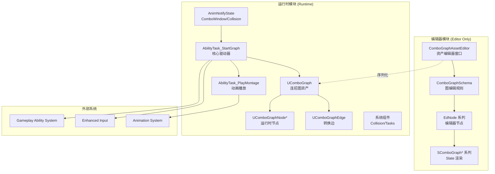
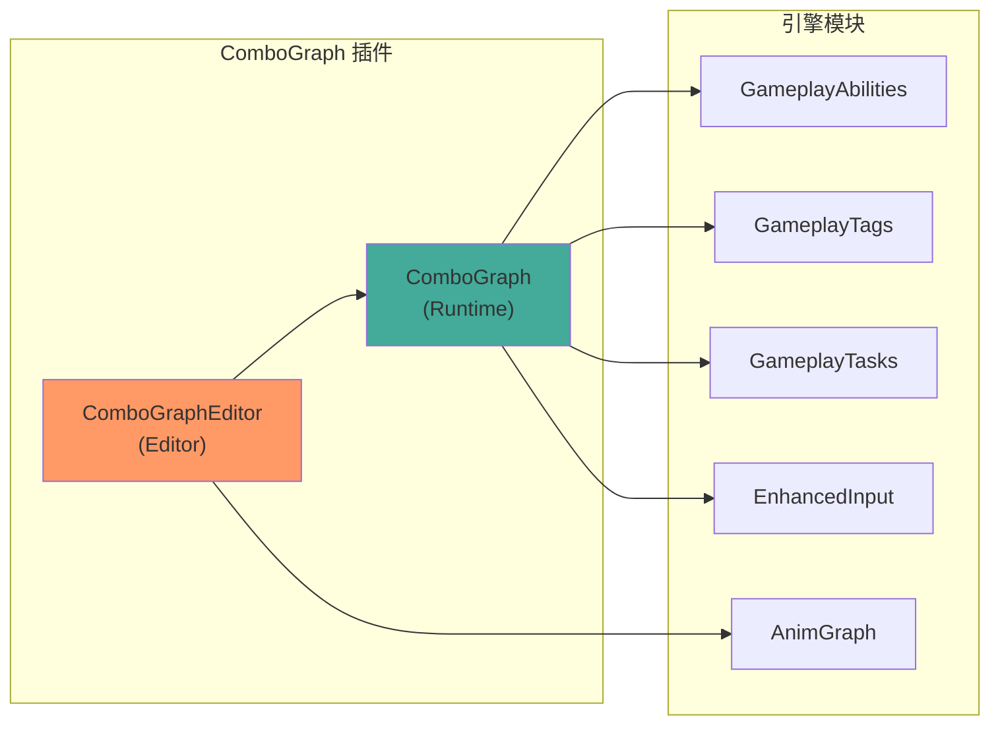

# ComboGraph 设计思想与架构概述

## 1. 解决的核心问题

### 传统连招系统的痛点

```
❌ 纯代码实现
   - 状态机逻辑分散在多个文件
   - 添加/修改连招需要改代码
   - 难以可视化调试
   
❌ 硬编码动画序列
   - if-else 嵌套判断输入
   - 时序控制复杂易错
   - 扩展性差
```

### ComboGraph 的解决方案

```
✅ 可视化图表编辑
   - 节点 = 动作（动画）
   - 边 = 转换条件（输入）
   - 所见即所得
   
✅ 数据驱动设计
   - 连招配置与代码分离
   - 设计师可直接编辑
   - 运行时动态解析
```

---

## 2. 设计哲学

### 2.1 分层架构

```
┌─────────────────────────────────────────────────────────┐
│                    编辑器层 (Editor)                      │
│  ┌─────────────┐ ┌─────────────┐ ┌─────────────────────┐│
│  │ Asset Editor │ │ Graph View  │ │ Property Inspector ││
│  └─────────────┘ └─────────────┘ └─────────────────────┘│
├─────────────────────────────────────────────────────────┤
│                    数据层 (Data)                          │
│  ┌─────────────┐ ┌─────────────┐ ┌─────────────────────┐│
│  │ UComboGraph │ │ NodeBase    │ │ Edge               ││
│  └─────────────┘ └─────────────┘ └─────────────────────┘│
├─────────────────────────────────────────────────────────┤
│                    运行时层 (Runtime)                     │
│  ┌─────────────┐ ┌─────────────┐ ┌─────────────────────┐│
│  │ AbilityTask │ │ AnimNotify  │ │ CollisionComponent ││
│  └─────────────┘ └─────────────┘ └─────────────────────┘│
├─────────────────────────────────────────────────────────┤
│                    集成层 (Integration)                   │
│  ┌─────────────┐ ┌─────────────┐ ┌─────────────────────┐│
│  │ GAS (能力)   │ │ Enhanced    │ │ Animation System  ││
│  │             │ │ Input       │ │                    ││
│  └─────────────┘ └─────────────┘ └─────────────────────┘│
└─────────────────────────────────────────────────────────┘
```

### 2.2 核心设计原则

| 原则 | 体现 |
|------|------|
| **数据与逻辑分离** | `UComboGraph` 是纯数据，`AbilityTask` 负责执行 |
| **编辑器与运行时分离** | `ComboGraphEditor` 模块仅编辑器加载 |
| **扩展优于修改** | 节点类可蓝图子类化，无需改源码 |
| **组合优于继承** | 功能通过组件/容器组合，非深继承 |

---

## 3. 整体架构图



---

## 4. 模块依赖关系



### Build.cs 依赖声明

```csharp
// ComboGraph.Build.cs - 运行时模块
PublicDependencyModuleNames.AddRange(new string[] {
    "Core",
    "CoreUObject",
    "Engine",
    "GameplayAbilities",
    "GameplayTags",
    "GameplayTasks",
    "EnhancedInput",
    "Niagara"  // 用于 Cue 特效
});

// ComboGraphEditor.Build.cs - 编辑器模块
PrivateDependencyModuleNames.AddRange(new string[] {
    "ComboGraph",       // 依赖运行时模块
    "UnrealEd",
    "GraphEditor",
    "PropertyEditor",
    "EditorStyle",
    "Persona",          // 动画预览
    "AnimGraph"
});
```

---

## 5. 为什么这样设计？

### 5.1 使用图（Graph）作为核心数据结构

**原因**：连招天然是一个有向图

```
          ┌─────┐
          │Entry│
          └──┬──┘
             │
          ┌──▼──┐
          │Attack│
          │  1   │
          └──┬──┘
        ┌────┴────┐
        │         │
     ┌──▼──┐   ┌──▼──┐
     │Attack│   │Kick │
     │  2   │   │     │
     └──┬──┘   └─────┘
        │
     ┌──▼──┐
     │Finish│
     └─────┘
```

- 每个节点代表一个"状态"（动作）
- 每条边代表"转换"（玩家输入）
- 图结构天然支持分支、循环

### 5.2 使用 AbilityTask 驱动执行

**原因**：与 GAS 深度整合

```cpp
// AbilityTask 的优势：
// 1. 生命周期自动管理（技能结束时自动清理）
// 2. 网络同步内置支持
// 3. 可以访问 Ability 的所有上下文
// 4. 异步执行模式天然适合连招
```

### 5.3 使用 AnimNotify 控制时序

**原因**：精确的动画帧同步

```
动画时间轴：
|--开始--|---连招窗口---|--恢复--|
         ↑             ↑
   NotifyBegin    NotifyEnd
   (开放输入)     (关闭输入)
```

---

## 6. 与传统实现的对比

| 方面 | 传统代码实现 | ComboGraph |
|------|-------------|------------|
| 配置方式 | C++/蓝图代码 | 可视化图表 |
| 修改成本 | 需要程序员 | 设计师可直接改 |
| 调试难度 | 打断点/日志 | 可视化状态 |
| 扩展性 | 需修改核心代码 | 创建新节点类 |
| 网络支持 | 需手动实现 | 内置同步 |
| GAS 整合 | 需要编写胶水代码 | 开箱即用 |

---

*下一篇：[02-核心类解析](./02-CoreClasses.md)*