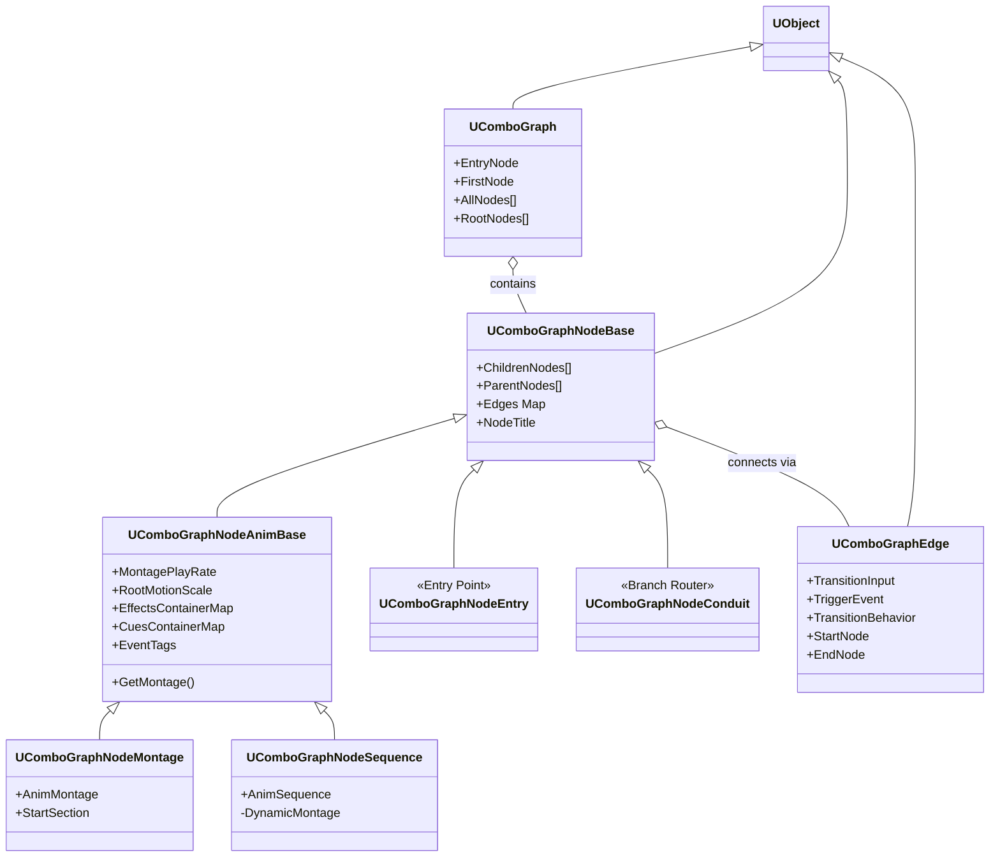
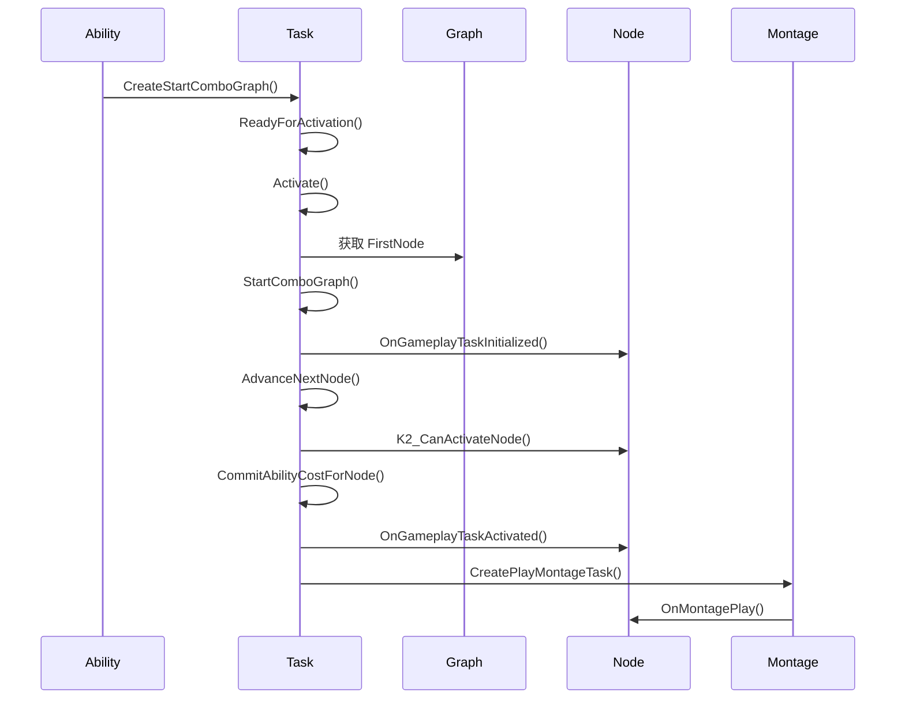

# ComboGraph 核心类解析

## 1. 类继承总览



---

## 2. 核心数据类

### 2.1 UComboGraph - 连招图资产

**文件位置**: `Graph/ComboGraph.h`

**职责**: 作为资产存储整个连招配置

```cpp
UCLASS(BlueprintType)
class UComboGraph : public UObject, public IInterface_PreviewMeshProvider
{
    // 入口节点（固定存在）
    UPROPERTY(BlueprintReadOnly)
    UComboGraphNodeEntry* EntryNode;
    
    // 第一个实际节点（Entry 的直接子节点）
    UPROPERTY(BlueprintReadOnly)
    UComboGraphNodeBase* FirstNode;
    
    // 所有节点列表
    UPROPERTY(BlueprintReadOnly)
    TArray<UComboGraphNodeBase*> AllNodes;
    
    // 根节点（无父节点的节点，通常只有 Entry）
    UPROPERTY(BlueprintReadOnly)
    TArray<UComboGraphNodeBase*> RootNodes;
    
    // 默认输入 Action（创建新边时使用）
    UPROPERTY(EditDefaultsOnly)
    UInputAction* DefaultInputAction;
    
#if WITH_EDITORONLY_DATA
    // 编辑器图表引用（仅编辑器存在）
    UEdGraph* EditorGraph;
#endif
};
```

**设计要点**:
- 实现 `IInterface_PreviewMeshProvider` 用于 Persona 预览
- 使用 `WITH_EDITORONLY_DATA` 隔离编辑器数据
- 既是数据容器，也是资产类型

---

### 2.2 UComboGraphNodeBase - 节点基类

**文件位置**: `Graph/ComboGraphNodeBase.h`

**职责**: 定义节点的图结构关系

```cpp
UCLASS()
class UComboGraphNodeBase : public UObject
{
    // 子节点列表
    UPROPERTY(BlueprintReadOnly)
    TArray<UComboGraphNodeBase*> ChildrenNodes;
    
    // 父节点列表
    UPROPERTY(BlueprintReadOnly)
    TArray<UComboGraphNodeBase*> ParentNodes;
    
    // 边映射：子节点 -> 连接的边
    UPROPERTY(BlueprintReadOnly)
    TMap<UComboGraphNodeBase*, UComboGraphEdge*> Edges;
    
    // 获取到指定子节点的边
    virtual UComboGraphEdge* GetEdge(UComboGraphNodeBase* ChildNode);
    
    // 根据输入 Action 获取对应的边
    virtual UComboGraphEdge* GetEdgeWithInput(UInputAction* InputAction);
    
    // 是否是叶子节点（无子节点）
    virtual bool IsLeafNode() const;
};
```

**设计要点**:
- 使用 `TMap` 存储边，快速查找
- 支持多父节点（可从多个节点转换过来）
- 支持多子节点（可转换到多个节点）

---

### 2.3 UComboGraphNodeAnimBase - 动画节点基类

**文件位置**: `Graph/ComboGraphNodeAnimBase.h`

**职责**: 承载动画和 GAS 相关配置

```cpp
UCLASS()
class UComboGraphNodeAnimBase : public UComboGraphNodeBase, 
                                 public IGameplayTaskOwnerInterface
{
    //========== 动画配置 ==========
    
    // 播放速率
    UPROPERTY(EditDefaultsOnly, BlueprintReadOnly)
    float MontagePlayRate = 1.f;
    
    // 根运动缩放
    UPROPERTY(EditDefaultsOnly, BlueprintReadOnly)
    float RootMotionScale = 1.f;
    
    //========== GAS 配置 ==========
    
    // 伤害处理方式（GAS 或 原生伤害系统）
    UPROPERTY(EditDefaultsOnly)
    EComboGraphDamageHandlingMethod DamageHandlingMethod;
    
    // Gameplay Effect 容器（Tag -> Effect 映射）
    UPROPERTY(EditDefaultsOnly)
    TMap<FGameplayTag, FComboGraphGameplayEffectContainer> EffectsContainerMap;
    
    // Gameplay Cue 容器（Tag -> Cue 映射）
    UPROPERTY(EditDefaultsOnly)
    TMap<FGameplayTag, FComboGraphCueContainer> CuesContainerMap;
    
    // 节点 Cost（消耗）
    UPROPERTY(EditDefaultsOnly)
    TSubclassOf<UGameplayEffect> CostGameplayEffect;
    
    // 监听的 Gameplay Event 标签
    UPROPERTY(EditDefaultsOnly)
    FGameplayTagContainer EventTags;
    
    //========== 虚函数 ==========
    
    // 获取要播放的 Montage
    virtual UAnimMontage* GetMontage() const { return nullptr; }
    
    // 获取动画资产
    virtual UAnimSequenceBase* GetAnimationAsset() const { return nullptr; }
    
    //========== BP 事件 ==========
    
    // 节点初始化时
    UFUNCTION(BlueprintImplementableEvent)
    void OnInitialized();
    
    // 节点激活时
    UFUNCTION(BlueprintImplementableEvent)
    void OnActivated();
    
    // 节点结束时
    UFUNCTION(BlueprintImplementableEvent)
    void OnDeactivated();
    
    // 动画开始播放时
    UFUNCTION(BlueprintImplementableEvent)
    void OnMontagePlay(UAnimMontage* Montage);
    
    // 收到 Gameplay Event 时
    UFUNCTION(BlueprintImplementableEvent)
    void OnEventReceived(FGameplayTag EventTag, FGameplayEventData EventData);
};
```

**设计要点**:
- 实现 `IGameplayTaskOwnerInterface` 使节点可以拥有 GameplayTask
- 使用 `TMap<FGameplayTag, Container>` 模式，事件驱动
- `BlueprintImplementableEvent` 允许蓝图扩展

---

### 2.4 UComboGraphEdge - 转换边

**文件位置**: `Graph/ComboGraphEdge.h`

**职责**: 定义节点间的转换条件

```cpp
UCLASS(Blueprintable)
class UComboGraphEdge : public UObject
{
    // 触发转换的输入 Action
    UPROPERTY(EditDefaultsOnly, BlueprintReadOnly)
    UInputAction* TransitionInput;
    
    // Enhanced Input 触发事件类型
    UPROPERTY(EditDefaultsOnly, BlueprintReadOnly)
    EComboGraphTransitionInputEvent TriggerEvent = EComboGraphTransitionInputEvent::Triggered;
    
    // 转换行为：
    // - OnComboWindowEnd: 连招窗口结束时转换
    // - Immediately: 立即转换
    // - OnAnimNotifyName/Class: 特定通知帧转换
    UPROPERTY(EditDefaultsOnly, BlueprintReadOnly)
    EComboGraphTransitionBehavior TransitionBehavior;
    
    // 起始节点
    UPROPERTY(BlueprintReadOnly)
    UComboGraphNodeBase* StartNode;
    
    // 目标节点
    UPROPERTY(BlueprintReadOnly)
    UComboGraphNodeBase* EndNode;
    
    // 网络复制
    virtual bool IsSupportedForNetworking() const override { return true; }
    
protected:
    // 当前输入实例（用于网络复制）
    UPROPERTY(Replicated)
    FInputActionInstance CurrentInputActionInstance;
    
    // 是否已确认（防止重复触发）
    bool bConfirmed = false;
};
```

**设计要点**:
- 支持 Enhanced Input 的多种触发类型
- 可配置转换时机（立即/窗口结束/通知帧）
- 支持网络复制

---

## 3. 运行时驱动类

### 3.1 UComboGraphAbilityTask_StartGraph - 核心驱动器

**文件位置**: `Abilities/Tasks/ComboGraphAbilityTask_StartGraph.h`

**职责**: 驱动整个连招的执行

```cpp
UCLASS()
class UComboGraphAbilityTask_StartGraph : public UAbilityTask
{
    //========== 创建入口 ==========
    
    UFUNCTION(BlueprintCallable)
    static UComboGraphAbilityTask_StartGraph* CreateStartComboGraph(
        UGameplayAbility* OwningAbility,
        UComboGraph* ComboGraph,
        UInputAction* InitialInput,
        bool bBroadcastInternalEvents = false
    );
    
    //========== 委托事件 ==========
    
    // 图开始
    UPROPERTY(BlueprintAssignable)
    FComboGraphAbilityTaskDelegate OnGraphStart;
    
    // 图结束
    UPROPERTY(BlueprintAssignable)
    FComboGraphAbilityTaskDelegate OnGraphEnd;
    
    // 收到事件
    UPROPERTY(BlueprintAssignable)
    FComboGraphAbilityTaskDelegate EventReceived;
    
    //========== 状态查询 ==========
    
    UFUNCTION(BlueprintCallable)
    UComboGraphNodeAnimBase* GetCurrentNode() const;
    
    UFUNCTION(BlueprintCallable)
    UComboGraphNodeAnimBase* GetPreviousNode() const;
    
    bool IsComboWindowOpened() const { return bComboWindowOpened; }
    
protected:
    //========== 内部状态 ==========
    
    // 当前运行的图
    UPROPERTY(Transient)
    UComboGraph* RunningGraph;
    
    // 当前节点
    UPROPERTY(Transient)
    UComboGraphNodeAnimBase* CurrentNode;
    
    // 上一个节点
    UPROPERTY(Transient)
    UComboGraphNodeAnimBase* PreviousNode;
    
    // 排队的下一个节点（玩家已输入）
    UPROPERTY(Transient)
    UComboGraphNodeAnimBase* QueuedNode;
    
    // 连招窗口是否开放
    bool bComboWindowOpened = false;
    
    // 是否已排队输入
    bool bComboQueued = false;
    
    //========== 核心方法 ==========
    
    virtual void Activate() override;
    virtual bool StartComboGraph(FString& FailReason);
    virtual bool AdvanceComboGraph(FString& FailReason);
    virtual bool AdvanceNextNode(UComboGraphNodeAnimBase* NextNode, FString& FailReason);
    
    // Cost 检查
    virtual bool CheckCostForNode(UComboGraphNodeAnimBase* Node, FString& FailReason);
    virtual bool CommitAbilityCostForNode(UComboGraphNodeAnimBase* Node, FString& FailReason);
    
    // 输入处理
    void SetupInputEvents();
    void SetupInputBindings();
    void HandleInputConfirmed(UComboGraphNodeAnimBase* NextNode, const UComboGraphEdge* Edge);
    
    // 事件处理
    void HandleComboBeginEvent();
    void HandleComboEndEvent();
    void HandleComboTransition();
};
```

**关键流程**:



---

## 4. 组件类

### 4.1 UComboGraphGameplayTasksComponent

**职责**: 为非 GAS 角色提供 GameplayTask 支持

```cpp
UCLASS()
class UComboGraphGameplayTasksComponent : public UGameplayTasksComponent
{
    // 发送复制的 Gameplay Event
    UFUNCTION(Server, Reliable)
    void ServerSendGameplayEvent(FGameplayTag EventTag, FGameplayEventData Payload);
};
```

### 4.2 UComboGraphCollisionComponent

**职责**: 管理连招的碰撞检测

```cpp
UCLASS()
class UComboGraphCollisionComponent : public UActorComponent
{
    // 检测到的命中 Actor
    UPROPERTY(BlueprintReadOnly)
    TArray<AActor*> HitActors;
    
    // 碰撞 Trace Channel
    UPROPERTY(EditDefaultsOnly)
    TEnumAsByte<ETraceTypeQuery> CollisionTraceChannel;
};
```

---

## 5. 类职责对照表

| 类 | 层级 | 职责 |
|----|------|------|
| `UComboGraph` | 数据 | 存储整个连招配置 |
| `UComboGraphNodeBase` | 数据 | 定义节点图结构关系 |
| `UComboGraphNodeAnimBase` | 数据 | 承载动画和 GAS 配置 |
| `UComboGraphNodeMontage` | 数据 | Montage 节点具体实现 |
| `UComboGraphNodeSequence` | 数据 | Sequence 节点（动态转 Montage） |
| `UComboGraphEdge` | 数据 | 定义转换条件 |
| `UComboGraphAbilityTask_StartGraph` | 运行时 | 驱动连招执行 |
| `UComboGraphAbilityTask_PlayMontage` | 运行时 | 播放动画 |
| `UComboGraphANS_ComboWindow` | 运行时 | 控制连招窗口时序 |
| `UComboGraphCollisionComponent` | 运行时 | 碰撞检测 |

---

*下一篇：[03-图编辑器系统](./03-GraphEditorSystem.md)*