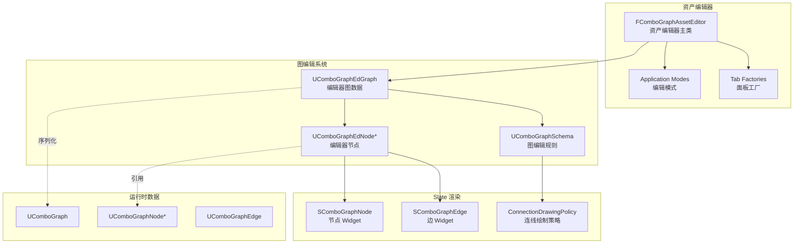

# ComboGraph 图编辑器系统

本文深入分析 ComboGraph 的自定义编辑器实现，这是学习 UE 编辑器扩展的绝佳案例。

## 1. 编辑器架构总览



---

## 2. 自定义资产类型

### 2.1 资产工厂

**文件**: `AssetTypes/ComboGraphFactory.h`

```cpp
UCLASS()
class UComboGraphFactory : public UFactory
{
    GENERATED_BODY()
    
public:
    UComboGraphFactory()
    {
        bCreateNew = true;            // 支持创建新资产
        bEditAfterNew = true;         // 创建后立即编辑
        SupportedClass = UComboGraph::StaticClass();
    }
    
    virtual UObject* FactoryCreateNew(
        UClass* Class,
        UObject* InParent,
        FName Name,
        EObjectFlags Flags,
        UObject* Context,
        FFeedbackContext* Warn
    ) override
    {
        UComboGraph* NewGraph = NewObject<UComboGraph>(InParent, Class, Name, Flags);
        return NewGraph;
    }
};
```

### 2.2 资产类型动作

**文件**: `AssetTypes/AssetTypeActions_ComboGraph.h`

```cpp
class FAssetTypeActions_ComboGraph : public FAssetTypeActions_Base
{
public:
    // 资产颜色（在内容浏览器中显示）
    virtual FColor GetTypeColor() const override 
    { 
        return FColor(255, 196, 128); // 橙色
    }
    
    // 资产名称
    virtual FText GetName() const override 
    { 
        return FText::FromString("Combo Graph"); 
    }
    
    // 分类
    virtual uint32 GetCategories() override 
    { 
        return EAssetTypeCategories::Gameplay; 
    }
    
    // 支持的类
    virtual UClass* GetSupportedClass() const override 
    { 
        return UComboGraph::StaticClass(); 
    }
    
    // 打开编辑器
    virtual void OpenAssetEditor(
        const TArray<UObject*>& InObjects,
        TSharedPtr<IToolkitHost> EditWithinLevelEditor
    ) override
    {
        // 创建自定义编辑器
        for (UObject* Object : InObjects)
        {
            if (UComboGraph* Graph = Cast<UComboGraph>(Object))
            {
                FComboGraphAssetEditor::CreateEditor(EToolkitMode::Standalone, EditWithinLevelEditor, Graph);
            }
        }
    }
};
```

---

## 3. 图编辑规则 (Schema)

**文件**: `Graph/ComboGraphSchema.h`

Schema 是 UE 图编辑器的核心，定义了：
- 可创建的节点类型
- 连接规则
- 右键菜单
- 拖放行为

### 3.1 右键菜单

```cpp
void UComboGraphSchema::GetGraphContextActions(
    FGraphContextMenuBuilder& ContextMenuBuilder
) const
{
    // 添加 Conduit 节点选项
    TSharedPtr<FComboGraphSchemaAction_NewNodeConduit> ConduitAction(
        new FComboGraphSchemaAction_NewNodeConduit(
            FText::FromString("Conduit"),
            FText::FromString("Add Conduit Node"),
            FText::FromString("Creates a branch conduit"),
            0
        )
    );
    ContextMenuBuilder.AddAction(ConduitAction);
    
    // 遍历所有 NodeBase 子类，添加到菜单
    for (TObjectIterator<UClass> It; It; ++It)
    {
        UClass* Class = *It;
        if (Class->IsChildOf(UComboGraphNodeAnimBase::StaticClass()) &&
            !Class->HasAnyClassFlags(CLASS_Abstract))
        {
            CreateAndAddActionToContextMenu(ContextMenuBuilder, Class);
        }
    }
}
```

### 3.2 连接规则

```cpp
const FPinConnectionResponse UComboGraphSchema::CanCreateConnection(
    const UEdGraphPin* PinA,
    const UEdGraphPin* PinB
) const
{
    // 获取节点
    UComboGraphEdNodeBase* NodeA = Cast<UComboGraphEdNodeBase>(PinA->GetOwningNode());
    UComboGraphEdNodeBase* NodeB = Cast<UComboGraphEdNodeBase>(PinB->GetOwningNode());
    
    // 不能自连
    if (NodeA == NodeB)
    {
        return FPinConnectionResponse(CONNECT_RESPONSE_DISALLOW, TEXT("Cannot connect to self"));
    }
    
    // 方向检查：只能 Output -> Input
    if (PinA->Direction == PinB->Direction)
    {
        return FPinConnectionResponse(CONNECT_RESPONSE_DISALLOW, TEXT("Cannot connect same direction pins"));
    }
    
    // 让节点自己决定
    FText ErrorMessage;
    if (!NodeA->GetComboGraphNode()->CanCreateConnection(NodeB->GetComboGraphNode(), ErrorMessage))
    {
        return FPinConnectionResponse(CONNECT_RESPONSE_DISALLOW, ErrorMessage.ToString());
    }
    
    return FPinConnectionResponse(CONNECT_RESPONSE_MAKE, TEXT(""));
}
```

### 3.3 创建连接（带边节点）

```cpp
bool UComboGraphSchema::TryCreateConnection(UEdGraphPin* A, UEdGraphPin* B) const
{
    UComboGraphEdNodeBase* NodeA = Cast<UComboGraphEdNodeBase>(A->GetOwningNode());
    UComboGraphEdNodeBase* NodeB = Cast<UComboGraphEdNodeBase>(B->GetOwningNode());
    
    // 确保方向正确
    if (A->Direction != EGPD_Output)
    {
        Swap(A, B);
        Swap(NodeA, NodeB);
    }
    
    // 创建边节点
    CreateEdgeConnection(A, B, NodeA, NodeB);
    
    return true;
}

void UComboGraphSchema::CreateEdgeConnection(...) const
{
    UComboGraphEdGraph* Graph = Cast<UComboGraphEdGraph>(PinA->GetOwningNode()->GetGraph());
    
    // 创建编辑器边节点
    UComboGraphEdNodeEdge* EdgeNode = NewObject<UComboGraphEdNodeEdge>(Graph);
    EdgeNode->CreateNewGuid();
    EdgeNode->AllocateDefaultPins();
    
    // 创建运行时边
    UComboGraphEdge* Edge = NewObject<UComboGraphEdge>(Graph->GetComboGraph());
    Edge->StartNode = NodeA->GetComboGraphNode();
    Edge->EndNode = NodeB->GetComboGraphNode();
    
    // 设置默认输入
    Edge->TransitionInput = Graph->GetComboGraph()->DefaultInputAction;
    
    // 建立关系
    EdgeNode->SetEdge(Edge);
    EdgeNode->CreateConnections(NodeA, NodeB);
    
    Graph->AddNode(EdgeNode, false, true);
}
```

### 3.4 拖放资产

```cpp
void UComboGraphSchema::DroppedAssetsOnGraph(
    const TArray<FAssetData>& Assets,
    const FVector2D& GraphPosition,
    UEdGraph* Graph
) const
{
    for (const FAssetData& AssetData : Assets)
    {
        UAnimationAsset* AnimAsset = Cast<UAnimationAsset>(AssetData.GetAsset());
        if (AnimAsset)
        {
            // 根据资产类型创建对应节点
            SpawnNodeFromAsset(AnimAsset, GraphPosition, Graph, nullptr);
        }
    }
}

void UComboGraphSchema::SpawnNodeFromAsset(
    UAnimationAsset* Asset,
    const FVector2D& GraphPosition,
    UEdGraph* Graph,
    UEdGraphPin* PinIfAvailable
)
{
    // 判断是 Montage 还是 Sequence
    UClass* NodeClass = GetNodeClassForAnimAsset(Asset, Graph);
    TSubclassOf<UComboGraphNodeAnimBase> RuntimeClass = GetRuntimeClassForAnimAsset(Asset, Graph);
    
    // 创建编辑器节点
    FComboGraphSchemaAction_NewNode Action;
    Action.NodeTemplate = NewObject<UComboGraphEdNode>(Graph);
    Action.NodeTemplate->SetComboGraphNode(NewObject<UComboGraphNodeAnimBase>(Graph, RuntimeClass));
    
    // 设置动画资产
    UComboGraphNodeAnimBase* RuntimeNode = Cast<UComboGraphNodeAnimBase>(Action.NodeTemplate->GetComboGraphNode());
    RuntimeNode->SetAnimationAsset(Asset);
    
    // 执行创建
    Action.PerformAction(Graph, PinIfAvailable, GraphPosition);
}
```

---

## 4. 编辑器节点 (EdNode)

### 4.1 双层节点设计

ComboGraph 使用双层节点设计：

```
┌─────────────────────────────────────┐
│         UComboGraphEdNode           │ ← 编辑器层（编辑器专用）
│  - 位置、大小、Pin 等编辑器属性      │
│  - 序列化时不包含                    │
├─────────────────────────────────────┤
│         UComboGraphNode*            │ ← 运行时层（打包后存在）
│  - 动画、Effect 等游戏数据          │
│  - 序列化到资产                     │
└─────────────────────────────────────┘
```

**文件**: `Graph/Nodes/ComboGraphEdNode.h`

```cpp
UCLASS()
class UComboGraphEdNode : public UComboGraphEdNodeBase
{
    GENERATED_BODY()
    
public:
    // 引用运行时节点
    UPROPERTY(VisibleAnywhere, Instanced)
    UComboGraphNodeBase* ComboGraphNode;
    
    // 获取运行时节点
    UComboGraphNodeBase* GetComboGraphNode() const { return ComboGraphNode; }
    
    // 设置运行时节点
    void SetComboGraphNode(UComboGraphNodeBase* InNode);
    
    // 从运行时节点同步编辑器属性
    void SyncWithGraphNode();
    
    // Pin 创建
    virtual void AllocateDefaultPins() override
    {
        // 输入 Pin
        CreatePin(EGPD_Input, TEXT("Transition"), TEXT("In"));
        
        // 输出 Pin
        CreatePin(EGPD_Output, TEXT("Transition"), TEXT("Out"));
    }
    
    // 节点标题
    virtual FText GetNodeTitle(ENodeTitleType::Type TitleType) const override
    {
        return ComboGraphNode ? ComboGraphNode->GetNodeTitle() : FText::FromString("Invalid");
    }
};
```

---

## 5. Slate 节点渲染

### 5.1 节点 Widget

**文件**: `Graph/Slate/SComboGraphNode.h`

```cpp
class SComboGraphNode : public SGraphNode
{
public:
    SLATE_BEGIN_ARGS(SComboGraphNode) {}
    SLATE_END_ARGS()
    
    void Construct(const FArguments& InArgs, UComboGraphEdNode* InNode);
    
    // 更新节点外观
    virtual void UpdateGraphNode() override;
    
    // 创建 Pin Widget
    virtual void CreatePinWidgets() override;
    
    // 节点内容区域
    virtual TSharedRef<SWidget> CreateNodeContentArea() override
    {
        UComboGraphNodeAnimBase* AnimNode = Cast<UComboGraphNodeAnimBase>(
            GraphNode->GetComboGraphNode()
        );
        
        return SNew(SVerticalBox)
            // 缩略图
            + SVerticalBox::Slot()
            .AutoHeight()
            [
                CreateThumbnailWidget()
            ]
            // 动画名称
            + SVerticalBox::Slot()
            .AutoHeight()
            .Padding(5)
            [
                SNew(STextBlock)
                .Text(AnimNode ? AnimNode->GetAnimAssetText() : FText())
            ]
            // 播放速率
            + SVerticalBox::Slot()
            .AutoHeight()
            [
                SNew(STextBlock)
                .Text(FText::Format(
                    LOCTEXT("PlayRate", "Rate: {0}"),
                    FText::AsNumber(AnimNode ? AnimNode->MontagePlayRate : 1.f)
                ))
            ];
    }
    
private:
    TSharedRef<SWidget> CreateThumbnailWidget();
};
```

### 5.2 边 Widget

**文件**: `Graph/Slate/SComboGraphEdge.h`

```cpp
class SComboGraphEdge : public SGraphNode
{
public:
    void Construct(const FArguments& InArgs, UComboGraphEdNodeEdge* InNode);
    
    // 边显示为输入图标
    virtual TSharedRef<SWidget> CreateNodeContentArea() override
    {
        UComboGraphEdge* Edge = EdgeNode->GetEdge();
        
        // 获取输入 Action 的图标
        UTexture2D* Icon = GetInputIcon(Edge->TransitionInput);
        
        return SNew(SBox)
            .WidthOverride(32)
            .HeightOverride(32)
            [
                SNew(SImage)
                .Image(Icon ? FSlateIcon(Icon) : FSlateIcon())
            ];
    }
};
```

### 5.3 连线绘制策略

**文件**: `Graph/ComboGraphConnectionDrawingPolicy.h`

```cpp
class FComboGraphConnectionDrawingPolicy : public FConnectionDrawingPolicy
{
public:
    // 绘制样条曲线连接
    virtual void DrawConnection(
        int32 LayerId,
        const FVector2D& Start,
        const FVector2D& End,
        const FConnectionParams& Params
    ) override
    {
        // 自定义曲线形状
        const FVector2D Delta = End - Start;
        const FVector2D NormalizedDelta = Delta.GetSafeNormal();
        
        // 控制点（决定曲线弯曲程度）
        const float TangentLength = FMath::Min(Delta.Size() * 0.5f, 150.f);
        const FVector2D P1 = Start + NormalizedDelta * TangentLength;
        const FVector2D P2 = End - NormalizedDelta * TangentLength;
        
        // 绘制贝塞尔曲线
        FSlateDrawElement::MakeSpline(
            OutDrawElements,
            LayerId,
            FPaintGeometry(),
            Start, P1, P2, End,
            Params.WireThickness,
            ESlateDrawEffect::None,
            Params.WireColor
        );
        
        // 在中点绘制边节点
        const FVector2D MidPoint = FMath::CubicInterp(Start, P1, End, P2, 0.5f);
        DrawEdgeWidget(MidPoint, Edge);
    }
};
```

---

## 6. Application Modes

ComboGraph 支持两种编辑模式：

```cpp
// Graph Mode - 连招图编辑
class FComboGraphDefaultAppMode : public FApplicationMode
{
    virtual void RegisterTabFactories(TSharedPtr<FTabManager> InTabManager) override
    {
        // 注册面板：图编辑器、属性面板、动画浏览器
        InTabManager->RegisterTabSpawner(GraphTabId, ...);
        InTabManager->RegisterTabSpawner(DetailsTabId, ...);
        InTabManager->RegisterTabSpawner(AnimBrowserTabId, ...);
    }
};

// Persona Mode - 动画预览
class FComboGraphPersonaAppMode : public FApplicationMode
{
    virtual void RegisterTabFactories(TSharedPtr<FTabManager> InTabManager) override
    {
        // 注册面板：视口、时间轴、骨架树
        InTabManager->RegisterTabSpawner(ViewportTabId, ...);
        InTabManager->RegisterTabSpawner(TimelineTabId, ...);
        InTabManager->RegisterTabSpawner(SkeletonTreeTabId, ...);
    }
};
```

---

## 7. 知识点总结

| 组件 | UE 框架 | 学习要点 |
|------|---------|---------|
| 资产工厂 | `UFactory` | 自定义资产创建流程 |
| 资产类型动作 | `FAssetTypeActions_Base` | 内容浏览器集成 |
| 图编辑器 | `FWorkflowCentricApplication` | 多模式编辑器 |
| Schema | `UEdGraphSchema` | 图编辑规则定义 |
| EdNode | `UEdGraphNode` | 编辑器节点封装 |
| Slate Widget | `SGraphNode` | 自定义节点渲染 |
| 连线策略 | `FConnectionDrawingPolicy` | 自定义连线绘制 |

---

*下一篇：[04-运行时执行流程](./04-RuntimeExecution.md)*