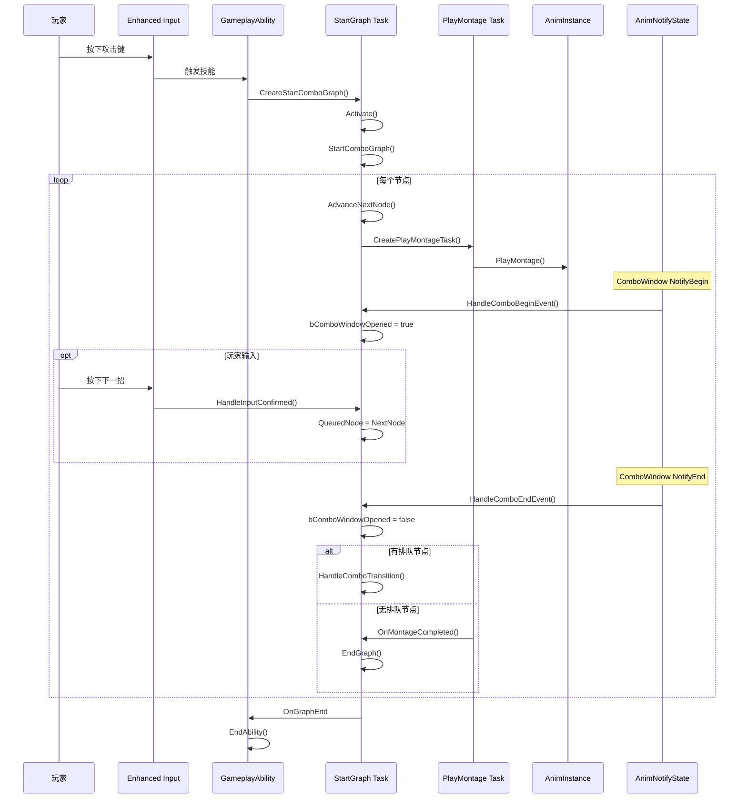

# ComboGraph 运行时执行流程

本文详细分析连招在游戏中如何实际执行。

## 1. 执行流程概览



---

## 2. 启动阶段

### 2.1 Task 创建

```cpp
// 在 GameplayAbility 中调用
void UMyComboAbility::ActivateAbility(...)
{
    // 创建 Task
    UComboGraphAbilityTask_StartGraph* Task = 
        UComboGraphAbilityTask_StartGraph::CreateStartComboGraph(
            this,                    // 所属 Ability
            ComboGraphAsset,         // ComboGraph 资产
            InitialInputAction,      // 初始输入（可选，用于 Conduit）
            false                    // 是否广播内部事件
        );
    
    // 绑定回调
    Task->OnGraphStart.AddDynamic(this, &UMyComboAbility::OnComboStarted);
    Task->OnGraphEnd.AddDynamic(this, &UMyComboAbility::OnComboEnded);
    Task->EventReceived.AddDynamic(this, &UMyComboAbility::OnEventReceived);
    
    // 启动 Task
    Task->ReadyForActivation();
}
```

### 2.2 Task 激活

```cpp
void UComboGraphAbilityTask_StartGraph::Activate()
{
    // 1. 获取输入组件
    const FGameplayAbilityActorInfo* ActorInfo = Ability->GetCurrentActorInfo();
    InputComponent = Cast<UEnhancedInputComponent>(
        ActorInfo->AvatarActor->InputComponent
    );
    
    // 2. 确保有 GameplayTasksComponent
    AActor* AvatarActor = GetAvatarActorFromActorInfo();
    UComboGraphGameplayTasksComponent* Component = 
        AvatarActor->FindComponentByClass<UComboGraphGameplayTasksComponent>();
    
    if (!Component && AvatarActor->GetLocalRole() == ROLE_Authority)
    {
        // 动态创建组件
        Component = NewObject<UComboGraphGameplayTasksComponent>(AvatarActor);
        Component->RegisterComponent();
    }
    
    // 3. 延迟到下一帧启动（避免输入系统竞态）
    GetWorld()->GetTimerManager().SetTimerForNextTick(
        this, 
        &UComboGraphAbilityTask_StartGraph::OnNextFrame
    );
}
```

### 2.3 图启动

```cpp
bool UComboGraphAbilityTask_StartGraph::StartComboGraph(FString& FailReason)
{
    // 1. 验证图有效
    if (!RunningGraph) return false;
    
    // 2. 获取第一个节点
    UComboGraphNodeBase* FirstRootNode = RunningGraph->FirstNode;
    
    // 3. 处理 Conduit（分支入口）
    UComboGraphNodeConduit* ConduitNode = Cast<UComboGraphNodeConduit>(FirstRootNode);
    if (ConduitNode)
    {
        // 根据 InitialInput 选择分支
        const UComboGraphEdge* Edge = ConduitNode->GetEdgeWithInput(InitialInput);
        if (!Edge)
        {
            FailReason = "No matching edge for InitialInput";
            return false;
        }
        FirstRootNode = Edge->EndNode;
    }
    
    // 4. 设置当前节点
    CurrentNode = Cast<UComboGraphNodeAnimBase>(FirstRootNode);
    PreviousNode = RunningGraph->EntryNode;
    
    // 5. 设置输入事件监听
    SetupInputEvents();
    
    // 6. 广播开始事件
    OnGraphStart.Broadcast(FGameplayTag(), FGameplayEventData());
    
    // 7. 推进到第一个节点
    return AdvanceComboGraph(FailReason);
}
```

---

## 3. 节点推进

### 3.1 节点激活流程

```cpp
bool UComboGraphAbilityTask_StartGraph::AdvanceNextNode(
    UComboGraphNodeAnimBase* NextNode, 
    FString& FailReason
)
{
    // 1. 重置状态
    QueuedNode = nullptr;
    bComboQueued = false;
    bComboWindowOpened = false;
    
    // 2. 初始化节点（调用 BP 事件）
    NextNode->OnGameplayTaskInitialized(*this);
    
    // 3. 检查是否可激活
    if (!NextNode->K2_CanActivateNode())
    {
        FailReason = "CanActivateNode returned false";
        return false;
    }
    
    // 4. 检查并提交 Cost
    if (!CommitAbilityCostForNode(NextNode, FailReason))
    {
        return false;
    }
    
    // 5. 通知前一个节点结束
    if (CurrentNode)
    {
        CurrentNode->OnGameplayTaskDeactivated(*this);
    }
    
    // 6. 更新当前节点
    PreviousNode = CurrentNode;
    CurrentNode = NextNode;
    
    // 7. 激活当前节点
    CurrentNode->OnGameplayTaskActivated(*this);
    
    // 8. 设置输入绑定
    SetupInputBindings();
    
    // 9. 播放动画
    UAnimMontage* Montage = CurrentNode->GetMontage();
    CreatePlayMontageTask(Montage);
    CurrentNode->OnMontagePlay(Montage);
    
    return true;
}
```

### 3.2 Cost 检查

```cpp
bool UComboGraphAbilityTask_StartGraph::CheckCostForNode(
    UComboGraphNodeAnimBase* Node, 
    FString& FailReason
)
{
    // 获取节点配置的 Cost GE
    const UGameplayEffect* CostGE = GetCostGameplayEffectForNode(Node);
    
    if (!CostGE) return true;  // 无 Cost，直接通过
    
    // 检查是否有足够资源
    const FGameplayAbilityActorInfo* ActorInfo = Ability->GetCurrentActorInfo();
    const FGameplayAbilitySpecHandle Handle = Ability->GetCurrentAbilitySpecHandle();
    
    if (!CanApplyAttributeModifiers(
        CostGE, 
        Ability->GetAbilityLevel(Handle, ActorInfo),
        Ability->MakeEffectContext(Handle, ActorInfo)
    ))
    {
        FailReason = "Not enough resources";
        return false;
    }
    
    return true;
}

bool UComboGraphAbilityTask_StartGraph::CommitAbilityCostForNode(
    UComboGraphNodeAnimBase* Node, 
    FString& FailReason
)
{
    // 全局忽略 Cost（调试用）
    if (UAbilitySystemGlobals::Get().ShouldIgnoreCosts())
    {
        return true;
    }
    
    if (!CheckCostForNode(Node, FailReason))
    {
        return false;
    }
    
    // 应用 Cost Effect
    const UGameplayEffect* CostGE = GetCostGameplayEffectForNode(Node);
    if (CostGE)
    {
        ApplyGameplayEffectToOwner(
            Handle, ActorInfo, ActivationInfo, CostGE,
            Ability->GetAbilityLevel(Handle, ActorInfo)
        );
    }
    
    return true;
}
```

---

## 4. 输入处理

### 4.1 输入绑定

```cpp
void UComboGraphAbilityTask_StartGraph::SetupInputBindings()
{
    // 清除之前的绑定
    ClearInputBindings();
    
    if (!InputComponent || !CurrentNode) return;
    
    // 遍历当前节点的所有边
    for (auto& Pair : CurrentNode->Edges)
    {
        UComboGraphEdge* Edge = Pair.Value;
        UInputAction* InputAction = Edge->TransitionInput;
        
        if (!InputAction) continue;
        
        // 获取触发事件类型
        ETriggerEvent TriggerEvent = Edge->GetEnhancedInputTriggerEvent();
        
        // 绑定输入
        FInputActionBinding& Binding = InputComponent->BindAction(
            InputAction,
            TriggerEvent,
            this,
            &UComboGraphAbilityTask_StartGraph::ReceivedInputConfirm,
            Edge
        );
        
        // 记录句柄以便清理
        InputHandles.Add(Binding.GetHandle());
    }
}
```

### 4.2 输入确认

```cpp
void UComboGraphAbilityTask_StartGraph::ReceivedInputConfirm(
    const FInputActionInstance& InputActionInstance,
    UComboGraphEdge* Edge
)
{
    // 防止重复确认
    if (Edge->IsConfirmed()) return;
    
    // 标记已确认
    Edge->SetIsConfirmed(true);
    
    // 保存输入实例（用于网络复制）
    Edge->SetCurrentInputActionInstance(InputActionInstance);
    CurrentInputActionInstance = InputActionInstance;
    
    // 获取目标节点
    UComboGraphNodeAnimBase* NextNode = Cast<UComboGraphNodeAnimBase>(Edge->EndNode);
    
    // 处理输入
    HandleInputConfirmed(NextNode, Edge);
}

void UComboGraphAbilityTask_StartGraph::HandleInputConfirmed(
    UComboGraphNodeAnimBase* NextNode,
    const UComboGraphEdge* Edge
)
{
    // 只有在连招窗口开放时才接受输入
    if (!bComboWindowOpened)
    {
        return;
    }
    
    // 已经有排队节点了
    if (bComboQueued)
    {
        return;
    }
    
    // 设置排队节点
    QueuedNode = NextNode;
    bComboQueued = true;
    
    // 根据转换行为决定何时转换
    switch (Edge->TransitionBehavior)
    {
        case EComboGraphTransitionBehavior::Immediately:
            // 立即转换
            HandleComboTransition();
            break;
            
        case EComboGraphTransitionBehavior::OnComboWindowEnd:
            // 等待窗口结束（由 AnimNotify 触发）
            break;
            
        case EComboGraphTransitionBehavior::OnAnimNotifyName:
        case EComboGraphTransitionBehavior::OnAnimNotifyClass:
            // 等待特定通知帧
            float TriggerTime = GetAnimNotifyTriggerTime(Edge);
            HandleComboTransitionForNotifyTriggerTime(TriggerTime);
            break;
    }
}
```

---

## 5. AnimNotify 时序控制

### 5.1 ComboWindow Notify

```cpp
// ComboGraphANS_ComboWindow.cpp

void UComboGraphANS_ComboWindow::NotifyBegin(
    USkeletalMeshComponent* MeshComp, 
    UAnimSequenceBase* Animation, 
    float TotalDuration, 
    const FAnimNotifyEventReference& EventReference
)
{
    // 发送 ComboBegin 事件
    SendEvent(MeshComp, FComboGraphNativeTags::Get().ComboBegin);
}

void UComboGraphANS_ComboWindow::NotifyEnd(
    USkeletalMeshComponent* MeshComp, 
    UAnimSequenceBase* Animation, 
    const FAnimNotifyEventReference& EventReference
)
{
    // 发送 ComboEnd 事件
    SendEvent(MeshComp, FComboGraphNativeTags::Get().ComboEnd);
}

void UComboGraphANS_ComboWindow::SendEvent(
    USkeletalMeshComponent* InMeshComp, 
    FGameplayTag InGameplayTag
)
{
    if (InMeshComp)
    {
        AActor* Owner = InMeshComp->GetOwner();
        
        // 避免在 Persona 预览中触发
        if (Owner && !FComboGraphUtils::IsAnimationPreviewActor(Owner))
        {
            UComboGraphBlueprintLibrary::SendGameplayEventToActor(
                Owner, 
                InGameplayTag, 
                FGameplayEventData()
            );
        }
    }
}
```

### 5.2 Task 事件处理

```cpp
void UComboGraphAbilityTask_StartGraph::HandleEventReceived(
    FGameplayTag EventTag, 
    FGameplayEventData EventData
)
{
    // ComboWindow 开始
    if (EventTag.MatchesTagExact(FComboGraphNativeTags::Get().ComboBegin))
    {
        HandleComboBeginEvent();
    }
    // ComboWindow 结束
    else if (EventTag.MatchesTagExact(FComboGraphNativeTags::Get().ComboEnd))
    {
        HandleComboEndEvent();
    }
    // 其他事件（如伤害触发）
    else
    {
        // 应用 Effect/Cue 容器
        ApplyEffectOrDamageContainer(CurrentNode, EventTag, EventData);
        
        // 广播给 BP
        EventReceived.Broadcast(EventTag, EventData);
    }
}

void UComboGraphAbilityTask_StartGraph::HandleComboBeginEvent()
{
    bComboWindowOpened = true;
    
    // 重置所有边的确认状态
    for (auto& Pair : CurrentNode->Edges)
    {
        Pair.Value->SetIsConfirmed(false);
    }
}

void UComboGraphAbilityTask_StartGraph::HandleComboEndEvent()
{
    bComboWindowOpened = false;
    
    // 如果有排队输入，执行转换
    if (bComboQueued && QueuedNode)
    {
        HandleComboTransition();
    }
}
```

---

## 6. 状态转换

### 6.1 Combo 转换

```cpp
void UComboGraphAbilityTask_StartGraph::HandleComboTransition()
{
    // 1. 服务器同步点（多人游戏）
    if (!IsLocallyControlled())
    {
        // 等待服务器确认
        UComboGraphAbilityTask_NetworkSyncPoint* SyncTask = 
            UComboGraphAbilityTask_NetworkSyncPoint::Create(Ability);
        SyncTask->OnSync.AddDynamic(this, &UComboGraphAbilityTask_StartGraph::OnServerSyncAdvanceNextNode);
        SyncTask->ReadyForActivation();
        return;
    }
    
    OnServerSyncAdvanceNextNode();
}

void UComboGraphAbilityTask_StartGraph::OnServerSyncAdvanceNextNode()
{
    // 停止当前 Montage
    if (RunningTask)
    {
        RunningTask->EndTask();
        RunningTask = nullptr;
    }
    
    // 推进到下一个节点
    FString FailReason;
    if (!AdvanceNextNode(QueuedNode, FailReason))
    {
        CG_RUNTIME_LOG(Warning, TEXT("AdvanceNextNode failed: %s"), *FailReason);
        EndGraph();
    }
}
```

### 6.2 图结束

```cpp
void UComboGraphAbilityTask_StartGraph::EndGraph()
{
    // 1. 清理输入绑定
    ClearInputBindings();
    
    // 2. 通知当前节点结束
    if (CurrentNode)
    {
        CurrentNode->OnGameplayTaskDeactivated(*this);
    }
    
    // 3. 广播结束事件
    if (ShouldBroadcastAbilityTaskDelegates())
    {
        FComboGraphDelegates::OnComboGraphEnded.Broadcast(*this, *RunningGraph);
        OnGraphEnd.Broadcast(FGameplayTag(), FGameplayEventData());
    }
    
    // 4. 结束 Task
    EndTask();
}
```

---

## 7. 时序图：完整连招流程

```
时间 →
────────────────────────────────────────────────────────────────►

动画1：
|═══════════════════════════════════════|
|--开始--|===连招窗口===|----恢复----|
          ↑             ↑
    ComboBegin    ComboEnd
    ● 开放输入     ● 检查排队
    
    玩家输入：          ↓
                  [按下攻击]
                  QueuedNode = 节点2
                  
                              ↓ 转换
动画2：
                              |═══════════════════════════════|
                              |--开始--|===连招窗口===|--恢复--|
                                        ↑
                                   ComboBegin
                                   ● 开放输入
                                   
                                   玩家未输入
                                   
                                                        ↓ 结束
                                                   EndGraph()
                                                   EndAbility()
```

---

*下一篇：[05-GAS集成详解](./05-GASIntegration.md)*