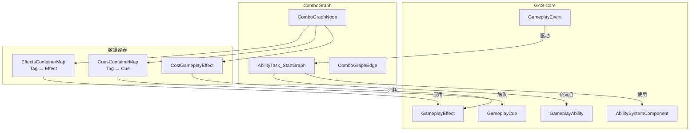
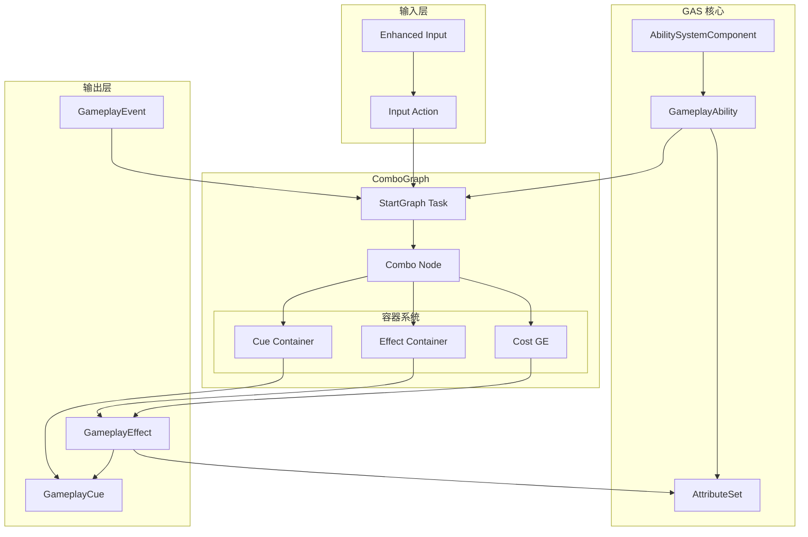

# ComboGraph 与 GAS 深度集成

本文分析 ComboGraph 如何与 Gameplay Ability System 深度整合。

## 1. 集成架构



---

## 2. AbilityTask 作为桥梁

### 2.1 Task 与 Ability 的关系

```cpp
// Task 继承自 UAbilityTask
UCLASS()
class UComboGraphAbilityTask_StartGraph : public UAbilityTask
{
    // 通过基类的 Ability 指针访问能力系统
protected:
    // 获取 ASC
    UAbilitySystemComponent* GetASC() const
    {
        return Ability ? Ability->GetAbilitySystemComponentFromActorInfo() : nullptr;
    }
    
    // 获取 ActorInfo
    const FGameplayAbilityActorInfo* GetActorInfo() const
    {
        return Ability ? Ability->GetCurrentActorInfo() : nullptr;
    }
    
    // 创建 EffectContext
    FGameplayEffectContextHandle MakeEffectContext() const
    {
        return Ability->MakeEffectContext(
            Ability->GetCurrentAbilitySpecHandle(),
            Ability->GetCurrentActorInfo()
        );
    }
};
```

### 2.2 为什么使用 AbilityTask

| 优势 | 说明 |
|------|------|
| 生命周期管理 | Ability 结束时自动清理 Task |
| 上下文访问 | 可访问 Ability 的所有信息 |
| 网络支持 | 内置 RPC 和同步机制 |
| 异步模式 | 适合长时间运行的连招 |
| 多 Task 协作 | 可与其他 Task 组合 |

---

## 3. Gameplay Effect 容器

### 3.1 容器结构

```cpp
// 单个 Effect 目标配置
USTRUCT(BlueprintType)
struct FComboGraphGameplayEffectContainer
{
    // 目标数据类（决定如何获取目标）
    UPROPERTY(EditDefaultsOnly)
    TSubclassOf<UGameplayAbilityTargetActor> TargetType;
    
    // 要应用的 Effect 列表
    UPROPERTY(EditDefaultsOnly)
    TArray<TSubclassOf<UGameplayEffect>> TargetGameplayEffectClasses;
    
    // Set by Caller 数值（动态伤害）
    UPROPERTY(EditDefaultsOnly)
    TMap<FGameplayTag, FScalableFloat> SetByCallerValues;
};
```

### 3.2 节点中的 Effect 配置

```cpp
// ComboGraphNodeAnimBase.h
UCLASS()
class UComboGraphNodeAnimBase : public UComboGraphNodeBase
{
    // Gameplay Tag -> Effect Container 映射
    // 例如：Event.Hit -> 应用伤害
    //       Event.Block -> 应用格挡
    UPROPERTY(EditDefaultsOnly, Category = "Gameplay Effects")
    TMap<FGameplayTag, FComboGraphGameplayEffectContainer> EffectsContainerMap;
};
```

### 3.3 Effect 应用流程

```cpp
void UComboGraphAbilityTask_StartGraph::ApplyEffectOrDamageContainer(
    UComboGraphNodeAnimBase* ComboNode,
    FGameplayTag EventTag,
    FGameplayEventData EventData
)
{
    // 根据配置选择处理方式
    if (ComboNode->DamageHandlingMethod == EComboGraphDamageHandlingMethod::AbilitySystem)
    {
        // GAS 方式：通过 GameplayEffect
        ApplyEffectContainer(ComboNode->EffectsContainerMap, EventTag, EventData);
    }
    else
    {
        // 原生方式：通过 ApplyDamage
        ApplyDamageContainer(ComboNode, EventTag, EventData);
    }
}

TArray<FActiveGameplayEffectHandle> UComboGraphAbilityTask_StartGraph::ApplyEffectContainer(
    TMap<FGameplayTag, FComboGraphGameplayEffectContainer> EffectContainerMap,
    FGameplayTag ContainerTag,
    const FGameplayEventData& EventData,
    int32 OverrideGameplayLevel
)
{
    // 1. 查找匹配的容器
    FComboGraphGameplayEffectContainer* Container = EffectContainerMap.Find(ContainerTag);
    if (!Container) return {};
    
    // 2. 创建 Spec
    FComboGraphGameplayEffectContainerSpec Spec = MakeEffectContainerSpecFromContainer(
        *Container, ContainerTag, EventData, OverrideGameplayLevel
    );
    
    // 3. 应用 Spec
    return ApplyEffectContainerSpec(Spec);
}

FComboGraphGameplayEffectContainerSpec UComboGraphAbilityTask_StartGraph::MakeEffectContainerSpecFromContainer(
    const FComboGraphGameplayEffectContainer& Container,
    FGameplayTag ContainerTag,
    const FGameplayEventData& EventData,
    int32 OverrideGameplayLevel
)
{
    FComboGraphGameplayEffectContainerSpec Spec;
    
    // 从 EventData 获取目标
    Spec.TargetData = EventData.TargetData;
    
    // 为每个 Effect 类创建 Spec
    for (const TSubclassOf<UGameplayEffect>& EffectClass : Container.TargetGameplayEffectClasses)
    {
        FGameplayEffectSpecHandle SpecHandle = MakeOutgoingGameplayEffectSpec(
            EffectClass,
            OverrideGameplayLevel
        );
        
        // 设置 Set by Caller 值
        for (auto& Pair : Container.SetByCallerValues)
        {
            float Value = Pair.Value.GetValueAtLevel(GetAbilityLevel());
            
            // 应用节点的伤害调整
            Value = GetNodeMagnitudeForContainer(CurrentNode, Value, ContainerTag);
            
            SpecHandle.Data->SetSetByCallerMagnitude(Pair.Key, Value);
        }
        
        Spec.TargetGameplayEffectSpecs.Add(SpecHandle);
    }
    
    return Spec;
}
```

---

## 4. Gameplay Cue 容器

### 4.1 Cue 容器结构

```cpp
// 单个 Cue 定义
USTRUCT(BlueprintType)
struct FComboGraphCueContainerDefinition
{
    // Cue 标签（可以多个）
    UPROPERTY(EditAnywhere)
    FGameplayTagContainer GameplayCueTags;
    
    // 附带的资源类型
    UPROPERTY(EditDefaultsOnly)
    EComboGraphCueSourceObjectType CueSourceObjectType;
    
    // Niagara 特效
    UPROPERTY(EditAnywhere, meta = (EditCondition = "..."))
    TSoftObjectPtr<UNiagaraSystem> NiagaraSystem;
    
    // Cascade 粒子（已废弃）
    UPROPERTY(EditAnywhere, meta = (EditCondition = "..."))
    TSoftObjectPtr<UParticleSystem> CascadeSystem;
    
    // 音效
    UPROPERTY(EditAnywhere, meta = (EditCondition = "..."))
    TSoftObjectPtr<USoundBase> SoundEffect;
};

// Cue 容器
USTRUCT(BlueprintType)
struct FComboGraphCueContainer
{
    UPROPERTY(EditAnywhere)
    TArray<FComboGraphCueContainerDefinition> Definitions;
};
```

### 4.2 Cue 触发流程

```cpp
void UComboGraphNodeAnimBase::ApplyCueContainer(
    FComboGraphCueContainer* Container,
    const FGameplayEventData& EventData,
    bool bPassOnlySoftObjectPaths
)
{
    if (!Container) return;
    
    // 获取 ASC
    UAbilitySystemComponent* ASC = GetASCFromCachedAbility();
    if (!ASC) return;
    
    // 收集所有定义和源对象
    TMap<FGameplayTag, FComboGraphCueContainerDefinition> Definitions;
    TArray<TWeakObjectPtr<UObject>> SourceObjects;
    Container->GetAggregatedDefinitionsAndObjects(Definitions, SourceObjects);
    
    // 创建 Cue 参数
    FGameplayCueParameters Params = CreateGameplayCueParameters(EventData);
    
    // 将源对象添加到自定义 EffectContext
    FGameplayEffectContext* Context = Params.EffectContext.Get();
    if (FComboGraphGameplayEffectContext* CGContext = 
        static_cast<FComboGraphGameplayEffectContext*>(Context))
    {
        CGContext->SetCueParamsObjects(SourceObjects);
    }
    
    // 触发每个 Cue
    for (auto& Pair : Definitions)
    {
        FGameplayTag CueTag = Pair.Key;
        ASC->ExecuteGameplayCue(CueTag, Params);
    }
}

FGameplayCueParameters UComboGraphNodeAnimBase::CreateGameplayCueParameters(
    const FGameplayEventData& EventData
) const
{
    FGameplayCueParameters Params;
    
    // 使用自定义 EffectContext
    Params.EffectContext = CachedOwningAbility->MakeEffectContext(
        CachedOwningAbility->GetCurrentAbilitySpecHandle(),
        CachedOwningAbility->GetCurrentActorInfo()
    );
    
    // 设置命中信息
    if (EventData.TargetData.IsValid(0))
    {
        const FHitResult* Hit = EventData.TargetData.Get(0)->GetHitResult();
        if (Hit)
        {
            Params.Location = Hit->ImpactPoint;
            Params.Normal = Hit->ImpactNormal;
            Params.PhysicalMaterial = Hit->PhysMaterial;
        }
    }
    
    return Params;
}
```

### 4.3 自定义 EffectContext

```cpp
// 扩展 EffectContext 以传递额外数据
USTRUCT(BlueprintType)
struct FComboGraphGameplayEffectContext : public FGameplayEffectContext
{
    // Cue 参数对象（Niagara、Sound 等）
    UPROPERTY()
    TArray<TWeakObjectPtr<UObject>> CueParamsObjects;
    
    // Cue 参数路径（用于网络序列化）
    UPROPERTY()
    TArray<FSoftObjectPath> CueParamsObjectsPaths;
    
    // 序列化
    virtual bool NetSerialize(FArchive& Ar, UPackageMap* Map, bool& bOutSuccess) override;
};

// AbilitySystemGlobals 配置
// DefaultGame.ini:
// [/Script/GameplayAbilities.AbilitySystemGlobals]
// AbilitySystemGlobalsClassName=/Script/ComboGraph.ComboGraphAbilitySystemGlobals
```

---

## 5. Cost 系统

### 5.1 节点 Cost 配置

```cpp
// 每个节点可以有独立的 Cost
UCLASS()
class UComboGraphNodeAnimBase : public UComboGraphNodeBase
{
    // 节点消耗的 GameplayEffect
    UPROPERTY(EditDefaultsOnly, Category = "Gameplay Effects")
    TSubclassOf<UGameplayEffect> CostGameplayEffect;
};
```

### 5.2 Cost 检查与应用

```cpp
bool UComboGraphAbilityTask_StartGraph::CommitAbilityCostForNode(
    UComboGraphNodeAnimBase* Node, 
    FString& FailReason
)
{
    // 全局忽略
    if (UAbilitySystemGlobals::Get().ShouldIgnoreCosts())
    {
        return true;
    }
    
    // 检查资源是否足够
    const UGameplayEffect* CostGE = GetCostGameplayEffectForNode(Node);
    if (CostGE)
    {
        if (!CanApplyAttributeModifiers(CostGE, ...))
        {
            FailReason = "Not enough resources";
            return false;
        }
        
        // 应用 Cost
        ApplyGameplayEffectToOwner(..., CostGE, ...);
    }
    
    return true;
}
```

---

## 6. Gameplay Event 系统

### 6.1 内置事件标签

```cpp
// ComboGraphNativeTags.h
struct FComboGraphNativeTags : public FGameplayTagNativeAdder
{
    // 连招窗口开始
    FGameplayTag ComboBegin;    // Event.ComboGraph.ComboBegin
    
    // 连招窗口结束  
    FGameplayTag ComboEnd;      // Event.ComboGraph.ComboEnd
    
    // 状态变化
    FGameplayTag StateChange;   // Event.ComboGraph.StateChange
    
    // 输入事件
    FGameplayTag Input;         // Event.ComboGraph.Input
    
    // 图开始
    FGameplayTag GraphStart;    // Event.ComboGraph.GraphStart
    
    // 图结束
    FGameplayTag GraphEnd;      // Event.ComboGraph.GraphEnd
};
```

### 6.2 事件监听

```cpp
void UComboGraphAbilityTask_StartGraph::SetupInputEvents()
{
    // 监听输入事件
    UAbilityTask_WaitGameplayEvent* InputTask = 
        UAbilityTask_WaitGameplayEvent::WaitGameplayEvent(
            Ability, 
            FComboGraphNativeTags::Get().Input
        );
    InputTask->EventReceived.AddDynamic(this, &ThisClass::OnEventInputReceived);
    InputTask->ReadyForActivation();
}
```

### 6.3 节点自定义事件

```cpp
// 节点可以监听自定义 Gameplay Event
UCLASS()
class UComboGraphNodeAnimBase : public UComboGraphNodeBase
{
    // 要监听的事件标签
    UPROPERTY(EditDefaultsOnly, Category = "Gameplay Events")
    FGameplayTagContainer EventTags;
    
    // 收到事件时的回调
    UFUNCTION(BlueprintImplementableEvent)
    void OnEventReceived(FGameplayTag EventTag, FGameplayEventData EventData);
};
```

---

## 7. 集成架构图



---

*下一篇：[06-网络同步机制](./06-NetworkReplication.md)*