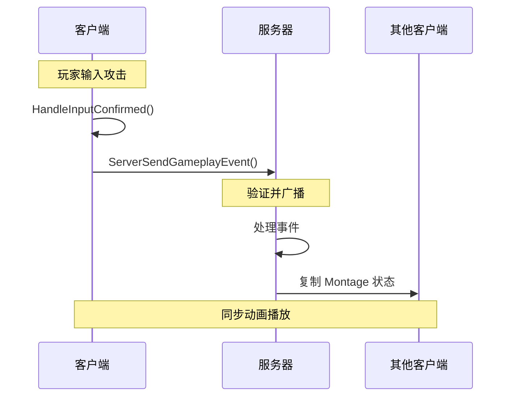
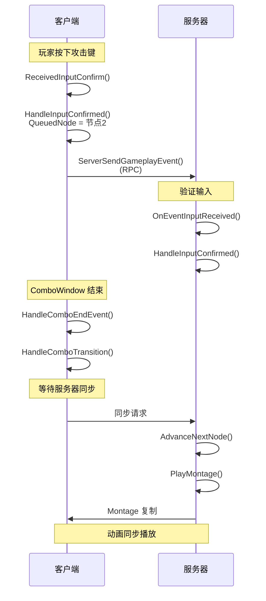

# ComboGraph 网络同步机制

本文分析 ComboGraph 如何在多人游戏中实现同步。

## 1. 网络架构概览



---

## 2. 复制策略

### 2.1 什么需要复制

| 数据 | 是否复制 | 原因 |
|------|---------|------|
| 输入确认 | ✅ 是 | 服务器需要验证 |
| 当前节点 | ❌ 否 | 由服务器推进 |
| Montage 播放 | ✅ 是 | 通过 ASC 复制 |
| Effect 应用 | ✅ 是 | 服务器权威 |
| Cue 触发 | ✅ 是 | 通过 ASC 复制 |
| Cost 消耗 | ✅ 是 | 服务器权威 |

### 2.2 复制类型

```cpp
// 边的输入实例需要复制
UCLASS()
class UComboGraphEdge : public UObject
{
    // 支持网络复制
    virtual bool IsSupportedForNetworking() const override { return true; }
    
    virtual void GetLifetimeReplicatedProps(TArray<FLifetimeProperty>& OutLifetimeProps) const override
    {
        DOREPLIFETIME(UComboGraphEdge, CurrentInputActionInstance);
    }
    
protected:
    // 复制的输入实例
    UPROPERTY(Replicated)
    FInputActionInstance CurrentInputActionInstance;
};
```

---

## 3. GameplayTasksComponent

### 3.1 为什么需要专用组件

```cpp
// 标准的 UGameplayTasksComponent 没有 RPC 功能
// ComboGraph 需要在客户端到服务器发送事件
// 因此创建了专用组件

UCLASS()
class UComboGraphGameplayTasksComponent : public UGameplayTasksComponent
{
public:
    // 发送复制的 Gameplay Event
    UFUNCTION(Server, Reliable)
    void ServerSendGameplayEvent(FGameplayTag EventTag, FGameplayEventData Payload);
    
    // 客户端 -> 服务器
    void ServerSendGameplayEvent_Implementation(
        FGameplayTag EventTag, 
        FGameplayEventData Payload
    )
    {
        AActor* Owner = GetOwner();
        if (Owner)
        {
            UAbilitySystemComponent* ASC = 
                UAbilitySystemGlobals::GetAbilitySystemComponentFromActor(Owner);
            if (ASC)
            {
                // 服务器端处理事件
                ASC->HandleGameplayEvent(EventTag, &Payload);
            }
        }
    }
};
```

### 3.2 组件的动态创建

```cpp
void UComboGraphAbilityTask_StartGraph::Activate()
{
    AActor* AvatarActor = GetAvatarActorFromActorInfo();
    
    // 检查是否已有组件
    UComboGraphGameplayTasksComponent* Component = 
        AvatarActor->FindComponentByClass<UComboGraphGameplayTasksComponent>();
    
    // 仅在服务器端创建
    if (!Component && AvatarActor->GetLocalRole() == ROLE_Authority)
    {
        Component = NewObject<UComboGraphGameplayTasksComponent>(
            AvatarActor, 
            TEXT("ComboGraphGameplayTasksComponent_Spawned")
        );
        Component->RegisterComponent();
    }
}
```

---

## 4. 输入同步

### 4.1 客户端输入处理

```cpp
void UComboGraphAbilityTask_StartGraph::ReceivedInputConfirm(
    const FInputActionInstance& InputActionInstance,
    UComboGraphEdge* Edge
)
{
    // 1. 本地处理（立即响应）
    Edge->SetIsConfirmed(true);
    Edge->SetCurrentInputActionInstance(InputActionInstance);
    HandleInputConfirmed(Cast<UComboGraphNodeAnimBase>(Edge->EndNode), Edge);
    
    // 2. 发送到服务器
    if (!IsStandalone() && IsLocallyControlled())
    {
        AActor* Avatar = GetAvatarActorFromActorInfo();
        UComboGraphGameplayTasksComponent* Component = 
            Avatar->FindComponentByClass<UComboGraphGameplayTasksComponent>();
        
        if (Component)
        {
            FGameplayEventData EventData;
            EventData.OptionalObject = Edge;
            EventData.OptionalObject2 = Edge->TransitionInput;
            
            Component->ServerSendGameplayEvent(
                FComboGraphNativeTags::Get().Input,
                EventData
            );
        }
    }
}
```

### 4.2 服务器验证

```cpp
void UComboGraphAbilityTask_StartGraph::OnEventInputReceived(FGameplayEventData EventData)
{
    // 从事件数据提取边信息
    UComboGraphEdge* Edge = Cast<UComboGraphEdge>(EventData.OptionalObject);
    
    if (Edge && !Edge->IsConfirmed())
    {
        // 服务器端验证和处理
        Edge->SetIsConfirmed(true);
        
        UComboGraphNodeAnimBase* NextNode = Cast<UComboGraphNodeAnimBase>(Edge->EndNode);
        HandleInputConfirmed(NextNode, Edge);
    }
}
```

---

## 5. 状态转换同步

### 5.1 网络同步点

```cpp
UCLASS()
class UComboGraphAbilityTask_NetworkSyncPoint : public UAbilityTask
{
public:
    // 创建同步点
    static UComboGraphAbilityTask_NetworkSyncPoint* Create(UGameplayAbility* OwningAbility);
    
    // 同步完成回调
    UPROPERTY(BlueprintAssignable)
    FOnSync OnSync;
    
protected:
    virtual void Activate() override
    {
        // 检查是否是权威端
        if (Ability->K2_HasAuthority())
        {
            // 服务器直接继续
            OnSync.Broadcast();
            EndTask();
        }
        else
        {
            // 客户端等待服务器确认
            // （通过 Gameplay Event 或 RPC）
        }
    }
};
```

### 5.2 转换同步流程

```cpp
void UComboGraphAbilityTask_StartGraph::HandleComboTransition()
{
    if (!IsLocallyControlled())
    {
        // 非本地控制（可能是 AI 或远程玩家）
        // 等待服务器同步
        UComboGraphAbilityTask_NetworkSyncPoint* SyncTask = 
            UComboGraphAbilityTask_NetworkSyncPoint::Create(Ability);
        SyncTask->OnSync.AddDynamic(
            this, 
            &UComboGraphAbilityTask_StartGraph::OnServerSyncAdvanceNextNode
        );
        SyncTask->ReadyForActivation();
        return;
    }
    
    // 本地控制，直接推进
    OnServerSyncAdvanceNextNode();
}

void UComboGraphAbilityTask_StartGraph::OnServerSyncAdvanceNextNode()
{
    // 停止当前动画
    if (RunningTask)
    {
        RunningTask->EndTask();
    }
    
    // 推进到下一个节点
    FString FailReason;
    AdvanceNextNode(QueuedNode, FailReason);
}
```

---

## 6. Montage 复制

### 6.1 利用 ASC 内置复制

```cpp
// GAS 的 ASC 已经处理了 Montage 的网络复制
// ComboGraph 只需正确使用 AbilityTask

void UComboGraphAbilityTask_StartGraph::CreatePlayMontageTask(UAnimMontage* Montage)
{
    // 使用 ComboGraph 自定义的 PlayMontage Task
    // 它内部会正确处理网络复制
    RunningTask = UComboGraphAbilityTask_PlayMontage::CreatePlayMontageAndWaitProxy(
        Ability,
        NAME_None,
        Montage,
        CurrentNode->MontagePlayRate,
        CurrentNode->GetAnimationStartSection(),
        CurrentNode->bStopAnimationWhenAbilityEnds,
        CurrentNode->RootMotionScale
    );
    
    // 绑定回调
    RunningTask->OnCompleted.AddDynamic(this, &ThisClass::OnMontageCompleted);
    RunningTask->OnBlendOut.AddDynamic(this, &ThisClass::OnMontageBlendOut);
    RunningTask->OnCancelled.AddDynamic(this, &ThisClass::OnMontageCancelled);
    RunningTask->OnInterrupted.AddDynamic(this, &ThisClass::OnMontageInterrupted);
    
    // 添加事件接收
    if (CurrentNode->EventTags.Num() > 0)
    {
        RunningTask->EventTags = CurrentNode->EventTags;
        RunningTask->EventReceived.AddDynamic(this, &ThisClass::HandleEventReceived);
    }
    
    RunningTask->ReadyForActivation();
}
```

### 6.2 网络模式检测

```cpp
bool UComboGraphAbilityTask_StartGraph::IsStandalone() const
{
    if (!AbilitySystemComponent)
    {
        return true;
    }
    
    return AbilitySystemComponent->GetNetMode() == NM_Standalone;
}

bool UComboGraphAbilityTask_StartGraph::IsLocallyControlled() const
{
    const FGameplayAbilityActorInfo* ActorInfo = Ability->GetCurrentActorInfo();
    return ActorInfo && ActorInfo->IsLocallyControlled();
}
```

---

## 7. Effect 同步

### 7.1 服务器权威

```cpp
TArray<FActiveGameplayEffectHandle> UComboGraphAbilityTask_StartGraph::ApplyEffectContainerSpec(
    const FComboGraphGameplayEffectContainerSpec& ContainerSpec
)
{
    TArray<FActiveGameplayEffectHandle> AllEffects;
    
    // Effect 只在服务器应用
    if (!Ability->K2_HasAuthority())
    {
        return AllEffects;
    }
    
    for (const FGameplayEffectSpecHandle& SpecHandle : ContainerSpec.TargetGameplayEffectSpecs)
    {
        if (SpecHandle.IsValid())
        {
            // 应用到所有目标
            AllEffects.Append(
                ApplyGameplayEffectSpecToTarget(
                    CurrentSpecHandle,
                    CurrentActorInfo,
                    CurrentActivationInfo,
                    SpecHandle,
                    ContainerSpec.TargetData
                )
            );
        }
    }
    
    return AllEffects;
}
```

### 7.2 Cost 同步

```cpp
bool UComboGraphAbilityTask_StartGraph::CommitAbilityCostForNode(
    UComboGraphNodeAnimBase* Node, 
    FString& FailReason
)
{
    // Cost 检查在服务器和客户端都执行（预测）
    // 但只有服务器的结果是权威的
    
    if (!CheckCostForNode(Node, FailReason))
    {
        return false;
    }
    
    // 实际应用只在服务器
    const UGameplayEffect* CostGE = GetCostGameplayEffectForNode(Node);
    if (CostGE)
    {
        // 这会通过 ASC 的复制机制同步到客户端
        ApplyGameplayEffectToOwner(..., CostGE, ...);
    }
    
    return true;
}
```

---

## 8. 网络时序图



---

## 9. 常见问题

### 9.1 Sequence 不支持网络

```cpp
// 在 AdvanceNextNode 中检查
const bool bIsSequence = CurrentNode->IsA(UComboGraphNodeSequence::StaticClass());
const bool bShouldWarn = FComboGraphUtils::GetPluginProjectSettings()->bSequencesNetworkedWarning;

if (bIsSequence && bShouldWarn && !IsStandalone())
{
    CG_RUNTIME_SLOG(Error, 
        TEXT("Using Animation Sequences in networked environment is not supported. "
             "Try using Animation Montages instead.")
    );
}
```

### 9.2 预测与回滚

ComboGraph 目前使用简单的服务器权威模式，不支持客户端预测回滚。这意味着：

- 高延迟环境下可能感觉不够流畅
- 适合局域网或延迟较低的联网游戏
- 如需更复杂的预测，需要自行扩展

---

*下一篇：[07-设计难点与解决方案](./07-DesignChallenges.md)*