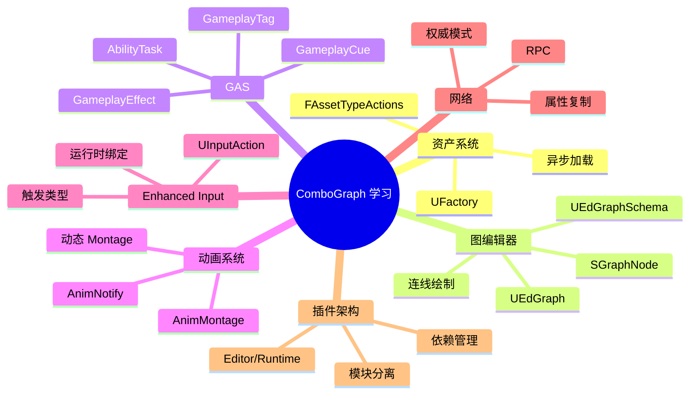

# ComboGraph 学习收获总结

通过研究 ComboGraph 插件，你可以学到以下 UE 开发知识点。

## 1. 资产系统

### 1.1 自定义资产类型

```cpp
// 步骤 1: 创建资产类
UCLASS()
class UMyCustomAsset : public UObject
{
    UPROPERTY(EditAnywhere)
    FString MyData;
};

// 步骤 2: 创建工厂
UCLASS()
class UMyCustomAssetFactory : public UFactory
{
    UMyCustomAssetFactory()
    {
        SupportedClass = UMyCustomAsset::StaticClass();
        bCreateNew = true;
    }
    
    virtual UObject* FactoryCreateNew(...) override
    {
        return NewObject<UMyCustomAsset>(InParent, SupportedClass, Name, Flags);
    }
};

// 步骤 3: 创建资产类型动作
class FAssetTypeActions_MyCustomAsset : public FAssetTypeActions_Base
{
    virtual UClass* GetSupportedClass() const override { return UMyCustomAsset::StaticClass(); }
    virtual FText GetName() const override { return LOCTEXT("Name", "My Custom Asset"); }
    virtual FColor GetTypeColor() const override { return FColor::Red; }
    virtual void OpenAssetEditor(...) override { /* 打开编辑器 */ }
};

// 步骤 4: 模块中注册
void FMyModule::StartupModule()
{
    IAssetTools& AssetTools = FModuleManager::LoadModuleChecked<FAssetToolsModule>("AssetTools").Get();
    AssetTools.RegisterAssetTypeActions(MakeShareable(new FAssetTypeActions_MyCustomAsset()));
}
```

### 1.2 学习要点

| 概念 | 说明 |
|------|------|
| `UFactory` | 资产创建工厂 |
| `FAssetTypeActions` | 定义资产在编辑器中的行为 |
| `FAssetData` | 资产元数据 |
| `FStreamableManager` | 异步加载资产 |

---

## 2. 图编辑器开发

### 2.1 核心组件

```cpp
// EdGraph - 编辑器图数据
UCLASS()
class UMyEdGraph : public UEdGraph
{
    UPROPERTY()
    UMyRuntimeGraph* RuntimeGraph;  // 引用运行时数据
};

// EdGraphNode - 编辑器节点
UCLASS()
class UMyEdNode : public UEdGraphNode
{
    virtual void AllocateDefaultPins() override
    {
        CreatePin(EGPD_Input, TEXT("MyPin"), TEXT("In"));
        CreatePin(EGPD_Output, TEXT("MyPin"), TEXT("Out"));
    }
};

// Schema - 图编辑规则
UCLASS()
class UMyGraphSchema : public UEdGraphSchema
{
    virtual void GetGraphContextActions(FGraphContextMenuBuilder& Builder) const override;
    virtual const FPinConnectionResponse CanCreateConnection(...) const override;
    virtual bool TryCreateConnection(...) const override;
};

// SGraphNode - Slate 渲染
class SMyGraphNode : public SGraphNode
{
    virtual void UpdateGraphNode() override;
    virtual TSharedRef<SWidget> CreateNodeContentArea() override;
};
```

### 2.2 学习要点

| 概念 | 说明 |
|------|------|
| `UEdGraph` | 图数据容器 |
| `UEdGraphNode` | 图节点 |
| `UEdGraphPin` | 节点引脚 |
| `UEdGraphSchema` | 图编辑规则 |
| `SGraphNode` | 节点 Slate Widget |
| `FConnectionDrawingPolicy` | 连线绘制 |
| `FGraphPanelNodeFactory` | 节点工厂 |

---

## 3. GAS 深度使用

### 3.1 AbilityTask 模式

```cpp
UCLASS()
class UMyAbilityTask : public UAbilityTask
{
public:
    // 静态创建方法
    UFUNCTION(BlueprintCallable, meta = (HidePin = "OwningAbility", DefaultToSelf = "OwningAbility"))
    static UMyAbilityTask* CreateMyTask(UGameplayAbility* OwningAbility, ...);
    
    // 委托事件
    UPROPERTY(BlueprintAssignable)
    FMyTaskDelegate OnComplete;
    
protected:
    virtual void Activate() override;
    virtual void OnDestroy(bool bInOwnerFinished) override;
};
```

### 3.2 Effect 容器模式

```cpp
USTRUCT()
struct FMyEffectContainer
{
    UPROPERTY(EditDefaultsOnly)
    TArray<TSubclassOf<UGameplayEffect>> Effects;
    
    UPROPERTY(EditDefaultsOnly)
    TMap<FGameplayTag, float> SetByCallerValues;
};

// 使用
void ApplyContainer(const FMyEffectContainer& Container, AActor* Target)
{
    for (auto& EffectClass : Container.Effects)
    {
        FGameplayEffectSpecHandle Spec = MakeOutgoingSpec(EffectClass, Level, Context);
        
        for (auto& [Tag, Value] : Container.SetByCallerValues)
        {
            Spec.Data->SetSetByCallerMagnitude(Tag, Value);
        }
        
        ApplyGameplayEffectSpecToTarget(Spec, Target);
    }
}
```

### 3.3 学习要点

| 概念 | 说明 |
|------|------|
| `UAbilityTask` | 异步能力任务 |
| `UGameplayEffect` | 效果定义 |
| `FGameplayEffectSpec` | 效果实例 |
| `FGameplayTag` | 标签系统 |
| `FGameplayEventData` | 事件数据 |
| `FGameplayCueParameters` | Cue 参数 |

---

## 4. 动画系统集成

### 4.1 AnimNotify 自定义

```cpp
// AnimNotify（瞬时）
UCLASS()
class UMyAnimNotify : public UAnimNotify
{
    virtual void Notify(USkeletalMeshComponent* MeshComp, UAnimSequenceBase* Animation) override
    {
        // 触发逻辑
    }
};

// AnimNotifyState（持续）
UCLASS()
class UMyAnimNotifyState : public UAnimNotifyState
{
    virtual void NotifyBegin(...) override { /* 开始 */ }
    virtual void NotifyTick(...) override { /* 每帧 */ }
    virtual void NotifyEnd(...) override { /* 结束 */ }
};
```

### 4.2 动态 Montage

```cpp
// 从 Sequence 创建 Montage
UAnimMontage* CreateMontageFromSequence(UAnimSequence* Sequence)
{
    UAnimMontage* Montage = NewObject<UAnimMontage>();
    
    // 设置骨架
    Montage->SetSkeleton(Sequence->GetSkeleton());
    
    // 创建 Slot
    FSlotAnimationTrack& Track = Montage->SlotAnimTracks[0];
    Track.SlotName = TEXT("DefaultSlot");
    
    // 添加动画段
    FAnimSegment Segment;
    Segment.AnimReference = Sequence;
    Segment.AnimStartTime = 0.f;
    Segment.AnimEndTime = Sequence->GetPlayLength();
    Track.AnimTrack.AnimSegments.Add(Segment);
    
    return Montage;
}
```

### 4.3 学习要点

| 概念 | 说明 |
|------|------|
| `UAnimNotify` | 瞬时动画通知 |
| `UAnimNotifyState` | 持续动画通知 |
| `UAnimMontage` | 动画蒙太奇 |
| `FAnimMontageInstance` | 蒙太奇实例 |
| `UAnimInstance` | 动画蓝图实例 |

---

## 5. Enhanced Input

### 5.1 运行时绑定

```cpp
void SetupInputBindings(UEnhancedInputComponent* InputComp)
{
    // 绑定 Action
    FInputActionBinding& Binding = InputComp->BindAction(
        MyInputAction,
        ETriggerEvent::Triggered,
        this,
        &ThisClass::OnInputTriggered,
        MyUserData  // 可传递额外数据
    );
    
    // 保存句柄以便清理
    MyBindingHandle = Binding.GetHandle();
}

void ClearInputBindings()
{
    if (InputComp && MyBindingHandle != 0)
    {
        InputComp->RemoveBindingByHandle(MyBindingHandle);
    }
}
```

### 5.2 学习要点

| 概念 | 说明 |
|------|------|
| `UInputAction` | 输入动作定义 |
| `UInputMappingContext` | 输入映射上下文 |
| `ETriggerEvent` | 触发事件类型 |
| `FInputActionInstance` | 输入实例（含时长等） |

---

## 6. 网络编程

### 6.1 RPC 模式

```cpp
UCLASS()
class UMyComponent : public UActorComponent
{
    // 服务器 RPC
    UFUNCTION(Server, Reliable)
    void ServerDoSomething(FMyData Data);
    
    void ServerDoSomething_Implementation(FMyData Data)
    {
        // 服务器执行
    }
    
    // 客户端 RPC
    UFUNCTION(Client, Reliable)
    void ClientNotify(FMyResult Result);
    
    // 多播 RPC
    UFUNCTION(NetMulticast, Reliable)
    void MulticastBroadcast();
};
```

### 6.2 属性复制

```cpp
UCLASS()
class UMyObject : public UObject
{
    virtual bool IsSupportedForNetworking() const override { return true; }
    
    virtual void GetLifetimeReplicatedProps(TArray<FLifetimeProperty>& OutLifetimeProps) const override
    {
        DOREPLIFETIME(UMyObject, MyReplicatedData);
    }
    
    UPROPERTY(Replicated)
    FMyData MyReplicatedData;
};
```

### 6.3 学习要点

| 概念 | 说明 |
|------|------|
| `UFUNCTION(Server)` | 服务器 RPC |
| `UFUNCTION(Client)` | 客户端 RPC |
| `UFUNCTION(NetMulticast)` | 多播 RPC |
| `DOREPLIFETIME` | 属性复制宏 |
| `GetNetMode()` | 获取网络模式 |

---

## 7. 插件架构

### 7.1 模块分离

```
MyPlugin/
├── Source/
│   ├── MyPluginRuntime/     ← 运行时模块
│   │   ├── Public/
│   │   ├── Private/
│   │   └── MyPluginRuntime.Build.cs
│   │
│   └── MyPluginEditor/      ← 编辑器模块
│       ├── Public/
│       ├── Private/
│       └── MyPluginEditor.Build.cs
│
└── MyPlugin.uplugin
```

### 7.2 .uplugin 配置

```json
{
    "FileVersion": 3,
    "FriendlyName": "My Plugin",
    "Modules": [
        {
            "Name": "MyPluginRuntime",
            "Type": "Runtime",
            "LoadingPhase": "Default"
        },
        {
            "Name": "MyPluginEditor",
            "Type": "Editor",
            "LoadingPhase": "PostEngineInit"
        }
    ],
    "Plugins": [
        {
            "Name": "GameplayAbilities",
            "Enabled": true
        }
    ]
}
```

### 7.3 学习要点

| 概念 | 说明 |
|------|------|
| 模块类型 | Runtime, Editor, Developer 等 |
| 加载阶段 | PreDefault, Default, PostEngineInit 等 |
| 模块依赖 | PublicDependency vs PrivateDependency |

---

## 8. 知识图谱



---

## 9. 推荐学习路径

1. **基础阶段**
   - 理解 UObject 和 UPROPERTY
   - 学习 Slate UI 基础
   - 了解 GAS 基本概念

2. **进阶阶段**
   - 研究 EdGraph 框架
   - 深入 GAS AbilityTask
   - 学习网络复制

3. **实践阶段**
   - 创建自定义资产类型
   - 开发简单的图编辑器
   - 扩展 ComboGraph 功能

---

*恭喜你完成了 ComboGraph 的学习！这些知识将帮助你成为更好的 UE 开发者。*