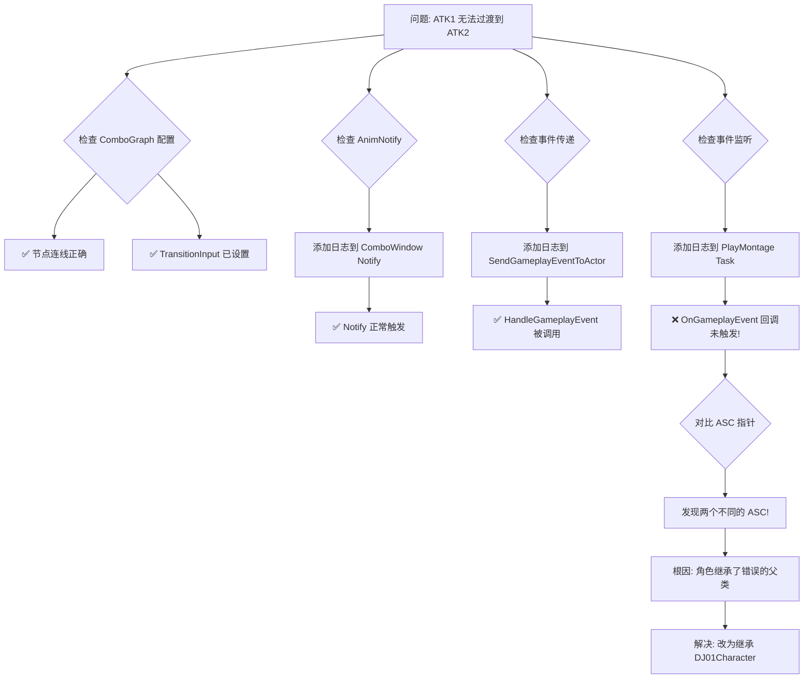
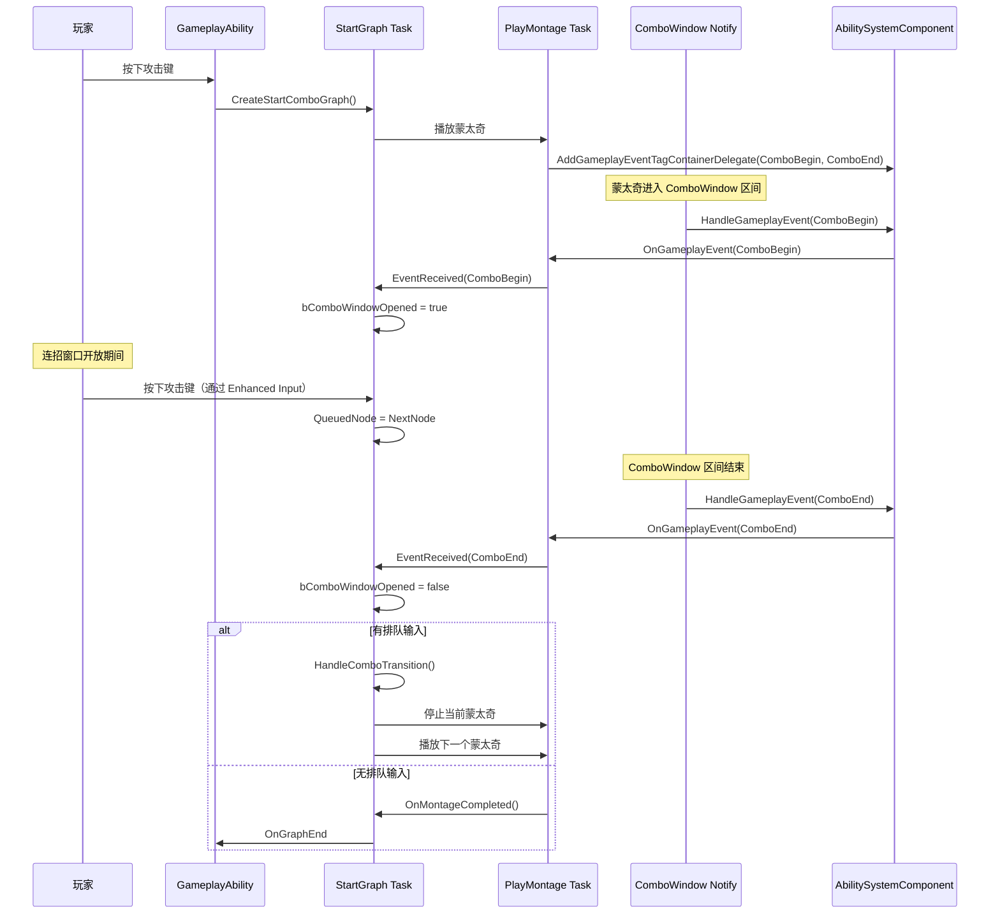
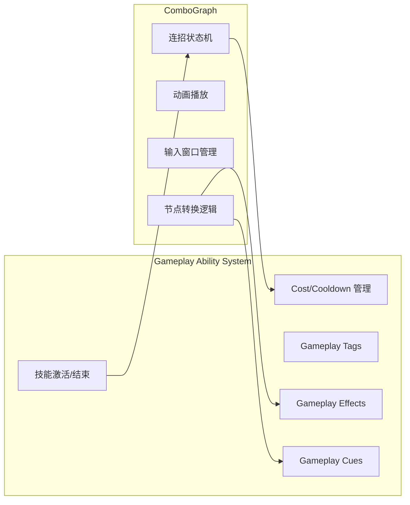
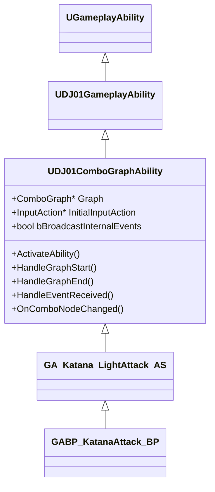

# ComboGraph 调试实战案例

本文档记录了在 DJ01 项目中集成 ComboGraph 插件时遇到的问题及调试过程，是一份宝贵的实战经验总结。

## 一、问题背景

### 1.1 目标
实现一个三段刀斩连招系统：
- **ATK1** → **ATK2**：上半身攻击，可移动
- **ATK3**：全身终结技，使用 Root Motion

### 1.2 技术栈
- ComboGraph 插件（管理连招状态机和动画）
- GAS（Gameplay Ability System，管理技能激活和效果）
- Lyra 架构（ASC 位于 PlayerState 上）
- AngelScript（技能逻辑脚本）

---

## 二、问题现象与排查过程

### 2.1 问题一：按一下触发多次技能激活

**现象**：按下攻击键，日志显示技能被激活了多次。

**原因**：`ActivationGroup` 默认允许技能重复激活，导致每次按键都重新激活技能。

**解决方案**：在 C++ 中设置 `ActivationGroup = EDJ01AbilityActivationGroup::Exclusive_Blocking`

```cpp
UDJ01ComboGraphAbility::UDJ01ComboGraphAbility(const FObjectInitializer& ObjectInitializer)
    : Super(ObjectInitializer)
{
    ActivationPolicy = EDJ01AbilityActivationPolicy::OnInputTriggered;
    ActivationGroup = EDJ01AbilityActivationGroup::Exclusive_Blocking;  // 关键修复
}
```

### 2.2 问题二：技能激活但看不到动画

**现象**：日志显示技能已激活，但角色没有播放攻击动画。

**原因**：蒙太奇的 Slot Name 与动画蓝图中的 Slot 不匹配。

**解决方案**：
1. 在动画蓝图 `ABP_MainHero` 中添加 `UpperBody` Slot
2. 确保蒙太奇使用的 Slot 与动画蓝图一致

### 2.3 问题三：ATK1 无法过渡到 ATK2（核心问题）

**现象**：ATK1 播放正常，但无论怎么按键都无法触发 ATK2。

**排查过程**：



**根因分析**：

角色 `BP_Test` 错误地继承了 `ADJ01CharacterWithAbilities`：

| 类 | ASC 位置 | 适用场景 |
|---|----------|----------|
| `ADJ01Character` | PlayerState | 玩家控制的角色（Lyra标准） |
| `ADJ01CharacterWithAbilities` | 角色自身 | AI角色、无PlayerState的角色 |

由于继承错误，导致：
- 角色身上有**自己的 ASC**（`Ptr: 7058C800`）
- PlayerState 也有 **PlayerState 的 ASC**（`Ptr: DC023C00`）
- Ability 运行在 PlayerState 的 ASC 上
- AnimNotify 发送事件到角色自身的 ASC 上
- **两个 ASC 互不通信，ComboBegin/ComboEnd 事件丢失！**

**解决方案**：将 `BP_Test` 的父类改为 `DJ01Character`

---

## 三、ComboGraph 事件驱动机制

### 3.1 核心事件 Tags

ComboGraph 使用以下 Gameplay Tags 驱动状态转换：

| Tag | 作用 | 触发时机 |
|-----|------|----------|
| `Event.ComboGraph.Animation.ComboBegin` | 开放连招输入窗口 | ComboWindow Notify 开始 |
| `Event.ComboGraph.Animation.ComboEnd` | 关闭连招窗口，处理排队输入 | ComboWindow Notify 结束 |
| `Event.ComboGraph.StateChange` | 节点切换通知 | 进入新节点时 |
| `Event.ComboGraph.Input` | 模拟输入（AI用） | 调用 SimulateComboInput |

### 3.2 事件流转时序



### 3.3 关键代码位置

| 功能 | 文件 | 关键函数 |
|------|------|----------|
| Notify 发送事件 | `ComboGraphANS_ComboWindow.cpp` | `SendEvent()` |
| 事件路由 | `ComboGraphBlueprintLibrary.cpp` | `SendGameplayEventToActor()` |
| 事件监听注册 | `ComboGraphAbilityTask_PlayMontage.cpp` | `Activate()` 中的 `AddGameplayEventTagContainerDelegate` |
| 事件处理 | `ComboGraphAbilityTask_StartGraph.cpp` | `HandleEventReceived()`, `HandleComboBeginEvent()`, `HandleComboEndEvent()` |
| 输入绑定 | `ComboGraphAbilityTask_StartGraph.cpp` | `SetupInputBindings()` |

---

## 四、ComboGraph 与 GAS 协作机制

### 4.1 职责分工



### 4.2 协作流程

1. **技能激活**：GAS 管理技能的激活条件、Cost、Cooldown
2. **ComboGraph 启动**：Ability 创建 `StartComboGraph` Task
3. **蒙太奇播放**：ComboGraph 通过 `PlayMontage` Task 播放动画
4. **节点切换时应用效果**：每个节点可配置 `GameplayEffect` 和 `GameplayCue`
5. **技能结束**：ComboGraph 结束后通知 Ability 结束

### 4.3 资源管理

| 资源 | 配置位置 | 作用 |
|------|----------|------|
| 蒙太奇 | ComboGraph 节点 | 每个节点对应的动画 |
| Cost GE | ComboGraph 节点 | 每个节点消耗的资源 |
| Effect Container | ComboGraph 节点 | 命中时应用的效果 |
| Cue Container | ComboGraph 节点 | 特效/音效 |

---

## 五、DJ01ComboGraphAbility 封装说明

### 5.1 类继承结构



### 5.2 封装的功能

```cpp filePath=Source/DJ01/Combo/Private/DJ01ComboGraphAbility.cpp
// 1. 构造函数设置默认值
UDJ01ComboGraphAbility::UDJ01ComboGraphAbility(const FObjectInitializer& ObjectInitializer)
    : Super(ObjectInitializer)
{
    ActivationPolicy = EDJ01AbilityActivationPolicy::OnInputTriggered;
    ActivationGroup = EDJ01AbilityActivationGroup::Exclusive_Blocking;  // 防止重复激活
}

// 2. ActivateAbility 中创建并启动 ComboGraph Task
void UDJ01ComboGraphAbility::ActivateAbility(...)
{
    // 获取 InitialInputAction（支持子类覆盖）
    UInputAction* ResolvedInitialInput = GetInitialInputAction();
    
    // 创建 Task
    ComboTask = UComboGraphAbilityTask_StartGraph::CreateStartComboGraph(
        this, Graph, ResolvedInitialInput, bBroadcastInternalEvents);
    
    // 绑定回调
    ComboTask->OnGraphStart.AddDynamic(this, &HandleGraphStart);
    ComboTask->OnGraphEnd.AddDynamic(this, &HandleGraphEnd);
    ComboTask->EventReceived.AddDynamic(this, &HandleEventReceived);
    
    ComboTask->ReadyForActivation();
}

// 3. 节点切换检测
void UDJ01ComboGraphAbility::HandleEventReceived(FGameplayTag EventTag, FGameplayEventData EventData)
{
    if (EventTag == FComboGraphNativeTags::Get().StateChange)
    {
        // 获取当前和之前的节点
        UComboGraphNodeAnimBase* CurrentNode = ComboTask->GetCurrentNode();
        UComboGraphNodeAnimBase* PreviousNode = ComboTask->GetPreviousNode();
        
        // 检测节点是否真的变化了
        if (CurrentNode != CachedPreviousNode)
        {
            OnComboNodeChanged(CachedPreviousNode, CurrentNode);  // 供子类覆盖
            CachedPreviousNode = CurrentNode;
        }
    }
}
```

### 5.3 子类使用方式

**AngelScript 子类** (`GA_Katana_LightAttack.as`)：
```angelscript
class UGA_Katana_LightAttack : UDJ01ComboGraphAbility
{
    void OnComboNodeChanged(UComboGraphNodeAnimBase PreviousNode, UComboGraphNodeAnimBase NewNode) override
    {
        // 根据节点名更新 Combo Tag（用于伤害计算）
        UpdateComboTag(NewNode.GetName().ToString());
    }
}
```

**蓝图子类** (`GABP_KatanaAttack`)：
- 设置 `Graph` 属性指向 `CG_KatanaBase`
- 设置 `InitialInputAction` 属性指向 `IA_LightAttack`

---

## 六、需要恢复的临时修改

在调试过程中，我们向 ComboGraph 插件添加了调试日志。问题解决后需要恢复：

### 6.1 ComboGraphANS_ComboWindow.cpp

| 行号 | 修改内容 | 恢复操作 |
|------|----------|----------|
| 7-8 | 添加了 `#include "AbilitySystemComponent.h"` 等 | 删除这两行 |
| 10 | 添加了 `DEFINE_LOG_CATEGORY_STATIC` | 删除此行 |
| 44-79 | `SendEvent()` 函数添加了大量日志和 ASC 获取逻辑 | 恢复为原版 |

**恢复后的 SendEvent 函数：**
```cpp
void UComboGraphANS_ComboWindow::SendEvent(USkeletalMeshComponent* InMeshComp, FGameplayTag InGameplayTag)
{
    if (InMeshComp)
    {
        AActor* Owner = InMeshComp->GetOwner();
        if (Owner && !FComboGraphUtils::IsAnimationPreviewActor(Owner))
        {
            UComboGraphBlueprintLibrary::SendGameplayEventToActor(Owner, InGameplayTag, FGameplayEventData());
        }
    }
}
```

### 6.2 ComboGraphBlueprintLibrary.cpp

| 行号 | 修改内容 | 恢复操作 |
|------|----------|----------|
| 16-34 | `SendGameplayEventToActor()` 添加了日志 | 删除所有 `UE_LOG` 语句 |

### 6.3 ComboGraphAbilityTask_PlayMontage.cpp

| 行号 | 修改内容 | 恢复操作 |
|------|----------|----------|
| 46 | 事件注册处添加了日志 | 删除日志，只保留 `AddGameplayEventTagContainerDelegate` 调用 |
| 420-429 | `OnGameplayEvent()` 添加了日志 | 删除日志语句 |

---

## 七、经验总结

### 7.1 调试技巧

1. **添加关键点日志**：在事件发送、接收、处理的每个环节添加日志
2. **打印对象指针**：当怀疑对象不一致时，打印指针地址进行对比
3. **追踪调用链**：从现象出发，逐步追踪到根因
4. **理解架构**：了解 Lyra 的 ASC 架构（可能在 Pawn 或 PlayerState 上）

### 7.2 Lyra 架构注意事项

| 角色类型 | 应继承的类 | ASC 位置 |
|----------|-----------|----------|
| 玩家控制角色 | `ADJ01Character` | PlayerState |
| AI 角色 | `ADJ01CharacterWithAbilities` | 角色自身 |
| 简化测试角色 | `ADJ01CharacterWithAbilities` | 角色自身 |

### 7.3 ComboGraph 集成要点

1. **Ability 设置**：使用 `Exclusive_Blocking` 防止重复激活
2. **蒙太奇配置**：确保 Slot Name 与动画蓝图一致
3. **Notify 配置**：使用 `ComboGraphANS_ComboWindow` 创建连招窗口
4. **输入配置**：在 ComboGraph Edge 上设置 `TransitionInput`
5. **ASC 一致性**：确保 Ability 和 AnimNotify 使用同一个 ASC

---

*文档版本：1.0 | 编写日期：2026-01-17*