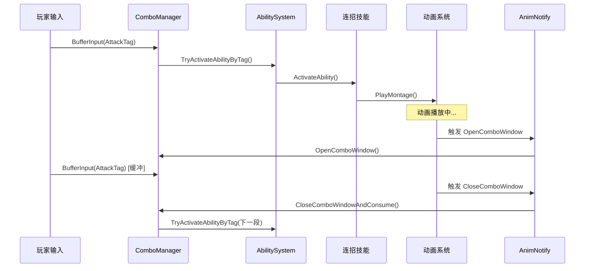
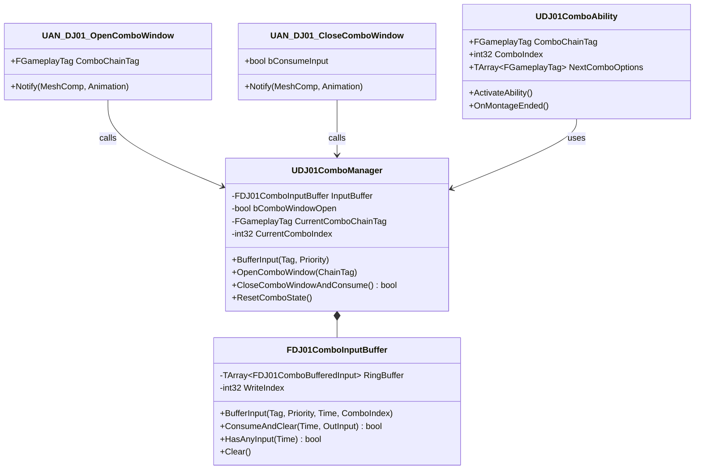

# DJ01 连招系统开发路线图

> 本文档规划连招系统的完整开发流程，确保架构稳定、逐步推进、不返工。

---

## 📋 目录

1. [系统概览](#系统概览)
2. [开发阶段](#开发阶段)
3. [详细任务清单](#详细任务清单)
4. [架构设计](#架构设计)
5. [接口定义](#接口定义)
6. [依赖关系](#依赖关系)

---

## 系统概览

### 目标

实现一个灵活的动作游戏连招系统，支持：

- ✅ 普攻连段（A1 → A2 → A3 自动衔接/输入衔接）
- ✅ 多段技能（可配置的连招链）
- ✅ 技能打断（高优先级技能打断低优先级）
- ✅ 武器切换打断（切换武器中断当前动作）
- ✅ 方向技（根据输入方向触发不同分支）
- ✅ 输入缓冲（预输入机制）

### 核心组件

```
┌─────────────────────────────────────────────────────────┐
│                    Character Layer                       │
│  ┌─────────────────┐  ┌─────────────────────────────┐   │
│  │  ComboManager   │  │  AbilitySystemComponent     │   │
│  │  - InputBuffer  │◄─┤  - 技能激活                  │   │
│  │  - ComboState   │  │  - Tag管理                   │   │
│  └────────┬────────┘  └──────────────┬──────────────┘   │
│           │                          │                   │
│           ▼                          ▼                   │
│  ┌─────────────────┐  ┌─────────────────────────────┐   │
│  │  AnimInstance   │  │  GameplayAbility            │   │
│  │  - 状态变量      │◄─┤  - 连招技能                  │   │
│  │  - 事件通知      │  │  - 打断逻辑                  │   │
│  └────────┬────────┘  └─────────────────────────────┘   │
│           │                                              │
│           ▼                                              │
│  ┌─────────────────────────────────────────────────┐    │
│  │  AnimNotifies                                    │    │
│  │  - AN_OpenComboWindow                            │    │
│  │  - AN_CloseComboWindow                           │    │
│  │  - AN_ResetCombo                                 │    │
│  └─────────────────────────────────────────────────┘    │
└─────────────────────────────────────────────────────────┘
```

---

## 开发阶段

### Phase 0: 架构定义 ✅ 已完成

| 任务 | 状态 | 说明 |
|------|------|------|
| ComboManager 组件设计 | ✅ | `UDJ01ComboManager` |
| InputBuffer USTRUCT | ✅ | `FDJ01ComboInputBuffer` |
| 缓冲输入结构体 | ✅ | `FDJ01ComboBufferedInput` |

**产出文件：**
- `Source/DJ01/Combo/Public/DJ01ComboTypes.h`
- `Source/DJ01/Combo/Public/DJ01ComboManager.h`
- `Source/DJ01/Combo/Private/DJ01ComboTypes.cpp`
- `Source/DJ01/Combo/Private/DJ01ComboManager.cpp`

---

### Phase 1: AnimNotify 接口定义

| 任务 | 状态 | 优先级 |
|------|------|--------|
| AN_DJ01_OpenComboWindow | ⬜ 待开发 | P0 |
| AN_DJ01_CloseComboWindow | ⬜ 待开发 | P0 |
| AN_DJ01_ResetCombo | ⬜ 待开发 | P1 |
| AN_DJ01_AutoChain | ⬜ 待开发 | P2 |

**目标：** 定义动画系统与 ComboManager 的交互接口

**文件规划：**
```
Source/DJ01/Combo/AnimNotifies/
├── AN_DJ01_OpenComboWindow.h
├── AN_DJ01_OpenComboWindow.cpp
├── AN_DJ01_CloseComboWindow.h
├── AN_DJ01_CloseComboWindow.cpp
├── AN_DJ01_ResetCombo.h
└── AN_DJ01_ResetCombo.cpp
```

---

### Phase 2: 动画系统基础

| 任务 | 状态 | 优先级 | 参考 |
|------|------|--------|------|
| 完善 DJ01AnimInstance | ⬜ 待开发 | P0 | Lyra ALyraAnimInstance |
| 基础移动状态变量 | ⬜ 待开发 | P0 | GroundDistance, Velocity 等 |
| 分层动画支持 | ⬜ 待评估 | P2 | LinkedAnimLayer |
| 动画蓝图模板 | ⬜ 待开发 | P1 | ABP_Character |

**关键暴露变量：**
```cpp
// 移动相关
float GroundDistance;
FVector Velocity;
float MovementSpeed;
bool bIsMoving;
bool bIsFalling;
bool bIsCrouching;

// 战斗相关
bool bIsInCombat;
int32 CurrentComboIndex;
bool bComboWindowOpen;
```

---

### Phase 3: 技能系统集成

| 任务 | 状态 | 优先级 |
|------|------|--------|
| 连招技能基类设计 | ⬜ 待开发 | P0 |
| 技能→ComboManager 交互 | ⬜ 待开发 | P0 |
| 技能打断规则配置 | ⬜ 待开发 | P1 |
| AbilityTask_WaitComboInput | ⬜ 待评估 | P2 |

**技能基类需要的功能：**
```cpp
// UDJ01ComboAbility : UDJ01GameplayAbility
class UDJ01ComboAbility
{
    // 连招链标识
    FGameplayTag ComboChainTag;
    
    // 当前是第几段
    int32 ComboIndex;
    
    // 可被哪些技能打断
    FGameplayTagContainer CancelledByTags;
    
    // 下一段技能候选
    TArray<FGameplayTag> NextComboOptions;
};
```

---

### Phase 4: 普攻原型验证

| 任务 | 状态 | 优先级 |
|------|------|--------|
| 普攻动画资源 | ⬜ 待准备 | P0 |
| 普攻 Montage + Notify | ⬜ 待开发 | P0 |
| 普攻技能 GA_Attack | ⬜ 待开发 | P0 |
| 完整流程测试 | ⬜ 待测试 | P0 |

**验证流程：**
```
玩家按键 → ComboManager.BufferInput() 
    → ASC.TryActivateAbility()
    → GA_Attack.Activate()
    → PlayMontage(Attack_01)
    → AN_OpenComboWindow → ComboManager.OpenComboWindow()
    → 玩家再次按键 → BufferInput() 被缓冲
    → AN_CloseComboWindow → ComboManager.CloseComboWindowAndConsume()
    → 消费成功 → 激活 Attack_02
    → 循环...
```

---

### Phase 5: 连招系统完善

| 任务 | 状态 | 优先级 |
|------|------|--------|
| 多武器连招链 | ⬜ 待开发 | P1 |
| 方向技分支 | ⬜ 待开发 | P1 |
| 技能打断验证 | ⬜ 待开发 | P1 |
| 武器切换打断 | ⬜ 待开发 | P2 |
| 自动衔接（部分连段） | ⬜ 待开发 | P2 |

---

### Phase 6: 配置化与工具

| 任务 | 状态 | 优先级 |
|------|------|--------|
| ComboData 数据资产 | ⬜ 待评估 | P2 |
| 连招可视化编辑器 | ⬜ 待评估 | P3 |
| 调试工具 | ⬜ 待开发 | P2 |

---

## 详细任务清单

### 当前 Sprint: Phase 1 - AnimNotify

```
[ ] 创建 AnimNotifies 目录
[ ] 实现 AN_DJ01_OpenComboWindow
    [ ] .h 文件
    [ ] .cpp 文件
    [ ] 测试编译
[ ] 实现 AN_DJ01_CloseComboWindow
    [ ] .h 文件
    [ ] .cpp 文件
    [ ] 测试编译
[ ] 实现 AN_DJ01_ResetCombo
    [ ] .h 文件
    [ ] .cpp 文件
    [ ] 测试编译
```

---

## 架构设计

### 数据流



### 类图



---

## 接口定义

### ComboManager 公开接口

```cpp
// 输入缓冲
void BufferInput(FGameplayTag AbilityTag, int32 Priority = 50);
bool TryActivateOrBuffer(FGameplayTag AbilityTag, int32 Priority = 50);
bool HasBufferedInput() const;
void ClearInputBuffer();

// 连招窗口（AnimNotify 调用）
void OpenComboWindow(FGameplayTag ComboChainTag = FGameplayTag());
bool CloseComboWindowAndConsume();
void CloseComboWindow();
bool IsComboWindowOpen() const;

// 连招状态
int32 GetCurrentComboIndex() const;
FGameplayTag GetCurrentComboChainTag() const;
void AdvanceComboIndex();
void ResetComboState();

// 自动衔接
void RequestAutoChain(FGameplayTag NextAbilityTag);

// 事件委托
FOnComboWindowStateChanged OnComboWindowStateChanged;
FOnComboAdvanced OnComboAdvanced;
```

### AnimNotify 接口

```cpp
// AN_DJ01_OpenComboWindow
UPROPERTY(EditAnywhere)
FGameplayTag ComboChainTag;  // 可选，标识当前连招链

// AN_DJ01_CloseComboWindow
UPROPERTY(EditAnywhere)
bool bConsumeInput = true;  // 是否消费输入

// AN_DJ01_ResetCombo
// 无额外参数，直接调用 ResetComboState()
```

---

## 依赖关系

```
Phase 0 (架构) ──┬── Phase 1 (AnimNotify)
                 │
                 └── Phase 2 (动画系统) ──┬── Phase 3 (技能系统)
                                          │
                                          └── Phase 4 (普攻验证)
                                                      │
                                                      ▼
                                               Phase 5 (完善)
                                                      │
                                                      ▼
                                               Phase 6 (工具)
```

**关键依赖：**
- Phase 1, 2, 3 可以**并行开发**，它们只依赖 Phase 0
- Phase 4 需要 1, 2, 3 全部完成后才能验证
- Phase 5, 6 是迭代优化阶段

---

## 参考资料

- [Lyra 动画系统](../Source/DJ01/Character/README.md)
- [GAS 架构文档](../Source/DJ01/AbilitySystem/AbilitySystem_Architecture.md)
- [动画系统设计](./Now/AnimationSystem_Design.md)

---

## 更新记录

| 日期 | 更新内容 |
|------|----------|
| 2025-12-07 | 初始版本，完成 Phase 0 架构定义 |