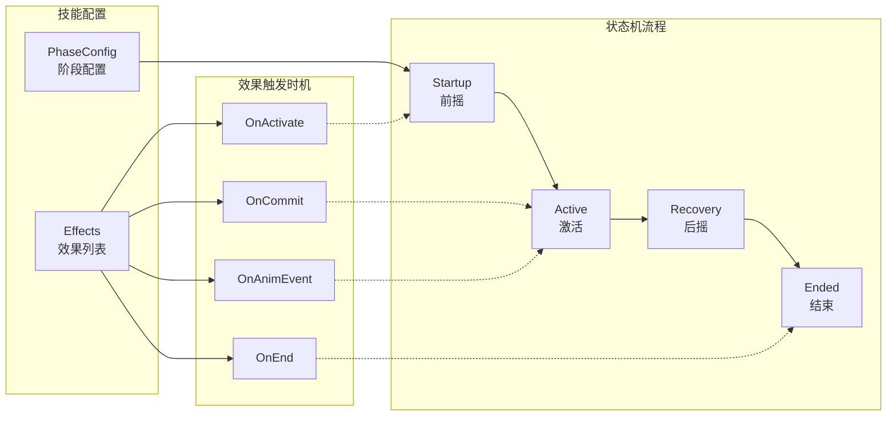
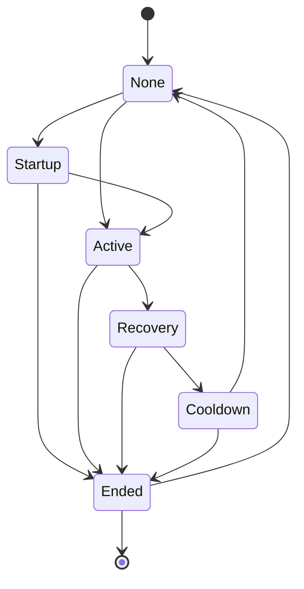

# 技能阶段状态机使用指南

> 本文档介绍如何使用 DJ01 项目的技能阶段状态机系统配置技能行为。

---

## 一、架构概览



### 核心组件

| 组件 | 文件 | 职责 |
|------|------|------|
| `UDJ01GameplayAbility` | `DJ01GameplayAbility.h/cpp` | 技能基类，持有状态机和效果配置 |
| `UDJ01AbilityPhaseStateMachine` | `DJ01AbilityPhaseStateMachine.h/cpp` | 独立状态机，管理阶段转换和计时 |
| `UDJ01AbilityEffect` | `DJ01AbilityEffect.h/cpp` | 效果基类 |
| `FDJ01AbilityPhaseConfig` | `DJ01AbilityPhase.h` | 阶段配置结构体 |

---

## 二、阶段配置 (PhaseConfig)

### 阶段枚举

```cpp
enum class EDJ01AbilityPhase : uint8
{
    None,       // 未激活
    Startup,    // 前摇阶段（可被打断）
    Active,     // 激活阶段（效果生效）
    Recovery,   // 后摇阶段（硬直）
    Cooldown,   // 冷却阶段
    Ended       // 结束
};
```

### 阶段配置属性

每个阶段 (`FDJ01AbilityPhaseInfo`) 包含以下配置：

| 属性 | 类型 | 说明 |
|------|------|------|
| `Duration` | `float` | 持续时间（秒），0 = 瞬时或由动画控制 |
| `bCanBeInterrupted` | `bool` | 是否可被打断（如受击） |
| `bCanCancelInto` | `bool` | 是否可取消到其他技能（用于连招） |
| `PhaseTags` | `FGameplayTagContainer` | 进入时添加、退出时移除的 Tag |

### 编辑器配置

在技能蓝图的 Details 面板中找到 **DJ01|Phase** 分类：


| 配置项 | 说明 |
|--------|------|
| `bUsePhaseStateMachine` | 是否启用阶段状态机 |
| `PhaseConfig.Startup` | 前摇阶段配置 |
| `PhaseConfig.Active` | 激活阶段配置 |
| `PhaseConfig.Recovery` | 后摇阶段配置 |

### C++ 配置示例

```cpp
// 技能构造函数中配置
UMySlashAbility::UMySlashAbility()
{
    // 启用阶段状态机
    bUsePhaseStateMachine = true;
    
    // 前摇配置：0.3秒，可打断，不可取消
    PhaseConfig.Startup.Duration = 0.3f;
    PhaseConfig.Startup.bCanBeInterrupted = true;
    PhaseConfig.Startup.bCanCancelInto = false;
    PhaseConfig.Startup.PhaseTags.AddTag(
        FGameplayTag::RequestGameplayTag("State.Ability.Startup")
    );
    
    // 激活阶段：0.5秒，不可打断
    PhaseConfig.Active.Duration = 0.5f;
    PhaseConfig.Active.bCanBeInterrupted = false;
    PhaseConfig.Active.bCanCancelInto = false;
    
    // 后摇配置：0.2秒，可取消到其他技能
    PhaseConfig.Recovery.Duration = 0.2f;
    PhaseConfig.Recovery.bCanBeInterrupted = true;
    PhaseConfig.Recovery.bCanCancelInto = true;  // 允许取消接下一个技能
}
```

### AngelScript 配置示例

```angelscript
class UAS_SlashAbility : UDJ01GameplayAbility
{
    default bUsePhaseStateMachine = true;
    
    UFUNCTION(BlueprintOverride)
    void K2_OnAbilityAdded()
    {
        // 配置前摇
        PhaseConfig.Startup.Duration = 0.3f;
        PhaseConfig.Startup.bCanBeInterrupted = true;
        
        // 配置激活阶段
        PhaseConfig.Active.Duration = 0.5f;
        PhaseConfig.Active.bCanBeInterrupted = false;
        
        // 配置后摇
        PhaseConfig.Recovery.Duration = 0.2f;
        PhaseConfig.Recovery.bCanCancelInto = true;
    }
}
```

---

## 三、效果配置 (Effects)

### 效果触发阶段

```cpp
enum class EDJ01EffectPhase : uint8
{
    OnActivate,   // 技能激活时立即触发
    OnCommit,     // 资源消耗后触发（前摇结束）
    OnAnimEvent,  // 动画事件触发（如伤害帧）
    OnEnd,        // 技能结束时触发
    Manual        // 手动触发（代码调用）
};
```

### 阶段与效果触发的映射关系

| EDJ01EffectPhase | 对应阶段 | 触发时机 |
|------------------|----------|----------|
| `OnActivate` | Startup | 技能激活/进入前摇时 |
| `OnCommit` | Active | 进入激活阶段时（前摇结束） |
| `OnAnimEvent` | Active | 收到指定动画事件时 |
| `OnEnd` | Ended | 技能结束时 |
| `Manual` | - | 代码手动触发 |

### 编辑器配置效果

在技能蓝图的 **DJ01|Effects** 分类中添加效果：

```
Effects (数组)
├── [0] Phase: OnActivate
│       Effect: DJ01DamageEffect (伤害效果)
│           ├── BaseDamage: 50
│           ├── ADRatio: 1.0
│           └── APRatio: 0.5
│
├── [1] Phase: OnAnimEvent
│       EventTag: Event.Animation.DamageFrame
│       Effect: DJ01DamageEffect (伤害效果)
│           └── BaseDamage: 100
│
└── [2] Phase: OnEnd
        Effect: DJ01HealEffect (治疗效果)
            └── BaseHeal: 20
```

### C++ 配置效果示例

```cpp
UMySlashAbility::UMySlashAbility()
{
    // 创建伤害效果（激活时触发）
    FDJ01AbilityEffectEntry DamageEntry;
    DamageEntry.Phase = EDJ01EffectPhase::OnCommit;
    DamageEntry.Effect = CreateDefaultSubobject<UDJ01DamageEffect>("MainDamage");
    Cast<UDJ01DamageEffect>(DamageEntry.Effect)->BaseDamage = 100.0f;
    Cast<UDJ01DamageEffect>(DamageEntry.Effect)->ADRatio = 1.5f;
    Effects.Add(DamageEntry);
    
    // 创建动画事件触发的效果
    FDJ01AbilityEffectEntry AnimEventEntry;
    AnimEventEntry.Phase = EDJ01EffectPhase::OnAnimEvent;
    AnimEventEntry.EventTag = FGameplayTag::RequestGameplayTag("Event.Animation.HitFrame");
    AnimEventEntry.Effect = CreateDefaultSubobject<UDJ01DamageEffect>("HitDamage");
    Effects.Add(AnimEventEntry);
}
```

### 内置效果类

| 效果类 | 文件 | 功能 |
|--------|------|------|
| `UDJ01DamageEffect` | `DJ01DamageEffect.h/cpp` | 造成伤害 |
| `UDJ01HealEffect` | `DJ01HealEffect.h/cpp` | 治疗 |

---

## 四、状态切换控制

### 自动切换（默认行为）

状态机根据 `Duration` 自动推进：

```
Startup (Duration秒后) → Active (Duration秒后) → Recovery (Duration秒后) → Ended
```

如果某阶段 `Duration = 0` 且没有 `PhaseTags`，则跳过该阶段。

### 有效的状态转换



### 手动切换 API

```cpp
// 切换到指定阶段
bool TransitionToPhase(EDJ01AbilityPhase NewPhase, bool bForce = false);

// 强制切换（跳过验证）
TransitionToPhase(EDJ01AbilityPhase::Ended, true);

// 跳过当前阶段，立即进入下一阶段
void SkipCurrentPhase();
```

### 查询状态 API

```cpp
// 获取当前阶段
EDJ01AbilityPhase GetCurrentPhase() const;

// 获取状态机实例
UDJ01AbilityPhaseStateMachine* GetPhaseStateMachine() const;

// 获取当前阶段剩余时间
float GetCurrentPhaseRemainingTime() const;

// 当前阶段是否可被打断
bool CanCurrentPhaseBeInterrupted() const;

// 当前阶段是否可取消到其他技能
bool CanCurrentPhaseCancelInto() const;
```

### 使用示例

```cpp
void UMyAbility::TryInterrupt()
{
    if (CanCurrentPhaseBeInterrupted())
    {
        // 可以被打断，结束技能
        TransitionToPhase(EDJ01AbilityPhase::Ended, true);
    }
}

void UMyAbility::TryChainNextAbility()
{
    if (CanCurrentPhaseCancelInto())
    {
        // 可以接下一个技能
        EndAbility(CurrentSpecHandle, CurrentActorInfo, CurrentActivationInfo, 
                   true, false);
    }
}
```

---

## 五、自定义阶段行为

### 重写阶段回调（C++）

```cpp
// 头文件
UCLASS()
class UMyAbility : public UDJ01GameplayAbility
{
    GENERATED_BODY()
    
protected:
    virtual void OnPhaseEnter_Implementation(EDJ01AbilityPhase Phase) override;
    virtual void OnPhaseExit_Implementation(EDJ01AbilityPhase Phase) override;
};

// 实现文件
void UMyAbility::OnPhaseEnter_Implementation(EDJ01AbilityPhase Phase)
{
    // 先调用父类（触发效果）
    Super::OnPhaseEnter_Implementation(Phase);
    
    switch (Phase)
    {
    case EDJ01AbilityPhase::Startup:
        // 播放前摇动画
        PlayMontage(StartupMontage);
        break;
        
    case EDJ01AbilityPhase::Active:
        // 生成技能特效
        SpawnVFX();
        break;
        
    case EDJ01AbilityPhase::Recovery:
        // 播放后摇动画
        PlayMontage(RecoveryMontage);
        break;
    }
}

void UMyAbility::OnPhaseExit_Implementation(EDJ01AbilityPhase Phase)
{
    Super::OnPhaseExit_Implementation(Phase);
    
    if (Phase == EDJ01AbilityPhase::Active)
    {
        // 清理激活阶段的特效
        CleanupVFX();
    }
}
```

### 重写阶段回调（AngelScript）

```angelscript
class UAS_FireballAbility : UDJ01GameplayAbility
{
    UFUNCTION(BlueprintOverride)
    void OnPhaseEnter(EDJ01AbilityPhase Phase)
    {
        switch (Phase)
        {
        case EDJ01AbilityPhase::Startup:
            // 播放蓄力动画
            break;
            
        case EDJ01AbilityPhase::Active:
            // 发射火球
            SpawnFireball();
            break;
            
        case EDJ01AbilityPhase::Recovery:
            // 播放收招动画
            break;
        }
    }
    
    UFUNCTION(BlueprintOverride)
    void OnPhaseExit(EDJ01AbilityPhase Phase)
    {
        // 自定义退出逻辑
    }
}
```

### 蓝图重写

在蓝图中可以直接重写 `OnPhaseEnter` 和 `OnPhaseExit` 事件：


---

## 六、与 ComboGraph 配合使用

`UDJ01ComboGraphAbility` 继承自 `UDJ01GameplayAbility`，自动支持阶段状态机。

### 动画事件自动触发效果

ComboGraph 系统收到动画事件时会自动调用 `TriggerEffectsByEvent`：

```cpp
void UDJ01ComboGraphAbility::HandleAnimationEvent(const FGameplayEventData& EventData)
{
    // 提取目标
    TArray<AActor*> Targets;
    if (AActor* TargetActor = EventData.Target.Get())
    {
        Targets.Add(TargetActor);
    }
    
    // 通过 EventTag 触发匹配的效果
    TriggerEffectsByEvent(EventData.EventTag, Targets);
}
```

### 配置方式

只需在效果配置中设置：
- `Phase = OnAnimEvent`
- `EventTag = 对应的动画事件 Tag`

```
Effects
└── [0] Phase: OnAnimEvent
        EventTag: Event.Animation.Combo.Hit1
        Effect: DJ01DamageEffect
            └── BaseDamage: 50
```

---

## 七、状态机委托

状态机提供以下委托供外部监听：

| 委托 | 参数 | 触发时机 |
|------|------|----------|
| `OnPhaseChanged` | `(OldPhase, NewPhase)` | 阶段变化时 |
| `OnPhaseEnter` | `(Phase)` | 进入阶段时 |
| `OnPhaseExit` | `(Phase)` | 退出阶段时 |
| `OnFinished` | `()` | 状态机运行结束时 |

### 绑定委托（C++）

```cpp
void UMyAbility::SetupStateMachineBindings()
{
    if (UDJ01AbilityPhaseStateMachine* SM = GetPhaseStateMachine())
    {
        SM->OnPhaseChanged.AddDynamic(this, &UMyAbility::OnPhaseChangedHandler);
    }
}

void UMyAbility::OnPhaseChangedHandler(EDJ01AbilityPhase OldPhase, EDJ01AbilityPhase NewPhase)
{
    UE_LOG(LogTemp, Log, TEXT("Phase changed: %s -> %s"), 
           *GetAbilityPhaseName(OldPhase), *GetAbilityPhaseName(NewPhase));
}
```

---

## 八、完整示例

### 普攻技能

```cpp
UCLASS()
class UBasicAttackAbility : public UDJ01GameplayAbility
{
    GENERATED_BODY()
    
public:
    UBasicAttackAbility()
    {
        // ===== 阶段配置 =====
        bUsePhaseStateMachine = true;
        
        // 前摇 0.1 秒（可打断）
        PhaseConfig.Startup.Duration = 0.1f;
        PhaseConfig.Startup.bCanBeInterrupted = true;
        
        // 激活 0.3 秒（不可打断）
        PhaseConfig.Active.Duration = 0.3f;
        PhaseConfig.Active.bCanBeInterrupted = false;
        
        // 后摇 0.15 秒（可接其他技能）
        PhaseConfig.Recovery.Duration = 0.15f;
        PhaseConfig.Recovery.bCanCancelInto = true;
        
        // ===== 效果配置 =====
        
        // 伤害效果：动画伤害帧触发
        FDJ01AbilityEffectEntry DamageEntry;
        DamageEntry.Phase = EDJ01EffectPhase::OnAnimEvent;
        DamageEntry.EventTag = FGameplayTag::RequestGameplayTag("Event.Animation.Attack.Hit");
        DamageEntry.Effect = CreateDefaultSubobject<UDJ01DamageEffect>("Damage");
        auto* DamageEffect = Cast<UDJ01DamageEffect>(DamageEntry.Effect);
        DamageEffect->BaseDamage = 30.0f;
        DamageEffect->ADRatio = 1.0f;
        Effects.Add(DamageEntry);
    }
};
```

### 蓄力技能

```cpp
UCLASS()
class UChargeAttackAbility : public UDJ01GameplayAbility
{
    GENERATED_BODY()
    
public:
    UChargeAttackAbility()
    {
        bUsePhaseStateMachine = true;
        
        // 长前摇（蓄力阶段）
        PhaseConfig.Startup.Duration = 1.5f;
        PhaseConfig.Startup.bCanBeInterrupted = true;
        PhaseConfig.Startup.PhaseTags.AddTag(
            FGameplayTag::RequestGameplayTag("State.Charging")
        );
        
        // 瞬时激活
        PhaseConfig.Active.Duration = 0.2f;
        PhaseConfig.Active.bCanBeInterrupted = false;
        
        // 较长后摇
        PhaseConfig.Recovery.Duration = 0.5f;
        PhaseConfig.Recovery.bCanCancelInto = false;
        
        // 蓄力完成时造成伤害
        FDJ01AbilityEffectEntry DamageEntry;
        DamageEntry.Phase = EDJ01EffectPhase::OnCommit;
        DamageEntry.Effect = CreateDefaultSubobject<UDJ01DamageEffect>("ChargeDamage");
        Cast<UDJ01DamageEffect>(DamageEntry.Effect)->BaseDamage = 200.0f;
        Effects.Add(DamageEntry);
    }
    
protected:
    virtual void OnPhaseEnter_Implementation(EDJ01AbilityPhase Phase) override
    {
        Super::OnPhaseEnter_Implementation(Phase);
        
        if (Phase == EDJ01AbilityPhase::Startup)
        {
            // 显示蓄力 UI
            ShowChargeUI();
        }
    }
    
    virtual void OnPhaseExit_Implementation(EDJ01AbilityPhase Phase) override
    {
        Super::OnPhaseExit_Implementation(Phase);
        
        if (Phase == EDJ01AbilityPhase::Startup)
        {
            // 隐藏蓄力 UI
            HideChargeUI();
        }
    }
};
```

---

## 九、调试技巧

### 日志

启用 `LogDJ01AbilitySystem` 的 Verbose 级别查看详细日志：

```ini
[Core.Log]
LogDJ01AbilitySystem=Verbose
```

### 控制台命令

```
// 显示当前激活技能的阶段信息
ShowDebug AbilitySystem
```

### 常见问题

| 问题 | 可能原因 | 解决方案 |
|------|----------|----------|
| 效果未触发 | Phase 不匹配 | 检查 `EDJ01EffectPhase` 配置 |
| 阶段跳过 | Duration=0 且无 PhaseTags | 设置合适的 Duration |
| 状态机未启动 | `bUsePhaseStateMachine=false` | 启用状态机 |
| 无法取消到其他技能 | `bCanCancelInto=false` | 修改对应阶段配置 |

---

## 相关文档

- [DJ01 Effect System](./EffectSystem_Guide.md)
- [DJ01 ComboGraph Integration](./ComboGraph_Integration.md)
- [DJ01 Attribute System](../DJ01_ATTRIBUTE_SYSTEM/README.md)