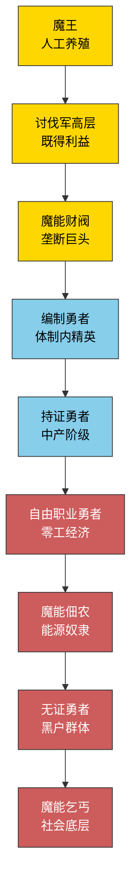
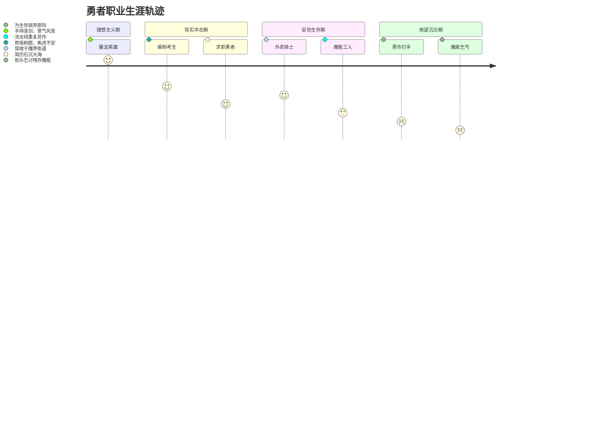
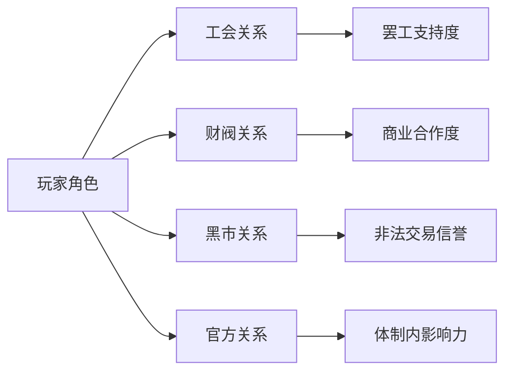
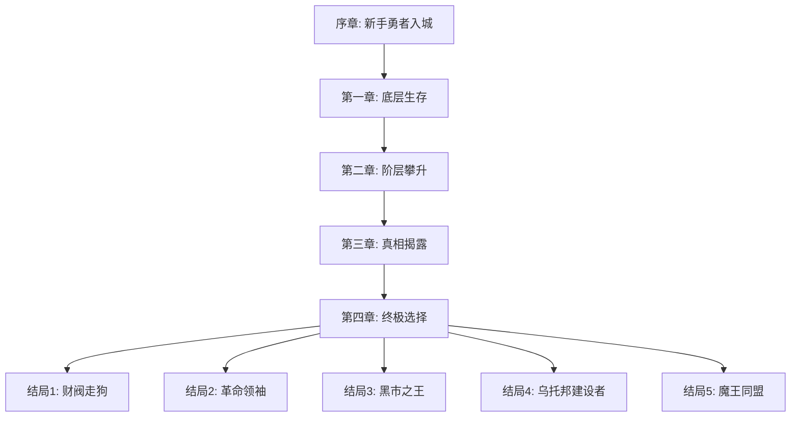
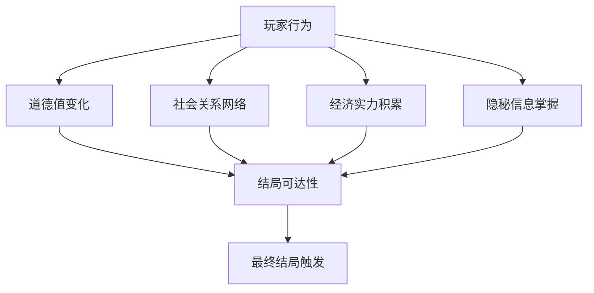

# 《Too Many Damn Heroes》游戏设计文档

*一个魔法朋克社会的黑色幽默动作RPG*

---

## 📋 文档信息
- **项目代号**: TMD_Heroes
- **游戏类型**: 动作RPG / 社会模拟 / 黑色幽默
- **目标平台**: PC / Unreal Engine 5 (Lyra框架)
- **文档版本**: v2.0
- **更新日期**: 2024-12-30

---

## 🎯 游戏核心概念

### 设计理念
一个通过"勇者通货膨胀"和"魔物牧场"这一荒诞设定，深度讽刺现代社会内卷、工业化生产、制造危机等问题的魔法朋克动作RPG。玩家在这个扭曲的魔法社会中体验真实的战斗、逐步发现真相、并做出改变命运的选择。

### 核心玩法循环
```
接取讨伐任务 → 真实战斗 → 发现违和感 → 调查真相 → 道德抉择 → 结局分化
           ↑                                              ↓
           ←←← 社会模拟：阶层流动、关系网络、经济生存 ←←←←
```

### 游戏双核心
1. **战斗核心**：与真实存在的魔物进行有风险的战斗
2. **社会核心**：在精心设计的"就业体系"中生存和发现真相

---

## 🌍 世界观设定

### 魔法朋克社会深度设定

#### 1. 核心社会矛盾
- **勇者通货膨胀危机**：
  - 异世界召唤术失控，每月新增10万+勇者
  - 屠龙技能沦为"基础生存技能"
  - 勇者就业市场彻底饱和

**典型勇者简历模板**：
```markdown
【勇者履历表】
姓名：张三（异世界ID: HERO_114514）
核心技能：
✅ 单手屠龙 (熟练度: 80%)
✅ 史诗级武器精通 (持证上岗)
✅ 魔法阵描绘 (速度: 3秒/个)
❌ 讨伐军编制 (梦寐以求)

工作经历：
- 魔界外卖配送员 (2年经验)
- 魔能工厂流水线工 (6个月)
- 黑市打手 (兼职)

期望薪资：300魔能币/月 + 五险一金
```

#### 2. 魔法能源经济体系

| 能源类型 | 获取方式 | 阶级限制 | 副作用 | 市场价格 |
|----------|----------|----------|--------|----------|
| **纯净魔能** | 财阀专供 | 黄金市民 | 成瘾性依赖 | 1000币/单位 |
| **工业废能** | 管道偷接 | 违法获取 | 随机变异 | 5币/单位 |
| **生命转化** | 黑市交易 | 无门槛 | 永久减HP | 50币/单位 |
| **环境吸收** | 污染区冥想 | 需防护装备 | 精神污染 | 免费但危险 |
| **情绪燃料** | 出卖快乐/痛苦 | 心理健康消耗 | 人格缺失 | 200币/单位 |

#### 3. 社会阶层结构



---

## 🎭 角色与职业系统

### 传统职业的现代化转型

#### 魔法服务业
| 职业名称 | 工作内容 | 技能需求 | 荒诞现实 |
|----------|----------|----------|----------|
| **魔网主播** | 直播"屠龙"内容（特效造假） | 幻象魔法 + 营销学 | 粉丝要求线下见面屠真龙 |
| **魔能快递** | 用传送门配送商品 | 空间魔法 + 体力 | 被投诉"包裹有异次元生物" |
| **治疗师** | 医疗魔法服务 | 生命魔法 + 医学 | 医疗保险不覆盖"诅咒类疾病" |
| **占卜师** | 预测服务（多为诈骗） | 预言魔法 + 话术 | 预测股市被证监会查封 |

#### 新兴魔法职业
| 职业名称 | 工作内容 | 社会地位 | 职业风险 |
|----------|----------|----------|----------|
| **情绪工人** | 向富人出售快乐魔法 | 底层服务业 | 情感永久缺失 |
| **记忆编辑师** | 删改不良记忆 | 中产技术岗 | 自身记忆混乱 |
| **魔能律师** | 处理魔法合同纠纷 | 中上层白领 | 被财阀威胁生命 |
| **亡灵客服** | 通过灵魂提供24h服务 | 最底层工作 | 生死界限模糊 |

### 职业转换系统



---

## 🏙️ 环境与场景设计

### 主要区域设定

#### 1. 符文金融城
- **视觉特征**: 悬浮的蓝色水晶大厦，金色符文装饰
- **环境音效**: 魔能交易所的喧闹声，传送门的嗡鸣声
- **特殊规则**: 
  - 禁飞区域（违者立即击落）
  - 魔能消费税高达30%
  - 需要"信用魔晶"才能进入高档区域

#### 2. 魔能贫民窟
- **视觉特征**: 生锈的紫色管道网络，到处漏液
- **环境音效**: 蒸汽嘶鸣，管道爆炸声
- **特殊机制**:
  - 随机魔能泄漏事件
  - 空气中有毒魔能颗粒
  - "魔能食物银行"救济站

#### 3. 黑市"胃袋区"
- **设定**: 巨型魔兽胃囊改造的地下交易场所
- **视觉**: 肉质墙壁，消化液滴落
- **机制**: 每小时布局随机变化，考验玩家记忆

#### 4. 讨伐军工业基地
- **标志**: 镀金巨龙骨架大门
- **氛围**: 军事化管理，KPI排行榜随处可见
- **内部设施**: 
  - "勇者工厂"批量培训中心
  - "战绩展示厅"英雄宣传中心
  - "业绩惩罚室"道德绑架场所

#### 5. 魔物繁殖场（隐藏区域）
- **位置**: 偏远地区，对外伪装成"军事禁区"
- **设施**: 
  - 孵化大厅：批量培育各等级魔物
  - 驯化训练场：植入可预测的行为模式
  - 投放准备区：等待运输的"产品"暂存
- **氛围**: 工厂化、压抑、充满生物气息
- **解锁条件**: 游戏中后期通过调查发现

### 动态环境系统

#### 魔能气象灾害
| 天气类型 | 影响效果 | 持续时间 | 应对方式 |
|----------|----------|----------|----------|
| **魔能酸雨** | 装备腐蚀加速 | 2-4小时 | 室内避难/防护装备 |
| **情绪风暴** | NPC态度随机改变 | 30分钟 | 情绪稳定剂 |
| **记忆迷雾** | 暂时遗忘已学技能 | 1小时 | 记忆药水 |
| **贪婪极光** | 金钱消耗翻倍 | 全天 | 封闭钱包/以物易物 |

#### 环境污染计算
$$\text{生存难度} = \frac{\text{区域污染浓度} \times \text{暴露时间}}{\text{防护装备等级} + \text{角色抗性}}$$

---

## 🎮 核心游戏机制

### 1. 魔能管理系统
- **魔能值**: 角色的生命力和魔法来源
- **消耗机制**: 技能使用、生存需求、房租税收
- **获取途径**: 工作收入、任务奖励、黑市交易
- **质量分级**: 纯净 > 工业 > 废料 > 污染

### 2. 社会关系网络


### 3. 道德抉择系统
- **剥削他人**: 获得经济利益，降低道德值
- **援助弱者**: 消耗资源，提升威望值
- **揭露真相**: 社会影响力提升，但面临威胁
- **同流合污**: 快速获得既得利益集团认同

---

## 🎯 任务与事件设计

### 随机社会事件

#### 周期性事件
1. **"屠龙证"考试季**
   - 考场外黄牛党兜售"真题"（成功率仅20%）
   - 玩家选择: 举报/购买/自己当枪手
   - 结果影响: 社会声誉/经济收益/法律风险

2. **魔能短缺危机**
   - 财阀人为制造供应紧张
   - 黑市价格暴涨300%
   - 贫民窟出现"魔能食物银行"

3. **勇者再就业培训**
   - "三天学会瞬移外卖术！包就业！"
   - 实际陷阱: 终身分成协议
   - 隐藏选项: 调查培训机构背景

#### 突发事件
- **工厂魔能泄漏**: 选择救援/逃跑/趁火打劫
- **财阀税务调查**: 协助/包庇/举报
- **勇者工会罢工**: 参与/反对/中立观望

### 主线任务架构



---

## 🎭 NPC与对话系统

### 典型NPC语录集

#### 底层勇者群体
- **失业老勇者**: *"当年我杀的是真龙，现在？我杀的是送餐超时这条恶龙。"*
- **魔能工人**: *"每天12小时站在炼化炉前，我觉得自己快被炼化了。"*
- **街头艺人**: *"表演'徒手屠龙'赚小费，观众都知道是假的，但他们需要这个幻觉。"*

#### 中产阶级
- **编制勇者**: *"体制内福利不错，就是要求随时准备'为人民屠龙'。"*
- **魔能律师**: *"我专门处理勇者劳动纠纷，讽刺的是我自己也在被剥削。"*
- **治疗师**: *"治疗别人的外伤容易，治疗社会的病却无能为力。"*

#### 精英阶层
- **财阀代表**: *"勇者多了？那就投放更多魔物啊，供需平衡懂吗？"*
- **讨伐军官**: *"我们不是在培养英雄，我们是在管理产能过剩。"*
- **知情高层**: *"魔王？那是我们最成功的产品。每五年一个，刚刚好。"*

#### 繁殖场工人（隐藏群体）
- **驯兽师**: *"这些魔物，从出生到死亡，都在我的手中。但我不能告诉任何人。"*
- **技术员**: *"你知道吗？每只史莱姆都有编号。我给今天这批编到了No.114514。"*
- **老工人**: *"有时候我分不清，到底是我们在养魔物，还是这个体制在养我们。"*

#### 特殊群体
- **黑市商人**: *"新鲜的魔能石！昨天刚从讨伐军仓库'借'出来的！"*
- **贫民窟孩子**: *"长大后我要当魔王——至少包吃包住！"*
- **魔网主播**: *"家人们，今天直播真人屠龙！不过是在绿幕前面。"*

### 对话系统机制
- **情绪状态影响**: NPC当前情绪影响对话选项
- **社会关系检测**: 玩家身份地位决定可触发对话
- **道德立场分歧**: 不同价值观的NPC有不同反应
- **信息获取差异**: 不同阶层NPC掌握的信息不同

---

## 🏆 多元结局系统

### 六大结局路线

| 结局类型 | 达成条件 | 关键抉择点 | 结局描述 |
|----------|----------|------------|----------|
| **财阀代言人** | 利用真相获取权力 | 销毁繁殖场证据 | 成为既得利益集团一员 |
| **革命领袖** | 收集足够证据+支持者 | 公开繁殖场真相 | 推翻虚假体系，面对新挑战 |
| **改良主义者** | 在体制内积累影响力 | 推动渐进改革 | 改善制度但体系继续运作 |
| **地下皇帝** | 垄断80%黑市交易 | 控制信息黑市 | 建立影子情报帝国 |
| **逃离者** | 发现真相+无力改变 | 离开这个城邦 | 探索未知的外部世界 |
| **虚无主义者** | 道德值降至最低 | 引爆繁殖场魔物失控 | 释放所有魔物，制造混乱 |

### 结局影响因子


---

## 🎨 美术风格与UI设计

### 视觉风格定位
- **主色调**: 魔法朋克紫 + 工业废土灰 + 贫富分化金
- **美术风格**: 像素艺术 + 赛博朋克元素
- **角色设计**: 现代职业装 + 魔法道具混搭

### 阶层视觉识别系统
| 社会阶层 | 颜色标识 | 材质特征 | UI元素 |
|----------|----------|----------|--------|
| **精英阶层** | 金色/宝蓝 | 发光水晶/丝绸 | 华丽边框/动态效果 |
| **中产阶级** | 银色/青绿 | 金属/皮革 | 简洁线条/实用设计 |
| **底层群体** | 铜色/暗红 | 锈蚀/破布 | 粗糙边缘/故障效果 |

### UI界面设计理念
- **信息密度**: 反映社会压力感
- **色彩对比**: 凸显阶级差异
- **交互反馈**: 体现社会地位变化
- **字体选择**: 现代简约 + 魔法符文装饰

---

## 🔧 技术实现规划

### 核心系统架构

#### 数据驱动设计
```csharp
[System.Serializable]
public class SocialEventData : ScriptableObject
{
    public string eventID;
    public string eventName;
    public string description;
    public SocialClass triggerClass;
    public List<EventChoice> choices;
    public Dictionary<StatType, int> consequences;
}
```

#### 关键系统模块
1. **社会关系管理器** - 处理NPC好感度、派系影响力
2. **经济系统管理器** - 魔能价格、通胀率、税收计算
3. **道德选择追踪器** - 记录玩家行为，影响结局分支
4. **随机事件生成器** - 基于当前社会状况生成合适事件
5. **对话系统引擎** - 动态生成符合角色身份的对话内容

### 存档系统设计
- **角色状态**: 等级、技能、魔能值、社会地位
- **世界状态**: 各区域污染度、NPC关系、经济指标
- **选择记录**: 重要决策历史，影响后续剧情分支
- **隐藏数据**: 未发现的秘密信息、隐藏结局进度

---

## 🎵 音频设计方案

### 音乐风格
- **主题曲**: 魔幻交响 + 工业电子混合
- **区域BGM**: 
  - 金融城: 紧张的交易所音效 + 古典管弦
  - 贫民窟: 压抑的工业噪音 + 民谣吉他
  - 黑市: 神秘的氛围音 + 爵士元素

### 音效设计
- **魔能音效**: 不同纯度的魔能有不同音频特征
- **社会环境音**: 反映各区域的生活状态
- **情绪音效**: 配合角色情感变化的音频提示

---

## 📊 游戏机制的现实隐喻

### 社会批判映射表
| 游戏机制 | 现实对应 | 讽刺要素 |
|----------|----------|----------|
| 勇者通货膨胀 | 大学生就业难 | 技能贬值、内卷加剧 |
| 魔能垄断 | 能源/资源垄断 | 基础需求被商品化 |
| 编制考试 | 公务员考试 | 阶层固化、机会稀缺 |
| **魔物繁殖场** | **工业化养殖/制造危机** | **生命被商品化，危机被制造** |
| **人造魔王** | **制造假想敌/战争经济** | **政治需要时就"投放"一个敌人** |
| 情绪贩卖 | 情感劳动 | 精神服务商品化 |
| 污染区域 | 环境问题 | 发展代价由底层承担 |
| **繁殖场工人** | **知情但沉默的底层** | **最了解真相的人反而最无力** |

### 玩法与思考的结合
- 每个游戏机制都映射真实社会问题
- 玩家在娱乐中自然思考社会现象
- 多重结局展示不同价值观选择的后果

---

## 🚀 开发里程碑

### Phase 1: 核心系统 (2-3个月)
- [ ] 基于Lyra框架的角色系统
- [ ] GAS能力系统基础架构
- [ ] 魔物AI行为树（繁殖型/失控型/野生型）
- [ ] 核心战斗循环原型
- [ ] 社会关系网络基础框架

### Phase 2: 世界构建 (2-3个月)  
- [ ] 核心区域场景搭建
- [ ] 繁殖场隐藏区域
- [ ] NPC对话系统和关系网络
- [ ] 证据收集和调查系统

### Phase 3: 内容填充 (3-4个月)
- [ ] 主线任务链完整实现
- [ ] 真相揭示层次设计
- [ ] 随机事件库建设(50+事件)
- [ ] 6大结局路线完整测试
- [ ] 美术资源批量制作

### Phase 4: 平衡调优 (1-2个月)
- [ ] 战斗系统平衡性调整
- [ ] 经济系统平衡性调整
- [ ] 多轮玩测反馈整合
- [ ] 性能优化和bug修复
- [ ] 音效音乐整合

### Phase 5: 发布准备 (0.5个月)
- [ ] 最终版本打包测试
- [ ] 宣传材料制作
- [ ] 发布平台准备

---

## 📚 附录

### 参考资料
- 《1984》- 极权社会讽刺
- 《美丽新世界》- 消费主义批判  
- 《雪国列车》- 阶级固化隐喻
- 《黑镜》系列 - 技术社会反思

### 灵感来源游戏
- 《Papers, Please》- 道德选择系统
- 《This War of Mine》- 生存道德困境
- 《Disco Elysium》- 复杂的意识形态表达
- 《标准配送》- 劳动异化主题

---

*"在这个人人都能屠龙的时代，真正的怪物是什么？"*
*"而那些龙，又是从哪里来的？"*

**[文档版本: TMD_Heroes_GDD_v2.0]**  
**[更新时间: 2024年12月30日]**  
**[核心设定: 魔物牧场体系]**
**[下次更新: 待核心系统原型完成后]**