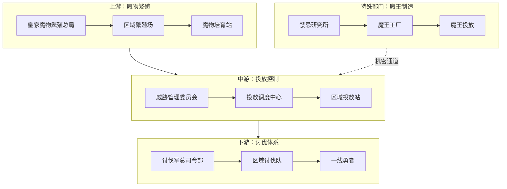
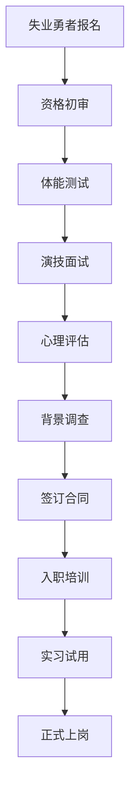
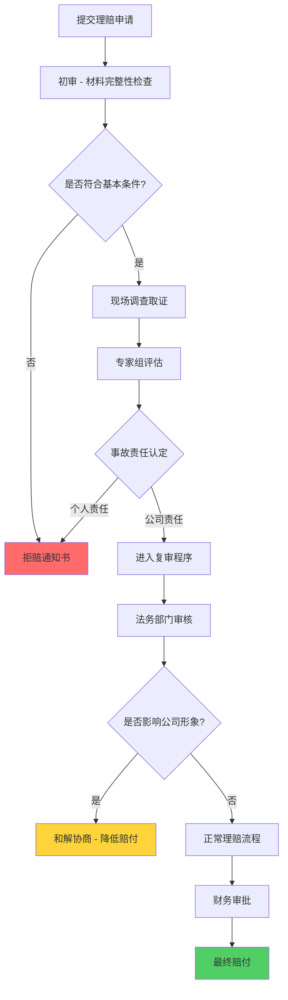
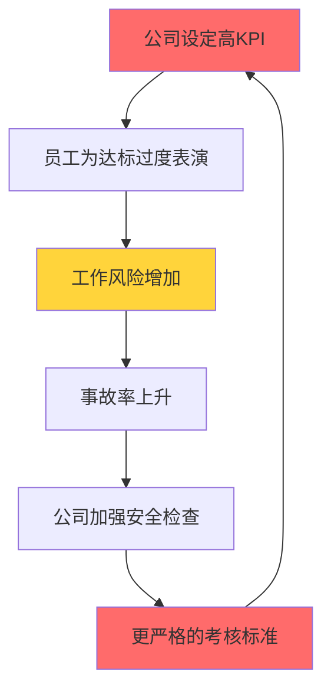
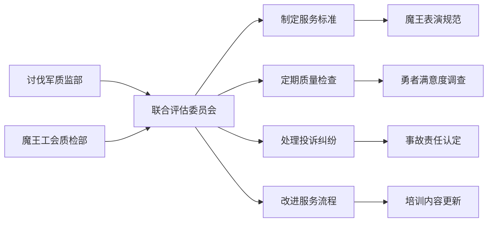
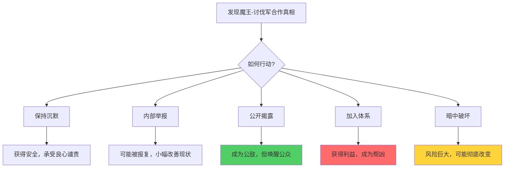

# 《Too Many Damn Heroes》魔王产业设定文档

*工业化魔物繁殖与可控威胁体系详细设计*

---

## 📋 文档信息
- **项目代号**: TMD_Heroes_MaouSystem
- **文档类型**: 游戏世界观 - 魔王产业设定
- **关联文档**: GameDesignDocument.md, HistoryBackground_v2.md
- **文档版本**: v2.0
- **更新日期**: 2024-12-30

---

## 🎯 核心概念

### 基本定义
**魔物是真实存在的威胁，但其数量、强度、分布被国家严密控制**

```
魔物 = 真实存在的生物 + 人工繁殖 + 定向投放
魔王 = 禁忌技术制造的Boss级存在 + 定期更换 + 计划性"讨伐"
讨伐 = 真实战斗 + 可控风险 + 精心设计的"胜利"
```

### 产业逻辑
- **供需控制**: 勇者过剩 → 需要稳定的"敌人供给"来维持就业
- **风险管控**: 魔物真实危险 → 但投放数量、地点、时机被精确计算
- **利益链条**: 繁殖场获利 → 讨伐军获预算 → 政府获稳定 → 资本获订单
- **社会功能**: 制造可控危机，消耗过剩劳动力，维护现有秩序

---

## 🏭 魔王产业组织架构

### 1. 核心产业链结构


### 2. 皇家魔物繁殖总局（核心机密机构）
```
皇家魔物繁殖总局 [机密等级：绝密]
├── 繁殖技术部 (魔物交配、基因改良、品种培育)
├── 投放规划部 (区域配额、时间表、难度曲线设计)  
├── 质量控制部 (战斗力测试、危险等级评定、淘汰处理)
├── 魔王工程部 (人造魔王研发、禁忌技术应用)
├── 安全保密部 (设施警卫、信息管控、泄密处理)
└── 对外协调部 (与讨伐军"意外遭遇"协调)
```

### 3. 魔物等级体系（产品分类）
| 等级 | 产品名称 | 繁殖周期 | 战斗力评级 | 投放区域 | 单价(内部) |
|------|----------|----------|------------|----------|------------|
| **F级** | 基础魔物 | 2周 | 新手可独立击杀 | 新手村周边 | 5魔能币 |
| **E级** | 普通魔物 | 1月 | 需小队配合 | 野外普通区 | 20魔能币 |
| **D级** | 精英魔物 | 3月 | 需装备精良小队 | 危险区域 | 100魔能币 |
| **C级** | 稀有魔物 | 6月 | 需专业团队 | 副本/巢穴 | 500魔能币 |
| **B级** | 领主魔物 | 1年 | 需精锐部队 | 区域Boss点 | 2000魔能币 |
| **A级** | 灾厄魔物 | 3年 | 需全军动员 | 特殊事件 | 10000魔能币 |
| **S级** | 人造魔王 | 5年+ | 史诗级战役 | 首都周边 | 无价(国家工程) |

### 4. 关键部门职能

#### 繁殖技术部
- **基因库管理**: 保存200年前真实魔物的基因样本
- **品种改良**: 提升战斗力同时保持可控性
- **批量繁殖**: 工厂化生产各等级魔物
- **寿命控制**: 确保魔物在指定时间内"自然死亡"

#### 投放规划部  
- **区域配额**: 根据勇者人数计算每个区域的魔物需求量
- **难度曲线**: 确保新人有怪可打，老手有挑战可接
- **节奏控制**: 避免魔物过多导致失控，或过少导致失业
- **意外预案**: 魔物失控时的紧急回收方案

---

## 📝 入职与培训体系

### 招聘流程


### 核心培训课程

#### 1. 必修课程 (80小时)
```markdown
【逃生魔法精通】(20小时)
- 瞬移魔法: 3秒内传送500米
- 隐身术: 紧急情况下消失
- 防护罩: 抵御意外重击
- 假死术: 心跳呼吸完全控制

【基础医疗魔法】(15小时)  
- 止血术: 轻伤自愈
- 骨折复位: 简单外伤处理
- 解毒术: 应对意外中毒
- 精神安抚: 缓解工作压力

【标准化表演】(25小时)
- 邪恶形象塑造: 表情、动作、气场
- 威胁台词演练: 100句经典反派对白
- 战斗动作设计: 眼看厉害但安全
- 死亡表演艺术: 各种"壮烈"倒地方式

【职业安全教育】(20小时)
- 工作风险识别: 什么情况最危险
- 应急预案执行: 遇到真正危险时的处理
- 保密协议解读: 什么能说什么不能说
- 心理健康维护: 如何保持正常人格
```

#### 2. 进阶选修课程
```markdown
【高级魔王专业课】
- 城堡管理与装修美学
- 手下培训与团队建设  
- 媒体公关与形象维护
- 大型活动策划与执行

【特殊技能认证】
- 飞行魔法操作员证
- 幻象魔法师资格证
- 召唤术安全操作证
- 诅咒魔法（无害版）证书
```

---

## 💼 工作内容与日常

### 标准工作流程

#### 1. 日常排班制度
```markdown
【魔怪工作时间表】

早班 (6:00-14:00)
- 新手村守护: 配合新人勇者练级
- 野外刷怪点: 定时出现被击败
- 城镇外围巡逻: 制造"威胁感"

中班 (14:00-22:00)  
- 副本BOSS值班: 配合团队副本
- 剧情任务配合: 演出特定剧情角色
- 特殊事件响应: 临时任务支援

夜班 (22:00-6:00)
- 恐怖氛围营造: 深夜"出没"吓唬人
- 设施维护: 修理魔王城道具
- 值班待命: 处理紧急情况
```

#### 2. 绩效考核指标 (KPI)
| 考核项目 | 权重 | 评分标准 | 月度目标 |
|----------|------|----------|----------|
| **死亡次数** | 30% | 每日标准死亡3-5次 | 月死亡≥100次 |
| **逃生成功率** | 25% | 真正危险时100%逃脱 | 零真实伤亡 |
| **演技评分** | 20% | 勇者满意度评价 | 平均分≥4.0/5.0 |
| **出勤率** | 15% | 按时到岗执行任务 | 出勤率≥95% |
| **安全记录** | 10% | 工作事故频率 | 零安全事故 |

#### 3. 典型工作场景
```markdown
【某个周一的工作日志】

08:30 - 到达新手村1号刷怪点，换装完毕
09:00 - 第一批新人勇者到达，开始"威胁表演"
09:15 - 被击败第1次，标准倒地，等待5分钟后"复活"
09:20 - 勇者小队要求重新挑战，配合第2轮演出
...
12:00 - 午休时间，与同事交流"演技心得"
13:00 - 下午场开始，接待中级勇者团队
15:30 - 意外情况：新人勇者攻击过重，启动紧急逃生
15:35 - 向主管报告意外，申请工伤认定
16:00 - 工伤申请被驳回，理由"躲避不及时，个人责任"
17:00 - 下班，拖着疼痛的身体回家
```

---

## 🔒 保密与合规管理

### 保密协议核心条款

#### 1. 绝对保密事项
```markdown
【严禁对外透露的机密信息】

一级机密：
- 魔王与讨伐军的合作关系
- 所有"死亡"均为表演的事实
- 魔王工会的组织架构

二级机密：
- 具体的演技培训内容
- 安全逃生的技术细节  
- 工作薪酬和福利待遇

三级机密：
- 同事的真实身份信息
- 内部工作流程和制度
- 客户（勇者）的评价反馈
```

#### 2. 违约责任
```markdown
【泄密处罚措施】

轻微泄密：
- 罚款：月薪的50%-200%
- 降级：职位等级下调1-2级
- 培训：强制参加保密教育

严重泄密：
- 巨额赔偿：100万魔能币违约金
- 行业禁入：魔王行业永久封禁
- 社会制裁：列入"不诚信"黑名单

极严重泾密：
- 法律后果：以"颠覆社会秩序"起诉
- 人身威胁：（此条款用灰色小字印刷）
```

---

## 💰 保险与福利制度

### 强制保险体系

#### 1. 魔怪职业保险套餐
```markdown
【基础保险包 - 强制购买】

🔴 死亡意外险
保费：月薪的30% (不可议价)
保额：50万魔能币
理赔条件：意外死亡且非表演失误
拒赔条件：
- "演技不佳导致的意外"
- "未按规定使用逃生魔法"  
- "工作时间外的死亡"
- "与勇者发生真实冲突"

🟡 工伤医疗险
保费：月薪的20%
保额：每年5万魔能币医疗费用
覆盖范围：工作时间内的物理伤害
免责条款：
- 精神创伤和职业病
- "表演过度"导致的损伤
- 慢性疼痛综合征
- 身份认知障碍

🟢 失业保障险 (可选)
保费：月薪的10%
理赔：失业后6个月内每月发放上月薪资的30%
等待期：6个月
拒赔条件：
- 主动离职
- 违反保密协议被解雇
- "不适应工作环境"
```

#### 2. 保险理赔的刁钻流程


#### 3. 经典拒赔案例
```markdown
【魔怪保险拒赔案例集锦】

案例001："躲避动作过于明显"
申请人：初级魔怪小王
事故：被新手勇者重击导致肋骨骨折
拒赔理由：监控显示其在被击中前0.3秒有明显躲避动作，
         不符合魔怪"愚蠢且反应迟钝"的职业设定
公司结论：表演失误，个人责任

案例002："受伤程度与攻击不符"  
申请人：中级魔兽老李
事故：勇者普通攻击后昏迷3小时
拒赔理由：该勇者攻击力经测定为标准范围，
         申请人受伤程度超出预期，怀疑故意夸大
公司结论：疑似诈保，移交法务部

案例003："超时工作不予认定"
申请人：高级魔王张三
事故：加班时被突袭讨伐队重伤
拒赔理由：事发时间为18:03，超出标准工作时间3分钟，
         不在工伤保险覆盖范围内
公司结论：个人时间发生的意外，不予理赔
```

### 员工福利制度

#### 1. 基础福利
| 福利项目 | 具体内容 | 适用人群 | 实际情况 |
|----------|----------|----------|----------|
| **食宿补贴** | 每月200魔能币 | L1-L3级员工 | 只能在指定(偏远)地点使用 |
| **年假** | 每年7天带薪休假 | 工作满1年员工 | 需提前3个月申请，通过率30% |
| **培训机会** | 免费技能提升课程 | 全体员工 | 多为"如何更好地被击败"类课程 |
| **团建活动** | 季度员工聚餐 | 全体员工 | 主题："如何在痛苦中找到快乐" |

#### 2. 高级员工专享福利
```markdown
【L4级以上魔王专享待遇】

🏰 专属魔王城使用权
- 提供装修精美的"邪恶巢穴"
- 含基础道具：王座、水晶球、地牢
- 需自费：高级装饰、魔法阵、手下雇佣

🎭 个人形象包装服务  
- 专业邪恶造型设计
- 个性化威胁台词创作
- 媒体采访培训指导
- 但需签署形象使用权让渡协议

👥 管理岗位培训
- "如何管理低级魔物"课程
- "员工激励与绩效考核"实战
- "危机公关与媒体应对"专业指导
- 实际内容：如何让手下更配合演出
```

---

## ⚔️ 职场矛盾与内部问题

### 1. 新老员工冲突

#### 价值观分歧
```markdown
【老员工心态】
"我们是职业演员，不是真的恶棍。
记住三个原则：保命第一，演技第二，工资第三。
那些想要'真正邪恶'的新人，迟早会后悔的。"

【新员工困惑】  
"说好的魔王霸业呢？为什么要学这么多逃生技能？
我是来当反派BOSS的，不是来当马戏团小丑的！
老员工们太消极了，一点职业尊严都没有！"

【中层管理焦虑】
"上面要求提高演出质量，下面抱怨工作危险性，
左边讨伐军催着要更逼真的效果，右边保险公司天天来查安全，
我这个区域经理怎么当？"
```

#### 世代冲突案例
```markdown
【典型冲突场景】

场景一：培训课堂
新人："为什么邪恶笑声要这么标准化？我觉得应该更有个性！"
老师（老员工）："个性？你知道去年因为'个性化表演'死了多少人吗？
                  按标准来，保命要紧！"

场景二：休息室
新人："我觉得我们应该向公司争取更好的待遇！"
老员工："年轻人，这工作已经比外卖员好多了，知足吧。
          真要抗议，小心被列入'不稳定因素'名单。"

场景三：工作现场  
新人魔王被击败后立即复活，继续挑衅
老员工魔王："你疯了？被击败就老实躺着，别节外生枝！"
新人："我要展现魔王的不屈意志！"
结果：新人被勇者"补刀"，真的受了重伤
```

### 2. 绩效压力导致的内卷

#### KPI竞争的扭曲现象
```markdown
【魔怪内卷现状】

死亡次数竞争：
- 为了达到月度KPI，有员工一天内"死亡"15次
- 导致假死技能过度使用，身体机能紊乱
- 出现"死亡成瘾症"心理疾病

演技评分内卷：
- 为了获得勇者好评，魔怪们开始"卷表演"
- 有人自费学习专业表演课程
- 甚至出现贿赂勇者给好评的现象

安全记录造假：
- 为了保持"零事故"记录，轻伤不报告
- 同事间互相隐瞒工伤情况
- 小伤拖成大伤的情况频发
```

#### 内部竞争的恶性循环


### 3. 心理健康问题

#### 常见职业病
| 病症名称 | 发病率 | 主要症状 | 公司态度 | 实际影响 |
|----------|--------|----------|----------|----------|
| **身份认知障碍** | 65% | 分不清真实身份与角色 | "适应性问题" | 社交困难，家庭关系紧张 |
| **假死创伤综合征** | 55% | 恐惧真正的死亡和战斗 | "心理素质不够" | 工作效率下降 |
| **慢性疼痛综合征** | 80% | 全身性疼痛，失眠 | "正常工作损耗" | 生活质量严重下降 |
| **表演性人格分裂** | 40% | 无法停止"邪恶"表演 | "个人问题" | 影响日常生活 |
| **社交恐惧症** | 45% | 害怕与"正常人"接触 | "工作需要" | 逐渐与社会脱节 |

#### 心理求助的困境
```markdown
【魔怪心理健康现状】

求助渠道缺失：
- 普通心理医生不了解魔怪工作特殊性
- 公司内部心理咨询师立场偏向公司
- 同行业交流因保密协议受限

治疗费用问题：
- 心理治疗不在医疗保险覆盖范围
- 自费治疗费用昂贵
- 请假看病影响绩效考核

社会偏见：
- 社会对"魔怪"职业有负面印象
- 家人朋友难以理解工作内容
- 职业歧视导致求职困难
```

---

## 🤝 与讨伐军的合作模式

### 1. 业务对接机制

#### 标准化服务流程
```markdown
【魔王服务预约系统】

在线预约平台：
- 勇者可提前1-7天预约讨伐服务
- 选择魔王等级、战斗难度、时长
- 支付定金，确保双方时间安排

服务类型分类：
┌─ 新手体验包：初级魔怪，保证胜利
├─ 标准挑战包：中级魔兽，适度难度  
├─ 团队副本包：高级魔王，需团队配合
├─ VIP定制包：传说魔帝，个性化剧本
└─ 紧急任务包：24小时待命，加急费用

质量保证承诺：
- 如勇者不满意，免费重新安排
- 魔王"死亡"后5分钟内必须复活
- 提供战斗录像，留作纪念
```

#### 双方利益分成
```markdown
【收益分配模式】

讨伐军收费标准：
- 新手体验：100魔能币/次
- 标准挑战：500魔能币/次  
- 团队副本：2000魔能币/次
- VIP定制：5000魔能币/次

魔王工会分成：
- 基础服务费的30%归魔王个人
- 10%上缴工会作为运营费用
- 60%归讨伐军作为"管理费"

附加收入：
- 表演优秀奖金：最多月薪的20%
- 客户好评奖励：每个5星评价50魔能币
- 加班费：标准时间外工作按1.5倍计费
- 但实际到手往往打折扣
```

### 2. 质量控制体系

#### 联合监督机制


#### 服务质量标准
```markdown
【魔王表演质量评价体系】

战斗表演 (40分)：
- 攻击动作威猛但安全 (10分)
- 防御姿态逼真合理 (10分)  
- 受击反应自然流畅 (10分)
- 死亡表演感染力强 (10分)

台词表达 (20分)：
- 威胁话语标准规范 (10分)
- 语音语调符合角色 (10分)

客户体验 (25分)：
- 勇者成就感满足度 (15分)
- 战斗节奏控制恰当 (10分)

安全记录 (15分)：
- 双方零真实伤害 (15分)
```

### 3. 应急协调机制

#### 意外事件处理流程
```markdown
【紧急情况应对预案】

Level 1：轻微意外
- 魔王轻伤或表演失误
- 勇者不满意要求重来
- 处理：现场调整，继续服务

Level 2：中等事故  
- 魔王中等程度受伤
- 勇者发生真实危险
- 处理：立即中止，启动医疗程序

Level 3：严重事故
- 任何一方重伤或死亡
- 保密协议泄露风险
- 处理：封锁现场，媒体管控

Level 4：系统性危机
- 大规模魔怪罢工
- 公众发现合作真相  
- 处理：启动危机公关，高层紧急会议
```

#### 危机公关策略
```markdown
【标准公关话术模板】

意外伤亡事件：
"这是一起不幸的训练事故，我们对逝者表示哀悼。
讨伐军和魔王双方一直保持着职业的、敌对的关系，
绝不存在任何形式的合作。我们将加强安全管理。"

泄密事件：
"这些都是心怀不满的前员工恶意造谣，
目的是破坏讨伐军的光辉形象。
我们保留追究法律责任的权利。"

罢工事件：
"魔王们的集体行动证明了他们组织严密、威胁巨大，
这更说明了讨伐军工作的重要性和紧迫性。
我们呼吁增加预算，加强讨伐力度。"
```

---

## 🎮 玩家互动方式设计

### 1. 玩家身份选择

#### 可选择的立场
```markdown
【玩家角色定位】

🗡️ 讨伐军内部人员
- 初级勇者：逐渐发现真相的过程
- 中层管理：在利益与良心间挣扎
- 高层官员：维护体系还是揭露真相

🎭 魔王工会成员
- 新入职魔怪：从理想到现实的落差
- 资深魔王：在体系内寻求改变
- 工会领导：平衡各方利益的困境

🕵️ 独立调查者  
- 记者：挖掘真相但面临威胁
- 律师：为魔怪维权的法律斗争
- 平民：普通人视角看待荒诞现实

📊 体系外观察者
- 魔能公司员工：另一个剥削链条
- 黑市商人：在夹缝中生存
- 外来者：以局外人身份观察一切
```

### 2. 关键选择节点

#### 发现真相后的选择


#### 具体互动机制
```markdown
【玩家行为影响系统】

信息收集阶段：
- 通过对话、文件、观察收集证据
- 不同身份获得的信息渠道不同
- 信息完整度影响后续选择质量

关系网络建立：
- 与不同派系NPC的关系值
- 影响可获得的支持和阻力
- 关系网决定结局可达性

道德选择积累：
- 每个选择影响道德倾向值
- 道德值影响NPC对玩家的反应
- 最终道德状态决定可触发结局

资源管理平衡：
- 金钱、影响力、安全等级的平衡
- 不同选择消耗不同资源
- 资源不足限制行动选项
```

### 3. 多重结局触发

#### 基于玩家立场的结局分支
```markdown
【魔王相关结局路线】

🎭 加入魔王工会结局
触发条件：选择成为职业魔怪
结局内容：体验从新人到资深魔王的全过程
结局变化：
- 理想型：成功改革工会，改善待遇
- 现实型：适应体系，成为熟练工人  
- 堕落型：被体系同化，失去人性

🔍 揭露真相结局
触发条件：收集足够证据并选择公开
结局内容：
- 成功版：推翻虚假体系，建立新秩序
- 失败版：被消声，但种下觉醒种子
- 悲剧版：付出生命代价，真相大白

🤝 改革体系结局  
触发条件：在体系内积累足够影响力
结局内容：
- 渐进改革：逐步改善魔怪待遇
- 利益平衡：在各方间寻找新平衡点
- 制度创新：建立更人道的合作模式

💰 维护既得利益结局
触发条件：选择与既得利益集团合作
结局内容：
- 成功上位：成为体系的既得利益者
- 道德沦丧：完全失去人性和良知
- 空虚结局：获得一切却失去自我
```

### 4. 动态事件触发

#### 基于玩家行为的随机事件
```markdown
【玩家行为触发的特殊事件】

调查过度触发：
- 事件：被监视、威胁、栽赃
- 选择：继续调查/暂时停止/寻求保护
- 后果：影响信息获取和人身安全

同情魔怪触发：
- 事件：目击魔怪被虐待、工伤事故
- 选择：出手相助/视而不见/举报上级
- 后果：影响魔怪群体对玩家的态度

内部举报触发：
- 事件：被要求做伪证、参与造假
- 选择：配合/拒绝/暗中记录
- 后果：影响在体系内的地位和安全

道德冲突触发：
- 事件：被要求做违背良心的事
- 选择：妥协/抗争/寻找第三条路
- 后果：影响道德值和关系网络
```

### 5. 隐藏内容解锁

#### 深度游戏内容
```markdown
【需要多周目才能完全了解的内容】

魔王工会内部文件：
- 真实的员工手册
- 内部培训视频  
- 工伤事故报告
- 员工投诉记录

讨伐军机密档案：
- 合作协议原件
- 财务流水记录
- 危机公关预案
- 高层会议记录

个人故事线：
- 各个魔王的转职原因
- 讨伐军官员的心路历程
- 体系受害者的个人悲剧
- 既得利益者的合理化逻辑

彩蛋和细节：
- 新闻报道的前后矛盾
- 广告宣传的讽刺对比
- 环境细节的暗示信息
- NPC对话的隐藏含义
```

---

## 🎯 游戏机制实现建议

### 核心系统设计要点
```markdown
【技术实现重点】

动态声誉系统：
- 玩家在不同群体中的声誉值
- 声誉影响可触发的事件和对话
- 声誉变化有延迟效应，模拟消息传播

证据收集系统：
- 碎片化信息需要玩家主动拼接
- 不同来源的信息可信度不同
- 证据完整度影响结局说服力

多重身份管理：
- 玩家可能需要在不同身份间切换
- 身份暴露风险和收益的平衡
- 身份冲突时的选择困境

时间压力机制：
- 某些事件有时效性
- 拖延可能错过关键信息或选择
- 但过于急躁可能暴露意图
```

---

**[文档版本: TMD_Heroes_Maou_v1.1]**  
**[更新时间: 2024年12月19日]**  
**[状态: 完整版本]**

---

*"在这个人人都在表演的世界里，谁还记得真实的模样？"*