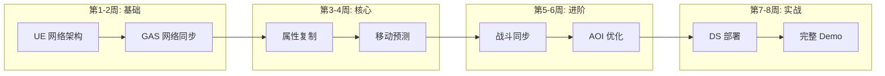
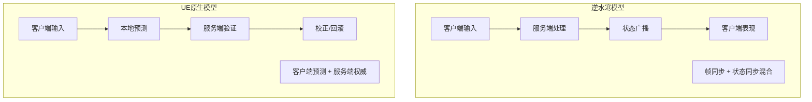

# 网络同步深度学习 - 总览

> **目标**：将逆水寒等大型 MMO 的服务端技术经验迁移到 UE 项目中，掌握核心网络同步技术，提升就业竞争力。

## 1. 学习路线图



---

## 2. 技术对照表

### 2.1 逆水寒 vs UE 架构对比

| 逆水寒概念 | UE 对应 | 说明 |
|-----------|---------|------|
| **GAS (Game Application Server)** | `Dedicated Server` | 游戏逻辑服务器 |
| **Gateway** | `Net Driver / Connection` | 客户端连接管理 |
| **Master** | 自定义 `MatchmakingServer` | 全局调度 (UE 无原生支持) |
| **Switcher** | 无 (直连模式) | UE 客户端直连 DS |
| **Property 系统** | `UPROPERTY(Replicated)` | 属性同步 |
| **脏标记 (Dirty Flag)** | `DOREPLIFETIME_CONDITION` | 条件复制 |
| **帧同步** | `ServerTick` + 自定义 | 需要自己实现 |
| **AOI (Area of Interest)** | `NetRelevancy` | 视野裁剪 |

### 2.2 同步模型对比



---

## 3. 学习模块详解

### 3.1 第一阶段：UE 网络基础

**目标**：理解 UE 原生网络架构

**学习内容**：
- [ ] UE 网络架构概述 (Server-Client 模型)
- [ ] Actor 复制机制 (`bReplicates`, `ReplicatedMovement`)
- [ ] RPC 类型与使用场景 (`Server`, `Client`, `NetMulticast`)
- [ ] Property Replication 条件 (`DOREPLIFETIME_CONDITION`)
- [ ] GAS 的网络同步 (预测、确认、回滚)

**实践任务**：
1. 创建一个 Listen Server，观察 Actor 复制
2. 实现一个简单的 RPC 调用链
3. 观察 GAS 能力的网络行为

**关键源码**：
```cpp
// UE 复制核心
Engine/Source/Runtime/Engine/Private/Net/RepLayout.cpp
Engine/Source/Runtime/Engine/Private/Net/NetConnection.cpp

// GAS 网络
Plugins/Runtime/GameplayAbilities/Source/GameplayAbilities/Private/AbilitySystemComponent_Abilities.cpp
```

### 3.2 第二阶段：属性复制深入

**目标**：掌握高效的属性同步策略

**学习内容**：
- [ ] RepNotify 与 OnRep 回调
- [ ] 条件复制策略 (COND_OwnerOnly, COND_SkipOwner 等)
- [ ] 自定义序列化 (`NetSerialize`)
- [ ] Push Model (UE5 新特性)
- [ ] 脏标记系统原理

**对标逆水寒**：
```lua
-- 逆水寒属性脏标记
function CServerPlayer:SetProperty(name, value)
    if self.m_Properties[name] ~= value then
        self.m_Properties[name] = value
        self.m_DirtyFlags[name] = true  -- 标记为脏
    end
end
```

**UE 实现**：
```cpp
// UE5 Push Model 方式
UPROPERTY(ReplicatedUsing = OnRep_Health)
float Health;

void OnRep_Health() {
    // 客户端收到更新后的处理
}

void SetHealth(float NewHealth) {
    if (Health != NewHealth) {
        Health = NewHealth;
        MARK_PROPERTY_DIRTY_FROM_NAME(ThisClass, Health, this);  // 手动标记
    }
}
```

### 3.3 第三阶段：移动预测与回滚

**目标**：实现流畅的网络移动

**学习内容**：
- [ ] CharacterMovementComponent 网络模式
- [ ] 客户端预测 (Client Prediction)
- [ ] 服务端校正 (Server Correction)
- [ ] 平滑处理 (Smoothing)
- [ ] 时间戳与延迟补偿

**对标逆水寒**：
```lua
-- 逆水寒客户端帧数据
function CClientPlayer:SendMoveInput(frame, input)
    -- 本地立即执行
    self:ApplyMoveLocally(input)
    -- 发送到服务端
    self:SendToServer("C2G_PlayerMove", frame, input)
    -- 缓存用于回滚
    self.m_PendingMoves[frame] = input
end
```

**UE 实现参考**：
```cpp
// CharacterMovementComponent.cpp
void UCharacterMovementComponent::ReplicateMoveToServer(float DeltaTime, const FVector& NewAcceleration)
{
    // 创建移动数据
    FSavedMove_Character* NewMove = CreateSavedMove();
    NewMove->SetMoveFor(CharacterOwner, DeltaTime, NewAcceleration, GetClientData());
    
    // 本地执行
    PerformMovement(DeltaTime);
    
    // 发送到服务端
    CallServerMove(NewMove, OldMove);
    
    // 保存用于校正
    SavedMoves.Add(NewMove);
}
```

### 3.4 第四阶段：战斗同步策略

**目标**：实现服务端权威的战斗系统

**学习内容**：
- [ ] 技能释放同步流程
- [ ] 伤害计算的服务端权威
- [ ] Buff/Effect 的网络复制
- [ ] 目标选择与命中判定
- [ ] 战斗事件广播

**对标逆水寒**：
```lua
-- 逆水寒技能释放流程
function CServerPlayer:CastSkill(skillId, target)
    -- 1. 服务端验证
    if not self:CanCastSkill(skillId) then return false end
    
    -- 2. 消耗资源
    self:ConsumeSkillCost(skillId)
    
    -- 3. 执行技能逻辑
    local skillInst = g_SkillMgr:CreateSkillInstance(skillId, self, target)
    skillInst:Execute()
    
    -- 4. 广播给客户端
    self:BroadcastToNearby("SkillCast", skillId, self.m_Id, target.m_Id)
end
```

**UE/GAS 实现**：
```cpp
// 你项目中的 DJ01GameplayAbility.cpp 可以扩展
void UDJ01GameplayAbility::ActivateAbility_Implementation(...)
{
    if (!K2_HasAuthority()) {
        // 客户端：发送激活请求
        CallServerTryActivateAbility();
        return;
    }
    
    // 服务端：验证并执行
    if (!CommitAbility()) return;
    
    // 执行能力逻辑
    PerformAbilityLogic();
    
    // 通过 GameplayEffect 同步效果
    ApplyEffectToTarget(TargetData);
}
```

### 3.5 第五阶段：AOI 视野管理

**目标**：优化大量玩家场景的网络流量

**学习内容**：
- [ ] UE NetRelevancy 机制
- [ ] 自定义 Actor 相关性判断
- [ ] 九宫格/四叉树 AOI 算法
- [ ] 动态调整同步频率

**对标逆水寒**：
```lua
-- 逆水寒 AOI 管理
function CScene:OnPlayerMove(player, newPos)
    local oldGrid = self:GetGridByPos(player.m_Pos)
    local newGrid = self:GetGridByPos(newPos)
    
    if oldGrid ~= newGrid then
        -- 离开旧格子
        oldGrid:RemovePlayer(player)
        -- 进入新格子
        newGrid:AddPlayer(player)
        
        -- 更新可见列表
        local oldVisible = self:GetVisiblePlayers(oldGrid)
        local newVisible = self:GetVisiblePlayers(newGrid)
        
        -- 发送进入/离开事件
        self:SyncPlayerVisibility(player, oldVisible, newVisible)
    end
end
```

**UE 实现**：
```cpp
// 自定义 NetRelevancy
bool AMyCharacter::IsNetRelevantFor(const AActor* RealViewer, const AActor* ViewTarget, const FVector& SrcLocation) const
{
    // 距离判断
    float DistSq = (GetActorLocation() - SrcLocation).SizeSquared();
    if (DistSq > NetCullDistanceSquared) {
        return false;  // 超出视野范围
    }
    
    // 可以添加更多条件：
    // - 是否在同一房间
    // - 是否在战斗中
    // - 玩家密度自适应
    
    return Super::IsNetRelevantFor(RealViewer, ViewTarget, SrcLocation);
}
```

---

## 4. 实践项目规划

### 项目 1：Dedicated Server 基础

**目标**：搭建可运行的 DS 环境

**任务**：
1. 配置项目支持 DS 打包
2. 实现基础的 GameMode (DS 专用)
3. 测试 Actor 复制
4. 实现简单的 Matchmaking 流程

**产出**：
- 可运行的 DS 程序
- 客户端连接 DS 的完整流程
- 文档：`P01_DedicatedServer.md`

### 项目 2：服务端权威移动

**目标**：实现可靠的网络移动同步

**任务**：
1. 分析 CharacterMovementComponent 网络代码
2. 实现自定义的移动预测
3. 实现服务端校正逻辑
4. 添加网络延迟模拟测试

**产出**：
- 流畅的网络移动体验
- 延迟 200ms 下仍可玩
- 文档：`P02_AuthoritativeMovement.md`

### 项目 3：战斗回滚系统

**目标**：实现可回滚的战斗预测

**任务**：
1. 设计战斗状态快照结构
2. 实现客户端预测命中
3. 实现服务端验证与校正
4. 处理不一致时的回滚

**产出**：
- 流畅的战斗体验
- 服务端权威的伤害计算
- 文档：`P03_CombatRollback.md`

---

## 5. 面试亮点准备

学完这套体系后，你可以在面试中展示：

### 技术深度

| 问题 | 你的回答要点 |
|------|-------------|
| "UE 网络同步原理？" | 属性复制 + RPC + 预测回滚，对比逆水寒的帧同步 |
| "如何优化大量玩家同步？" | AOI 视野管理 + 条件复制 + 动态频率，实践经验 |
| "GAS 网络如何工作？" | 预测 Key + 服务端确认 + GameplayEffect 复制 |
| "移动同步如何保证流畅？" | 客户端预测 + 服务端校正 + 平滑插值，200ms 体验 |

### 项目经验

> "我基于 Lyra 框架搭建了一个 UE5 项目，深入研究了逆水寒等 MMO 的服务端架构。在网络同步方面，我实现了：
> 1. 完整的 Dedicated Server 部署流程
> 2. 服务端权威的移动系统，支持 200ms 延迟下的流畅体验
> 3. 基于 GAS 的战斗预测与回滚机制
> 4. 参考 MMO 架构的 AOI 优化方案
> 
> 这让我对网络游戏的同步机制有了从原理到实践的完整理解。"

---

## 6. 参考资料

### UE 官方
- [UE Networking Overview](https://docs.unrealengine.com/5.0/en-US/networking-overview-for-unreal-engine/)
- [Gameplay Ability System Networking](https://docs.unrealengine.com/5.0/en-US/gameplay-ability-system-for-unreal-engine/)

### 项目内文档
- [ComboGraph 网络同步](../ComboGraph/06-NetworkReplication.md)
- [UE 框架学习路线](../UE_Learning_Roadmap.md)

### 逆水寒服务端文档
- [服务器横向与纵向扩展](逆水寒/TotalLearn/ServerCore/30_服务器横向与纵向扩展.md)
- [角色属性持久化策略](逆水寒/TotalLearn/ServerCore/29_角色属性持久化策略.md)
- [客户端与服务端帧协作机制](逆水寒/TotalLearn/ClientCore/13_客户端与服务端帧协作机制.md)

---

## 7. 下一步

开始学习 [01_UE_NetworkArchitecture.md](./01_UE_NetworkArchitecture.md)