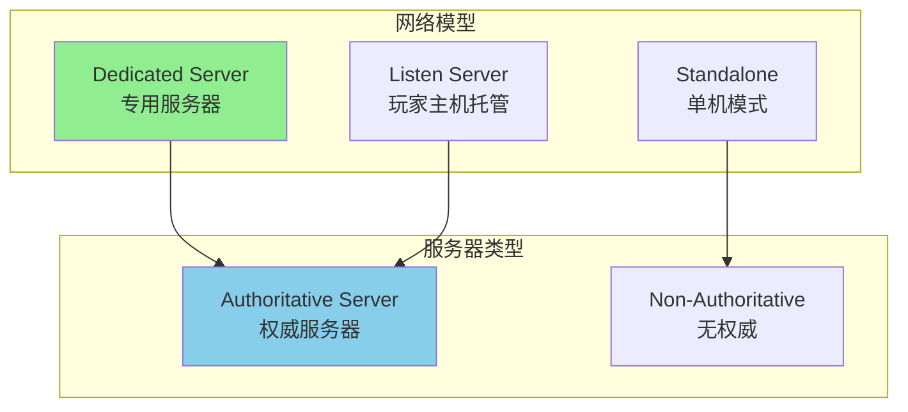
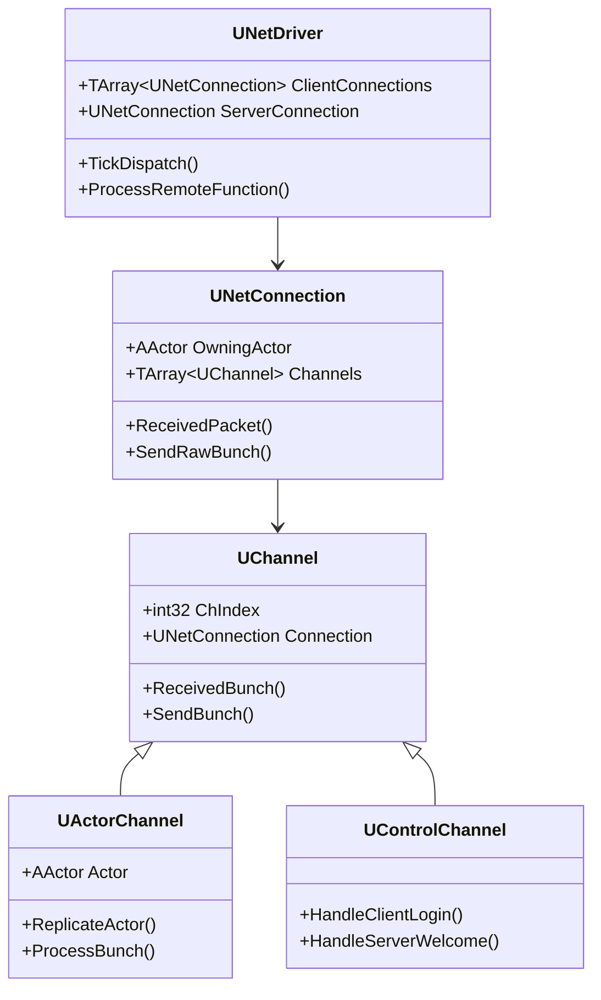
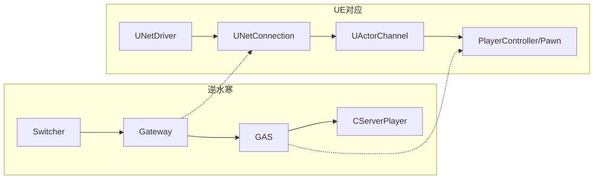
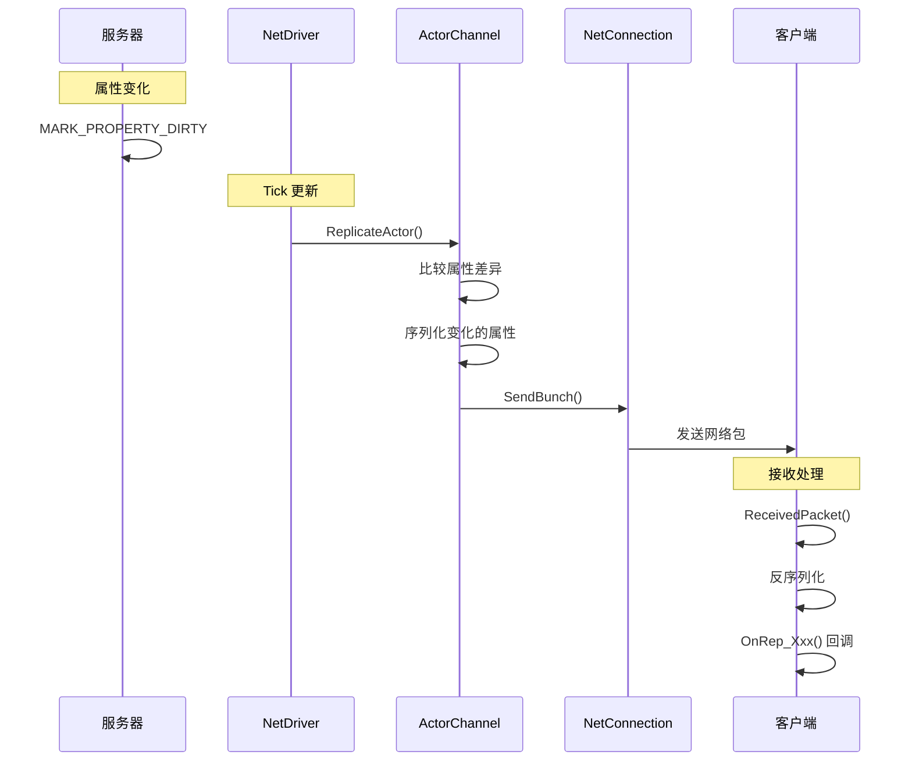
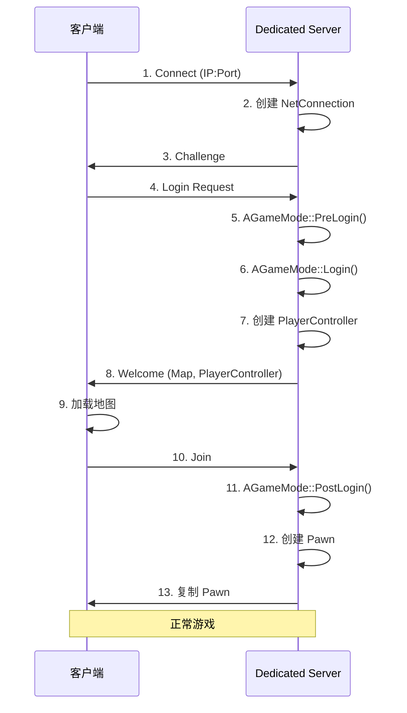
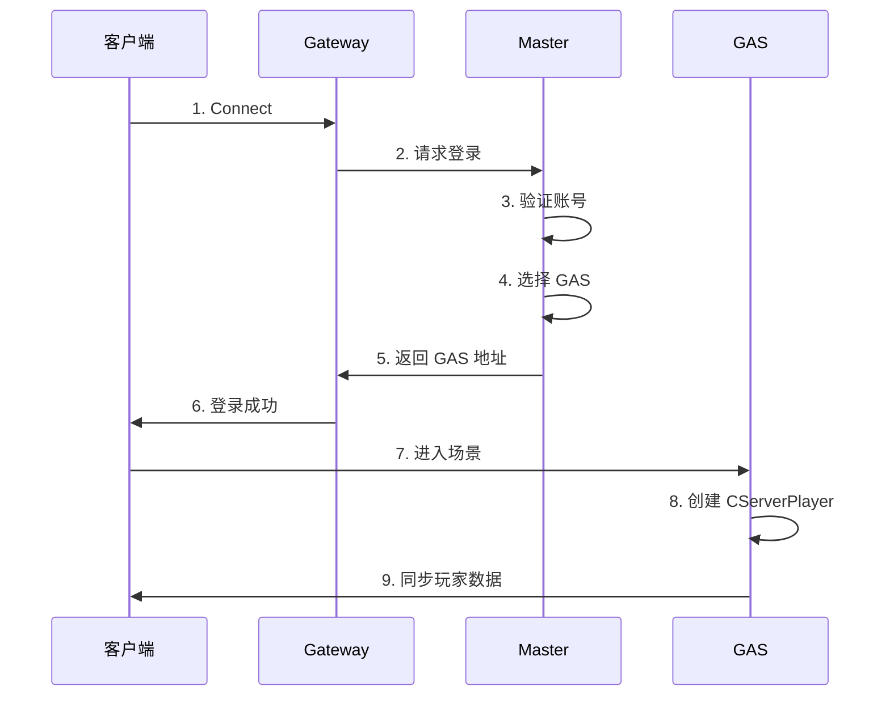
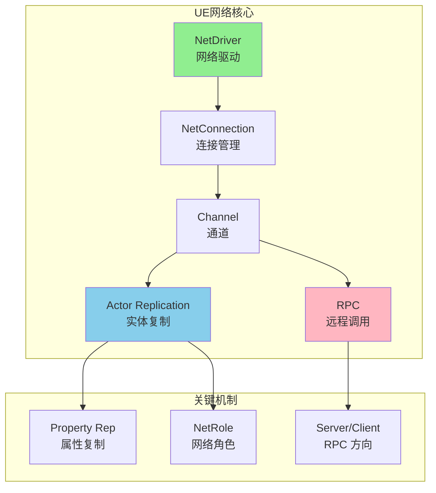

# 01. UE 网络架构深度解析

> 本文档深入分析 UE 的网络架构，并与逆水寒服务端架构进行对比。

## 1. 架构总览

### 1.1 UE 网络模型



### 1.2 对比：逆水寒 vs UE

| 特性 | 逆水寒 | UE |
|------|--------|-----|
| **服务器模型** | 多进程分布式 (GAS+Master+Gateway) | 单进程 Dedicated Server |
| **消息路由** | 通过 Switcher 中转 | 直接 TCP/UDP 连接 |
| **同步模型** | 帧同步 + 状态同步混合 | 状态同步为主 + 客户端预测 |
| **扩展方式** | 增加 GAS 进程 | 多个 DS 实例 + Matchmaking |
| **单服承载** | ~2000 玩家/GAS | ~100 玩家/DS (典型) |

---

## 2. 核心类结构

### 2.1 网络栈类图



### 2.2 逆水寒对应概念



---

## 3. Actor 复制机制

### 3.1 复制条件

```cpp
// Actor.h
UPROPERTY(Category=Replication, EditDefaultsOnly, ReplicatedUsing=OnRep_ReplicatedMovement)
struct FRepMovement ReplicatedMovement;

// Actor 需要设置为可复制
void AMyActor::AMyActor()
{
    bReplicates = true;
    bAlwaysRelevant = false;
    NetUpdateFrequency = 100.0f;  // 每秒更新次数
    MinNetUpdateFrequency = 2.0f; // 最小更新频率
}
```

### 3.2 复制流程



### 3.3 对比逆水寒的 Property 同步

**逆水寒方式**：
```lua
-- 服务端设置属性
function CServerPlayer:SetHealth(value)
    if self.m_Health ~= value then
        self.m_Health = value
        self:MarkDirty("Health")  -- 手动标记脏
    end
end

-- 定时同步
function CServerPlayer:SyncProperties()
    local dirty = self:GetDirtyProperties()
    if #dirty > 0 then
        self:SendToClient("SyncProps", dirty)
        self:ClearDirtyFlags()
    end
end
```

**UE 方式**：
```cpp
// 声明复制属性
UPROPERTY(ReplicatedUsing = OnRep_Health)
float Health;

// 获取需要复制的属性
void AMyCharacter::GetLifetimeReplicatedProps(TArray<FLifetimeProperty>& OutLifetimeProps) const
{
    Super::GetLifetimeReplicatedProps(OutLifetimeProps);
    
    // 普通复制
    DOREPLIFETIME(AMyCharacter, Health);
    
    // 条件复制：只给拥有者
    DOREPLIFETIME_CONDITION(AMyCharacter, Mana, COND_OwnerOnly);
}

// 复制回调
void AMyCharacter::OnRep_Health()
{
    // 客户端收到更新后执行
    UpdateHealthUI();
}
```

---

## 4. RPC 机制

### 4.1 RPC 类型

| 类型 | 方向 | 可靠性 | 使用场景 |
|------|------|--------|---------|
| `Server` | 客户端→服务端 | 可配置 | 玩家输入、请求 |
| `Client` | 服务端→客户端 | 可配置 | 反馈、通知 |
| `NetMulticast` | 服务端→所有客户端 | 可配置 | 广播事件 |

### 4.2 RPC 声明示例

```cpp
UCLASS()
class AMyCharacter : public ACharacter
{
    // 客户端调用，服务端执行
    UFUNCTION(Server, Reliable, WithValidation)
    void ServerCastSkill(int32 SkillId, AActor* Target);
    
    // 服务端调用，指定客户端执行
    UFUNCTION(Client, Reliable)
    void ClientShowDamage(float Damage, FVector Location);
    
    // 服务端调用，所有客户端执行
    UFUNCTION(NetMulticast, Unreliable)
    void MulticastPlayEffect(UParticleSystem* Effect);
};

// 实现
void AMyCharacter::ServerCastSkill_Implementation(int32 SkillId, AActor* Target)
{
    // 服务端逻辑
    if (CanCastSkill(SkillId))
    {
        ExecuteSkill(SkillId, Target);
    }
}

bool AMyCharacter::ServerCastSkill_Validate(int32 SkillId, AActor* Target)
{
    // 安全验证
    return SkillId > 0 && Target != nullptr;
}
```

### 4.3 对比逆水寒的 RPC

**逆水寒 RPC**：
```lua
-- 定义 RPC
RegisterRpc("C2G_CastSkill", function(player, skillId, targetId)
    -- 服务端处理
    player:CastSkill(skillId, targetId)
end)

-- 客户端调用
function CClientPlayer:CastSkill(skillId, targetId)
    self:CallServerRpc("C2G_CastSkill", skillId, targetId)
end
```

**UE 方式的优势**：
1. 编译期类型检查
2. 自动的参数序列化
3. 内置的 Validation 机制
4. 与 C++ 反射系统集成

---

## 5. 网络角色 (Net Role)

### 5.1 角色类型

```cpp
enum ENetRole
{
    ROLE_None,              // 无网络
    ROLE_SimulatedProxy,    // 模拟代理（他人的 Pawn）
    ROLE_AutonomousProxy,   // 自主代理（自己的 Pawn）
    ROLE_Authority,         // 权威（服务器）
};
```

### 5.2 角色判断

```cpp
void AMyCharacter::DoSomething()
{
    switch (GetLocalRole())
    {
    case ROLE_Authority:
        // 服务器：执行权威逻辑
        break;
        
    case ROLE_AutonomousProxy:
        // 控制的客户端：预测 + 发送输入
        break;
        
    case ROLE_SimulatedProxy:
        // 其他客户端：只显示同步的状态
        break;
    }
}

// 常用判断
bool bIsServer = HasAuthority();
bool bIsLocalPlayer = IsLocallyControlled();
```

### 5.3 对比逆水寒

```lua
-- 逆水寒通过不同类区分
CServerPlayer  -- 服务端角色实体
CClientPlayer  -- 客户端角色实体
COtherPlayer   -- 其他玩家的客户端表现

-- UE 通过同一个类 + NetRole 区分
AMyCharacter {
    ROLE_Authority        -- 对应 CServerPlayer
    ROLE_AutonomousProxy  -- 对应 CClientPlayer (自己)
    ROLE_SimulatedProxy   -- 对应 COtherPlayer (他人)
}
```

---

## 6. 连接流程

### 6.1 客户端连接 DS 流程



### 6.2 对比逆水寒登录流程



---

## 7. 在你项目中的应用

### 7.1 已有的网络支持

你的项目基于 Lyra，已经有了：
- `DJ01PlayerController` - 可扩展网络功能
- `DJ01Character` - 可配置复制属性
- `DJ01AbilitySystemComponent` - 内置 GAS 网络

### 7.2 下一步扩展建议

```cpp
// 1. 在 DJ01PlayerController 中添加 RPC 示例
UFUNCTION(Server, Reliable)
void ServerRequestSpawn(TSubclassOf<ADJ01Character> CharacterClass);

// 2. 在 DJ01Character 中添加复制属性
UPROPERTY(ReplicatedUsing = OnRep_CombatState)
EDJ01CombatState CombatState;

// 3. 在 DJ01GameMode 中处理玩家登录
virtual void PostLogin(APlayerController* NewPlayer) override;
```

---

## 8. 关键源码位置

### UE 引擎
| 模块 | 路径 |
|------|------|
| 网络核心 | `Engine/Source/Runtime/Engine/Private/Net/` |
| Actor 复制 | `Engine/Source/Runtime/Engine/Private/RepLayout.cpp` |
| NetDriver | `Engine/Source/Runtime/Engine/Private/NetworkDriver.cpp` |
| DS 启动 | `Engine/Source/Runtime/Launch/Private/LaunchEngineLoop.cpp` |

### 你的项目
| 模块 | 路径 |
|------|------|
| 角色 | `Source/DJ01/Character/Public/DJ01Character.h` |
| 控制器 | `Source/DJ01/Player/Public/DJ01PlayerController.h` |
| GAS | `Source/DJ01/AbilitySystem/Public/DJ01AbilitySystemComponent.h` |

---

## 9. 总结



**核心要点**：
1. UE 使用单进程 DS，逆水寒使用多进程分布式
2. UE 的属性复制通过 `DOREPLIFETIME` 宏声明
3. RPC 分为 Server、Client、NetMulticast 三种
4. NetRole 决定了 Actor 在网络中的行为

---

## 下一步

学习 [02_GAS_NetworkSync.md](./02_GAS_NetworkSync.md) - 深入 GAS 的网络同步机制