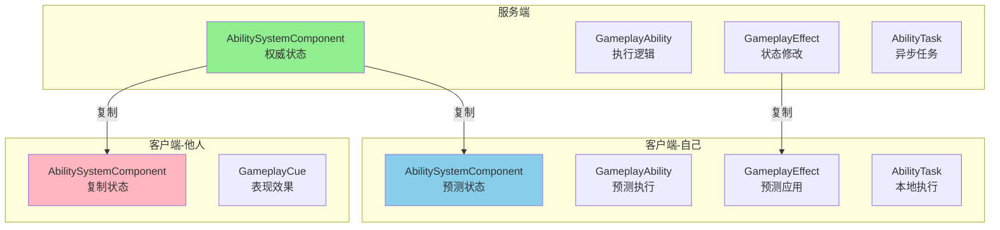
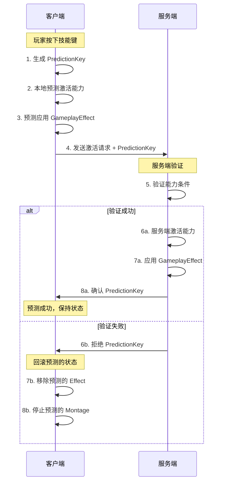
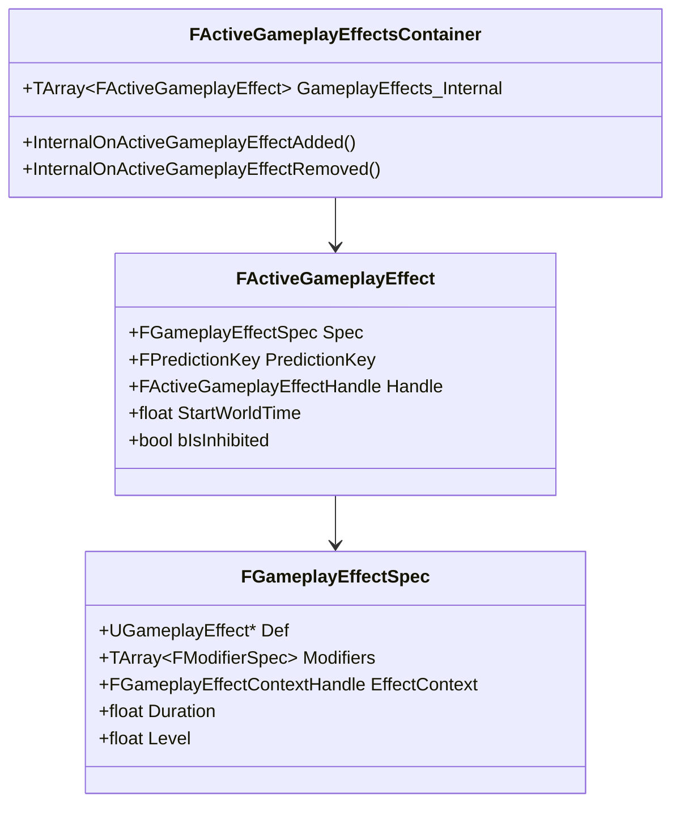
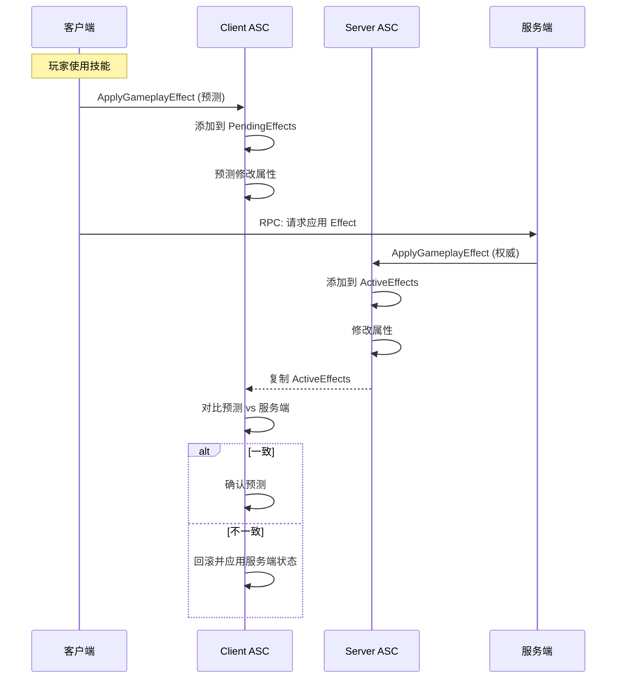
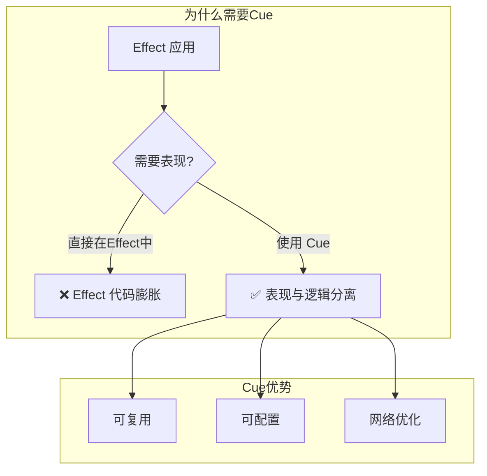
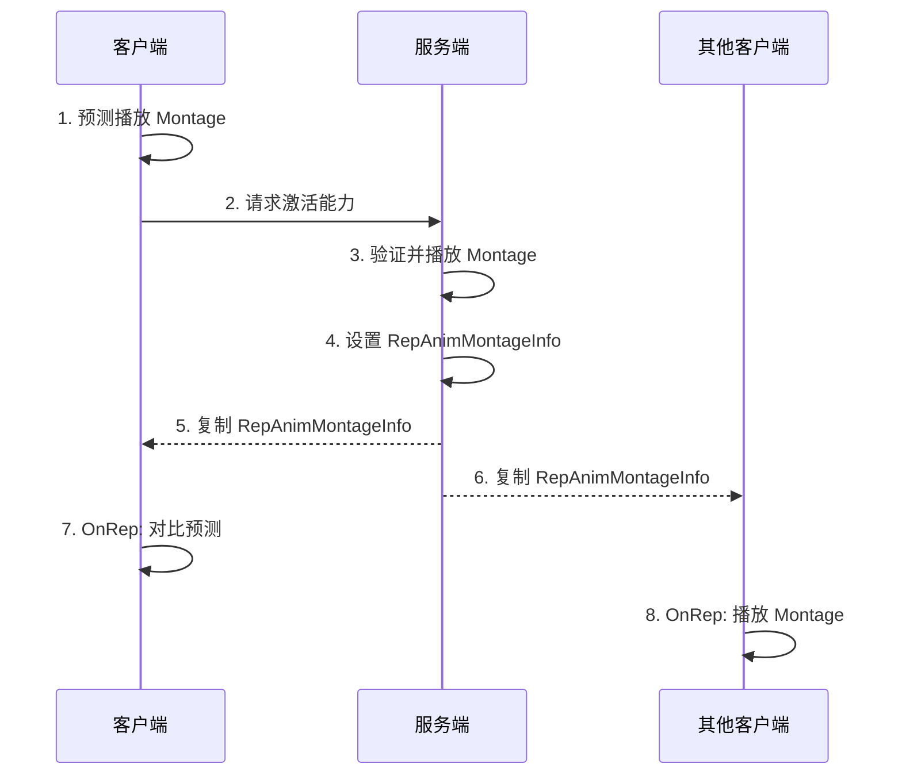
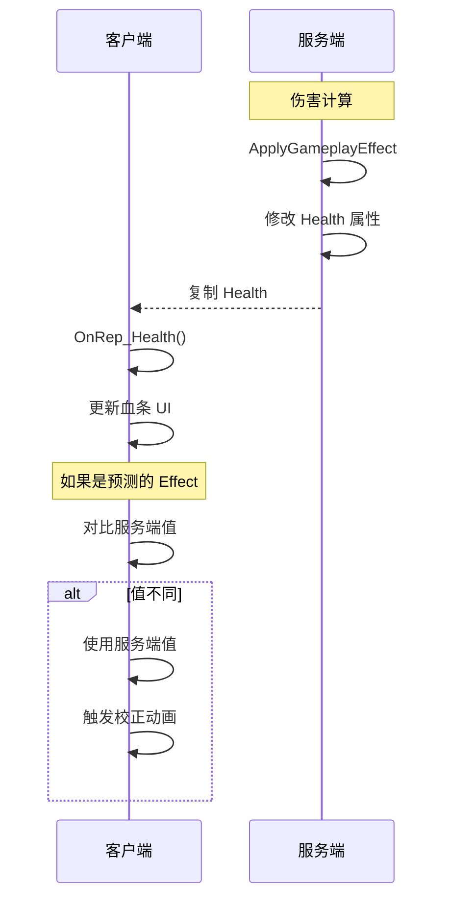
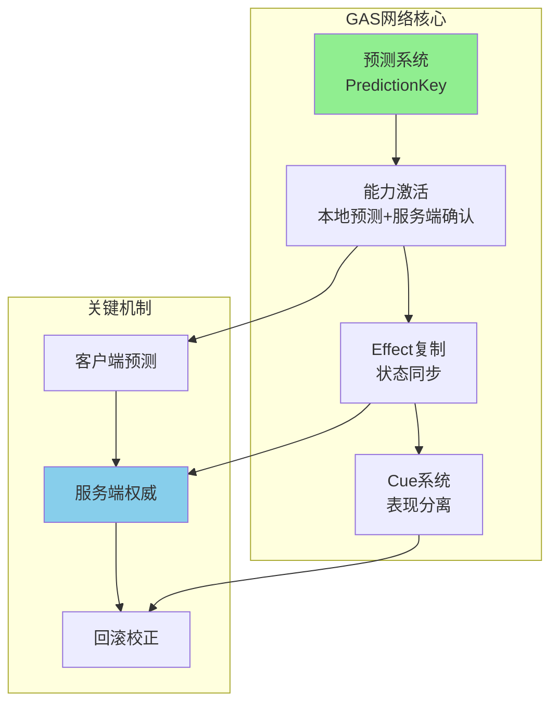

# 02. GAS 网络同步机制深度解析

> 本文档深入分析 Gameplay Ability System (GAS) 的网络同步机制，这是你的 DJ01 项目中最核心的战斗系统网络层。

## 1. GAS 网络架构总览

### 1.1 核心组件的网络角色



### 1.2 同步模型对比

| 特性 | GAS 方式 | 逆水寒方式 |
|------|---------|-----------|
| **技能激活** | 客户端预测 + 服务端确认 | 服务端权威，客户端表现 |
| **效果应用** | 预测 + 回滚 | 服务端计算后广播 |
| **Buff 管理** | GameplayEffect 复制 | Property 脏标记同步 |
| **表现效果** | GameplayCue 机制 | 客户端自行播放 |

---

## 2. 预测机制 (Prediction)

### 2.1 预测 Key 系统



### 2.2 源码分析

```cpp
// AbilitySystemComponent.h
struct FPredictionKey
{
    int16 Current;      // 当前预测 ID
    int16 Base;         // 基础预测 ID
    bool bIsServerInitiated;  // 是否服务端发起
    
    // 判断是否为本地预测
    bool IsLocalClientKey() const;
    
    // 判断是否已被服务端确认
    bool WasLocallyGenerated() const;
};

// 预测激活能力
bool UAbilitySystemComponent::InternalTryActivateAbility(
    FGameplayAbilitySpecHandle Handle,
    FPredictionKey InPredictionKey,
    UGameplayAbility** OutInstancedAbility,
    FOnGameplayAbilityEnded* OnGameplayAbilityEndedDelegate,
    const FGameplayEventData* TriggerEventData)
{
    // 生成预测 Key（如果客户端）
    if (!InPredictionKey.IsValidKey() && IsOwnerActorAuthoritative() == false)
    {
        InPredictionKey = FPredictionKey::CreateNewPredictionKey(this);
    }
    
    // 尝试激活
    if (Ability->CanActivateAbility(Handle, ActorInfo, nullptr, nullptr, nullptr))
    {
        // 激活成功
        Ability->CallActivateAbility(Handle, ActorInfo, ActivationInfo, ...);
        return true;
    }
    
    return false;
}
```

### 2.3 对比逆水寒的技能激活

**逆水寒方式**（服务端权威）：
```lua
-- 客户端请求释放技能
function CClientPlayer:RequestCastSkill(skillId, targetId)
    -- 不在本地执行，直接请求服务端
    self:SendToServer("C2G_CastSkill", skillId, targetId)
end

-- 服务端处理
function CServerPlayer:OnCastSkillRequest(skillId, targetId)
    -- 验证
    if not self:CanCastSkill(skillId) then
        return self:SendError("SkillOnCooldown")
    end
    
    -- 执行
    self:ExecuteSkill(skillId, targetId)
    
    -- 广播给所有客户端
    self:BroadcastToNearby("SkillCast", self.m_Id, skillId, targetId)
end

-- 客户端收到广播后播放表现
function CClientPlayer:OnSkillCastBroadcast(casterId, skillId, targetId)
    self:PlaySkillAnimation(skillId)
end
```

**GAS 方式**（客户端预测）：
```cpp
// 客户端触发技能
void AMyCharacter::CastSkill(int32 SkillId)
{
    UAbilitySystemComponent* ASC = GetAbilitySystemComponent();
    
    // 这会自动处理预测
    ASC->TryActivateAbilityByClass(SkillAbilityClass);
    // 1. 如果是客户端：本地预测执行 + 发送服务端请求
    // 2. 如果是服务端：直接执行
}
```

---

## 3. GameplayEffect 网络复制

### 3.1 Effect 复制结构



### 3.2 复制条件

```cpp
// AbilitySystemComponent.cpp
void UAbilitySystemComponent::GetLifetimeReplicatedProps(TArray<FLifetimeProperty>& OutLifetimeProps) const
{
    Super::GetLifetimeReplicatedProps(OutLifetimeProps);
    
    // Effect 容器：复制给所有人
    DOREPLIFETIME(UAbilitySystemComponent, ActiveGameplayEffects);
    
    // 激活的能力：复制给所有人
    DOREPLIFETIME(UAbilitySystemComponent, ActivatableAbilities);
    
    // 被阻止的能力：只复制给拥有者
    DOREPLIFETIME_CONDITION(UAbilitySystemComponent, BlockedAbilityBindings, COND_OwnerOnly);
    
    // 复制的动画 Montage：复制给所有人
    DOREPLIFETIME(UAbilitySystemComponent, RepAnimMontageInfo);
}
```

### 3.3 Effect 添加/移除流程



---

## 4. 能力激活网络流程

### 4.1 客户端到服务端的调用链

```cpp
// 1. 客户端请求激活
void UAbilitySystemComponent::ServerTryActivateAbility_Implementation(
    FGameplayAbilitySpecHandle AbilityToActivate,
    bool InputPressed,
    FPredictionKey PredictionKey)
{
    // 在服务端执行激活
    InternalServerTryActivateAbility(AbilityToActivate, InputPressed, PredictionKey, nullptr);
}

// 2. 服务端内部激活
void UAbilitySystemComponent::InternalServerTryActivateAbility(...)
{
    FGameplayAbilitySpec* Spec = FindAbilitySpecFromHandle(Handle);
    
    // 验证能力
    if (!Spec || !Spec->Ability)
    {
        ClientActivateAbilityFailed(Handle, PredictionKey.Current);
        return;
    }
    
    // 尝试激活
    if (InternalTryActivateAbility(Handle, PredictionKey, ...))
    {
        // 成功：标记预测 Key 为已确认
        MarkAbilitySpecDirty(*Spec);
    }
    else
    {
        // 失败：通知客户端回滚
        ClientActivateAbilityFailed(Handle, PredictionKey.Current);
    }
}

// 3. 客户端处理失败
void UAbilitySystemComponent::ClientActivateAbilityFailed_Implementation(
    FGameplayAbilitySpecHandle Handle,
    int16 PredictionKey)
{
    // 查找预测激活的能力
    FGameplayAbilitySpec* Spec = FindAbilitySpecFromHandle(Handle);
    if (Spec && Spec->Ability)
    {
        // 回滚：结束本地预测的能力实例
        Spec->Ability->EndAbility(Handle, ActorInfo, ActivationInfo, true, true);
    }
    
    // 移除预测的 Effect
    ActiveGameplayEffects.RemovePredictedEffects(FPredictionKey(PredictionKey));
}
```

### 4.2 你项目中的应用

在 `DJ01GameplayAbility` 中，可以这样利用预测：

```cpp
// DJ01GameplayAbility.cpp
void UDJ01GameplayAbility::ActivateAbility(
    const FGameplayAbilitySpecHandle Handle,
    const FGameplayAbilityActorInfo* ActorInfo,
    const FGameplayAbilityActivationInfo ActivationInfo,
    const FGameplayEventData* TriggerEventData)
{
    // 检查是否为预测执行
    if (ActivationInfo.ActivationMode == EGameplayAbilityActivationMode::Predicting)
    {
        // 客户端预测中
        // 可以播放动画、VFX 等表现
        // 但不要执行不可回滚的逻辑
    }
    
    // 提交能力（消耗资源、进入冷却）
    if (!CommitAbility(Handle, ActorInfo, ActivationInfo))
    {
        EndAbility(Handle, ActorInfo, ActivationInfo, true, true);
        return;
    }
    
    // 执行能力逻辑
    PerformAbilityLogic();
}
```

---

## 5. GameplayCue 网络机制

### 5.1 Cue 的设计理念



### 5.2 Cue 的网络复制方式

```cpp
// GameplayCue 有多种执行模式
UENUM()
enum class EGameplayCueExecutionTarget : uint8
{
    // 所有客户端执行（通过复制）
    AllClients,
    
    // 只在本地客户端执行（不复制）
    LocalOnly,
    
    // 只在服务端执行
    ServerOnly,
};

// 触发 Cue
void UAbilitySystemComponent::ExecuteGameplayCue(
    const FGameplayTag GameplayCueTag,
    FGameplayEffectContextHandle EffectContext)
{
    if (IsOwnerActorAuthoritative())
    {
        // 服务端：通过 NetMulticast 广播
        NetMulticast_InvokeGameplayCueExecuted(GameplayCueTag, PredictionKey, EffectContext);
    }
    else
    {
        // 客户端：本地执行（预测）
        InvokeGameplayCueEvent(GameplayCueTag, EGameplayCueEvent::Executed, EffectContext);
    }
}
```

### 5.3 对比逆水寒的表现同步

**逆水寒方式**：
```lua
-- 服务端触发技能效果
function CServerPlayer:OnSkillHit(target, damage)
    -- 广播给周围玩家
    self:BroadcastToNearby("SkillEffect", {
        CasterId = self.m_Id,
        TargetId = target.m_Id,
        EffectId = "FireExplosion",
        Damage = damage
    })
end

-- 客户端播放效果
function CClientScene:OnSkillEffect(data)
    local caster = self:GetPlayer(data.CasterId)
    local target = self:GetPlayer(data.TargetId)
    
    -- 播放特效
    g_EffectMgr:PlayEffect(data.EffectId, target:GetPosition())
    
    -- 播放伤害数字
    g_UIMgr:ShowDamageNumber(target, data.Damage)
end
```

**GAS Cue 方式**：
```cpp
// 在 GameplayEffect 中配置 Cue
UPROPERTY(EditDefaultsOnly, Category = "GameplayCue")
TArray<FGameplayEffectCue> GameplayCues;

// Cue Handler（蓝图或 C++）
UCLASS()
class UGC_DamageEffect : public UGameplayCueNotify_Static
{
    virtual void HandleGameplayCue(AActor* Target, EGameplayCueEvent::Type EventType, 
        const FGameplayCueParameters& Parameters) override
    {
        // 播放特效
        UNiagaraFunctionLibrary::SpawnSystemAtLocation(...);
        
        // 播放声音
        UGameplayStatics::PlaySoundAtLocation(...);
        
        // 显示伤害数字
        ShowDamageWidget(Parameters.RawMagnitude);
    }
};
```

---

## 6. Montage 网络同步

### 6.1 动画复制结构

```cpp
// 复制的 Montage 信息
USTRUCT()
struct FGameplayAbilityRepAnimMontage
{
    UPROPERTY()
    UAnimMontage* AnimMontage;
    
    UPROPERTY()
    float PlayRate;
    
    UPROPERTY()
    float Position;
    
    UPROPERTY()
    FName SectionName;
    
    UPROPERTY()
    uint8 IsStopped : 1;
    
    UPROPERTY()
    uint8 ForcePlayBit : 1;
    
    UPROPERTY()
    FPredictionKey PredictionKey;
};

// ASC 中声明复制
UPROPERTY(ReplicatedUsing = OnRep_ReplicatedAnimMontage)
FGameplayAbilityRepAnimMontage RepAnimMontageInfo;
```

### 6.2 Montage 同步流程



### 6.3 在你的 ComboGraph 中的应用

你的 `ComboGraph` 已经有了网络支持，可以参考其实现：

```cpp
// 参考 ComboGraph 的 Montage 同步
// Plugins/ComboGraph/Source/ComboGraph/Private/Abilities/Tasks/ComboGraphAbilityTask_PlayMontage.cpp

void UComboGraphAbilityTask_PlayMontage::Activate()
{
    if (Ability)
    {
        // 播放 Montage（会自动处理网络复制）
        if (UAbilitySystemComponent* ASC = AbilitySystemComponent.Get())
        {
            // PlayMontage 内部会设置 RepAnimMontageInfo
            const float Duration = ASC->PlayMontage(
                Ability, 
                ActivationInfo, 
                MontageToPlay, 
                PlayRate, 
                StartSection
            );
        }
    }
}
```

---

## 7. 属性 (Attribute) 网络复制

### 7.1 属性复制配置

```cpp
// 你的 DJ01AttributeSet
void UDJ01AttributeSet::GetLifetimeReplicatedProps(TArray<FLifetimeProperty>& OutLifetimeProps) const
{
    Super::GetLifetimeReplicatedProps(OutLifetimeProps);
    
    // 生命值：复制给所有人（用于显示血条）
    DOREPLIFETIME_CONDITION_NOTIFY(UDJ01AttributeSet, Health, COND_None, REPNOTIFY_Always);
    
    // 最大生命值
    DOREPLIFETIME_CONDITION_NOTIFY(UDJ01AttributeSet, MaxHealth, COND_None, REPNOTIFY_Always);
    
    // 法力值：只复制给拥有者（其他人不需要看到）
    DOREPLIFETIME_CONDITION_NOTIFY(UDJ01AttributeSet, Mana, COND_OwnerOnly, REPNOTIFY_Always);
}

// 属性变化回调
void UDJ01AttributeSet::OnRep_Health(const FGameplayAttributeData& OldHealth)
{
    // 通知 GAS 属性已复制
    GAMEPLAYATTRIBUTE_REPNOTIFY(UDJ01AttributeSet, Health, OldHealth);
    
    // 可以在这里更新 UI
}
```

### 7.2 属性修改的网络流程



---

## 8. 实践：为 DJ01 添加网络战斗

### 8.1 服务端权威的伤害计算

```cpp
// DJ01DamageExecution.cpp
void UDJ01DamageExecution::Execute_Implementation(
    const FGameplayEffectCustomExecutionParameters& ExecutionParams,
    FGameplayEffectCustomExecutionOutput& OutExecutionOutput) const
{
    // 只在服务端执行伤害计算
    UAbilitySystemComponent* TargetASC = ExecutionParams.GetTargetAbilitySystemComponent();
    if (!TargetASC || !TargetASC->GetOwner()->HasAuthority())
    {
        return;
    }
    
    // 获取属性
    float BaseDamage = 0.f;
    ExecutionParams.AttemptCalculateCapturedAttributeMagnitude(
        DamageStatics().DamageDef, 
        EvaluationParameters, 
        BaseDamage
    );
    
    // 计算最终伤害
    float FinalDamage = CalculateFinalDamage(BaseDamage, ExecutionParams);
    
    // 输出到 Health 属性
    if (FinalDamage > 0.f)
    {
        OutExecutionOutput.AddOutputModifier(
            FGameplayModifierEvaluatedData(
                UDJ01AttributeSet::GetHealthAttribute(),
                EGameplayModOp::Additive,
                -FinalDamage
            )
        );
    }
}
```

### 8.2 网络化的技能释放

```cpp
// DJ01GameplayAbility 中添加
void UDJ01GameplayAbility::ServerConfirmTargetData(
    FGameplayAbilityTargetDataHandle TargetData)
{
    // 只在服务端执行
    if (!K2_HasAuthority())
    {
        return;
    }
    
    // 验证目标数据
    if (!IsValidTargetData(TargetData))
    {
        return;
    }
    
    // 应用伤害 Effect
    FGameplayEffectSpecHandle DamageSpec = MakeOutgoingGameplayEffectSpec(DamageEffectClass);
    if (DamageSpec.IsValid())
    {
        ApplyGameplayEffectSpecToTarget(
            CurrentSpecHandle,
            CurrentActorInfo,
            CurrentActivationInfo,
            DamageSpec,
            TargetData
        );
    }
}
```

---

## 9. 调试与问题排查

### 9.1 常用调试命令

```cpp
// 在控制台执行
showdebug abilitysystem     // 显示 ASC 调试信息
AbilitySystem.Debug.All 1   // 开启所有 GAS 调试日志

// 网络相关
net.ListActorChannels       // 列出 Actor 通道
net.DumpRelevantActors      // 显示相关 Actor
```

### 9.2 常见网络问题

| 问题 | 原因 | 解决方案 |
|------|------|---------|
| 技能在客户端不生效 | 未正确设置 Replication | 检查 ASC 的 bReplicates |
| Effect 不同步 | 复制条件错误 | 检查 DOREPLIFETIME 设置 |
| 预测回滚频繁 | 服务端验证失败 | 检查能力的 CanActivate 逻辑 |
| Montage 不同步 | 未使用 ASC 播放 | 使用 ASC->PlayMontage() |

---

## 10. 总结



**核心要点**：
1. GAS 使用 PredictionKey 实现客户端预测
2. GameplayEffect 通过 DOREPLIFETIME 复制
3. GameplayCue 分离表现与逻辑
4. Montage 通过 RepAnimMontageInfo 同步

---

## 下一步

学习 [03_PropertyReplication.md](./03_PropertyReplication.md) - 深入属性复制与脏标记系统