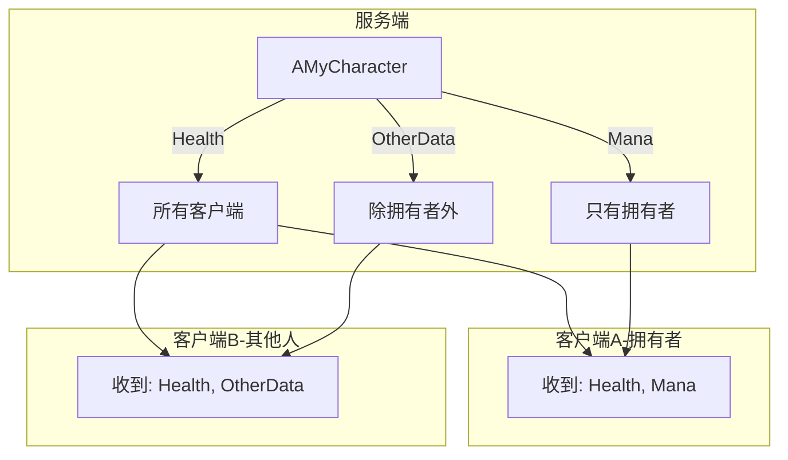
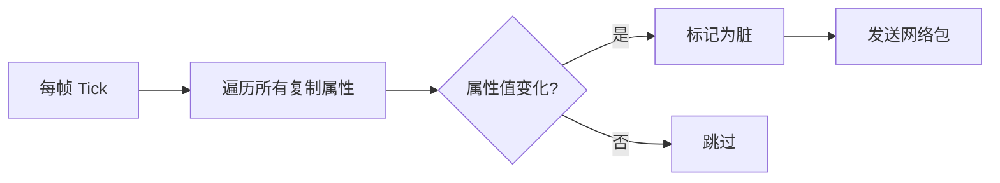
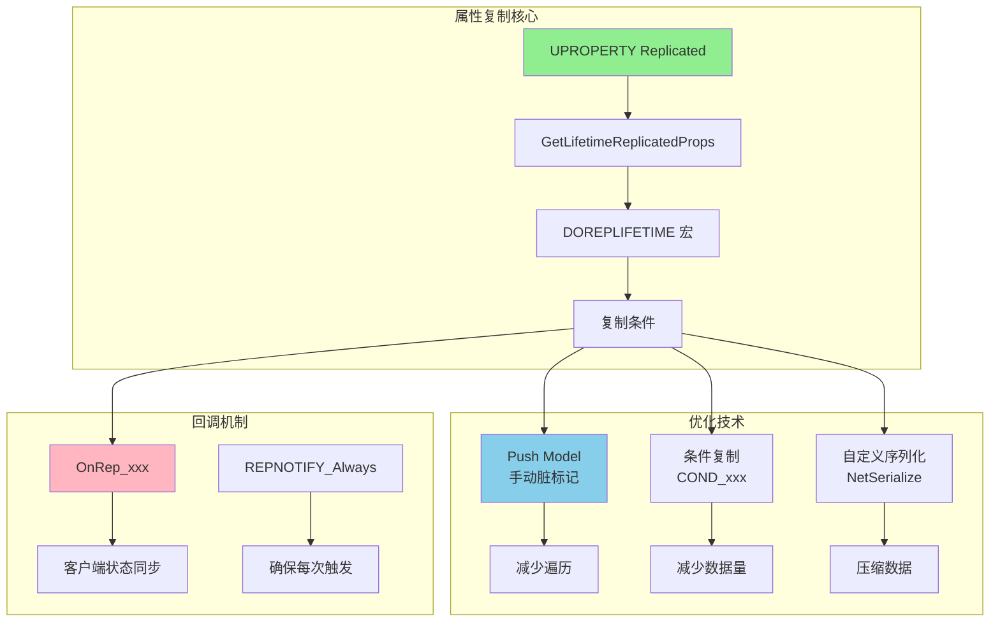

# 03. 属性复制与脏标记系统

> 本文档深入分析 UE 的属性复制机制，并对比逆水寒的 Property 脏标记系统，帮助你理解如何高效同步游戏状态。

## 1. 属性复制基础

### 1.1 复制声明方式

```cpp
UCLASS()
class AMyCharacter : public ACharacter
{
    GENERATED_BODY()
    
    // 基础复制
    UPROPERTY(Replicated)
    int32 Score;
    
    // 带回调的复制
    UPROPERTY(ReplicatedUsing = OnRep_Health)
    float Health;
    
    // 条件复制
    UPROPERTY(Replicated)
    float Mana;  // 在 GetLifetimeReplicatedProps 中配置条件
    
    // 复制回调
    UFUNCTION()
    void OnRep_Health();
    
    // 必须实现这个函数
    virtual void GetLifetimeReplicatedProps(TArray<FLifetimeProperty>& OutLifetimeProps) const override;
};

void AMyCharacter::GetLifetimeReplicatedProps(TArray<FLifetimeProperty>& OutLifetimeProps) const
{
    Super::GetLifetimeReplicatedProps(OutLifetimeProps);
    
    DOREPLIFETIME(AMyCharacter, Score);
    DOREPLIFETIME_CONDITION(AMyCharacter, Health, COND_None);
    DOREPLIFETIME_CONDITION(AMyCharacter, Mana, COND_OwnerOnly);
}
```

### 1.2 复制条件详解

| 条件 | 说明 | 使用场景 |
|------|------|---------|
| `COND_None` | 无条件复制 | 所有人需要的数据（位置、血量） |
| `COND_OwnerOnly` | 只给拥有者 | 私有数据（背包、技能冷却） |
| `COND_SkipOwner` | 除拥有者外所有人 | 自己已知的数据 |
| `COND_SimulatedOnly` | 只给模拟代理 | 他人需要的表现数据 |
| `COND_AutonomousOnly` | 只给自主代理 | 本地预测需要的数据 |
| `COND_InitialOnly` | 只在初始化时复制 | 不变的数据（角色ID） |
| `COND_InitialOrOwner` | 初始化或拥有者 | 初始化后只给拥有者更新 |
| `COND_Custom` | 自定义条件 | 复杂的复制逻辑 |

### 1.3 条件复制示意图



---

## 2. 脏标记系统

### 2.1 传统模式 vs Push Model

**传统模式**：引擎每帧检查所有复制属性是否变化



**Push Model (UE5)**：手动标记脏属性


### 2.2 Push Model 使用

```cpp
// 1. 启用 Push Model（在 .Build.cs 中）
PublicDefinitions.Add("WITH_PUSH_MODEL=1");

// 2. 声明属性支持 Push Model
UPROPERTY(ReplicatedUsing = OnRep_Health)
float Health;

// 3. 修改属性时手动标记
void AMyCharacter::SetHealth(float NewHealth)
{
    if (Health != NewHealth)
    {
        Health = NewHealth;
        
        // 手动标记脏
        MARK_PROPERTY_DIRTY_FROM_NAME(AMyCharacter, Health, this);
        
        // 如果是服务端，属性变化会被复制
        // 如果是客户端，这个调用无效
    }
}

// 4. GetLifetimeReplicatedProps 中也需要配合
void AMyCharacter::GetLifetimeReplicatedProps(TArray<FLifetimeProperty>& OutLifetimeProps) const
{
    Super::GetLifetimeReplicatedProps(OutLifetimeProps);
    
    FDoRepLifetimeParams Params;
    Params.bIsPushBased = true;  // 启用 Push Model
    Params.Condition = COND_None;
    
    DOREPLIFETIME_WITH_PARAMS_FAST(AMyCharacter, Health, Params);
}
```

### 2.3 对比逆水寒的脏标记

**逆水寒方式**：

```lua
-- Property 基类
function CProperty:Set(value)
    if self.m_Value ~= value then
        self.m_Value = value
        self.m_Dirty = true  -- 手动标记脏
        
        -- 通知变化
        if self.m_OnChange then
            self.m_OnChange(value)
        end
    end
end

-- 玩家属性集合
function CServerPlayer:SetHealth(value)
    local oldValue = self.m_Health:Get()
    self.m_Health:Set(value)
    
    if oldValue ~= value then
        -- 可能需要广播给周围玩家
        if value <= 0 then
            self:OnDeath()
        end
    end
end

-- 定时同步脏属性
function CServerPlayer:SyncDirtyProperties()
    local dirtyProps = {}
    
    for name, prop in pairs(self.m_Properties) do
        if prop:IsDirty() then
            dirtyProps[name] = prop:Get()
            prop:ClearDirty()
        end
    end
    
    if next(dirtyProps) then
        self:SendToClient("SyncProps", dirtyProps)
    end
end
```

**对比分析**：

| 特性 | UE Push Model | 逆水寒脏标记 |
|------|---------------|-------------|
| 标记方式 | 宏 `MARK_PROPERTY_DIRTY` | 手动设置 `m_Dirty = true` |
| 同步时机 | 引擎网络 Tick | 自定义定时器 |
| 序列化 | 自动（反射） | 手动打包 |
| 条件复制 | 内置支持 | 需要自己实现 |
| 性能 | 优化好 | 灵活可控 |

---

## 3. 复制回调 (OnRep)

### 3.1 基础用法

```cpp
// 声明
UPROPERTY(ReplicatedUsing = OnRep_Health)
float Health;

// 回调实现
void AMyCharacter::OnRep_Health()
{
    // 客户端收到新的 Health 值后执行
    
    // 更新 UI
    if (HealthBar)
    {
        HealthBar->SetPercent(Health / MaxHealth);
    }
    
    // 播放受伤效果
    if (Health < PreviousHealth)
    {
        PlayHitReaction();
    }
    
    PreviousHealth = Health;
}
```

### 3.2 带旧值的回调

```cpp
// 声明（UE5 方式）
UPROPERTY(ReplicatedUsing = OnRep_Health)
float Health;

// 回调可以接收旧值
void AMyCharacter::OnRep_Health(float OldHealth)
{
    float Delta = Health - OldHealth;
    
    if (Delta < 0)
    {
        // 受到伤害
        PlayDamageEffect(-Delta);
    }
    else if (Delta > 0)
    {
        // 被治疗
        PlayHealEffect(Delta);
    }
}

// GetLifetimeReplicatedProps 中配置
void AMyCharacter::GetLifetimeReplicatedProps(TArray<FLifetimeProperty>& OutLifetimeProps) const
{
    Super::GetLifetimeReplicatedProps(OutLifetimeProps);
    
    // 使用 REPNOTIFY_Always 确保每次都调用 OnRep
    DOREPLIFETIME_CONDITION_NOTIFY(AMyCharacter, Health, COND_None, REPNOTIFY_Always);
}
```

### 3.3 回调通知模式

| 模式 | 说明 |
|------|------|
| `REPNOTIFY_OnChanged` | 只有值变化时才调用 (默认) |
| `REPNOTIFY_Always` | 每次复制都调用，即使值相同 |

---

## 4. 复杂数据结构的复制

### 4.1 结构体复制

```cpp
// 定义可复制的结构体
USTRUCT()
struct FCharacterStats
{
    GENERATED_BODY()
    
    UPROPERTY()
    float Health;
    
    UPROPERTY()
    float MaxHealth;
    
    UPROPERTY()
    float Mana;
    
    UPROPERTY()
    int32 Level;
};

// 在 Actor 中使用
UCLASS()
class AMyCharacter : public ACharacter
{
    UPROPERTY(ReplicatedUsing = OnRep_Stats)
    FCharacterStats Stats;
    
    void OnRep_Stats();
};
```

### 4.2 数组复制

```cpp
// 基础数组复制
UPROPERTY(Replicated)
TArray<int32> Inventory;

// 带回调的数组（UE5 FastArray）
UPROPERTY(ReplicatedUsing = OnRep_Items)
TArray<FItemData> Items;

void AMyCharacter::OnRep_Items()
{
    // 注意：这里会在整个数组变化时调用
    // 不是单个元素变化时调用
    RefreshInventoryUI();
}
```

### 4.3 FastArraySerializer (高效数组同步)

```cpp
// 定义数组元素
USTRUCT()
struct FInventoryItem : public FFastArraySerializerItem
{
    GENERATED_BODY()
    
    UPROPERTY()
    int32 ItemId;
    
    UPROPERTY()
    int32 Count;
    
    // 元素变化时的回调
    void PreReplicatedRemove(const struct FInventoryArray& InArraySerializer);
    void PostReplicatedAdd(const struct FInventoryArray& InArraySerializer);
    void PostReplicatedChange(const struct FInventoryArray& InArraySerializer);
};

// 定义数组容器
USTRUCT()
struct FInventoryArray : public FFastArraySerializer
{
    GENERATED_BODY()
    
    UPROPERTY()
    TArray<FInventoryItem> Items;
    
    bool NetDeltaSerialize(FNetDeltaSerializeInfo& DeltaParms)
    {
        return FFastArraySerializer::FastArrayDeltaSerialize<FInventoryItem, FInventoryArray>(
            Items, DeltaParms, *this);
    }
};

// 在 Actor 中使用
UCLASS()
class AMyCharacter : public ACharacter
{
    UPROPERTY(Replicated)
    FInventoryArray Inventory;
    
    void AddItem(int32 ItemId, int32 Count)
    {
        if (HasAuthority())
        {
            FInventoryItem NewItem;
            NewItem.ItemId = ItemId;
            NewItem.Count = Count;
            Inventory.Items.Add(NewItem);
            Inventory.MarkItemDirty(NewItem);  // 标记单个元素
        }
    }
};
```

### 4.4 对比逆水寒的容器同步

**逆水寒方式**：
```lua
-- 背包数据同步
function CServerPlayer:AddItem(itemId, count)
    local item = {
        Id = itemId,
        Count = count,
        SlotIndex = self:GetFreeSlot()
    }
    
    self.m_Inventory[item.SlotIndex] = item
    
    -- 只同步变化的槽位
    self:SendToClient("ItemAdded", item)
end

function CServerPlayer:RemoveItem(slotIndex)
    local item = self.m_Inventory[slotIndex]
    self.m_Inventory[slotIndex] = nil
    
    -- 同步移除
    self:SendToClient("ItemRemoved", slotIndex)
end
```

---

## 5. 自定义序列化

### 5.1 NetSerialize 接口

```cpp
USTRUCT()
struct FCompressedVector
{
    GENERATED_BODY()
    
    float X, Y, Z;
    
    // 自定义网络序列化
    bool NetSerialize(FArchive& Ar, UPackageMap* Map, bool& bOutSuccess)
    {
        // 压缩为 16 位整数
        if (Ar.IsSaving())
        {
            int16 CompX = FMath::Clamp(FMath::RoundToInt(X * 100.f), -32768, 32767);
            int16 CompY = FMath::Clamp(FMath::RoundToInt(Y * 100.f), -32768, 32767);
            int16 CompZ = FMath::Clamp(FMath::RoundToInt(Z * 100.f), -32768, 32767);
            
            Ar << CompX << CompY << CompZ;
        }
        else
        {
            int16 CompX, CompY, CompZ;
            Ar << CompX << CompY << CompZ;
            
            X = CompX / 100.f;
            Y = CompY / 100.f;
            Z = CompZ / 100.f;
        }
        
        bOutSuccess = true;
        return true;
    }
};

// 需要在结构体定义后添加
template<>
struct TStructOpsTypeTraits<FCompressedVector> : public TStructOpsTypeTraitsBase2<FCompressedVector>
{
    enum
    {
        WithNetSerializer = true,
    };
};
```

### 5.2 量化位置 (Quantization)

```cpp
// UE 内置的位置量化
USTRUCT()
struct FRepMovement
{
    // 位置使用量化
    UPROPERTY()
    FVector_NetQuantize100 Location;  // 精度 0.01
    
    // 旋转使用字节压缩
    UPROPERTY()
    FRotator Rotation;  // 每个轴使用 1 字节
    
    // 速度使用量化
    UPROPERTY()
    FVector_NetQuantize100 LinearVelocity;
};
```

---

## 6. 在 DJ01 项目中的应用

### 6.1 优化属性复制

```cpp
// DJ01AttributeSet.h
UCLASS()
class UDJ01AttributeSet : public UAttributeSet
{
    GENERATED_BODY()
    
public:
    // 生命值 - 所有人可见（用于显示血条）
    UPROPERTY(BlueprintReadOnly, ReplicatedUsing = OnRep_Health)
    FGameplayAttributeData Health;
    
    // 最大生命值 - 所有人可见
    UPROPERTY(BlueprintReadOnly, ReplicatedUsing = OnRep_MaxHealth)
    FGameplayAttributeData MaxHealth;
    
    // 法力值 - 只有拥有者可见
    UPROPERTY(BlueprintReadOnly, ReplicatedUsing = OnRep_Mana)
    FGameplayAttributeData Mana;
    
    // 护盾值 - 所有人可见
    UPROPERTY(BlueprintReadOnly, ReplicatedUsing = OnRep_Shield)
    FGameplayAttributeData Shield;
    
protected:
    UFUNCTION()
    void OnRep_Health(const FGameplayAttributeData& OldHealth);
    
    UFUNCTION()
    void OnRep_MaxHealth(const FGameplayAttributeData& OldMaxHealth);
    
    UFUNCTION()
    void OnRep_Mana(const FGameplayAttributeData& OldMana);
    
    UFUNCTION()
    void OnRep_Shield(const FGameplayAttributeData& OldShield);
};

// DJ01AttributeSet.cpp
void UDJ01AttributeSet::GetLifetimeReplicatedProps(TArray<FLifetimeProperty>& OutLifetimeProps) const
{
    Super::GetLifetimeReplicatedProps(OutLifetimeProps);
    
    // 所有人可见的属性
    DOREPLIFETIME_CONDITION_NOTIFY(UDJ01AttributeSet, Health, COND_None, REPNOTIFY_Always);
    DOREPLIFETIME_CONDITION_NOTIFY(UDJ01AttributeSet, MaxHealth, COND_None, REPNOTIFY_Always);
    DOREPLIFETIME_CONDITION_NOTIFY(UDJ01AttributeSet, Shield, COND_None, REPNOTIFY_Always);
    
    // 只有拥有者可见的属性
    DOREPLIFETIME_CONDITION_NOTIFY(UDJ01AttributeSet, Mana, COND_OwnerOnly, REPNOTIFY_Always);
}

void UDJ01AttributeSet::OnRep_Health(const FGameplayAttributeData& OldHealth)
{
    GAMEPLAYATTRIBUTE_REPNOTIFY(UDJ01AttributeSet, Health, OldHealth);
    
    // 广播属性变化事件，供 UI 监听
    if (UDJ01AbilitySystemComponent* ASC = Cast<UDJ01AbilitySystemComponent>(GetOwningAbilitySystemComponent()))
    {
        ASC->OnHealthChanged.Broadcast(OldHealth.GetCurrentValue(), Health.GetCurrentValue());
    }
}
```

### 6.2 战斗状态复制

```cpp
// DJ01Character.h
UENUM(BlueprintType)
enum class EDJ01CombatState : uint8
{
    Idle,
    Combat,
    Stunned,
    Dead
};

UCLASS()
class ADJ01Character : public ACharacter
{
    // 战斗状态 - 所有人可见
    UPROPERTY(ReplicatedUsing = OnRep_CombatState)
    EDJ01CombatState CombatState;
    
    // 目标 - 只有拥有者可见
    UPROPERTY(ReplicatedUsing = OnRep_CurrentTarget)
    TWeakObjectPtr<AActor> CurrentTarget;
    
    UFUNCTION()
    void OnRep_CombatState();
    
    UFUNCTION()
    void OnRep_CurrentTarget();
    
public:
    // 服务端设置战斗状态
    UFUNCTION(BlueprintCallable, Category = "Combat")
    void SetCombatState(EDJ01CombatState NewState);
};

// DJ01Character.cpp
void ADJ01Character::GetLifetimeReplicatedProps(TArray<FLifetimeProperty>& OutLifetimeProps) const
{
    Super::GetLifetimeReplicatedProps(OutLifetimeProps);
    
    DOREPLIFETIME(ADJ01Character, CombatState);
    DOREPLIFETIME_CONDITION(ADJ01Character, CurrentTarget, COND_OwnerOnly);
}

void ADJ01Character::SetCombatState(EDJ01CombatState NewState)
{
    if (HasAuthority() && CombatState != NewState)
    {
        CombatState = NewState;
        
        // 如果使用 Push Model
        // MARK_PROPERTY_DIRTY_FROM_NAME(ADJ01Character, CombatState, this);
        
        // 服务端也要执行状态变化逻辑
        OnCombatStateChanged(NewState);
    }
}

void ADJ01Character::OnRep_CombatState()
{
    // 客户端收到状态变化
    OnCombatStateChanged(CombatState);
}

void ADJ01Character::OnCombatStateChanged(EDJ01CombatState NewState)
{
    switch (NewState)
    {
    case EDJ01CombatState::Combat:
        // 进入战斗状态的表现
        PlayCombatReadyAnimation();
        break;
        
    case EDJ01CombatState::Stunned:
        // 眩晕状态的表现
        PlayStunnedAnimation();
        break;
        
    case EDJ01CombatState::Dead:
        // 死亡状态的表现
        PlayDeathAnimation();
        break;
    }
}
```

---

## 7. 性能优化

### 7.1 减少复制频率

```cpp
// 设置 Actor 网络更新频率
AMyCharacter::AMyCharacter()
{
    // 每秒最多更新 30 次（默认 100）
    NetUpdateFrequency = 30.0f;
    
    // 最小更新频率（Actor 静止时）
    MinNetUpdateFrequency = 2.0f;
}

// 动态调整更新频率
void AMyCharacter::Tick(float DeltaTime)
{
    Super::Tick(DeltaTime);
    
    // 根据与本地玩家的距离调整
    if (HasAuthority())
    {
        float Distance = GetDistanceToLocalPlayer();
        
        if (Distance > 5000.f)
        {
            NetUpdateFrequency = 5.0f;  // 远处的角色低频更新
        }
        else if (Distance > 2000.f)
        {
            NetUpdateFrequency = 15.0f;
        }
        else
        {
            NetUpdateFrequency = 30.0f;  // 近处的角色高频更新
        }
    }
}
```

### 7.2 条件复制优化

```cpp
// 自定义复制条件
void AMyCharacter::GetLifetimeReplicatedProps(TArray<FLifetimeProperty>& OutLifetimeProps) const
{
    Super::GetLifetimeReplicatedProps(OutLifetimeProps);
    
    // 使用自定义条件
    DOREPLIFETIME_CONDITION(AMyCharacter, DetailedStats, COND_Custom);
}

// 实现自定义条件
void AMyCharacter::PreReplication(IRepChangedPropertyTracker& ChangedPropertyTracker)
{
    Super::PreReplication(ChangedPropertyTracker);
    
    // 只有在特定情况下才复制 DetailedStats
    // 例如：只有当查看玩家详情界面时才复制
    DOREPLIFETIME_ACTIVE_OVERRIDE(AMyCharacter, DetailedStats, bIsBeingInspected);
}
```

---

## 8. 调试技巧

### 8.1 日志输出

```cpp
// 启用复制日志
// 在 DefaultEngine.ini 中添加
[Core.Log]
LogNetTraffic=Verbose
LogRep=Verbose

// 代码中添加
UE_LOG(LogNet, Log, TEXT("Property %s replicated: Old=%f, New=%f"), 
    *PropertyName, OldValue, NewValue);
```

### 8.2 网络模拟器

```cpp
// 使用控制台命令模拟网络延迟
// 游戏中按 ~ 打开控制台
Net PktLag=200        // 添加 200ms 延迟
Net PktLoss=5         // 5% 丢包率
Net PktDup=2          // 2% 重复包
Net PktOrder=1        // 启用乱序

// 在 C++ 中设置
if (UNetDriver* NetDriver = GetWorld()->GetNetDriver())
{
    // 延迟
    NetDriver->SetPacketSimulationSettings(FPacketSimulationSettings());
}
```

---

## 9. 总结



**核心要点**：
1. 使用 `DOREPLIFETIME_CONDITION` 控制复制范围
2. 使用 Push Model 手动标记脏属性，提升性能
3. OnRep 回调处理客户端状态同步
4. 复杂数据结构使用 FastArraySerializer

---

## 下一步

学习 [04_MovementPrediction.md](./04_MovementPrediction.md) - 移动预测与回滚机制