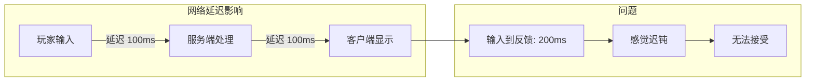
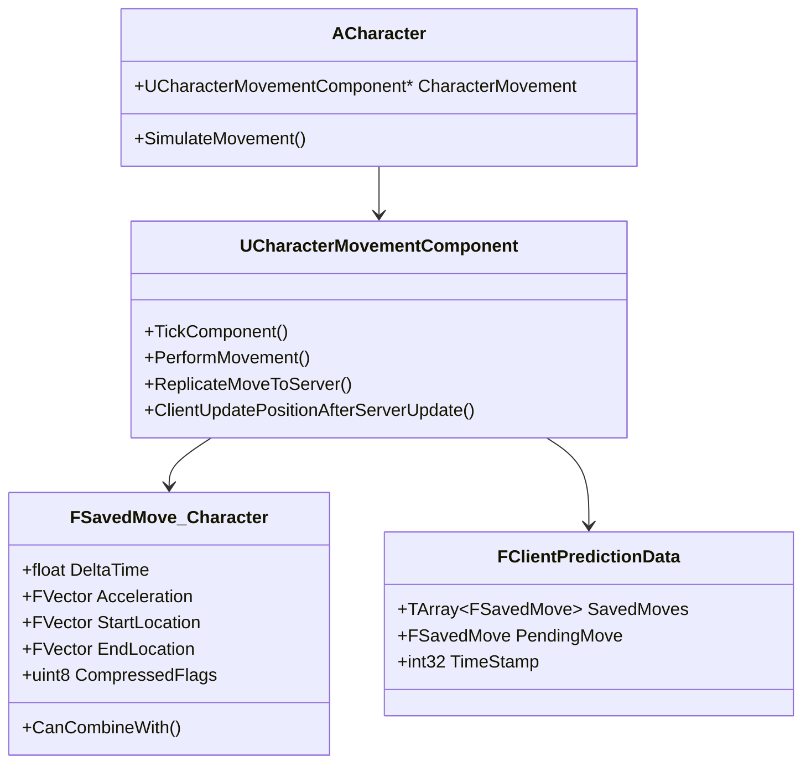
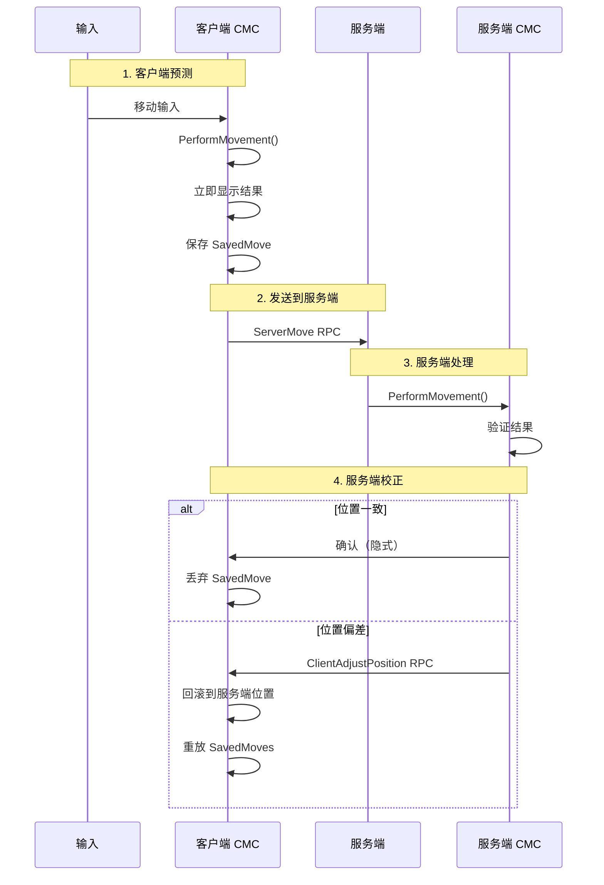
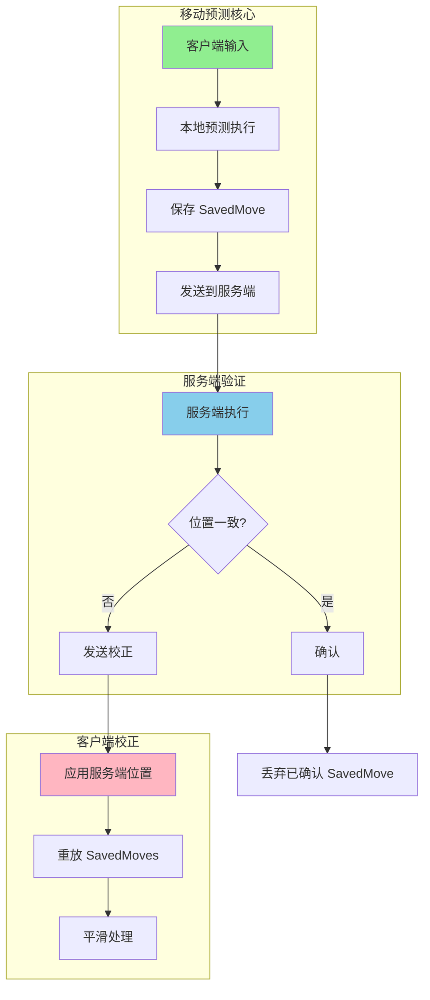

# 04. 移动预测与回滚机制

> 本文档深入分析 UE 的角色移动网络同步机制，这是网络游戏中最关键的技术之一。流畅的移动体验直接决定了游戏的可玩性。

## 1. 移动同步的核心挑战

### 1.1 问题背景



### 1.2 解决方案对比

| 方案 | 原理 | 优点 | 缺点 |
|------|------|------|------|
| **纯服务端权威** | 服务端处理所有移动 | 最安全 | 延迟感强 |
| **客户端预测** | 客户端先执行，服务端验证 | 即时反馈 | 需要回滚 |
| **帧同步** | 所有客户端同步执行 | 一致性好 | 延迟受限于最慢客户端 |

**UE 的选择**：客户端预测 + 服务端权威

---

## 2. UE 移动预测架构

### 2.1 核心类关系



### 2.2 移动同步流程



---

## 3. 源码深入分析

### 3.1 客户端移动处理

```cpp
// CharacterMovementComponent.cpp
void UCharacterMovementComponent::TickComponent(float DeltaTime, ...)
{
    // 区分网络角色
    if (CharacterOwner->GetLocalRole() == ROLE_AutonomousProxy)
    {
        // 自主代理（玩家控制的角色）
        ReplicateMoveToServer(DeltaTime, Acceleration);
    }
    else if (CharacterOwner->GetLocalRole() == ROLE_SimulatedProxy)
    {
        // 模拟代理（其他玩家的角色）
        SimulatedTick(DeltaTime);
    }
    else if (CharacterOwner->HasAuthority())
    {
        // 服务端
        PerformMovement(DeltaTime);
    }
}

void UCharacterMovementComponent::ReplicateMoveToServer(float DeltaTime, const FVector& NewAcceleration)
{
    // 1. 创建移动数据
    FSavedMovePtr NewMove = CreateSavedMove();
    NewMove->SetMoveFor(CharacterOwner, DeltaTime, NewAcceleration, *ClientData);
    
    // 2. 本地执行移动
    PerformMovement(NewMove->DeltaTime);
    
    // 3. 记录结束位置
    NewMove->PostUpdate(CharacterOwner, FSavedMove_Character::PostUpdate_Record);
    
    // 4. 保存用于回滚
    ClientData->SavedMoves.Add(NewMove);
    
    // 5. 发送到服务端
    if (CanCombineWith(...))
    {
        // 合并多个移动，减少 RPC 数量
        CombineWith(...);
    }
    
    CallServerMove(NewMove, OldMove);
}
```

### 3.2 服务端验证

```cpp
// 服务端 RPC 处理
void UCharacterMovementComponent::ServerMove_Implementation(
    float TimeStamp,
    FVector_NetQuantize10 InAccel,
    FVector_NetQuantize100 ClientLoc,
    uint8 CompressedMoveFlags,
    uint8 ClientRoll,
    uint32 View,
    UPrimitiveComponent* ClientMovementBase,
    FName ClientBaseBoneName,
    uint8 ClientMovementMode)
{
    // 1. 反作弊：检查时间戳
    if (!VerifyClientTimeStamp(TimeStamp))
    {
        return;
    }
    
    // 2. 反作弊：检查移动速度
    FVector ReceivedAcceleration = InAccel;
    if (ReceivedAcceleration.SizeSquared() > FMath::Square(GetMaxAcceleration() * 1.1f))
    {
        // 加速度异常
        return;
    }
    
    // 3. 在服务端执行移动
    const FVector OldLocation = UpdatedComponent->GetComponentLocation();
    PerformMovement(DeltaTime);
    const FVector NewLocation = UpdatedComponent->GetComponentLocation();
    
    // 4. 比较客户端位置与服务端位置
    const float LocationError = (ClientLoc - NewLocation).Size();
    
    if (LocationError > MaxLocationError)
    {
        // 5. 位置偏差过大，需要校正
        ClientAdjustPosition(
            TimeStamp,
            NewLocation,
            Velocity,
            UpdatedComponent->GetComponentQuat(),
            GetMovementBase(),
            GetMovementBaseBoneName(),
            bHasBase,
            bBaseIsSimulated,
            MovementMode
        );
    }
}
```

### 3.3 客户端校正

```cpp
// 客户端收到校正 RPC
void UCharacterMovementComponent::ClientAdjustPosition_Implementation(
    float TimeStamp,
    FVector NewLoc,
    FVector NewVel,
    UPrimitiveComponent* NewBase,
    FName NewBaseBoneName,
    bool bHasBase,
    bool bBaseRelativePosition,
    uint8 ServerMovementMode)
{
    // 1. 应用服务端位置
    UpdatedComponent->SetWorldLocation(NewLoc);
    Velocity = NewVel;
    
    // 2. 清除已确认的 SavedMoves
    AckMove(TimeStamp);
    
    // 3. 重放未确认的 SavedMoves
    ClientData->ReplayMoves(TimeStamp);
}

void FClientPredictionData::ReplayMoves(float TimeStamp)
{
    // 从服务端位置开始，重新执行所有未确认的移动
    for (FSavedMovePtr& Move : SavedMoves)
    {
        if (Move->TimeStamp > TimeStamp)
        {
            // 重新执行这个移动
            CharacterMovement->PerformMovement(Move->DeltaTime);
        }
    }
}
```

---

## 4. 对比逆水寒的移动同步

### 4.1 逆水寒移动同步

```lua
-- 客户端移动处理
function CClientPlayer:OnMoveInput(direction, deltaTime)
    -- 1. 本地立即移动
    local newPos = self:CalculateNewPosition(direction, deltaTime)
    self:SetPosition(newPos)
    
    -- 2. 记录移动帧数据
    local frame = g_FrameMgr:GetCurrentFrame()
    local moveData = {
        Frame = frame,
        Direction = direction,
        StartPos = self.m_Position,
        EndPos = newPos,
        TimeStamp = os.time()
    }
    
    -- 3. 缓存用于回滚
    self.m_PendingMoves[frame] = moveData
    
    -- 4. 发送到服务端
    self:SendToServer("C2G_PlayerMove", moveData)
end

-- 服务端处理
function CServerPlayer:OnClientMove(moveData)
    -- 1. 反作弊检查
    if not self:ValidateMoveSpeed(moveData) then
        return self:KickPlayer("SpeedHack")
    end
    
    -- 2. 服务端执行移动
    local serverPos = self:ExecuteMove(moveData)
    
    -- 3. 比较位置
    local diff = (serverPos - moveData.EndPos):Length()
    
    if diff > TOLERANCE then
        -- 4. 需要校正
        self:SendToClient("MoveCorrection", {
            Frame = moveData.Frame,
            Position = serverPos
        })
    end
end

-- 客户端收到校正
function CClientPlayer:OnMoveCorrection(data)
    -- 1. 回滚到服务端位置
    self:SetPosition(data.Position)
    
    -- 2. 重放后续移动
    for frame, move in pairs(self.m_PendingMoves) do
        if frame > data.Frame then
            local newPos = self:CalculateNewPosition(move.Direction, move.DeltaTime)
            self:SetPosition(newPos)
        end
    end
    
    -- 3. 清除已确认的移动
    self:ClearPendingMovesBefore(data.Frame)
end
```

### 4.2 技术对比

| 特性 | UE 方式 | 逆水寒方式 |
|------|---------|-----------|
| **预测单位** | 时间戳 | 帧号 |
| **数据压缩** | 内置量化 | 自定义打包 |
| **回滚机制** | SavedMoves 重放 | 帧数据重放 |
| **校正频率** | 基于误差阈值 | 基于帧差异 |
| **反作弊** | 速度检查、时间戳验证 | 速度检查、帧序列验证 |

---

## 5. 在 DJ01 项目中的应用

### 5.1 自定义移动组件

```cpp
// DJ01CharacterMovementComponent.h
UCLASS()
class UDJ01CharacterMovementComponent : public UCharacterMovementComponent
{
    GENERATED_BODY()
    
public:
    // 扩展的移动能力
    UPROPERTY(EditAnywhere, Category = "Movement")
    float DashSpeed = 1500.f;
    
    UPROPERTY(EditAnywhere, Category = "Movement")
    float DashDuration = 0.3f;
    
    // 冲刺状态（需要网络同步）
    UPROPERTY(Replicated)
    bool bIsDashing;
    
    // 冲刺方向
    UPROPERTY(Replicated)
    FVector DashDirection;
    
    // 执行冲刺（服务端权威）
    UFUNCTION(Server, Reliable)
    void ServerDash(FVector Direction);
    
    // 预测冲刺（客户端）
    void PredictDash(FVector Direction);
    
protected:
    virtual void PerformMovement(float DeltaTime) override;
    virtual class FNetworkPredictionData_Client* GetPredictionData_Client() const override;
};

// DJ01CharacterMovementComponent.cpp
void UDJ01CharacterMovementComponent::PerformMovement(float DeltaTime)
{
    if (bIsDashing)
    {
        // 冲刺移动逻辑
        FVector DashVelocity = DashDirection * DashSpeed;
        Velocity = DashVelocity;
    }
    
    Super::PerformMovement(DeltaTime);
}

void UDJ01CharacterMovementComponent::PredictDash(FVector Direction)
{
    // 客户端预测冲刺
    if (CharacterOwner->GetLocalRole() == ROLE_AutonomousProxy)
    {
        bIsDashing = true;
        DashDirection = Direction.GetSafeNormal();
        
        // 发送到服务端
        ServerDash(DashDirection);
    }
}

void UDJ01CharacterMovementComponent::ServerDash_Implementation(FVector Direction)
{
    // 服务端验证并执行
    if (CanDash())
    {
        bIsDashing = true;
        DashDirection = Direction.GetSafeNormal();
        
        // 设置定时器结束冲刺
        GetWorld()->GetTimerManager().SetTimer(
            DashTimerHandle,
            this,
            &UDJ01CharacterMovementComponent::EndDash,
            DashDuration
        );
    }
}
```

### 5.2 自定义 SavedMove

```cpp
// 扩展 SavedMove 以支持冲刺
class FSavedMove_DJ01 : public FSavedMove_Character
{
public:
    // 保存冲刺状态
    uint8 bSavedIsDashing : 1;
    FVector SavedDashDirection;
    
    virtual void Clear() override
    {
        FSavedMove_Character::Clear();
        bSavedIsDashing = false;
        SavedDashDirection = FVector::ZeroVector;
    }
    
    virtual void SetMoveFor(ACharacter* Character, float InDeltaTime, FVector const& NewAccel, class FNetworkPredictionData_Client_Character& ClientData) override
    {
        FSavedMove_Character::SetMoveFor(Character, InDeltaTime, NewAccel, ClientData);
        
        // 保存冲刺状态
        if (UDJ01CharacterMovementComponent* CMC = Cast<UDJ01CharacterMovementComponent>(Character->GetCharacterMovement()))
        {
            bSavedIsDashing = CMC->bIsDashing;
            SavedDashDirection = CMC->DashDirection;
        }
    }
    
    virtual bool CanCombineWith(const FSavedMovePtr& NewMove, ACharacter* Character, float MaxDelta) const override
    {
        // 冲刺状态不同的移动不能合并
        FSavedMove_DJ01* DJ01Move = (FSavedMove_DJ01*)&NewMove;
        if (bSavedIsDashing != DJ01Move->bSavedIsDashing)
        {
            return false;
        }
        
        return FSavedMove_Character::CanCombineWith(NewMove, Character, MaxDelta);
    }
    
    virtual void PrepMoveFor(ACharacter* Character) override
    {
        FSavedMove_Character::PrepMoveFor(Character);
        
        // 恢复冲刺状态（用于重放）
        if (UDJ01CharacterMovementComponent* CMC = Cast<UDJ01CharacterMovementComponent>(Character->GetCharacterMovement()))
        {
            CMC->bIsDashing = bSavedIsDashing;
            CMC->DashDirection = SavedDashDirection;
        }
    }
};
```

---

## 6. 平滑处理

### 6.1 插值平滑

```cpp
// 对于其他玩家（SimulatedProxy），使用插值平滑
void UDJ01CharacterMovementComponent::SimulatedTick(float DeltaSeconds)
{
    // 获取目标位置（服务端复制过来的）
    FVector TargetLocation = CharacterOwner->GetReplicatedMovement().Location;
    FVector CurrentLocation = UpdatedComponent->GetComponentLocation();
    
    // 使用插值平滑
    FVector SmoothedLocation = FMath::VInterpTo(
        CurrentLocation,
        TargetLocation,
        DeltaSeconds,
        SmoothNetUpdateInterpSpeed  // 默认 100
    );
    
    UpdatedComponent->SetWorldLocation(SmoothedLocation);
}
```

### 6.2 校正平滑

```cpp
// 当客户端收到校正时，不要瞬移，而是平滑过渡
void UDJ01CharacterMovementComponent::SmoothCorrection(const FVector& OldLocation, const FVector& NewLocation)
{
    // 计算偏移
    FVector Offset = OldLocation - NewLocation;
    
    // 如果偏移较小，使用平滑
    if (Offset.Size() < MaxSmoothCorrectionDistance)
    {
        // 记录偏移，每帧逐渐消除
        MeshTranslationOffset = Offset;
    }
    else
    {
        // 偏移过大，直接跳转
        MeshTranslationOffset = FVector::ZeroVector;
    }
}

void UDJ01CharacterMovementComponent::TickComponent(float DeltaTime, ...)
{
    Super::TickComponent(DeltaTime, ...);
    
    // 平滑消除偏移
    if (!MeshTranslationOffset.IsNearlyZero())
    {
        MeshTranslationOffset = FMath::VInterpTo(
            MeshTranslationOffset,
            FVector::ZeroVector,
            DeltaTime,
            CorrectionSmoothSpeed
        );
        
        // 应用到 Mesh 的相对位置
        CharacterOwner->GetMesh()->SetRelativeLocation(MeshTranslationOffset);
    }
}
```

---

## 7. 延迟补偿

### 7.1 服务端延迟补偿

```cpp
// 当玩家射击时，服务端需要考虑网络延迟
bool UDJ01CombatComponent::ServerProcessHit(
    const FHitResult& HitResult,
    float ClientTimeStamp)
{
    // 1. 计算需要回退的时间
    float Ping = GetOwnerPing();
    float RewindTime = Ping * 0.5f;  // 单向延迟
    
    // 2. 获取目标在过去的位置
    FVector TargetLocationInPast = GetPositionAtTime(
        HitResult.GetActor(),
        ClientTimeStamp - RewindTime
    );
    
    // 3. 使用过去的位置验证命中
    bool bValidHit = ValidateHitAgainstPosition(HitResult, TargetLocationInPast);
    
    return bValidHit;
}

// 位置历史记录
void UDJ01CombatComponent::SavePositionHistory()
{
    FPositionSnapshot Snapshot;
    Snapshot.Location = GetOwner()->GetActorLocation();
    Snapshot.Rotation = GetOwner()->GetActorRotation();
    Snapshot.TimeStamp = GetWorld()->GetTimeSeconds();
    
    PositionHistory.Add(Snapshot);
    
    // 只保留最近 1 秒的历史
    while (PositionHistory.Num() > 0 && 
           GetWorld()->GetTimeSeconds() - PositionHistory[0].TimeStamp > 1.0f)
    {
        PositionHistory.RemoveAt(0);
    }
}
```

---

## 8. 调试与测试

### 8.1 网络调试命令

```cpp
// 控制台命令
p.NetShowCorrections 1    // 显示服务端校正
p.NetVisualizeSimulatedPositions 1  // 可视化模拟位置
p.NetVisualizeSmoothing 1  // 可视化平滑

// 网络延迟模拟
Net.PktLag 200     // 200ms 延迟
Net.PktLoss 5      // 5% 丢包

// 显示网络统计
stat net
```

### 8.2 可视化调试

```cpp
// 在角色中添加调试绘制
void ADJ01Character::DrawDebugMovement()
{
    if (!bDrawDebugMovement) return;
    
    // 绘制服务端位置（绿色）
    DrawDebugSphere(GetWorld(), GetReplicatedMovement().Location, 50.f, 12, FColor::Green);
    
    // 绘制客户端位置（蓝色）
    DrawDebugSphere(GetWorld(), GetActorLocation(), 50.f, 12, FColor::Blue);
    
    // 绘制预测路径
    if (UDJ01CharacterMovementComponent* CMC = GetCharacterMovement<UDJ01CharacterMovementComponent>())
    {
        FVector PredictedEnd = GetActorLocation() + CMC->Velocity * 0.5f;
        DrawDebugLine(GetWorld(), GetActorLocation(), PredictedEnd, FColor::Yellow);
    }
}
```

---

## 9. 总结



**核心要点**：
1. 客户端预测 + 服务端权威是 UE 的核心移动同步模式
2. SavedMove 用于保存移动历史，支持回滚重放
3. 平滑处理确保校正时不会出现抖动
4. 延迟补偿使高延迟下的命中判定更公平

---

## 下一步

学习 [05_CombatSync.md](./05_CombatSync.md) - 战斗同步策略