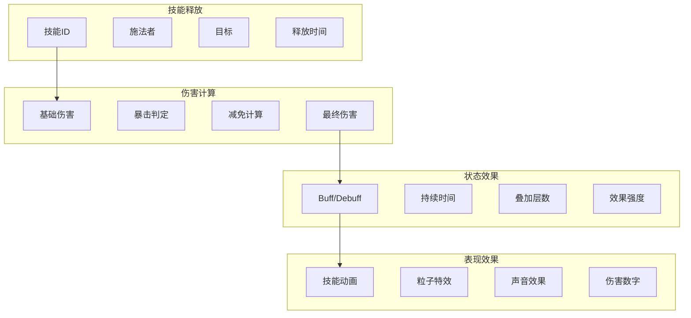
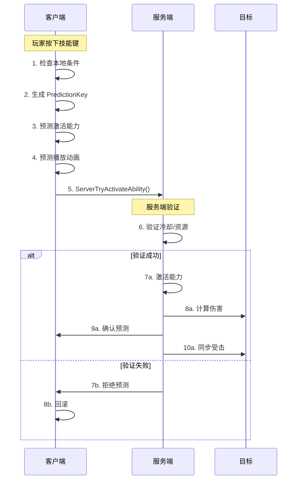
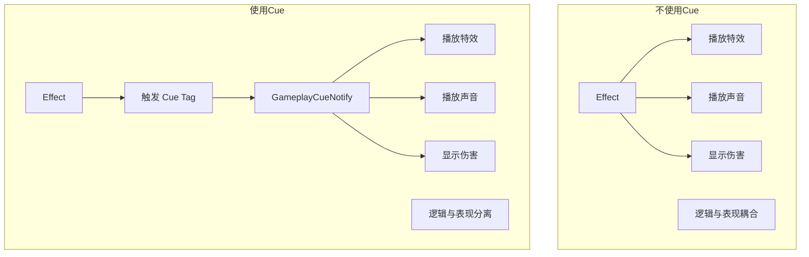
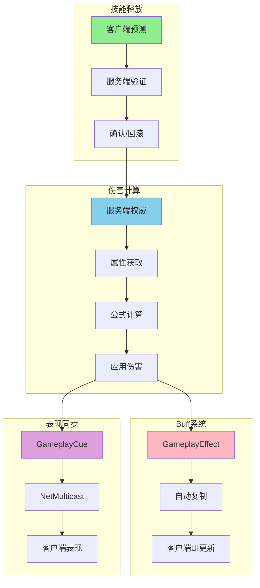

# 05. 战斗同步策略

> 本文档深入分析网络游戏中战斗系统的同步策略，结合你的 DJ01 项目和逆水寒的设计经验。

## 1. 战斗同步的核心问题

### 1.1 需要同步什么



### 1.2 同步策略选择

| 数据类型 | 同步策略 | 原因 |
|---------|---------|------|
| **技能释放** | 客户端预测 + 服务端确认 | 需要即时反馈 |
| **伤害计算** | 服务端权威 | 防止作弊 |
| **Buff 状态** | 服务端权威 + 复制 | 数据一致性 |
| **表现效果** | GameplayCue | 与逻辑分离 |

---

## 2. 技能释放同步

### 2.1 GAS 技能激活流程



### 2.2 在 DJ01 中实现

```cpp
// DJ01GameplayAbility.cpp
void UDJ01GameplayAbility::ActivateAbility(
    const FGameplayAbilitySpecHandle Handle,
    const FGameplayAbilityActorInfo* ActorInfo,
    const FGameplayAbilityActivationInfo ActivationInfo,
    const FGameplayEventData* TriggerEventData)
{
    // 检查是否可以激活
    if (!CanActivateAbility(Handle, ActorInfo, nullptr, nullptr, nullptr))
    {
        EndAbility(Handle, ActorInfo, ActivationInfo, true, true);
        return;
    }
    
    // 提交能力（消耗资源、触发冷却）
    if (!CommitAbility(Handle, ActorInfo, ActivationInfo))
    {
        EndAbility(Handle, ActorInfo, ActivationInfo, true, true);
        return;
    }
    
    // 播放动画（通过 ASC 自动处理网络同步）
    PlayMontage(ActivationMontage);
    
    // 如果需要选择目标
    if (bRequiresTarget)
    {
        // 使用 AbilityTask 等待目标选择
        UAbilityTask_WaitTargetData* WaitTargetTask = UAbilityTask_WaitTargetData::WaitTargetData(
            this,
            NAME_None,
            EGameplayTargetingConfirmation::UserConfirmed,
            TargetActorClass
        );
        WaitTargetTask->ValidData.AddDynamic(this, &UDJ01GameplayAbility::OnTargetDataReady);
        WaitTargetTask->ReadyForActivation();
    }
    else
    {
        // 直接执行效果
        ExecuteAbilityEffect();
    }
}
```

### 2.3 对比逆水寒的技能释放

**逆水寒方式**：

```lua
-- 客户端请求释放技能
function CClientPlayer:CastSkill(skillId, targetId)
    -- 1. 本地预检查
    if not self:CanCastSkill(skillId) then
        return g_UIMgr:ShowTip("技能冷却中")
    end
    
    -- 2. 播放预测动画
    self:PlaySkillAnimation(skillId)
    
    -- 3. 发送请求到服务端
    self:SendToServer("C2G_CastSkill", {
        SkillId = skillId,
        TargetId = targetId,
        Frame = g_FrameMgr:GetCurrentFrame(),
        Position = self:GetPosition(),
        Direction = self:GetDirection()
    })
    
    -- 4. 等待服务端结果
    self.m_PendingSkills[skillId] = {
        Frame = g_FrameMgr:GetCurrentFrame(),
        Predicted = true
    }
end

-- 服务端处理
function CServerPlayer:OnCastSkillRequest(data)
    -- 1. 验证
    if not self:CanCastSkill(data.SkillId) then
        return self:SendToClient("SkillCastFailed", {
            SkillId = data.SkillId,
            Reason = "Cooldown"
        })
    end
    
    -- 2. 执行技能
    local skill = g_SkillMgr:CreateSkill(data.SkillId, self)
    skill:SetTarget(data.TargetId)
    skill:Execute()
    
    -- 3. 广播给周围玩家
    self:BroadcastToNearby("SkillExecuted", {
        CasterId = self.m_Id,
        SkillId = data.SkillId,
        TargetId = data.TargetId
    })
end
```

---

## 3. 伤害计算同步

### 3.1 服务端权威伤害

```cpp
// DJ01DamageExecution.cpp
void UDJ01DamageExecution::Execute_Implementation(
    const FGameplayEffectCustomExecutionParameters& ExecutionParams,
    FGameplayEffectCustomExecutionOutput& OutExecutionOutput) const
{
    // 只在服务端执行
    UAbilitySystemComponent* SourceASC = ExecutionParams.GetSourceAbilitySystemComponent();
    UAbilitySystemComponent* TargetASC = ExecutionParams.GetTargetAbilitySystemComponent();
    
    AActor* SourceActor = SourceASC ? SourceASC->GetOwnerActor() : nullptr;
    AActor* TargetActor = TargetASC ? TargetASC->GetOwnerActor() : nullptr;
    
    if (!TargetActor || !TargetActor->HasAuthority())
    {
        // 非服务端，不执行
        return;
    }
    
    const FGameplayEffectSpec& Spec = ExecutionParams.GetOwningSpec();
    
    // 获取伤害相关属性
    float BaseDamage = 0.f;
    float AttackPower = 0.f;
    float DefensePower = 0.f;
    float CritRate = 0.f;
    float CritDamage = 0.f;
    
    // 从源（攻击者）获取攻击属性
    ExecutionParams.AttemptCalculateCapturedAttributeMagnitude(
        DamageStatics().AttackPowerDef, EvaluationParameters, AttackPower);
    ExecutionParams.AttemptCalculateCapturedAttributeMagnitude(
        DamageStatics().CritRateDef, EvaluationParameters, CritRate);
    ExecutionParams.AttemptCalculateCapturedAttributeMagnitude(
        DamageStatics().CritDamageDef, EvaluationParameters, CritDamage);
    
    // 从目标获取防御属性
    ExecutionParams.AttemptCalculateCapturedAttributeMagnitude(
        DamageStatics().DefensePowerDef, EvaluationParameters, DefensePower);
    
    // 获取技能基础伤害
    BaseDamage = Spec.GetSetByCallerMagnitude(FGameplayTag::RequestGameplayTag("Data.Damage.Base"), false, 0.f);
    
    // 计算最终伤害
    float FinalDamage = CalculateDamage(BaseDamage, AttackPower, DefensePower, CritRate, CritDamage);
    
    // 输出伤害
    if (FinalDamage > 0.f)
    {
        OutExecutionOutput.AddOutputModifier(
            FGameplayModifierEvaluatedData(
                UDJ01AttributeSet::GetHealthAttribute(),
                EGameplayModOp::Additive,
                -FinalDamage
            )
        );
        
        // 触发伤害 Cue（用于表现）
        FGameplayCueParameters CueParams;
        CueParams.RawMagnitude = FinalDamage;
        CueParams.EffectContext = Spec.GetContext();
        TargetASC->ExecuteGameplayCue(
            FGameplayTag::RequestGameplayTag("GameplayCue.Damage"),
            CueParams
        );
    }
}

float UDJ01DamageExecution::CalculateDamage(
    float BaseDamage, float Attack, float Defense, float CritRate, float CritDamage) const
{
    // 基础公式：伤害 = (基础伤害 + 攻击力) * (1 - 防御减免)
    float DamageReduction = Defense / (Defense + 1000.f);  // 防御减免公式
    float Damage = (BaseDamage + Attack) * (1.f - DamageReduction);
    
    // 暴击判定
    if (FMath::FRand() < CritRate)
    {
        Damage *= (1.f + CritDamage);
    }
    
    return FMath::Max(0.f, Damage);
}
```

### 3.2 对比逆水寒的伤害计算

```lua
-- 服务端伤害计算
function CServerSkill:CalculateDamage(caster, target)
    -- 获取属性
    local attack = caster:GetAttribute("Attack")
    local defense = target:GetAttribute("Defense")
    local critRate = caster:GetAttribute("CritRate")
    local critDamage = caster:GetAttribute("CritDamage")
    
    -- 基础伤害
    local baseDamage = self.m_SkillData.BaseDamage
    local attackCoef = self.m_SkillData.AttackCoef
    
    -- 伤害公式
    local damage = (baseDamage + attack * attackCoef)
    
    -- 防御减免
    local defenseRate = defense / (defense + 1000)
    damage = damage * (1 - defenseRate)
    
    -- 暴击
    local isCrit = math.random() < critRate
    if isCrit then
        damage = damage * (1 + critDamage)
    end
    
    -- 记录战斗日志
    g_BattleLog:Record({
        Attacker = caster.m_Id,
        Target = target.m_Id,
        Skill = self.m_SkillId,
        Damage = damage,
        IsCrit = isCrit
    })
    
    return damage, isCrit
end
```

---

## 4. Buff/状态效果同步

### 4.1 GameplayEffect 作为 Buff

```cpp
// 创建一个持续性 Buff
UCLASS()
class UGE_Burning : public UGameplayEffect
{
    UGE_Burning()
    {
        // 持续时间
        DurationPolicy = EGameplayEffectDurationType::HasDuration;
        DurationMagnitude = FScalableFloat(5.0f);  // 5秒
        
        // 周期性执行
        Period = 1.0f;  // 每秒执行一次
        bExecutePeriodicEffectOnApplication = true;
        
        // 修改器
        FGameplayModifierInfo DamageModifier;
        DamageModifier.Attribute = UDJ01AttributeSet::GetHealthAttribute();
        DamageModifier.ModifierOp = EGameplayModOp::Additive;
        DamageModifier.ModifierMagnitude = FScalableFloat(-20.0f);  // 每秒 20 伤害
        Modifiers.Add(DamageModifier);
        
        // 叠加策略
        StackingType = EGameplayEffectStackingType::AggregateBySource;
        StackLimitCount = 3;  // 最多叠加 3 层
        
        // Cue 表现
        FGameplayEffectCue BurningCue;
        BurningCue.GameplayCueTags.AddTag(FGameplayTag::RequestGameplayTag("GameplayCue.Status.Burning"));
        GameplayCues.Add(BurningCue);
    }
};
```

### 4.2 Buff 的网络复制

```cpp
// GameplayEffect 的复制是自动的
// ASC 会复制 ActiveGameplayEffects

// 在 DJ01Character 中监听 Buff 变化
void ADJ01Character::SetupASC()
{
    if (AbilitySystemComponent)
    {
        // 监听 Effect 添加
        AbilitySystemComponent->OnActiveGameplayEffectAddedDelegateToSelf.AddUObject(
            this, &ADJ01Character::OnEffectAdded);
        
        // 监听 Effect 移除
        AbilitySystemComponent->OnAnyGameplayEffectRemovedDelegate().AddUObject(
            this, &ADJ01Character::OnEffectRemoved);
    }
}

void ADJ01Character::OnEffectAdded(
    UAbilitySystemComponent* ASC,
    const FGameplayEffectSpec& Spec,
    FActiveGameplayEffectHandle Handle)
{
    // 获取 Effect 的 Tag
    FGameplayTagContainer Tags;
    Spec.GetAllGrantedTags(Tags);
    
    // 更新 Buff UI
    if (Tags.HasTag(FGameplayTag::RequestGameplayTag("Status.Debuff")))
    {
        UpdateDebuffUI(Spec, Handle);
    }
}
```

### 4.3 对比逆水寒的 Buff 系统

```lua
-- 服务端 Buff 管理
function CServerBuffMgr:AddBuff(target, buffId, caster, duration)
    local buffData = g_BuffConfig[buffId]
    
    -- 检查叠加
    local existingBuff = target:GetBuff(buffId)
    if existingBuff then
        if buffData.StackType == "Refresh" then
            existingBuff:RefreshDuration()
            return existingBuff
        elseif buffData.StackType == "Stack" then
            if existingBuff.m_Stacks < buffData.MaxStack then
                existingBuff:AddStack()
            end
            return existingBuff
        end
    end
    
    -- 创建新 Buff
    local buff = CBuff:new(buffId, buffData)
    buff:SetCaster(caster)
    buff:SetTarget(target)
    buff:SetDuration(duration or buffData.Duration)
    
    -- 添加到目标
    target:AddBuff(buff)
    
    -- 同步给客户端
    target:SendToClient("BuffAdded", {
        BuffId = buffId,
        CasterId = caster.m_Id,
        Duration = buff.m_Duration,
        Stacks = buff.m_Stacks
    })
    
    -- 广播给周围玩家（用于显示 Debuff 图标）
    if buffData.ShowToOthers then
        target:BroadcastToNearby("BuffVisible", {
            TargetId = target.m_Id,
            BuffId = buffId
        })
    end
    
    return buff
end
```

---

## 5. 命中判定同步

### 5.1 服务端命中验证

```cpp
// DJ01 中的命中判定
UCLASS()
class UDJ01AbilityTask_WaitHitConfirm : public UAbilityTask
{
public:
    // 客户端检测到命中后，发送到服务端验证
    UFUNCTION(Server, Reliable)
    void ServerConfirmHit(const FHitResult& HitResult, float ClientTimeStamp);
    
    void ServerConfirmHit_Implementation(const FHitResult& HitResult, float ClientTimeStamp)
    {
        // 1. 延迟补偿：获取目标在客户端射击时的位置
        AActor* HitActor = HitResult.GetActor();
        if (!HitActor) return;
        
        float Ping = GetOwnerPing();
        FVector TargetLocationAtHitTime = GetTargetPositionAtTime(HitActor, ClientTimeStamp);
        
        // 2. 验证命中
        FVector HitLocation = HitResult.ImpactPoint;
        float Distance = FVector::Dist(HitLocation, TargetLocationAtHitTime);
        
        // 允许一定的容差
        const float HitTolerance = 50.f + Ping * 0.1f;  // 延迟越高容差越大
        
        if (Distance < HitTolerance)
        {
            // 命中有效
            OnHitConfirmed.Broadcast(HitResult);
        }
        else
        {
            // 命中无效（可能是作弊或严重延迟）
            UE_LOG(LogCombat, Warning, TEXT("Hit rejected: Distance=%f, Tolerance=%f"), Distance, HitTolerance);
        }
    }
};
```

### 5.2 延迟补偿实现

```cpp
// 位置历史记录组件
UCLASS()
class UDJ01PositionHistoryComponent : public UActorComponent
{
public:
    // 记录位置历史
    void RecordPosition()
    {
        FPositionSnapshot Snapshot;
        Snapshot.Location = GetOwner()->GetActorLocation();
        Snapshot.Rotation = GetOwner()->GetActorRotation();
        Snapshot.ServerTime = GetWorld()->GetGameState()->GetServerWorldTimeSeconds();
        
        PositionHistory.Add(Snapshot);
        
        // 保留最近 1 秒
        CleanOldSnapshots();
    }
    
    // 获取过去某时刻的位置
    FVector GetPositionAtTime(float Time) const
    {
        // 找到最接近的两个快照，进行插值
        for (int32 i = PositionHistory.Num() - 1; i > 0; --i)
        {
            if (PositionHistory[i].ServerTime >= Time && PositionHistory[i-1].ServerTime <= Time)
            {
                float Alpha = (Time - PositionHistory[i-1].ServerTime) / 
                    (PositionHistory[i].ServerTime - PositionHistory[i-1].ServerTime);
                return FMath::Lerp(PositionHistory[i-1].Location, PositionHistory[i].Location, Alpha);
            }
        }
        
        // 如果没找到，返回当前位置
        return GetOwner()->GetActorLocation();
    }
    
private:
    TArray<FPositionSnapshot> PositionHistory;
};
```

---

## 6. 表现效果同步 (GameplayCue)

### 6.1 Cue 的优势



### 6.2 自定义 Cue

```cpp
// 伤害 Cue
UCLASS()
class UGC_Damage : public UGameplayCueNotify_Static
{
public:
    virtual void HandleGameplayCue(
        AActor* MyTarget,
        EGameplayCueEvent::Type EventType,
        const FGameplayCueParameters& Parameters) override
    {
        if (EventType == EGameplayCueEvent::Executed)
        {
            // 获取伤害值
            float Damage = Parameters.RawMagnitude;
            
            // 播放受击特效
            if (HitEffect)
            {
                UNiagaraFunctionLibrary::SpawnSystemAtLocation(
                    MyTarget->GetWorld(),
                    HitEffect,
                    Parameters.EffectContext.GetHitResult() ? 
                        Parameters.EffectContext.GetHitResult()->ImpactPoint : 
                        MyTarget->GetActorLocation()
                );
            }
            
            // 播放受击声音
            if (HitSound)
            {
                UGameplayStatics::PlaySoundAtLocation(
                    MyTarget->GetWorld(),
                    HitSound,
                    MyTarget->GetActorLocation()
                );
            }
            
            // 显示伤害数字
            if (ADJ01Character* Character = Cast<ADJ01Character>(MyTarget))
            {
                Character->ShowDamageNumber(Damage, Parameters.EffectContext.GetInstigator());
            }
        }
    }
    
protected:
    UPROPERTY(EditDefaultsOnly)
    UNiagaraSystem* HitEffect;
    
    UPROPERTY(EditDefaultsOnly)
    USoundBase* HitSound;
};
```

### 6.3 Cue 的网络行为

```cpp
// Cue 的执行位置取决于 Effect 的应用位置
// 
// 服务端应用 Effect -> Cue 通过 NetMulticast 广播到所有客户端
// 客户端预测 Effect -> Cue 在本地客户端执行

// 可以控制 Cue 的执行范围
void UDJ01AbilitySystemComponent::ExecuteGameplayCue(
    const FGameplayTag GameplayCueTag,
    const FGameplayCueParameters& GameplayCueParameters)
{
    // 默认行为：服务端广播，客户端本地执行
    Super::ExecuteGameplayCue(GameplayCueTag, GameplayCueParameters);
    
    // 或者只在本地执行（不广播）
    // InvokeGameplayCueEvent(GameplayCueTag, EGameplayCueEvent::Executed, GameplayCueParameters);
}
```

---

## 7. 完整战斗流程示例

### 7.1 近战攻击

```cpp
// DJ01MeleeAttackAbility.cpp
void UDJ01MeleeAttackAbility::ActivateAbility(...)
{
    // 1. 提交能力
    if (!CommitAbility(...)) return;
    
    // 2. 播放攻击动画
    UAbilityTask_PlayMontageAndWait* MontageTask = UAbilityTask_PlayMontageAndWait::CreatePlayMontageAndWaitProxy(
        this, NAME_None, AttackMontage, 1.0f);
    MontageTask->OnCompleted.AddDynamic(this, &UDJ01MeleeAttackAbility::OnMontageCompleted);
    MontageTask->ReadyForActivation();
    
    // 3. 等待命中事件（通过 AnimNotify 触发）
    UAbilityTask_WaitGameplayEvent* EventTask = UAbilityTask_WaitGameplayEvent::WaitGameplayEvent(
        this, FGameplayTag::RequestGameplayTag("Event.Montage.Hit"), nullptr, true, true);
    EventTask->EventReceived.AddDynamic(this, &UDJ01MeleeAttackAbility::OnHitEvent);
    EventTask->ReadyForActivation();
}

void UDJ01MeleeAttackAbility::OnHitEvent(FGameplayEventData Payload)
{
    // 4. 检测命中范围内的敌人
    TArray<FHitResult> HitResults;
    PerformMeleeTrace(HitResults);
    
    // 5. 应用伤害
    for (const FHitResult& Hit : HitResults)
    {
        if (AActor* HitActor = Hit.GetActor())
        {
            // 创建目标数据
            FGameplayAbilityTargetDataHandle TargetData = 
                UAbilitySystemBlueprintLibrary::AbilityTargetDataFromHitResult(Hit);
            
            // 应用伤害 Effect
            ApplyGameplayEffectToTarget(
                GetCurrentAbilitySpecHandle(),
                GetCurrentActorInfo(),
                GetCurrentActivationInfo(),
                MakeOutgoingGameplayEffectSpec(DamageEffectClass),
                TargetData
            );
        }
    }
}
```

### 7.2 远程技能

```cpp
// DJ01ProjectileAbility.cpp
void UDJ01ProjectileAbility::ActivateAbility(...)
{
    // 1. 提交能力
    if (!CommitAbility(...)) return;
    
    // 2. 播放施法动画
    PlayMontageTask(CastMontage);
    
    // 3. 等待施法完成事件
    WaitGameplayEventTask(FGameplayTag::RequestGameplayTag("Event.Montage.SpawnProjectile"));
}

void UDJ01ProjectileAbility::OnSpawnProjectileEvent(FGameplayEventData Payload)
{
    // 只在服务端生成投射物
    if (!K2_HasAuthority()) return;
    
    // 4. 生成投射物
    ADJ01Projectile* Projectile = GetWorld()->SpawnActorDeferred<ADJ01Projectile>(
        ProjectileClass,
        GetSpawnTransform(),
        GetOwningActorFromActorInfo(),
        Cast<APawn>(GetOwningActorFromActorInfo())
    );
    
    // 5. 设置投射物的 Effect
    Projectile->SetDamageEffectSpec(MakeOutgoingGameplayEffectSpec(DamageEffectClass));
    
    // 6. 完成生成（会自动复制到客户端）
    Projectile->FinishSpawning(GetSpawnTransform());
}

// DJ01Projectile.cpp
void ADJ01Projectile::OnHit(const FHitResult& HitResult)
{
    // 只在服务端处理命中
    if (!HasAuthority()) return;
    
    AActor* HitActor = HitResult.GetActor();
    if (HitActor && HitActor != GetInstigator())
    {
        // 应用伤害
        if (UAbilitySystemComponent* TargetASC = UAbilitySystemBlueprintLibrary::GetAbilitySystemComponent(HitActor))
        {
            TargetASC->ApplyGameplayEffectSpecToSelf(*DamageEffectSpec.Data.Get());
        }
    }
    
    // 销毁投射物（会复制到客户端）
    Destroy();
}
```

---

## 8. 调试与优化

### 8.1 战斗日志

```cpp
// 战斗日志系统
UCLASS()
class UDJ01CombatLog : public UObject
{
public:
    void LogDamage(
        AActor* Attacker,
        AActor* Target,
        float Damage,
        bool bIsCrit,
        const FGameplayTag& AbilityTag)
    {
        FCombatLogEntry Entry;
        Entry.Timestamp = GetWorld()->GetTimeSeconds();
        Entry.AttackerName = Attacker->GetName();
        Entry.TargetName = Target->GetName();
        Entry.Damage = Damage;
        Entry.bIsCrit = bIsCrit;
        Entry.AbilityTag = AbilityTag;
        
        Entries.Add(Entry);
        
        UE_LOG(LogCombat, Log, TEXT("[Combat] %s -> %s: %.1f damage (Crit=%d) [%s]"),
            *Entry.AttackerName, *Entry.TargetName, Entry.Damage, Entry.bIsCrit,
            *Entry.AbilityTag.ToString());
    }
    
private:
    TArray<FCombatLogEntry> Entries;
};
```

### 8.2 网络优化

```cpp
// 优化 Effect 复制频率
void UDJ01AbilitySystemComponent::GetLifetimeReplicatedProps(TArray<FLifetimeProperty>& OutLifetimeProps) const
{
    Super::GetLifetimeReplicatedProps(OutLifetimeProps);
    
    // 减少不必要的复制
    DOREPLIFETIME_CONDITION(UDJ01AbilitySystemComponent, ActiveGameplayEffects, COND_OwnerOnly);
}

// 优化 Cue 广播范围
void UDJ01AbilitySystemComponent::NetMulticast_InvokeGameplayCueExecuted_Implementation(
    const FGameplayTag GameplayCueTag,
    FPredictionKey PredictionKey,
    FGameplayEffectContextHandle EffectContext)
{
    // 只向视野内的客户端广播
    // 通过自定义的 Multicast 过滤
}
```

---

## 9. 总结



**核心要点**：
1. 技能释放使用客户端预测 + 服务端验证
2. 伤害计算必须在服务端执行
3. Buff 状态通过 GameplayEffect 自动复制
4. 表现效果通过 GameplayCue 分离

---

## 下一步

学习 [06_AOI_Relevancy.md](./06_AOI_Relevancy.md) - 视野管理与裁剪优化