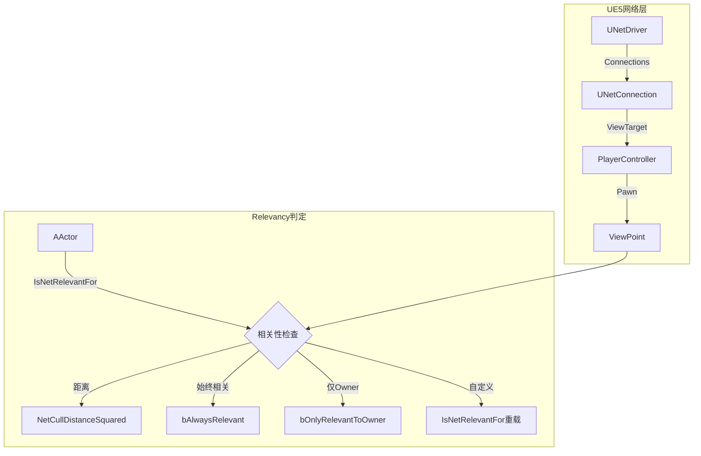
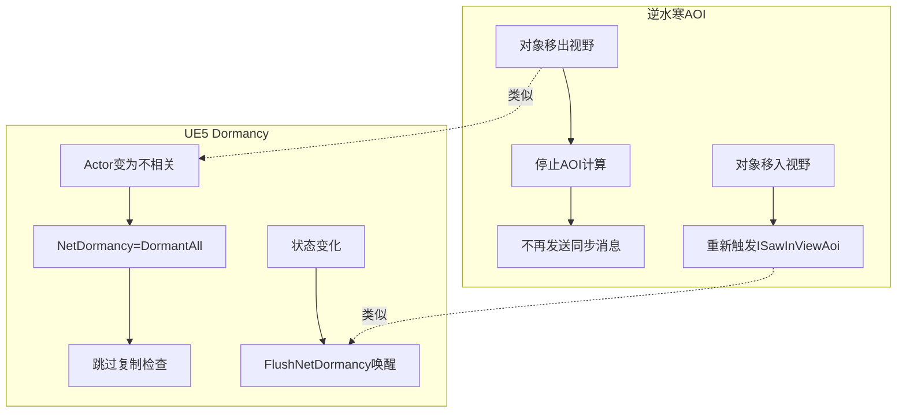
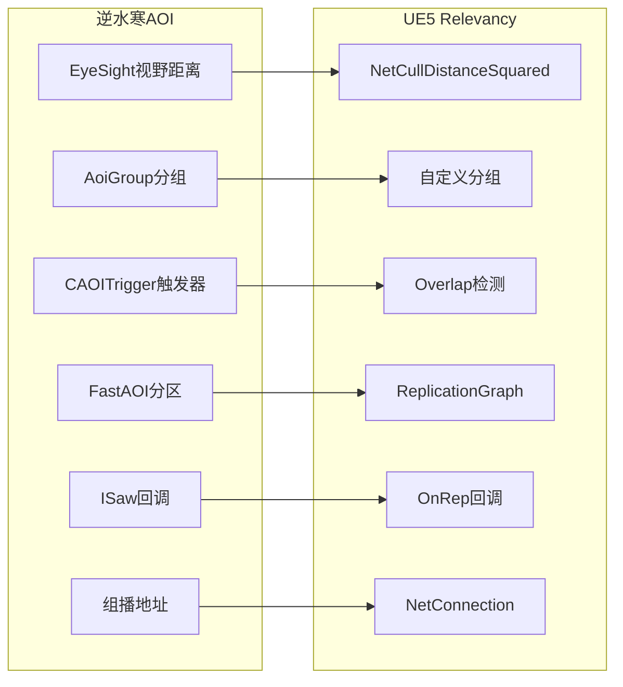

# 06 - AOI与网络相关性系统

## 概述

在MMO服务端，AOI（Area of Interest）系统决定"谁能看到谁"，这直接影响网络带宽和服务器负载。UE5中对应的概念是 **Network Relevancy（网络相关性）** 系统。

本文档将逆水寒的AOI架构映射到UE5的Relevancy机制，帮助你理解两者的共通之处和设计差异。

---

## 核心概念对比

| 逆水寒AOI | UE5 Relevancy | 说明 |
|-----------|---------------|------|
| `EyeSight`（视野距离） | `NetCullDistanceSquared` | 决定同步范围的距离阈值 |
| `EnumAoiGroup`（AOI分组） | `NetDriverName` / 自定义Channel | 按类型分组减少计算 |
| `CAOITrigger`（区域触发器） | `USphereComponent` + Overlap | 区域检测机制 |
| `FastAOI`（Region分区） | `UNetConnection::ViewTarget` | 大场景优化 |
| `ViewAoiGroupRpcAddr`（组播地址） | `GetNetConnection()->GetViewTarget()` | 消息投递对象 |
| `ISawInViewAoi`回调 | `OnRep_` / `BeginPlay` for Client | 进入视野事件 |

---

## UE5 Relevancy 架构

### 层次结构



### 相关性判定流程

```mermaid
sequenceDiagram
    participant ND as NetDriver
    participant NC as NetConnection
    participant Rep as FActorReplicationInfo
    participant Actor as AActor
    
    ND->>ND: ServerReplicateActors()
    loop 每个Connection
        ND->>NC: GetViewTarget()
        loop 每个待复制Actor
            NC->>Actor: IsNetRelevantFor(ViewTarget)
            alt 相关
                Actor-->>Rep: 加入复制列表
            else 不相关
                Actor-->>Rep: 跳过或休眠
            end
        end
        Rep->>NC: ReplicateActors()
    end
```

---

## 距离剔除：NetCullDistanceSquared

### 基础配置

UE5中每个Actor都有一个 `NetCullDistanceSquared` 属性：

```cpp
// AActor中的网络剔除距离
UPROPERTY(EditAnywhere, BlueprintReadWrite, Category=Replication)
float NetCullDistanceSquared = 225000000.0f; // 默认15000单位（约150米）

// 对应逆水寒的 EyeSight 概念
// 逆水寒: self.m_engineObject:SetEyeSight(eyeSight)
// UE5: Actor->SetNetCullDistanceSquared(FMath::Square(DistanceUnits));
```

### 在DJ01中配置

```cpp filePath=Source/DJ01/Characters/DJ01CharacterBase.h
// DJ01角色基类 - 网络相关性配置
UCLASS()
class ADJ01CharacterBase : public ACharacter
{
    GENERATED_BODY()
    
public:
    ADJ01CharacterBase();
    
    // 根据角色类型设置不同的剔除距离
    UPROPERTY(EditDefaultsOnly, Category = "Network|Relevancy")
    float BaseNetCullDistance = 10000.0f; // 100米基础距离
    
    // 重要角色（Boss）使用更大距离
    UPROPERTY(EditDefaultsOnly, Category = "Network|Relevancy")
    float BossNetCullDistance = 30000.0f;
    
protected:
    virtual void BeginPlay() override;
    
    // 动态调整剔除距离
    void SetupNetCullDistance();
};
```

```cpp filePath=Source/DJ01/Characters/DJ01CharacterBase.cpp
#include "DJ01CharacterBase.h"

ADJ01CharacterBase::ADJ01CharacterBase()
{
    // 基础复制配置
    bReplicates = true;
    bAlwaysRelevant = false;
    bOnlyRelevantToOwner = false;
    
    // 设置默认剔除距离
    NetCullDistanceSquared = FMath::Square(BaseNetCullDistance);
}

void ADJ01CharacterBase::BeginPlay()
{
    Super::BeginPlay();
    SetupNetCullDistance();
}

void ADJ01CharacterBase::SetupNetCullDistance()
{
    // 类似逆水寒的场景视野配置
    // CSceneMgr:_GetSceneViewAOI() 根据场景类型调整视野
    
    if (HasAuthority())
    {
        // 服务器端根据角色类型设置
        if (IsBossCharacter())
        {
            NetCullDistanceSquared = FMath::Square(BossNetCullDistance);
        }
        else
        {
            NetCullDistanceSquared = FMath::Square(BaseNetCullDistance);
        }
    }
}
```

---

## 自定义相关性：IsNetRelevantFor

### 重载相关性判定

UE5允许重载 `IsNetRelevantFor` 实现自定义逻辑：

```cpp filePath=Source/DJ01/Actors/DJ01RelevancyActor.h
UCLASS()
class ADJ01RelevancyActor : public AActor
{
    GENERATED_BODY()
    
public:
    // 类似逆水寒的AOI分组概念
    UPROPERTY(EditDefaultsOnly, Category = "Network|Relevancy")
    EDJ01RelevancyGroup RelevancyGroup = EDJ01RelevancyGroup::Default;
    
    // 重载相关性判定
    virtual bool IsNetRelevantFor(
        const AActor* RealViewer,
        const AActor* ViewTarget,
        const FVector& SrcLocation) const override;
        
    // 扇形视野检测（类似逆水寒的fAEyeSector）
    UPROPERTY(EditDefaultsOnly, Category = "Network|Relevancy")
    bool bUseSectorRelevancy = false;
    
    UPROPERTY(EditDefaultsOnly, Category = "Network|Relevancy", 
        meta = (EditCondition = "bUseSectorRelevancy"))
    float SectorAngleDegrees = 90.0f;
};
```

```cpp filePath=Source/DJ01/Actors/DJ01RelevancyActor.cpp
bool ADJ01RelevancyActor::IsNetRelevantFor(
    const AActor* RealViewer,
    const AActor* ViewTarget,
    const FVector& SrcLocation) const
{
    // 1. 始终相关检查
    if (bAlwaysRelevant)
    {
        return true;
    }
    
    // 2. 仅对Owner相关
    if (bOnlyRelevantToOwner)
    {
        return IsOwnedBy(RealViewer);
    }
    
    // 3. 分组检查 - 类似逆水寒的EnumAoiGroup
    // 逆水寒: if (pObj->NoCalcAoi(pAnoObj, pAnoObj->GetAoiGroup())) continue;
    if (ADJ01RelevancyActor* OtherActor = Cast<ADJ01RelevancyActor>(ViewTarget))
    {
        if (ShouldSkipRelevancyForGroup(OtherActor->RelevancyGroup))
        {
            return false;
        }
    }
    
    // 4. 距离检查
    const float DistSq = FVector::DistSquared(GetActorLocation(), SrcLocation);
    if (DistSq > NetCullDistanceSquared)
    {
        return false;
    }
    
    // 5. 扇形视野检查 - 类似逆水寒的扇形AOI
    // 逆水寒: bASeeB = d.x * ADirection.x + d.y * ADirection.y > d.Mag() * fAEyeSector
    if (bUseSectorRelevancy && ViewTarget)
    {
        FVector ToThis = (GetActorLocation() - ViewTarget->GetActorLocation()).GetSafeNormal();
        FVector ViewDir = ViewTarget->GetActorForwardVector();
        
        float DotProduct = FVector::DotProduct(ToThis, ViewDir);
        float CosAngle = FMath::Cos(FMath::DegreesToRadians(SectorAngleDegrees * 0.5f));
        
        if (DotProduct < CosAngle)
        {
            return false;
        }
    }
    
    return true;
}
```

---

## 相关性分组：模拟AOI Group

### 分组定义

```cpp filePath=Source/DJ01/Network/DJ01RelevancyTypes.h
#pragma once

#include "DJ01RelevancyTypes.generated.h"

// 模拟逆水寒的 EnumAoiGroup
UENUM(BlueprintType)
enum class EDJ01RelevancyGroup : uint8
{
    Default = 0,    // 需要完整相关性计算（类似EnumAoiGroup.None）
    NPC = 1,        // NPC之间可跳过
    Monster = 2,    // 怪物之间可跳过
    Projectile = 3, // 投射物
    Item = 4,       // 掉落物
    Effect = 5      // 特效
};

// 分组跳过规则
// 类似逆水寒: 同组怪物不计算相互AOI
inline bool ShouldSkipRelevancyBetweenGroups(
    EDJ01RelevancyGroup GroupA, 
    EDJ01RelevancyGroup GroupB)
{
    // Default组需要完整计算
    if (GroupA == EDJ01RelevancyGroup::Default || 
        GroupB == EDJ01RelevancyGroup::Default)
    {
        return false;
    }
    
    // 同组跳过
    return GroupA == GroupB;
}
```

---

## AOI触发器：UE5的Overlap机制

### 逆水寒CAOITrigger vs UE5 SphereComponent

逆水寒使用 `CAOITrigger` 进行区域检测，UE5中可以使用 `USphereComponent` 配合Overlap事件：

```cpp filePath=Source/DJ01/Triggers/DJ01AOITrigger.h
#pragma once

#include "CoreMinimal.h"
#include "GameFramework/Actor.h"
#include "Components/SphereComponent.h"
#include "DJ01AOITrigger.generated.h"

// 模拟逆水寒的CAOITrigger
UCLASS()
class ADJ01AOITrigger : public AActor
{
    GENERATED_BODY()
    
public:
    ADJ01AOITrigger();
    
    // 触发器类型 - 类似EnumAoiTriggerType
    UPROPERTY(EditDefaultsOnly, Category = "AOI")
    EDJ01TriggerType TriggerType = EDJ01TriggerType::None;
    
    // 视野范围 - 类似EyeSight
    UPROPERTY(EditAnywhere, Category = "AOI")
    float EyeSight = 500.0f;
    
    // 生命周期 - 类似Duration
    UPROPERTY(EditAnywhere, Category = "AOI")
    float LifeTime = 0.0f;
    
    // 初始化触发器（类似CAOITrigger:Init）
    UFUNCTION(BlueprintCallable)
    void InitTrigger(AActor* Owner, float InEyeSight, bool bAttachToOwner = true);
    
    // 回调委托
    DECLARE_DYNAMIC_MULTICAST_DELEGATE_TwoParams(FOnActorEnterAOI, AActor*, TriggerActor, AActor*, OtherActor);
    DECLARE_DYNAMIC_MULTICAST_DELEGATE_TwoParams(FOnActorLeaveAOI, AActor*, TriggerActor, AActor*, OtherActor);
    
    UPROPERTY(BlueprintAssignable)
    FOnActorEnterAOI OnActorEnterAOI;
    
    UPROPERTY(BlueprintAssignable)
    FOnActorLeaveAOI OnActorLeaveAOI;
    
protected:
    UPROPERTY(VisibleAnywhere)
    USphereComponent* TriggerSphere;
    
    UPROPERTY()
    TWeakObjectPtr<AActor> OwnerActor;
    
    FTimerHandle LifeTimeHandle;
    
    UFUNCTION()
    void OnSphereBeginOverlap(UPrimitiveComponent* OverlappedComponent,
        AActor* OtherActor, UPrimitiveComponent* OtherComp,
        int32 OtherBodyIndex, bool bFromSweep, const FHitResult& SweepResult);
        
    UFUNCTION()
    void OnSphereEndOverlap(UPrimitiveComponent* OverlappedComponent,
        AActor* OtherActor, UPrimitiveComponent* OtherComp, int32 OtherBodyIndex);
        
    void OnLifeTimeExpired();
};
```

```cpp filePath=Source/DJ01/Triggers/DJ01AOITrigger.cpp
#include "DJ01AOITrigger.h"
#include "TimerManager.h"

ADJ01AOITrigger::ADJ01AOITrigger()
{
    PrimaryActorTick.bCanEverTick = false;
    
    // 创建球形触发器
    TriggerSphere = CreateDefaultSubobject<USphereComponent>(TEXT("TriggerSphere"));
    TriggerSphere->SetCollisionProfileName(TEXT("OverlapAll"));
    TriggerSphere->SetGenerateOverlapEvents(true);
    RootComponent = TriggerSphere;
    
    // 网络配置 - 触发器通常不需要复制
    bReplicates = false;
}

void ADJ01AOITrigger::InitTrigger(AActor* Owner, float InEyeSight, bool bAttachToOwner)
{
    // 类似逆水寒 CAOITrigger:Init
    OwnerActor = Owner;
    EyeSight = InEyeSight;
    
    // 设置球体半径
    TriggerSphere->SetSphereRadius(EyeSight);
    
    // 绑定Overlap事件
    TriggerSphere->OnComponentBeginOverlap.AddDynamic(this, &ADJ01AOITrigger::OnSphereBeginOverlap);
    TriggerSphere->OnComponentEndOverlap.AddDynamic(this, &ADJ01AOITrigger::OnSphereEndOverlap);
    
    if (Owner && bAttachToOwner)
    {
        // 附着到Owner - 类似AddPassenger
        AttachToActor(Owner, FAttachmentTransformRules::SnapToTargetNotIncludingScale);
    }
    
    // 设置生命周期
    if (LifeTime > 0.0f)
    {
        GetWorldTimerManager().SetTimer(
            LifeTimeHandle, 
            this, 
            &ADJ01AOITrigger::OnLifeTimeExpired, 
            LifeTime, 
            false);
    }
}

void ADJ01AOITrigger::OnSphereBeginOverlap(UPrimitiveComponent* OverlappedComponent,
    AActor* OtherActor, UPrimitiveComponent* OtherComp,
    int32 OtherBodyIndex, bool bFromSweep, const FHitResult& SweepResult)
{
    // 类似 CAOITrigger:ISawInViewAoi
    if (OtherActor && OtherActor != GetOwner() && OtherActor != this)
    {
        OnActorEnterAOI.Broadcast(this, OtherActor);
    }
}

void ADJ01AOITrigger::OnSphereEndOverlap(UPrimitiveComponent* OverlappedComponent,
    AActor* OtherActor, UPrimitiveComponent* OtherComp, int32 OtherBodyIndex)
{
    // 类似 CAOITrigger:ISawLeftViewAoi
    if (OtherActor && OtherActor != GetOwner() && OtherActor != this)
    {
        OnActorLeaveAOI.Broadcast(this, OtherActor);
    }
}

void ADJ01AOITrigger::OnLifeTimeExpired()
{
    Destroy();
}
```

---

## 网络休眠：Dormancy

### UE5 Dormancy机制

当Actor长时间不相关时，UE5支持让其进入"休眠"状态以节省带宽：

```cpp filePath=Source/DJ01/Actors/DJ01DormantActor.h
UCLASS()
class ADJ01DormantActor : public AActor
{
    GENERATED_BODY()
    
public:
    ADJ01DormantActor();
    
protected:
    // 休眠配置
    virtual void BeginPlay() override;
    
    // 当状态变化时唤醒
    void WakeFromDormancy();
};
```

```cpp filePath=Source/DJ01/Actors/DJ01DormantActor.cpp
ADJ01DormantActor::ADJ01DormantActor()
{
    bReplicates = true;
    
    // 休眠策略配置
    // DORM_Never: 永不休眠
    // DORM_Awake: 保持唤醒
    // DORM_DormantAll: 对所有连接休眠
    // DORM_DormantPartial: 部分休眠
    // DORM_Initial: 初始休眠，需要手动唤醒
    NetDormancy = DORM_DormantPartial;
}

void ADJ01DormantActor::BeginPlay()
{
    Super::BeginPlay();
    
    // 初始时让Actor进入休眠
    if (HasAuthority())
    {
        SetNetDormancy(DORM_DormantAll);
    }
}

void ADJ01DormantActor::WakeFromDormancy()
{
    // 类似逆水寒中对象状态变化触发同步
    if (HasAuthority())
    {
        // 强制唤醒
        ForceNetUpdate();
        FlushNetDormancy();
    }
}
```

### Dormancy与逆水寒AOI的对比



---

## 场景级同步优化

### 类似FastAOI的Region分区

UE5没有内置的Region分区，但可以通过 `AReplicationGraphNode` 实现：

```cpp filePath=Source/DJ01/Network/DJ01ReplicationGraph.h
#pragma once

#include "ReplicationGraph.h"
#include "DJ01ReplicationGraph.generated.h"

// 自定义Replication Graph实现类似FastAOI的空间分区
UCLASS()
class UDJ01ReplicationGraph : public UReplicationGraph
{
    GENERATED_BODY()
    
public:
    virtual void InitGlobalActorClassSettings() override;
    virtual void InitGlobalGraphNodes() override;
    virtual void RouteAddNetworkActorToNodes(const FNewReplicatedActorInfo& ActorInfo,
        FGlobalActorReplicationInfo& GlobalInfo) override;
        
protected:
    // 空间网格节点 - 类似FastAOI的Region
    UPROPERTY()
    UReplicationGraphNode_GridSpatialization2D* GridNode;
    
    // 始终相关节点
    UPROPERTY()
    UReplicationGraphNode_AlwaysRelevant* AlwaysRelevantNode;
};
```

```cpp filePath=Source/DJ01/Network/DJ01ReplicationGraph.cpp
#include "DJ01ReplicationGraph.h"

void UDJ01ReplicationGraph::InitGlobalActorClassSettings()
{
    Super::InitGlobalActorClassSettings();
    
    // 配置不同Actor类型的复制策略
    // 类似逆水寒的场景AOI配置
}

void UDJ01ReplicationGraph::InitGlobalGraphNodes()
{
    Super::InitGlobalGraphNodes();
    
    // 创建空间分区节点
    // 类似逆水寒的FastAOI Region分区
    GridNode = CreateNewNode<UReplicationGraphNode_GridSpatialization2D>();
    GridNode->CellSize = 10000.0f; // 类似aoiRangeSpanBit
    GridNode->SpatialBias = FVector2D(-100000.0f, -100000.0f);
    AddGlobalGraphNode(GridNode);
    
    // 始终相关节点
    AlwaysRelevantNode = CreateNewNode<UReplicationGraphNode_AlwaysRelevant>();
    AddGlobalGraphNode(AlwaysRelevantNode);
}

void UDJ01ReplicationGraph::RouteAddNetworkActorToNodes(
    const FNewReplicatedActorInfo& ActorInfo,
    FGlobalActorReplicationInfo& GlobalInfo)
{
    // 根据Actor类型路由到不同节点
    // 类似逆水寒根据角色类型选择AOI策略
    
    if (ActorInfo.Actor->bAlwaysRelevant)
    {
        AlwaysRelevantNode->NotifyAddNetworkActor(ActorInfo);
    }
    else
    {
        GridNode->AddActor_Dormancy(ActorInfo, GlobalInfo);
    }
}
```

---

## 实践：技能范围检测

### 结合AOI与GAS

```cpp filePath=Source/DJ01/Abilities/DJ01AOIAbilityTask.h
#pragma once

#include "Abilities/Tasks/AbilityTask.h"
#include "DJ01AOIAbilityTask.generated.h"

// 技能范围检测任务 - 结合AOI触发器和GAS
UCLASS()
class UDJ01AOIAbilityTask : public UAbilityTask
{
    GENERATED_BODY()
    
public:
    // 创建AOI检测任务
    UFUNCTION(BlueprintCallable, Category = "Ability|Tasks",
        meta = (DisplayName = "Wait for Targets in AOI", 
                HidePin = "OwningAbility", DefaultToSelf = "OwningAbility"))
    static UDJ01AOIAbilityTask* CreateAOIDetectionTask(
        UGameplayAbility* OwningAbility,
        float Radius,
        float Duration,
        bool bFollowOwner);
        
    // 回调委托
    DECLARE_DYNAMIC_MULTICAST_DELEGATE_OneParam(FOnTargetEnterAOI, AActor*, Target);
    DECLARE_DYNAMIC_MULTICAST_DELEGATE_OneParam(FOnTargetLeaveAOI, AActor*, Target);
    
    UPROPERTY(BlueprintAssignable)
    FOnTargetEnterAOI OnTargetEnter;
    
    UPROPERTY(BlueprintAssignable)
    FOnTargetLeaveAOI OnTargetLeave;
    
protected:
    virtual void Activate() override;
    virtual void OnDestroy(bool bInOwnerFinished) override;
    
    UPROPERTY()
    class ADJ01AOITrigger* AOITrigger;
    
    float Radius;
    float Duration;
    bool bFollowOwner;
    
    UFUNCTION()
    void HandleTargetEnter(AActor* TriggerActor, AActor* OtherActor);
    
    UFUNCTION()
    void HandleTargetLeave(AActor* TriggerActor, AActor* OtherActor);
};
```

---

## 总结与对比

### 概念映射图



### 核心差异

| 方面 | 逆水寒 | UE5 |
|------|--------|-----|
| **计算位置** | 专用AOI引擎（C++层） | NetDriver复制阶段 |
| **空间分区** | Grid + Region双层 | ReplicationGraph可定制 |
| **触发器** | 专用CAOITrigger类 | 通用Overlap组件 |
| **分组** | 硬编码枚举 | 可扩展的自定义系统 |
| **休眠** | 无（持续计算） | Dormancy机制 |

### 学习建议

1. **理解基础**：先掌握UE5的 `NetCullDistanceSquared` 和 `IsNetRelevantFor`
2. **实践触发器**：使用 `USphereComponent` 实现类似CAOITrigger的功能
3. **进阶优化**：学习 `UReplicationGraph` 实现类似FastAOI的空间分区
4. **结合GAS**：将AOI检测与Gameplay Ability结合，实现技能范围判定

---

## 下一步

- [07_HighLoadOptimization.md](./07_HighLoadOptimization.md) - 高负载下的同步频率动态调整