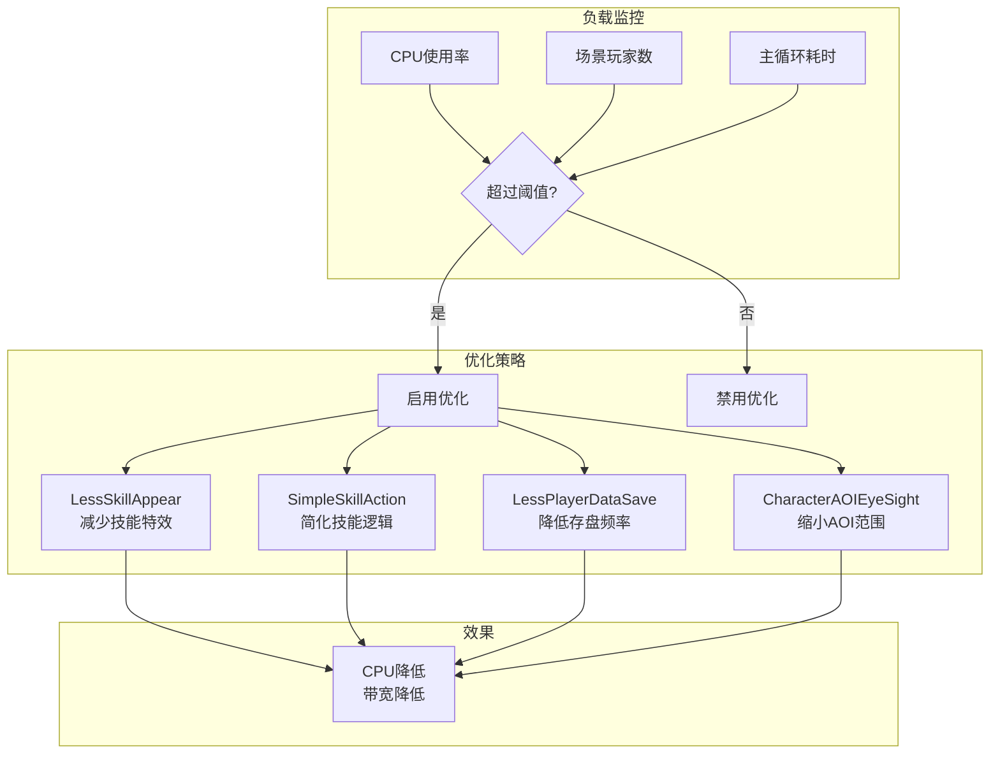
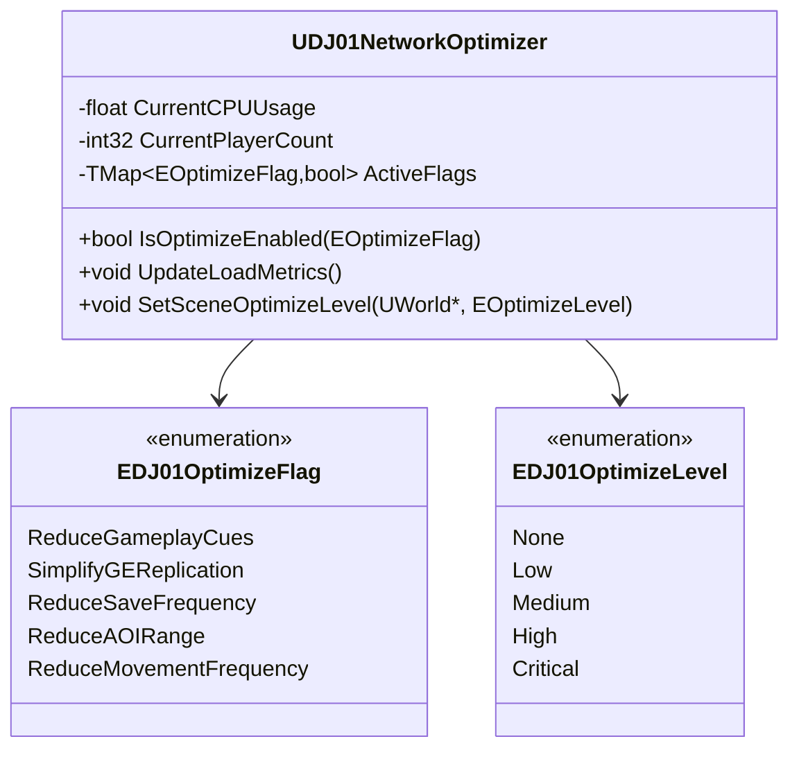
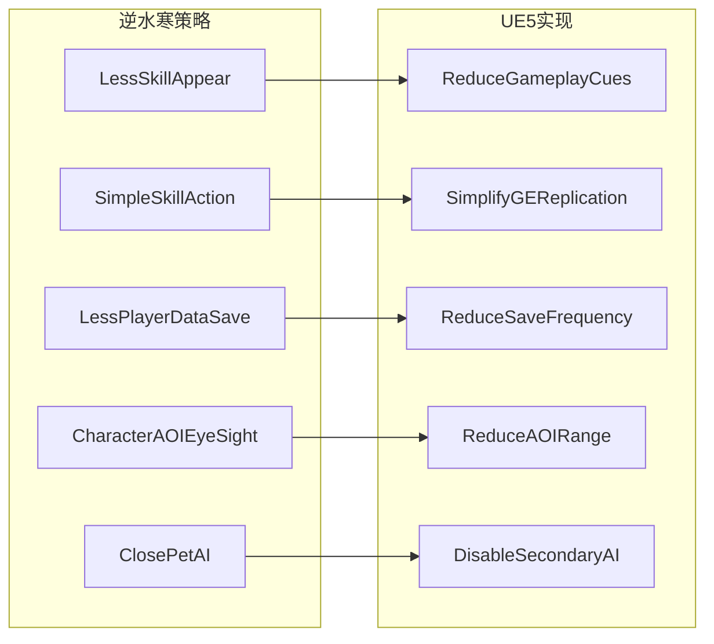

# 07 - 高负载下的同步优化

## 概述

当服务器面临高并发时，需要动态调整同步策略以保证系统稳定。本文档分析逆水寒的 `ServerOptimizeMgr` 负载优化机制，并将其思想应用到UE5的网络同步中。

---

## 核心概念对比

| 逆水寒 | UE5 | 说明 |
|--------|-----|------|
| `ServerOptimizeMgr` | `ANetworkSettings` / 自定义 | 全局优化控制器 |
| `IsOptimizeOpen()` | 自定义条件检查 | 动态开关策略 |
| `LessSkillAppear` | 减少Cue复制 | 简化技能表现 |
| `LessPlayerDataSave` | 降低存盘频率 | 减少DB压力 |
| `SimpleSkillAction` | 简化GE复制 | 降低网络负载 |
| 场景CPU阈值触发 | 自定义监控 | 负载感知 |

---

## 逆水寒负载优化架构

### 优化管理器流程



### 核心代码逻辑

```lua filePath=game/gas/lua/optimize/ServerOptimizeMgr.lua
-- 逆水寒的优化策略配置
OptimizeConfigs = {
    LessSkillAppear = 1,        -- 减少技能出现广播
    SimpleSkillAction = 2,      -- 简化技能行为
    LessPlayerDataSave = 3,     -- 降低存盘频率
    LessBuffAction = 4,         -- 减少Buff行为
    ClosePetAI = 5,             -- 关闭宠物AI
    CharacterAOIEyeSight = 21,  -- 缩小角色AOI视野
}

function CServerOptimizeMgr:IsOptimizeOpen(scene, optimizeName)
    if not scene then return false end
    
    -- 检查场景是否启用了该优化
    local flag = self.m_OptimizeFlags[scene.m_SceneId]
    if flag and flag[optimizeName] then
        return true
    end
    
    -- 检查全局CPU阈值
    if self.m_CurrentCPU > self.m_CPUThreshold then
        return true
    end
    
    return false
end
```

---

## UE5 网络负载优化系统

### 架构设计



### 优化管理器实现

```cpp filePath=Source/DJ01/Network/DJ01NetworkOptimizer.h
#pragma once

#include "CoreMinimal.h"
#include "Subsystems/GameInstanceSubsystem.h"
#include "DJ01NetworkOptimizer.generated.h"

// 优化策略标志
UENUM(BlueprintType)
enum class EDJ01OptimizeFlag : uint8
{
    None                    = 0,
    ReduceGameplayCues      = 1 << 0,  // 类似 LessSkillAppear
    SimplifyGEReplication   = 1 << 1,  // 类似 SimpleSkillAction
    ReduceSaveFrequency     = 1 << 2,  // 类似 LessPlayerDataSave
    ReduceAOIRange          = 1 << 3,  // 类似 CharacterAOIEyeSight
    ReduceMovementFrequency = 1 << 4,  // 降低移动同步频率
    SkipNonEssentialRPC     = 1 << 5,  // 跳过非必要RPC
};
ENUM_CLASS_FLAGS(EDJ01OptimizeFlag);

// 优化等级
UENUM(BlueprintType)
enum class EDJ01OptimizeLevel : uint8
{
    None = 0,      // 正常模式
    Low = 1,       // 轻度优化
    Medium = 2,    // 中度优化
    High = 3,      // 重度优化
    Critical = 4   // 紧急模式
};

// 负载指标
USTRUCT(BlueprintType)
struct FDJ01LoadMetrics
{
    GENERATED_BODY()
    
    UPROPERTY(BlueprintReadOnly)
    float CPUUsage = 0.0f;
    
    UPROPERTY(BlueprintReadOnly)
    float MemoryUsage = 0.0f;
    
    UPROPERTY(BlueprintReadOnly)
    int32 PlayerCount = 0;
    
    UPROPERTY(BlueprintReadOnly)
    float AverageTickTime = 0.0f;
    
    UPROPERTY(BlueprintReadOnly)
    int32 ReplicatedActorCount = 0;
    
    UPROPERTY(BlueprintReadOnly)
    float NetworkBandwidth = 0.0f;
};

DECLARE_DYNAMIC_MULTICAST_DELEGATE_TwoParams(FOnOptimizeLevelChanged, 
    EDJ01OptimizeLevel, OldLevel, EDJ01OptimizeLevel, NewLevel);

/**
 * 网络优化管理器
 * 类似逆水寒的ServerOptimizeMgr，动态调整同步策略
 */
UCLASS()
class UDJ01NetworkOptimizer : public UGameInstanceSubsystem
{
    GENERATED_BODY()
    
public:
    virtual void Initialize(FSubsystemCollectionBase& Collection) override;
    virtual void Deinitialize() override;
    
    // 检查是否启用某项优化（类似IsOptimizeOpen）
    UFUNCTION(BlueprintCallable, Category = "Network|Optimization")
    bool IsOptimizeEnabled(EDJ01OptimizeFlag Flag) const;
    
    // 获取当前优化等级
    UFUNCTION(BlueprintPure, Category = "Network|Optimization")
    EDJ01OptimizeLevel GetCurrentOptimizeLevel() const { return CurrentLevel; }
    
    // 获取当前负载指标
    UFUNCTION(BlueprintPure, Category = "Network|Optimization")
    const FDJ01LoadMetrics& GetLoadMetrics() const { return LoadMetrics; }
    
    // 手动设置优化等级（用于测试或强制模式）
    UFUNCTION(BlueprintCallable, Category = "Network|Optimization")
    void SetOptimizeLevel(EDJ01OptimizeLevel NewLevel);
    
    // 优化等级变化事件
    UPROPERTY(BlueprintAssignable, Category = "Network|Optimization")
    FOnOptimizeLevelChanged OnOptimizeLevelChanged;
    
protected:
    // 当前优化等级
    UPROPERTY()
    EDJ01OptimizeLevel CurrentLevel = EDJ01OptimizeLevel::None;
    
    // 当前启用的优化标志
    UPROPERTY()
    int32 ActiveFlags = 0;
    
    // 负载指标
    UPROPERTY()
    FDJ01LoadMetrics LoadMetrics;
    
    // 阈值配置
    UPROPERTY(EditDefaultsOnly, Category = "Thresholds")
    float CPUThreshold_Low = 0.5f;      // 50% CPU触发Low
    
    UPROPERTY(EditDefaultsOnly, Category = "Thresholds")
    float CPUThreshold_Medium = 0.7f;   // 70% CPU触发Medium
    
    UPROPERTY(EditDefaultsOnly, Category = "Thresholds")
    float CPUThreshold_High = 0.85f;    // 85% CPU触发High
    
    UPROPERTY(EditDefaultsOnly, Category = "Thresholds")
    float CPUThreshold_Critical = 0.95f; // 95% CPU触发Critical
    
    UPROPERTY(EditDefaultsOnly, Category = "Thresholds")
    int32 PlayerThreshold_Medium = 50;
    
    UPROPERTY(EditDefaultsOnly, Category = "Thresholds")
    int32 PlayerThreshold_High = 100;
    
    // 定时更新
    FTimerHandle UpdateTimerHandle;
    
    void UpdateLoadMetrics();
    void EvaluateOptimizeLevel();
    void ApplyOptimizeFlags(EDJ01OptimizeLevel Level);
};
```

```cpp filePath=Source/DJ01/Network/DJ01NetworkOptimizer.cpp
#include "DJ01NetworkOptimizer.h"
#include "Engine/World.h"
#include "GameFramework/GameStateBase.h"
#include "HAL/PlatformMisc.h"
#include "TimerManager.h"

void UDJ01NetworkOptimizer::Initialize(FSubsystemCollectionBase& Collection)
{
    Super::Initialize(Collection);
    
    // 每秒更新一次负载指标
    if (UWorld* World = GetWorld())
    {
        World->GetTimerManager().SetTimer(
            UpdateTimerHandle,
            this,
            &UDJ01NetworkOptimizer::UpdateLoadMetrics,
            1.0f,
            true);
    }
}

void UDJ01NetworkOptimizer::Deinitialize()
{
    if (UWorld* World = GetWorld())
    {
        World->GetTimerManager().ClearTimer(UpdateTimerHandle);
    }
    Super::Deinitialize();
}

bool UDJ01NetworkOptimizer::IsOptimizeEnabled(EDJ01OptimizeFlag Flag) const
{
    return (ActiveFlags & static_cast<int32>(Flag)) != 0;
}

void UDJ01NetworkOptimizer::SetOptimizeLevel(EDJ01OptimizeLevel NewLevel)
{
    if (CurrentLevel != NewLevel)
    {
        EDJ01OptimizeLevel OldLevel = CurrentLevel;
        CurrentLevel = NewLevel;
        ApplyOptimizeFlags(NewLevel);
        OnOptimizeLevelChanged.Broadcast(OldLevel, NewLevel);
        
        UE_LOG(LogTemp, Log, TEXT("Optimize Level Changed: %d -> %d"), 
            static_cast<int32>(OldLevel), static_cast<int32>(NewLevel));
    }
}

void UDJ01NetworkOptimizer::UpdateLoadMetrics()
{
    // 更新CPU使用率
    // 注意：UE没有直接的CPU使用率API，这里使用帧时间作为近似
    float DeltaSeconds = GetWorld()->GetDeltaSeconds();
    float TargetFrameTime = 1.0f / 60.0f; // 假设目标60FPS
    LoadMetrics.CPUUsage = FMath::Clamp(DeltaSeconds / TargetFrameTime, 0.0f, 2.0f);
    
    // 更新玩家数量
    if (AGameStateBase* GameState = GetWorld()->GetGameState())
    {
        LoadMetrics.PlayerCount = GameState->PlayerArray.Num();
    }
    
    // 更新平均Tick时间
    LoadMetrics.AverageTickTime = DeltaSeconds * 1000.0f; // 转为毫秒
    
    // 更新复制Actor数量
    LoadMetrics.ReplicatedActorCount = 0;
    for (TActorIterator<AActor> It(GetWorld()); It; ++It)
    {
        if ((*It)->GetIsReplicated())
        {
            LoadMetrics.ReplicatedActorCount++;
        }
    }
    
    // 评估优化等级
    EvaluateOptimizeLevel();
}

void UDJ01NetworkOptimizer::EvaluateOptimizeLevel()
{
    // 类似逆水寒根据CPU和玩家数评估
    EDJ01OptimizeLevel NewLevel = EDJ01OptimizeLevel::None;
    
    // CPU阈值判断
    if (LoadMetrics.CPUUsage >= CPUThreshold_Critical)
    {
        NewLevel = EDJ01OptimizeLevel::Critical;
    }
    else if (LoadMetrics.CPUUsage >= CPUThreshold_High)
    {
        NewLevel = EDJ01OptimizeLevel::High;
    }
    else if (LoadMetrics.CPUUsage >= CPUThreshold_Medium)
    {
        NewLevel = EDJ01OptimizeLevel::Medium;
    }
    else if (LoadMetrics.CPUUsage >= CPUThreshold_Low)
    {
        NewLevel = EDJ01OptimizeLevel::Low;
    }
    
    // 玩家数阈值（可能提升等级）
    if (LoadMetrics.PlayerCount >= PlayerThreshold_High && 
        NewLevel < EDJ01OptimizeLevel::High)
    {
        NewLevel = EDJ01OptimizeLevel::High;
    }
    else if (LoadMetrics.PlayerCount >= PlayerThreshold_Medium && 
             NewLevel < EDJ01OptimizeLevel::Medium)
    {
        NewLevel = EDJ01OptimizeLevel::Medium;
    }
    
    SetOptimizeLevel(NewLevel);
}

void UDJ01NetworkOptimizer::ApplyOptimizeFlags(EDJ01OptimizeLevel Level)
{
    // 根据等级设置优化标志
    // 类似逆水寒的场景优化配置
    
    ActiveFlags = 0;
    
    switch (Level)
    {
    case EDJ01OptimizeLevel::Critical:
        ActiveFlags |= static_cast<int32>(EDJ01OptimizeFlag::SkipNonEssentialRPC);
        // Fall through
    case EDJ01OptimizeLevel::High:
        ActiveFlags |= static_cast<int32>(EDJ01OptimizeFlag::ReduceAOIRange);
        ActiveFlags |= static_cast<int32>(EDJ01OptimizeFlag::ReduceMovementFrequency);
        // Fall through
    case EDJ01OptimizeLevel::Medium:
        ActiveFlags |= static_cast<int32>(EDJ01OptimizeFlag::SimplifyGEReplication);
        ActiveFlags |= static_cast<int32>(EDJ01OptimizeFlag::ReduceSaveFrequency);
        // Fall through
    case EDJ01OptimizeLevel::Low:
        ActiveFlags |= static_cast<int32>(EDJ01OptimizeFlag::ReduceGameplayCues);
        break;
    case EDJ01OptimizeLevel::None:
    default:
        break;
    }
}
```

---

## 应用到具体系统

### 1. GameplayCue优化（类似LessSkillAppear）

```cpp filePath=Source/DJ01/GAS/DJ01GameplayCueManager.h
#pragma once

#include "GameplayCueManager.h"
#include "DJ01GameplayCueManager.generated.h"

/**
 * 自定义GameplayCue管理器
 * 在高负载时减少Cue的网络传输
 */
UCLASS()
class UDJ01GameplayCueManager : public UGameplayCueManager
{
    GENERATED_BODY()
    
public:
    // 重载Cue路由，加入优化检查
    virtual void RouteGameplayCue(
        AActor* TargetActor,
        FGameplayTag GameplayCueTag,
        EGameplayCueEvent::Type EventType,
        const FGameplayCueParameters& Parameters) override;
        
protected:
    // 检查Cue是否可以被优化掉
    bool ShouldSkipCueForOptimization(
        const FGameplayTag& CueTag,
        const FGameplayCueParameters& Parameters) const;
        
    // 非必要Cue标签（高负载时跳过）
    UPROPERTY(EditDefaultsOnly, Category = "Optimization")
    FGameplayTagContainer NonEssentialCueTags;
};
```

```cpp filePath=Source/DJ01/GAS/DJ01GameplayCueManager.cpp
#include "DJ01GameplayCueManager.h"
#include "DJ01NetworkOptimizer.h"
#include "Kismet/GameplayStatics.h"

void UDJ01GameplayCueManager::RouteGameplayCue(
    AActor* TargetActor,
    FGameplayTag GameplayCueTag,
    EGameplayCueEvent::Type EventType,
    const FGameplayCueParameters& Parameters)
{
    // 类似逆水寒的 LessSkillAppear 优化
    // 高负载时跳过非必要的Cue
    
    if (ShouldSkipCueForOptimization(GameplayCueTag, Parameters))
    {
        UE_LOG(LogTemp, Verbose, TEXT("Skipping GameplayCue %s due to optimization"), 
            *GameplayCueTag.ToString());
        return;
    }
    
    Super::RouteGameplayCue(TargetActor, GameplayCueTag, EventType, Parameters);
}

bool UDJ01GameplayCueManager::ShouldSkipCueForOptimization(
    const FGameplayTag& CueTag,
    const FGameplayCueParameters& Parameters) const
{
    // 获取优化管理器
    UGameInstance* GI = Cast<UGameInstance>(UGameplayStatics::GetGameInstance(this));
    if (!GI) return false;
    
    UDJ01NetworkOptimizer* Optimizer = GI->GetSubsystem<UDJ01NetworkOptimizer>();
    if (!Optimizer) return false;
    
    // 检查是否启用了Cue优化
    if (!Optimizer->IsOptimizeEnabled(EDJ01OptimizeFlag::ReduceGameplayCues))
    {
        return false;
    }
    
    // 检查是否是非必要Cue
    return NonEssentialCueTags.HasTag(CueTag);
}
```

### 2. 属性复制频率优化（类似SimpleSkillAction）

```cpp filePath=Source/DJ01/Network/DJ01NetFrequencyComponent.h
#pragma once

#include "Components/ActorComponent.h"
#include "DJ01NetFrequencyComponent.generated.h"

/**
 * 网络频率控制组件
 * 根据负载动态调整Actor的复制频率
 */
UCLASS(ClassGroup=(Network), meta=(BlueprintSpawnableComponent))
class UDJ01NetFrequencyComponent : public UActorComponent
{
    GENERATED_BODY()
    
public:
    UDJ01NetFrequencyComponent();
    
    virtual void BeginPlay() override;
    virtual void TickComponent(float DeltaTime, ELevelTick TickType, 
        FActorComponentTickFunction* ThisTickFunction) override;
    
protected:
    // 基础更新频率
    UPROPERTY(EditDefaultsOnly, Category = "Network")
    float BaseNetUpdateFrequency = 100.0f;
    
    // 各优化等级的频率乘数
    UPROPERTY(EditDefaultsOnly, Category = "Network")
    float LowOptimizeMultiplier = 0.8f;
    
    UPROPERTY(EditDefaultsOnly, Category = "Network")
    float MediumOptimizeMultiplier = 0.5f;
    
    UPROPERTY(EditDefaultsOnly, Category = "Network")
    float HighOptimizeMultiplier = 0.3f;
    
    UPROPERTY(EditDefaultsOnly, Category = "Network")
    float CriticalOptimizeMultiplier = 0.1f;
    
    // 优化等级变化回调
    UFUNCTION()
    void OnOptimizeLevelChanged(EDJ01OptimizeLevel OldLevel, EDJ01OptimizeLevel NewLevel);
    
    void UpdateNetFrequency(EDJ01OptimizeLevel Level);
};
```

```cpp filePath=Source/DJ01/Network/DJ01NetFrequencyComponent.cpp
#include "DJ01NetFrequencyComponent.h"
#include "DJ01NetworkOptimizer.h"
#include "GameFramework/Actor.h"
#include "Kismet/GameplayStatics.h"

UDJ01NetFrequencyComponent::UDJ01NetFrequencyComponent()
{
    PrimaryComponentTick.bCanEverTick = false;
}

void UDJ01NetFrequencyComponent::BeginPlay()
{
    Super::BeginPlay();
    
    // 订阅优化等级变化
    if (UGameInstance* GI = Cast<UGameInstance>(UGameplayStatics::GetGameInstance(this)))
    {
        if (UDJ01NetworkOptimizer* Optimizer = GI->GetSubsystem<UDJ01NetworkOptimizer>())
        {
            Optimizer->OnOptimizeLevelChanged.AddDynamic(
                this, &UDJ01NetFrequencyComponent::OnOptimizeLevelChanged);
                
            // 应用当前等级
            UpdateNetFrequency(Optimizer->GetCurrentOptimizeLevel());
        }
    }
}

void UDJ01NetFrequencyComponent::OnOptimizeLevelChanged(
    EDJ01OptimizeLevel OldLevel, EDJ01OptimizeLevel NewLevel)
{
    UpdateNetFrequency(NewLevel);
}

void UDJ01NetFrequencyComponent::UpdateNetFrequency(EDJ01OptimizeLevel Level)
{
    // 类似逆水寒的 SimpleSkillAction
    // 高负载时降低复制频率
    
    float Multiplier = 1.0f;
    
    switch (Level)
    {
    case EDJ01OptimizeLevel::Low:
        Multiplier = LowOptimizeMultiplier;
        break;
    case EDJ01OptimizeLevel::Medium:
        Multiplier = MediumOptimizeMultiplier;
        break;
    case EDJ01OptimizeLevel::High:
        Multiplier = HighOptimizeMultiplier;
        break;
    case EDJ01OptimizeLevel::Critical:
        Multiplier = CriticalOptimizeMultiplier;
        break;
    default:
        break;
    }
    
    if (AActor* Owner = GetOwner())
    {
        float NewFrequency = BaseNetUpdateFrequency * Multiplier;
        Owner->NetUpdateFrequency = NewFrequency;
        Owner->MinNetUpdateFrequency = NewFrequency * 0.5f;
        
        UE_LOG(LogTemp, Verbose, TEXT("%s NetUpdateFrequency: %.1f -> %.1f"),
            *Owner->GetName(), BaseNetUpdateFrequency, NewFrequency);
    }
}
```

### 3. 移动同步优化（降低CMC更新频率）

```cpp filePath=Source/DJ01/Characters/DJ01CharacterMovementComponent.h
#pragma once

#include "GameFramework/CharacterMovementComponent.h"
#include "DJ01CharacterMovementComponent.generated.h"

/**
 * 支持负载优化的移动组件
 */
UCLASS()
class UDJ01CharacterMovementComponent : public UCharacterMovementComponent
{
    GENERATED_BODY()
    
public:
    UDJ01CharacterMovementComponent();
    
    // 重载服务器移动处理
    virtual void ServerMove_PerformMovement(const FCharacterNetworkMoveData& MoveData) override;
    
protected:
    // 是否启用移动优化
    bool bMovementOptimized = false;
    
    // 跳过移动的计数器（用于降频）
    int32 SkipMoveCounter = 0;
    
    // 每N次移动处理一次
    UPROPERTY(EditDefaultsOnly, Category = "Network|Optimization")
    int32 OptimizedMoveInterval = 3;
    
    void CheckOptimizationStatus();
};
```

```cpp filePath=Source/DJ01/Characters/DJ01CharacterMovementComponent.cpp
#include "DJ01CharacterMovementComponent.h"
#include "DJ01NetworkOptimizer.h"
#include "Kismet/GameplayStatics.h"

UDJ01CharacterMovementComponent::UDJ01CharacterMovementComponent()
{
    // 默认移动优化关闭
    bMovementOptimized = false;
}

void UDJ01CharacterMovementComponent::ServerMove_PerformMovement(
    const FCharacterNetworkMoveData& MoveData)
{
    CheckOptimizationStatus();
    
    // 高负载时降低移动处理频率
    // 类似逆水寒的优化策略
    if (bMovementOptimized)
    {
        SkipMoveCounter++;
        if (SkipMoveCounter < OptimizedMoveInterval)
        {
            // 跳过此次移动处理，但更新时间戳防止超时
            return;
        }
        SkipMoveCounter = 0;
    }
    
    Super::ServerMove_PerformMovement(MoveData);
}

void UDJ01CharacterMovementComponent::CheckOptimizationStatus()
{
    if (UGameInstance* GI = Cast<UGameInstance>(
            UGameplayStatics::GetGameInstance(GetOwner())))
    {
        if (UDJ01NetworkOptimizer* Optimizer = GI->GetSubsystem<UDJ01NetworkOptimizer>())
        {
            bMovementOptimized = Optimizer->IsOptimizeEnabled(
                EDJ01OptimizeFlag::ReduceMovementFrequency);
        }
    }
}
```

---

## 优化策略配置

### 按等级配置优化策略

```cpp filePath=Source/DJ01/Network/DJ01OptimizeConfig.h
#pragma once

#include "Engine/DataAsset.h"
#include "DJ01OptimizeConfig.generated.h"

// 单个优化等级的配置
USTRUCT(BlueprintType)
struct FDJ01OptimizeLevelConfig
{
    GENERATED_BODY()
    
    // 网络更新频率乘数
    UPROPERTY(EditDefaultsOnly)
    float NetUpdateFrequencyMultiplier = 1.0f;
    
    // AOI距离乘数
    UPROPERTY(EditDefaultsOnly)
    float AOIDistanceMultiplier = 1.0f;
    
    // 是否跳过非必要Cue
    UPROPERTY(EditDefaultsOnly)
    bool bSkipNonEssentialCues = false;
    
    // 是否简化GE复制
    UPROPERTY(EditDefaultsOnly)
    bool bSimplifyGEReplication = false;
    
    // 存盘间隔乘数
    UPROPERTY(EditDefaultsOnly)
    float SaveIntervalMultiplier = 1.0f;
    
    // 移动同步间隔
    UPROPERTY(EditDefaultsOnly)
    int32 MovementSyncInterval = 1;
};

/**
 * 优化配置数据资产
 */
UCLASS()
class UDJ01OptimizeConfigAsset : public UDataAsset
{
    GENERATED_BODY()
    
public:
    // 各等级配置
    UPROPERTY(EditDefaultsOnly, Category = "Config")
    FDJ01OptimizeLevelConfig LowConfig;
    
    UPROPERTY(EditDefaultsOnly, Category = "Config")
    FDJ01OptimizeLevelConfig MediumConfig;
    
    UPROPERTY(EditDefaultsOnly, Category = "Config")
    FDJ01OptimizeLevelConfig HighConfig;
    
    UPROPERTY(EditDefaultsOnly, Category = "Config")
    FDJ01OptimizeLevelConfig CriticalConfig;
    
    // 获取指定等级的配置
    const FDJ01OptimizeLevelConfig& GetConfig(EDJ01OptimizeLevel Level) const;
};
```

### 数据驱动的阈值配置

```cpp filePath=Source/DJ01/Network/DJ01OptimizeConfig.cpp
#include "DJ01OptimizeConfig.h"

const FDJ01OptimizeLevelConfig& UDJ01OptimizeConfigAsset::GetConfig(
    EDJ01OptimizeLevel Level) const
{
    switch (Level)
    {
    case EDJ01OptimizeLevel::Low:
        return LowConfig;
    case EDJ01OptimizeLevel::Medium:
        return MediumConfig;
    case EDJ01OptimizeLevel::High:
        return HighConfig;
    case EDJ01OptimizeLevel::Critical:
        return CriticalConfig;
    default:
        static FDJ01OptimizeLevelConfig DefaultConfig;
        return DefaultConfig;
    }
}
```

---

## 监控与调试

### 性能监控界面

```cpp filePath=Source/DJ01/UI/DJ01NetworkDebugWidget.h
#pragma once

#include "Blueprint/UserWidget.h"
#include "DJ01NetworkDebugWidget.generated.h"

/**
 * 网络性能调试界面
 */
UCLASS()
class UDJ01NetworkDebugWidget : public UUserWidget
{
    GENERATED_BODY()
    
public:
    virtual void NativeConstruct() override;
    virtual void NativeTick(const FGeometry& MyGeometry, float InDeltaTime) override;
    
protected:
    UPROPERTY(meta = (BindWidget))
    class UTextBlock* CPUText;
    
    UPROPERTY(meta = (BindWidget))
    class UTextBlock* PlayerCountText;
    
    UPROPERTY(meta = (BindWidget))
    class UTextBlock* OptimizeLevelText;
    
    UPROPERTY(meta = (BindWidget))
    class UTextBlock* ActiveFlagsText;
    
    UPROPERTY(meta = (BindWidget))
    class UProgressBar* CPUProgressBar;
    
    void UpdateDisplay();
};
```

---

## 优化效果对比

### 概念映射总结



### 预期收益

| 优化策略 | CPU降低 | 带宽降低 | 体验影响 |
|----------|---------|---------|----------|
| ReduceGameplayCues | 5-10% | 15-20% | 轻微（特效减少）|
| SimplifyGEReplication | 10-15% | 20-30% | 轻微（同步延迟）|
| ReduceMovementFrequency | 15-20% | 25-35% | 中等（移动抖动）|
| ReduceAOIRange | 20-30% | 40-50% | 明显（远处不可见）|

---

## 总结

### 核心设计原则

1. **渐进降级**：根据负载等级逐步启用优化，避免突然变化
2. **可配置性**：所有阈值和策略通过DataAsset配置，便于调整
3. **透明监控**：实时显示负载指标和当前优化状态
4. **平滑过渡**：优化切换时避免视觉跳变

### 学习建议

1. 先实现 `UDJ01NetworkOptimizer` 基础框架
2. 逐个添加优化策略，从 `ReduceGameplayCues` 开始
3. 建立压力测试环境，验证优化效果
4. 根据实际情况调整阈值配置

---

## 下一步

- [08_DistributedArchitecture.md](./08_DistributedArchitecture.md) - 分布式服务器架构（多DS协调）